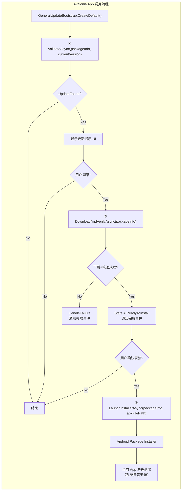
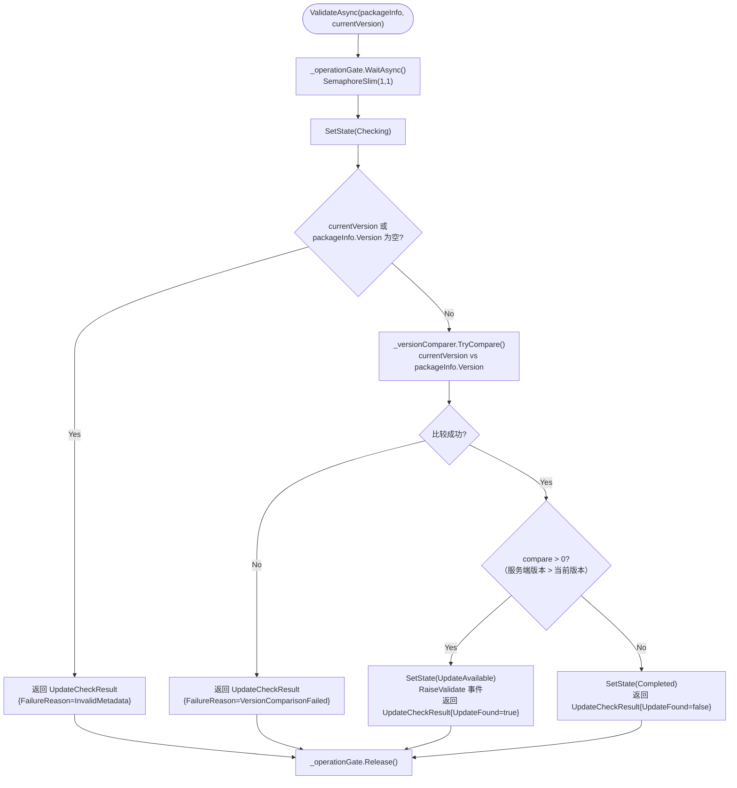
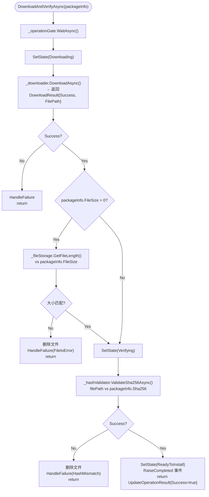
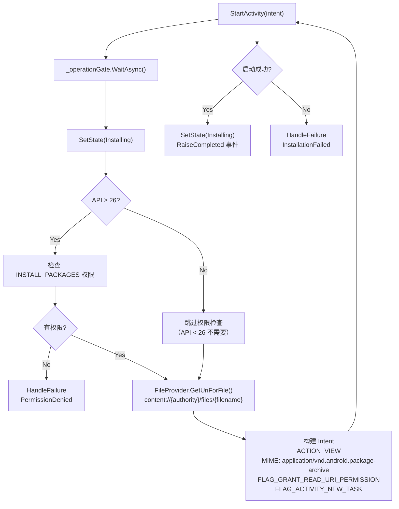

# GeneralUpdate.Avalonia.Android — 执行流程详解

> **目标读者：** 需要在 Avalonia Android 应用中集成自动更新的开发者
>
> **阅读完你将理解：**
> - `AndroidBootstrap` 的显式三步 API 设计意图（Validate → DownloadAndVerify → LaunchInstaller）
> - `HttpResumableApkDownloader` 的断点续传机制：Range 请求 + Sidecar 元数据 + 原子重命名
> - SHA256 校验的安全上下限与文件大小双重验证
> - Android APK 安装的 FileProvider URI 授权流程
> - `SemaphoreSlim(1,1)` 并发保护与线程安全设计
> - `IUpdateEventDispatcher` 的 UI 线程调度机制
> - 多协议认证架构（HMAC / Bearer / API Key / Basic）

---

## 目录

1. [架构总览](#1-架构总览)
2. [入口：GeneralUpdateBootstrap 工厂](#2-入口generalupdatebootstrap-工厂)
3. [AndroidBootstrap：三步显式 API](#3-androidbootstrap三步显式-api)
4. [Step 1：ValidateAsync — 版本校验](#4-step-1validateasync--版本校验)
5. [Step 2：DownloadAndVerifyAsync — 下载与校验](#5-step-2downloadandverifyasync--下载与校验)
6. [断点续传：HttpResumableApkDownloader 深度解析](#6-断点续传httpresumableapkdownloader-深度解析)
7. [哈希校验与文件大小验证](#7-哈希校验与文件大小验证)
8. [Step 3：LaunchInstallerAsync — APK 安装触发](#8-step-3launchinstallerasync--apk-安装触发)
9. [并发安全与线程模型](#9-并发安全与线程模型)
10. [事件调度与 UI 线程](#10-事件调度与-ui-线程)
11. [多协议认证架构](#11-多协议认证架构)
12. [关键代码路径索引](#12-关键代码路径索引)

---

## 1. 架构总览

### 1.1 六服务可替换架构

Avalonia.Android 采用**全接口抽象 + 工厂装配**的设计，每个核心能力都有接口，可独立替换：

```
┌──────────────────────────────────────────────────────────────┐
│                   GeneralUpdateBootstrap（静态工厂）           │
│                   CreateDefault(options) → IAndroidBootstrap │
├──────────────────────────────────────────────────────────────┤
│                   AndroidBootstrap（编排层）                   │
│                                                              │
│  ┌──────────────┐  ┌──────────────┐  ┌──────────────────┐   │
│  │ IVersion     │  │ IUpdate      │  │ IHashValidator   │   │
│  │ Comparer     │  │ Downloader   │  │ SHA256 校验       │   │
│  │ 版本对比      │  │ HTTP 断点续传 │  │                  │   │
│  └──────────────┘  └──────────────┘  └──────────────────┘   │
│                                                              │
│  ┌──────────────┐  ┌──────────────┐  ┌──────────────────┐   │
│  │ IApkInstaller│  │ IFileStorage │  │ IUpdateEvent     │   │
│  │ 系统安装器    │  │ 文件系统抽象  │  │ Dispatcher       │   │
│  │ FileProvider │  │              │  │ UI 线程调度       │   │
│  └──────────────┘  └──────────────┘  └──────────────────┘   │
│                                                              │
│  ┌──────────────────────────────────────────────────────┐   │
│  │ HttpDownloadOptions（横切配置）                       │   │
│  │ SSL 策略 / 代理 / 超时 / 重试 / 认证                  │   │
│  └──────────────────────────────────────────────────────┘   │
└──────────────────────────────────────────────────────────────┘
```

### 1.2 三步 API 设计哲学

与 Maui.Android 的合并式 API 不同，Avalonia.Android 采用**显式三步 API**：

| 步骤 | 方法 | 职责 | 调用方控制点 |
|------|------|------|-------------|
| 1 | `ValidateAsync` | 版本对比，判断是否有更新 | 决定是否继续 |
| 2 | `DownloadAndVerifyAsync` | 下载 + SHA256 校验 | 显示进度 UI |
| 3 | `LaunchInstallerAsync` | 触发系统安装器 | 用户确认后调用 |

**设计意图：** 调用方在每个步骤之间拥有完全的控制权——可以在版本检查后展示更新提示、在下载中显示进度条、在安装前要求用户确认。

---

## 2. 入口：GeneralUpdateBootstrap 工厂

```csharp
public static class GeneralUpdateBootstrap
{
    public static IAndroidBootstrap CreateDefault(AndroidUpdateOptions? options = null)
    {
        options ??= new AndroidUpdateOptions();
        var downloadDir = ResolveDownloadDirectory(options);

        return new AndroidBootstrap(
            versionComparer: new SystemVersionComparer(),
            downloader: new HttpResumableApkDownloader(options.HttpOptions),
            hashValidator: new Sha256HashValidator(),
            apkInstaller: new AndroidApkInstaller(),
            fileStorage: new PhysicalFileStorage(),
            eventDispatcher: new ImmediateEventDispatcher(),
            logger: new NoOpUpdateLogger()
        );
    }

    private static string ResolveDownloadDirectory(AndroidUpdateOptions options)
    {
        // 1. 优先使用用户指定的路径
        // 2. 回退到 Android 缓存目录
        // 3. 确保目录存在
    }
}
```

---

## 3. AndroidBootstrap：三步显式 API

### 3.1 完整生命周期



### 3.2 状态机

```
None → Checking → UpdateAvailable → Downloading → Verifying → ReadyToInstall → Installing → Completed
                                                           ↓                ↓
                                                       Failed            Failed
                                                           ↓                ↓
                                                       Canceled          Canceled
```

状态通过 `SetState()` 线程安全地更新，可通过 `GetSnapshot()` 随时查询：

```csharp
public UpdateStateSnapshot GetSnapshot()
{
    lock (_sync)
    {
        return _snapshot; // { State, FailureReason, Message }
    }
}
```

---

## 4. Step 1：ValidateAsync — 版本校验



### 4.1 版本比较器接口

```csharp
public interface IVersionComparer
{
    bool TryCompare(string currentVersion, string targetVersion,
                    out int compare, out string? error);
    // compare > 0: targetVersion 更大（有更新）
    // compare = 0: 相同
    // compare < 0: targetVersion 更小（降级，通常不应发生）
}
```

默认实现 `SystemVersionComparer` 使用 `System.Version` 类进行语义化比较。

---

## 5. Step 2：DownloadAndVerifyAsync — 下载与校验



---

## 6. 断点续传：HttpResumableApkDownloader 深度解析

### 6.1 核心机制

```
下载流程
  │
  ├── Phase 1: HEAD 请求
  │     探测服务端能力：Accept-Ranges, ETag, Content-Length
  │
  ├── Phase 2: 检测已有部分下载
  │     检查 {filename}.part + {filename}.json (sidecar)
  │     sidecar 记录：URL, SHA256, 已下载字节数, ETag, LastModified
  │
  ├── Phase 3: 续传一致性验证
  │     URL 是否相同? SHA256 是否相同? 文件大小是否匹配? ETag 是否匹配?
  │     如果任何一项变化 → 删除旧临时文件，从头下载
  │
  ├── Phase 4: GET with Range
  │     从头下载：GET {url}
  │     续传：     GET {url} + Range: bytes={downloaded}-
  │     流式写入 {filename}.part，实时更新 sidecar
  │
  ├── Phase 5: 原子重命名
  │     下载完成 → {filename}.part → {filename}.apk
  │     删除 sidecar
  │
  └── Progress 报告
        已下载字节数、总大小、速度（bytes/s）、百分比
```

### 6.2 Sidecar 元数据

```json
{
    "url": "https://cdn.example.com/app-v2.0.apk",
    "sha256": "a1b2c3d4...",
    "downloadedBytes": 15728640,
    "totalBytes": 52428800,
    "etag": "\"abc123\"",
    "lastModified": "2026-06-01T12:00:00Z"
}
```

### 6.3 速度计量

```csharp
// SpeedCalculator 基于滑动窗口计算下载速度
public class SpeedCalculator
{
    // 记录最近 N 秒的字节数
    // 计算 bytes/sec，格式化为可读字符串（KB/s, MB/s）
}
```

---

## 7. 哈希校验与文件大小验证

### 7.1 双重验证

```
DownloadAndVerifyAsync 验证顺序:
  1. 文件大小验证（如果 metadata 提供了 FileSize）
     → 不匹配 → 删除文件，返回 FileIoError
  2. SHA256 验证（如果 metadata 提供了 Sha256）
     → 不匹配 → 删除文件，返回 HashMismatch
```

### 7.2 Sha256HashValidator

```csharp
public class Sha256HashValidator : IHashValidator
{
    public async Task<UpdateOperationResult> ValidateSha256Async(
        string filePath, string expectedHash, CancellationToken ct)
    {
        var actualHash = await ComputeSha256Async(filePath, ct);
        if (!string.Equals(actualHash, expectedHash, StringComparison.OrdinalIgnoreCase))
        {
            return new UpdateOperationResult
            {
                Success = false,
                FailureReason = UpdateFailureReason.HashMismatch,
                Message = $"Hash mismatch. Expected: {expectedHash}, Actual: {actualHash}"
            };
        }
        return new UpdateOperationResult { Success = true };
    }
}
```

---

## 8. Step 3：LaunchInstallerAsync — APK 安装触发

### 8.1 Android 安装流程



### 8.2 FileProvider 配置

在 `AndroidManifest.xml` 中：

```xml
<application>
    <provider
        android:name="androidx.core.content.FileProvider"
        android:authorities="${applicationId}.fileprovider"
        android:exported="false"
        android:grantUriPermissions="true">
        <meta-data
            android:name="android.support.FILE_PROVIDER_PATHS"
            android:resource="@xml/file_paths" />
    </provider>
</application>
```

在 `xml/file_paths.xml` 中：

```xml
<paths>
    <cache-path name="updates" path="." />
    <external-files-path name="external_updates" path="." />
</paths>
```

---

## 9. 并发安全与线程模型

### 9.1 SemaphoreSlim 操作门

```csharp
private readonly SemaphoreSlim _operationGate = new(1, 1);

public async Task<UpdateCheckResult> ValidateAsync(...)
{
    await _operationGate.WaitAsync(cancellationToken);
    try
    {
        // 临界区：版本检查
    }
    finally
    {
        _operationGate.Release();
    }
}
```

**设计意图：**
- 三步 API 各自独立获取和释放锁
- 调用方在步骤之间可以做 UI 操作（显示对话框等）
- 但在任一步骤内部，不会有并发操作
- `SemaphoreSlim(1,1)` 确保同一时间只有一个操作在执行

### 9.2 状态快照的线程安全

```csharp
private readonly object _sync = new();
private UpdateStateSnapshot _snapshot;

private void SetState(UpdateState state, UpdateFailureReason reason, string? message)
{
    lock (_sync)
    {
        _snapshot = new UpdateStateSnapshot(state, reason, message);
    }
}
```

---

## 10. 事件调度与 UI 线程

### 10.1 IUpdateEventDispatcher

```csharp
public interface IUpdateEventDispatcher
{
    void Dispatch(Action action);
}
```

默认实现 `ImmediateEventDispatcher` 直接执行委托。调用方可替换为 Avalonia 的 UI 线程调度：

```csharp
public class AvaloniaEventDispatcher : IUpdateEventDispatcher
{
    public void Dispatch(Action action)
    {
        Avalonia.Threading.Dispatcher.UIThread.Post(action);
    }
}
```

### 10.2 事件体系

| 事件 | EventArgs | 触发时机 |
|------|-----------|----------|
| `AddListenerValidate` | `ValidateEventArgs` | 发现可用更新 |
| `AddListenerDownloadProgressChanged` | `DownloadProgressChangedEventArgs` | 下载进度（速度、字节、百分比） |
| `AddListenerUpdateCompleted` | `UpdateCompletedEventArgs` | 下载+校验完成 / 安装触发 |
| `AddListenerUpdateFailed` | `UpdateFailedEventArgs` | 任何步骤失败 |

---

## 11. 多协议认证架构

### 11.1 认证方案

```csharp
public interface IHttpAuthProvider
{
    void ApplyAuth(HttpRequestMessage request);
}
```

支持四种方案：

| 方案 | 实现 | 典型 Header |
|------|------|------------|
| **HMAC-SHA256** | `HmacAuthProvider` | `Authorization: HMAC-SHA256 {signature}` |
| **Bearer Token** | `BearerAuthProvider` | `Authorization: Bearer {token}` |
| **API Key** | `ApiKeyAuthProvider` | `X-API-Key: {key}` |
| **HTTP Basic** | `BasicAuthProvider` | `Authorization: Basic {base64}` |

### 11.2 全局 vs 单包粒度

```csharp
// 全局认证：所有下载请求共用
var options = new AndroidUpdateOptions
{
    HttpOptions = new HttpDownloadOptions
    {
        AuthProvider = new BearerAuthProvider("global-token")
    }
};

// 单包认证：特定包的下载使用不同凭据
var packageInfo = new UpdatePackageInfo
{
    AuthScheme = AuthScheme.Bearer,
    AuthToken = "per-package-token"
};
// 单包认证优先级 > 全局认证
```

---

## 12. 关键代码路径索引

| 组件 | 文件 | 关键方法 |
|------|------|----------|
| 静态工厂 | `GeneralUpdateBootstrap.cs` | `CreateDefault()` |
| 编排器 | `Services/AndroidBootstrap.cs` | `ValidateAsync()` / `DownloadAndVerifyAsync()` / `LaunchInstallerAsync()` |
| 编排器接口 | `Abstractions/IAndroidBootstrap.cs` | — |
| 断点续传下载器 | `Services/HttpResumableApkDownloader.cs` | `DownloadAsync()` / HEAD 探测 / Range 请求 |
| SHA256 校验 | `Services/Sha256HashValidator.cs` | `ValidateSha256Async()` |
| APK 安装器 | `Services/AndroidApkInstaller.cs` | `LaunchInstallAsync()` / FileProvider URI |
| 版本比较器 | `Services/SystemVersionComparer.cs` | `TryCompare()` |
| 文件存储 | `Services/PhysicalFileStorage.cs` | `GetFileLength()` / `DeleteFile()` |
| 事件调度 | `Services/ImmediateEventDispatcher.cs` | `Dispatch()` |
| 速度计量 | `Utilities/SpeedCalculator.cs` | 滑动窗口速度计算 |
| 下载选项 | `Models/HttpDownloadOptions.cs` | SSL / 代理 / 超时 / 重试 / 认证 |
| 更新选项 | `Models/AndroidUpdateOptions.cs` | DownloadDirectory / FileProviderAuthority |
| 认证接口 | `Abstractions/IHttpAuthProvider.cs` | `ApplyAuth()` |
| SSL 策略 | `Abstractions/ISslValidationPolicy.cs` | — |
