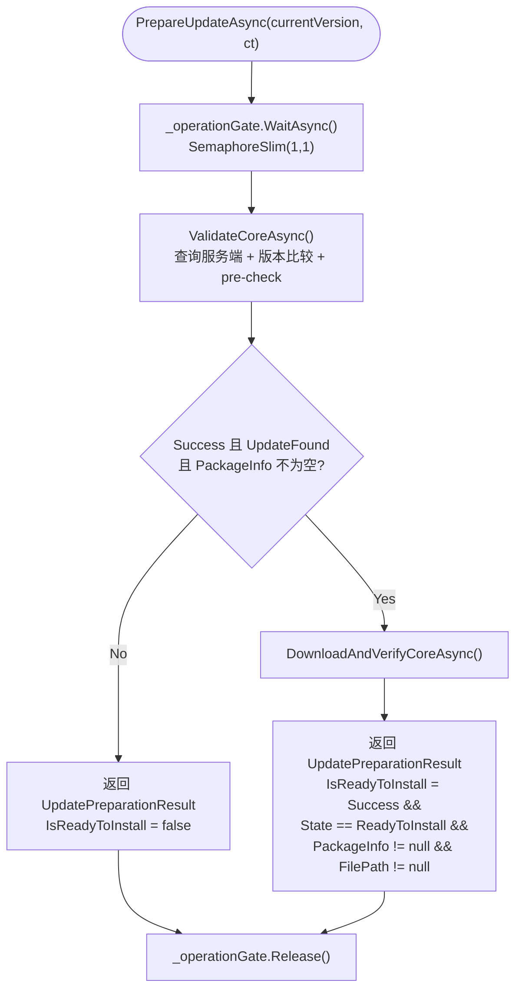
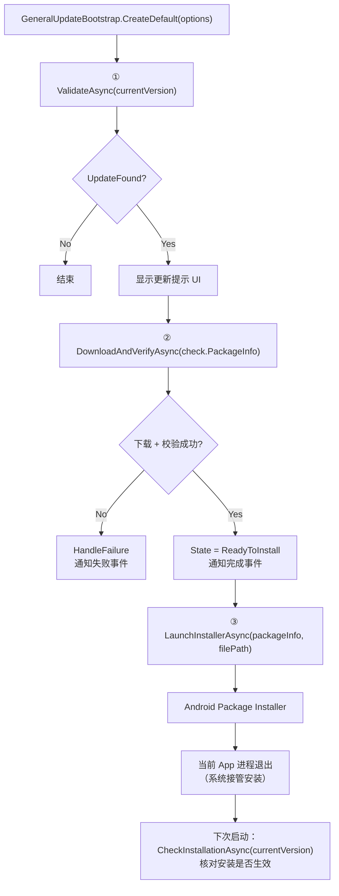
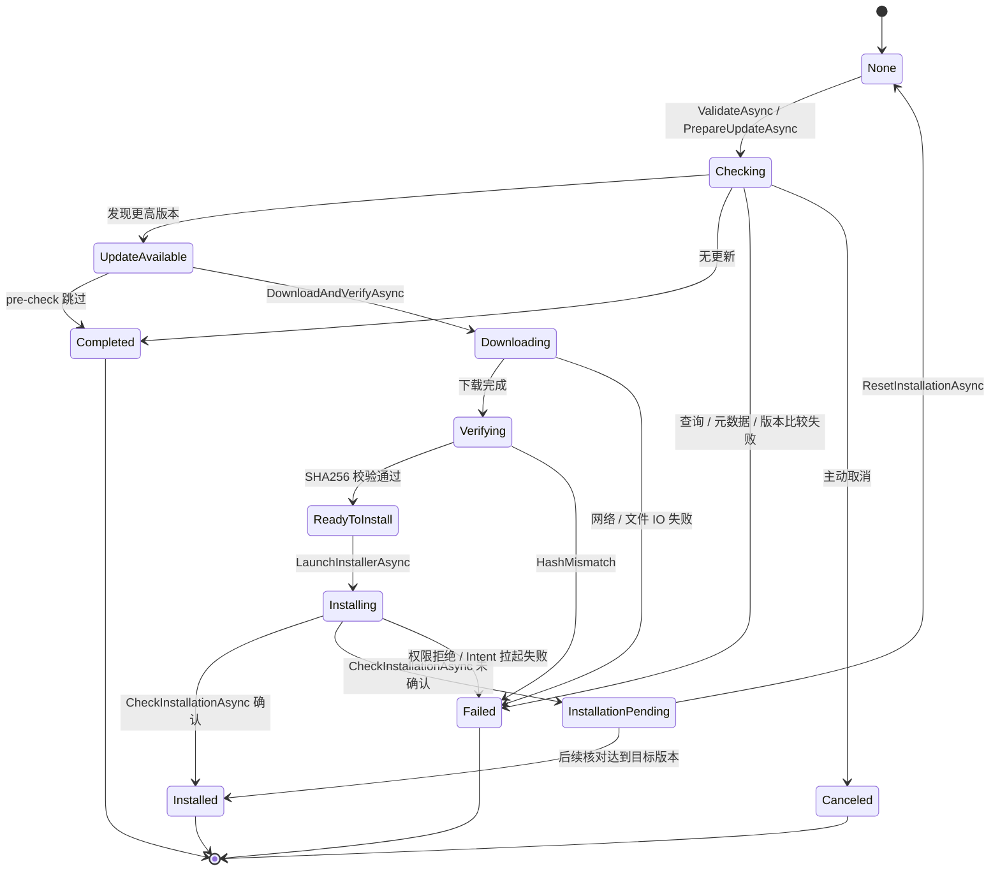
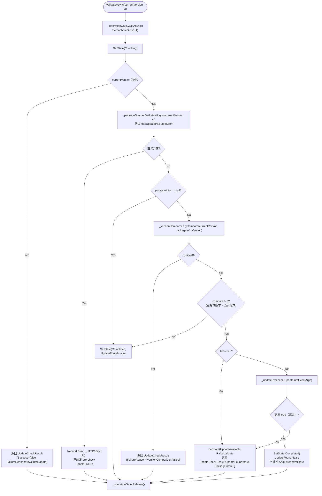
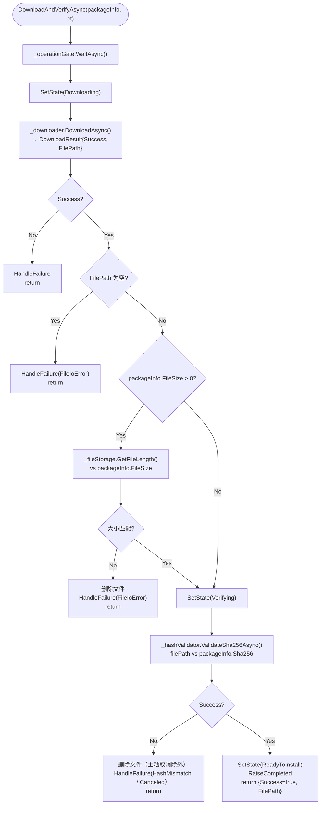
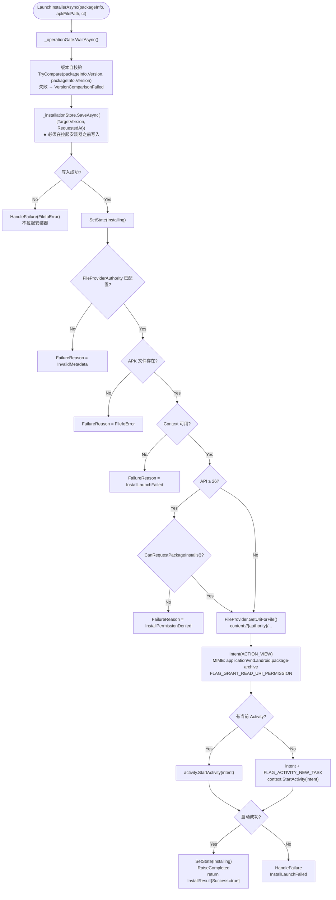
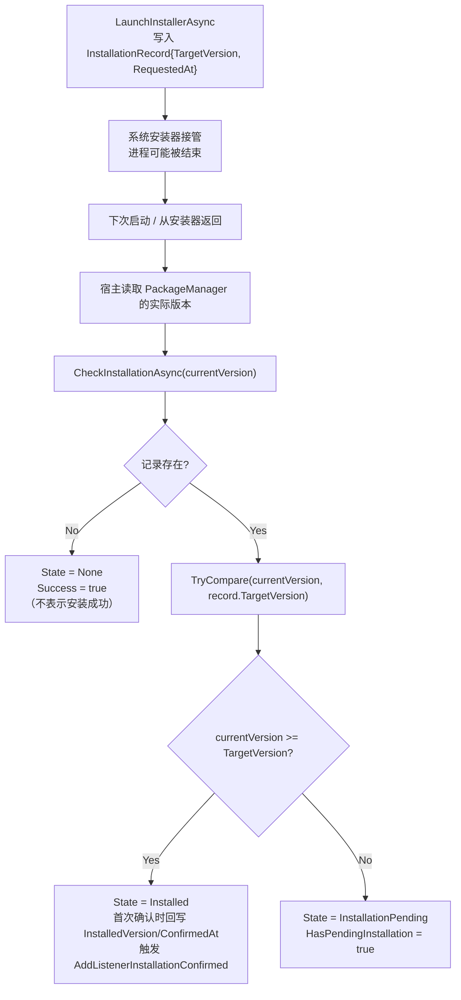

# GeneralUpdate.Avalonia.Android — 执行流程详解

> **目标读者：** 需要在 Avalonia Android 应用中集成自动更新的开发者
>
> **阅读完你将理解：**
> - `ValidateAsync` 如何从服务端查询并挑选最新 APK（调用方只提供当前版本）
> - `PrepareUpdateAsync` 与分阶段三步 API 的取舍
> - `HttpResumableApkDownloader` 的断点续传机制：HEAD 探测 + Range 请求 + Sidecar 元数据 + 原子重命名
> - 文件大小与 SHA256 的双重校验
> - Android APK 安装的 FileProvider URI 授权流程
> - 安装结果闭环：为什么"安装器已拉起"不等于"安装成功"
> - `SemaphoreSlim(1,1)` 操作门与 `Dispose` 生命周期约定
> - `IUpdateEventDispatcher` 的 UI 线程调度机制
> - 多协议认证架构（HMAC / Bearer / API Key / Basic）与其发送范围

---

## 目录

1. [架构总览](#1-架构总览)
2. [入口：GeneralUpdateBootstrap 工厂](#2-入口generalupdatebootstrap-工厂)
3. [两种调用姿势：一体化与分阶段](#3-两种调用姿势一体化与分阶段)
4. [ValidateAsync — 服务端查询与版本校验](#4-validateasync--服务端查询与版本校验)
5. [DownloadAndVerifyAsync — 下载与校验](#5-downloadandverifyasync--下载与校验)
6. [断点续传：HttpResumableApkDownloader 深度解析](#6-断点续传httpresumableapkdownloader-深度解析)
7. [哈希校验与文件大小验证](#7-哈希校验与文件大小验证)
8. [LaunchInstallerAsync — APK 安装触发](#8-launchinstallerasync--apk-安装触发)
9. [安装结果闭环](#9-安装结果闭环)
10. [并发安全与线程模型](#10-并发安全与线程模型)
11. [事件调度与 UI 线程](#11-事件调度与-ui-线程)
12. [多协议认证架构](#12-多协议认证架构)
13. [关键代码路径索引](#13-关键代码路径索引)

---

## 1. 架构总览

### 1.1 全接口抽象 + 工厂装配

Avalonia.Android 采用**全接口抽象 + 工厂装配**的设计，每个核心能力都有接口，可独立替换：

```
┌──────────────────────────────────────────────────────────────────────┐
│                    GeneralUpdateBootstrap（静态工厂）                  │
│                    CreateDefault(options, ...) → IAndroidBootstrap   │
├──────────────────────────────────────────────────────────────────────┤
│                        AndroidBootstrap（编排层）                      │
│                                                                      │
│  ┌────────────────┐  ┌────────────────┐  ┌────────────────────┐     │
│  │ IVersion       │  │ IUpdatePackage │  │ IUpdateDownloader  │     │
│  │ Comparer       │  │ Source         │  │ HTTP 断点续传       │     │
│  │ 版本对比        │  │ 服务端查询协议  │  │                    │     │
│  └────────────────┘  └────────────────┘  └────────────────────┘     │
│                                                                      │
│  ┌────────────────┐  ┌────────────────┐  ┌────────────────────┐     │
│  │ IHashValidator │  │ IApkInstaller  │  │ IFileStorage       │     │
│  │ SHA256 校验     │  │ 系统安装器      │  │ 文件系统抽象        │     │
│  └────────────────┘  └────────────────┘  └────────────────────┘     │
│                                                                      │
│  ┌────────────────────┐  ┌────────────────────┐  ┌───────────────┐  │
│  │ IInstallationStore │  │ IUpdateEvent       │  │ IUpdateLogger │  │
│  │ 安装记录持久化      │  │ Dispatcher         │  │ 日志           │  │
│  │                    │  │ UI 线程调度         │  │               │  │
│  └────────────────────┘  └────────────────────┘  └───────────────┘  │
│                                                                      │
│  ┌──────────────────────────────────────────────────────────────┐   │
│  │ HttpDownloadOptions（横切配置）                                │   │
│  │ SSL 策略 / 代理 / 超时 / 重试 / 认证                            │   │
│  └──────────────────────────────────────────────────────────────┘   │
└──────────────────────────────────────────────────────────────────────┘
```

默认实现与抽象接口的对应关系见[组件参考文档](GeneralUpdate.Avalonia.Android#41-组件可扩展能力总览)。

### 1.2 两种调用姿势

| 姿势 | 方法 | 适用场景 |
|------|------|---------|
| **一体化** | `PrepareUpdateAsync(currentVersion, ct)` | 宿主只需要"准备一个已校验的 APK"，同一个操作锁内完成查询、比较、pre-check、下载与校验 |
| **分阶段** | `ValidateAsync` → `DownloadAndVerifyAsync` → `LaunchInstallerAsync` | 需要在检查后展示更新提示、在下载中显示进度条、在安装前要求用户确认 |

| 步骤 | 方法 | 职责 | 调用方控制点 |
|------|------|------|-------------|
| 0 | `ValidateAsync(currentVersion, ct)` | 查询服务端 + 版本对比 + pre-check | 决定是否继续 |
| 1 | `DownloadAndVerifyAsync(packageInfo, ct)` | 下载 + 大小校验 + SHA256 校验 | 显示进度 UI |
| 2 | `LaunchInstallerAsync(packageInfo, path, ct)` | 写入安装记录 + 触发系统安装器 | 用户确认后调用 |
| — | `CheckInstallationAsync(currentVersion, ct)` | 离线核对上次安装是否真正生效 | 启动 / 返回时调用 |

:::info 与旧版本的关键差异
从 `v0.0.1-beta.10` 起，`ValidateAsync` **不再接收 `UpdatePackageInfo`**：包元数据由组件依据
`AndroidUpdateOptions.UpdateServer`（或注入的 `IUpdatePackageSource`）自行查询，调用方只需提供设备上的当前版本，
拿到 `UpdateCheckResult.PackageInfo` 后再传给下载与安装方法。
:::

---

## 2. 入口：GeneralUpdateBootstrap 工厂

```csharp
public static class GeneralUpdateBootstrap
{
    public static IAndroidBootstrap CreateDefault(
        AndroidUpdateOptions options,
        IAndroidContextProvider? contextProvider = null,     // 默认 DefaultAndroidContextProvider
        IAndroidActivityProvider? activityProvider = null,   // 默认 NullAndroidActivityProvider
        HttpClient? httpClient = null,                       // 外部客户端由宿主管理
        IVersionComparer? versionComparer = null,            // 默认 SystemVersionComparer
        IUpdateEventDispatcher? eventDispatcher = null,      // 默认 ImmediateEventDispatcher
        IUpdateLogger? logger = null,                        // 默认 NoOpUpdateLogger
        HttpDownloadOptions? httpOptions = null,             // SSL / 代理 / 超时 / 重试 / 认证
        IUpdatePackageSource? packageSource = null,          // 默认 HttpUpdatePackageClient
        IInstallationStore? installationStore = null)        // 默认 JsonFileInstallationStore
    {
        // 1. 解析下载目录：options.DownloadDirectoryPath → <CacheDir>/update → <TempPath>/update
        // 2. 解析安装记录路径：options.InstallationStateFilePath → <FilesDir>/update/installation.json
        // 3. 创建共享的一个 HttpClient（传入外部客户端时借用，不改写其 Timeout/handler）
        // 4. 装配 downloader / packageSource / hashValidator / installer / store 并返回 AndroidBootstrap
    }
}
```

工厂的两个关键副作用值得注意：

1. **下载目录与安装记录路径会被回填到 `options`**（`with` 表达式产生的副本），以便下载器与安装器使用同一份最终路径
2. **`DownloadBufferSize <= 0` 会立即抛 `ArgumentOutOfRangeException`**；`Context` 不可用且未显式指定 `InstallationStateFilePath` 时抛 `InvalidOperationException`

---

## 3. 两种调用姿势：一体化与分阶段

### 3.1 一体化：PrepareUpdateAsync


```mermaid
flowchart TB
    START(["PrepareUpdateAsync(currentVersion, ct)"]) --> GATE["_operationGate.WaitAsync()\nSemaphoreSlim(1,1)"]
    GATE --> VAL["ValidateCoreAsync()\n查询服务端 + 版本比较 + pre-check"]
    VAL --> CHK{"Success 且 UpdateFound\n且 PackageInfo 不为空?"}
    CHK -- "No" --> RET1["返回 UpdatePreparationResult\nIsReadyToInstall = false"]
    CHK -- "Yes" --> DL["DownloadAndVerifyCoreAsync()"]
    DL --> RET2["返回 UpdatePreparationResult\nIsReadyToInstall = Success &&\nState == ReadyToInstall &&\nPackageInfo != null && FilePath != null"]
    RET1 --> RELEASE["_operationGate.Release()"]
    RET2 --> RELEASE
```

`PrepareUpdateAsync` **不会**打开安装器或权限页面：它只负责把 APK 准备到"已校验、可安装"的状态。无更新或被 pre-check 跳过时 `Success = true`、`IsReadyToInstall = false`、`UpdateFound = false`。

### 3.2 分阶段：三步显式 API


```mermaid
flowchart TB
    CREATE["GeneralUpdateBootstrap.CreateDefault(options)"] --> VAL["① ValidateAsync(currentVersion)"]

    VAL --> VAL_RES{"UpdateFound?"}
    VAL_RES -- "No" --> DONE["结束"]
    VAL_RES -- "Yes" --> UI["显示更新提示 UI"]

    UI --> DL["② DownloadAndVerifyAsync(check.PackageInfo)"]

    DL --> DL_RES{"下载 + 校验成功?"}
    DL_RES -- "No" --> FAIL["HandleFailure\n通知失败事件"]
    DL_RES -- "Yes" --> READY["State = ReadyToInstall\n通知完成事件"]

    READY --> INSTALL["③ LaunchInstallerAsync(packageInfo, filePath)"]
    INSTALL --> SYS["Android Package Installer"]
    SYS --> APP_EXIT["当前 App 进程退出\n（系统接管安装）"]
    APP_EXIT --> NEXT["下次启动：CheckInstallationAsync(currentVersion)\n核对安装是否生效"]
```

### 3.3 完整生命周期与状态机


```mermaid
stateDiagram-v2
    [*] --> None
    None --> Checking: ValidateAsync / PrepareUpdateAsync
    Checking --> UpdateAvailable: 发现更高版本
    Checking --> Completed: 无更新
    Checking --> Failed: 查询 / 元数据 / 版本比较失败
    Checking --> Canceled: 主动取消
    UpdateAvailable --> Completed: pre-check 跳过
    UpdateAvailable --> Downloading: DownloadAndVerifyAsync
    Downloading --> Verifying: 下载完成
    Downloading --> Failed: 网络 / 文件 IO 失败
    Verifying --> ReadyToInstall: SHA256 校验通过
    Verifying --> Failed: HashMismatch
    ReadyToInstall --> Installing: LaunchInstallerAsync
    Installing --> Installed: CheckInstallationAsync 确认
    Installing --> InstallationPending: CheckInstallationAsync 未确认
    InstallationPending --> Installed: 后续核对达到目标版本
    Installing --> Failed: 权限拒绝 / Intent 拉起失败
    InstallationPending --> None: ResetInstallationAsync
    Installed --> [*]
    Completed --> [*]
    Failed --> [*]
    Canceled --> [*]
```

状态通过 `SetState()` 在锁内更新，可通过 `GetSnapshot()` 随时查询：

```csharp
public UpdateStateSnapshot GetSnapshot()
{
    lock (_sync)
    {
        return _snapshot; // { State, FailureReason, Message }
    }
}
```

---

## 4. ValidateAsync — 服务端查询与版本校验

### 4.1 完整流程


```mermaid
flowchart TB
    START(["ValidateAsync(currentVersion, ct)"]) --> GATE["_operationGate.WaitAsync()\nSemaphoreSlim(1,1)"]
    GATE --> SET1["SetState(Checking)"]

    SET1 --> EMPTY{"currentVersion 为空?"}
    EMPTY -- "Yes" --> FAIL1["返回 UpdateCheckResult\n{Success=false, FailureReason=InvalidMetadata}"]
    EMPTY -- "No" --> QUERY["_packageSource.GetLatestAsync(currentVersion, ct)\n默认 HttpUpdatePackageClient"]

    QUERY --> QUERY_OK{"查询异常?"}
    QUERY_OK -- "Yes" --> FAIL_Q["NetworkError（HTTP/IO/超时）\n不触发 pre-check\nHandleFailure"]
    QUERY_OK -- "No" --> NULLP{"packageInfo == null?"}

    NULLP -- "Yes" --> NOUPDATE["SetState(Completed)\nUpdateFound=false"]
    NULLP -- "No" --> COMPARE["_versionComparer.TryCompare(currentVersion, packageInfo.Version)"]

    COMPARE --> COMP_OK{"比较成功?"}
    COMP_OK -- "No" --> FAIL2["返回 UpdateCheckResult\n{FailureReason=VersionComparisonFailed}"]
    COMP_OK -- "Yes" --> RESULT{"compare > 0?\n（服务端版本 > 当前版本）"}

    RESULT -- "No" --> NOUPDATE
    RESULT -- "Yes" --> PRECHECK{"IsForced?"}
    PRECHECK -- "Yes" --> AVAIL
    PRECHECK -- "No" --> CB["_updatePrecheck(UpdateInfoEventArgs)"]
    CB --> SKIP{"返回 true（跳过）?"}
    SKIP -- "Yes" --> SKIPPED["SetState(Completed)\nUpdateFound=false\n不触发 AddListenerValidate"]
    SKIP -- "No" --> AVAIL["SetState(UpdateAvailable)\nRaiseValidate\n返回 UpdateCheckResult{UpdateFound=true, PackageInfo=...}"]

    AVAIL --> RELEASE["_operationGate.Release()"]
    SKIPPED --> RELEASE
    NOUPDATE --> RELEASE
    FAIL1 --> RELEASE
    FAIL2 --> RELEASE
    FAIL_Q --> RELEASE
```

### 4.2 服务端查询协议

`IUpdatePackageSource` 是查询入口，默认实现 `HttpUpdatePackageClient` 支持两种模式：

| 模式 | 触发条件 | 行为 |
|------|---------|------|
| GeneralUpdate 验证协议 | `UpdateServer.UseJsonEndpoint = false`（默认） | `POST` 请求体 `version / appKey / appType / platform / productId`，解析 `{"code":200,"body":[...]}` |
| 静态 JSON | `UpdateServer.UseJsonEndpoint = true` | `GET` 单个 `UpdatePackageInfo` JSON；HTTP 204 或 `null` 表示无更新 |

默认协议下的包筛选规则：

```
body 中逐条检查
  ├── entry.IsFreeze == true            → 跳过（冻结版本不推送）
  ├── entry.PackageType ∉ {null, 0, 2}  → 跳过（非完整包）
  ├── entry.Format 不为 apk/.apk        → 跳过（需 URL 以 .apk 结尾）
  ├── ValidateMetadata() 失败           → 抛 InvalidDataException
  └── 通过 → 与当前 latest 比较，保留版本更高的
```

`ValidateMetadata()` 要求：`Version` 非空、`DownloadUrl` 是绝对 HTTP(S) 地址、`FileSize >= 0`、`Sha256` 为 64 位十六进制字符串。

### 4.3 失败分类

| 异常 | 上报结果 |
|------|---------|
| `HttpRequestException` / `OperationCanceledException` / `IOException` / `TimeoutException` | `FailureReason = NetworkError` |
| `JsonException` / `InvalidDataException` / `ArgumentException` | `FailureReason = InvalidMetadata` |
| 未配置 `UpdateServer` 且未注入包源 | `InvalidDataException("Configure UpdateServer or supply an IUpdatePackageSource.")` → `InvalidMetadata` |
| 请求期间主动取消 | `State = Canceled`、`FailureReason = Canceled` |
| 等待操作锁时取消 | 抛 `OperationCanceledException`（不返回结果对象） |

:::warning 查询失败不会触发 pre-check
请求、协议与元数据错误只通过 `UpdateCheckResult.Success = false`、`FailureReason` 和 `AddListenerUpdateFailed` 上报，
pre-check 回调不会执行，避免业务层把"查询失败"当作"有更新"。
:::

### 4.4 版本比较器接口

```csharp
public interface IVersionComparer
{
    bool TryCompare(string currentVersion, string targetVersion,
                    out int compareResult, out string? errorMessage);
    // compareResult > 0: targetVersion 更大（有更新）
    // compareResult = 0: 相同
    // compareResult < 0: targetVersion 更小（降级）
}
```

默认实现 `SystemVersionComparer` 使用 `System.Version` 进行语义化比较。查询阶段在挑选 `body` 中最新包时也会复用它。

---

## 5. DownloadAndVerifyAsync — 下载与校验


```mermaid
flowchart TB
    START(["DownloadAndVerifyAsync(packageInfo, ct)"]) --> GATE["_operationGate.WaitAsync()"]
    GATE --> SET_DL["SetState(Downloading)"]

    SET_DL --> DOWNLOAD["_downloader.DownloadAsync()\n→ DownloadResult{Success, FilePath}"]

    DOWNLOAD --> DL_OK{"Success?"}
    DL_OK -- "No" --> FAIL["HandleFailure\nreturn"]

    DL_OK -- "Yes" --> HAS_PATH{"FilePath 为空?"}
    HAS_PATH -- "Yes" --> FAIL_PATH["HandleFailure(FileIoError)\nreturn"]

    HAS_PATH -- "No" --> SIZE{"packageInfo.FileSize > 0?"}
    SIZE -- "Yes" --> CHECK_SIZE["_fileStorage.GetFileLength()\nvs packageInfo.FileSize"]
    CHECK_SIZE --> SIZE_OK{"大小匹配?"}
    SIZE_OK -- "No" --> DEL_SIZE["删除文件\nHandleFailure(FileIoError)\nreturn"]

    SIZE_OK -- "Yes" --> HASH
    SIZE -- "No" --> HASH["SetState(Verifying)"]
    HASH --> DO_HASH["_hashValidator.ValidateSha256Async()\nfilePath vs packageInfo.Sha256"]

    DO_HASH --> HASH_OK{"Success?"}
    HASH_OK -- "No" --> DEL_HASH["删除文件（主动取消除外）\nHandleFailure(HashMismatch / Canceled）\nreturn"]

    HASH_OK -- "Yes" --> COMPLETE["SetState(ReadyToInstall)\nRaiseCompleted\nreturn {Success=true, FilePath}"]
```

`DownloadAndVerifyAsync` 接受 `packageInfo` 参数，因此既可配合 `ValidateAsync` 的结果使用，也可在包信息来自业务自有渠道（例如从配置中心下发）时单独调用。

---

## 6. 断点续传：HttpResumableApkDownloader 深度解析

### 6.1 核心机制

```
下载流程
  │
  ├── Phase 0: 元数据前置校验
  │     DownloadUrl 是绝对 HTTP(S) 且 Sha256 非空，否则 → InvalidMetadata
  │     非 HTTPS 且未开启 AllowInsecureHttpDownloads → InvalidMetadata
  │
  ├── Phase 1: HEAD 探测
  │     获取 Accept-Ranges / ETag / Content-Length / Last-Modified
  │     HEAD 返回 405/501 → 退回 GET 探测
  │
  ├── Phase 2: 检测已有部分下载
  │     检查 {filename}.part + {filename}.json（sidecar）
  │
  ├── Phase 3: 续传一致性校验
  │     文件名 / ETag / LastModified 任一不一致 → 丢弃临时文件，从头下载
  │     sidecar 为无效 JSON → 丢弃，从头下载
  │
  ├── Phase 4: GET with Range
  │     从头下载：GET {url}
  │     续传：     GET {url} + Range: bytes={existingLength}-
  │     服务端返回 200 OK（不支持 Range）→ 丢弃临时文件，重新下载
  │     流式写入 {filename}.part，实时回调进度
  │
  ├── Phase 5: 原子重命名
  │     下载完成 → {filename}.part → 最终文件名（覆盖）
  │     删除 sidecar
  │
  └── Progress 报告
        已下载字节数、总大小、速度（bytes/s）、百分比、状态描述（Downloading/Resuming/Download completed）
```

### 6.2 Sidecar 元数据

`DownloadResumeMetadata` 的持久化字段（不再记录"已下载字节数"，长度直接取自 `.part` 文件）：

```json
{
  "downloadUrl": "https://cdn.example.com/app-v2.0.apk",
  "expectedSha256": "a1b2c3d4...",
  "expectedFileSize": 52428800,
  "fileName": "app-v2.0.apk",
  "etag": "\"abc123\"",
  "lastModified": "2026-06-01T12:00:00Z"
}
```

### 6.3 速度计量

速度计量内联在下载器内部（滑动窗口，窗口长度由 `AndroidUpdateOptions.SpeedSmoothingWindowSeconds` 控制，默认 4 秒），并把结果放进 `DownloadProgressInfo.DownloadSpeedBytesPerSecond`。

### 6.4 重试策略

| 情况 | 是否重试 |
|------|---------|
| HEAD / GET / 响应流的瞬态网络失败（超时、429、5xx、无状态码） | 重试并续传 |
| 元数据查询失败 | 不重试 |
| 永久 HTTP 错误（如 401） | 不重试 |
| 主动取消 | 不重试 |

`MaxRetryAttempts` 默认 3，表示"首次 1 次 + 重试 2 次"；退避延迟为 `min(30s, RetryBaseDelay * 2^attempt)`。

---

## 7. 哈希校验与文件大小验证

### 7.1 双重验证

```
DownloadAndVerifyAsync 验证顺序:
  1. FilePath 非空           → 否则 FileIoError
  2. 文件大小验证（FileSize > 0 时）
     → 不匹配 → 删除文件，返回 FileIoError
  3. SHA256 验证
     → 不匹配 → 删除文件，返回 HashMismatch
     → 主动取消 → 返回 Canceled（保留文件，便于续传）
```

### 7.2 Sha256HashValidator

```csharp
public sealed class Sha256HashValidator : IHashValidator
{
    public Sha256HashValidator(UpdateLanguage language = UpdateLanguage.English);

    public async Task<HashValidationResult> ValidateSha256Async(
        string filePath, string expectedSha256, CancellationToken ct = default)
    {
        // 1. expectedSha256 为空 → Success = false
        // 2. 文件不存在     → Success = false
        // 3. 计算实际 SHA256 并与期望值做 OrdinalIgnoreCase 比较
        //    → 不一致：FailureReason = HashMismatch，并回填 ActualSha256 / ExpectedSha256
    }
}
```

---

## 8. LaunchInstallerAsync — APK 安装触发

### 8.1 Android 安装流程


```mermaid
flowchart TB
    START(["LaunchInstallerAsync(packageInfo, apkFilePath, ct)"]) --> GATE["_operationGate.WaitAsync()"]
    GATE --> VC["版本自校验\nTryCompare(packageInfo.Version, packageInfo.Version)\n失败 → VersionComparisonFailed"]
    VC --> SAVE["_installationStore.SaveAsync(\n{TargetVersion, RequestedAt})\n★ 必须在拉起安装器之前写入"]
    SAVE --> SAVE_OK{"写入成功?"}
    SAVE_OK -- "No" --> FAIL_SAVE["HandleFailure(FileIoError)\n不拉起安装器"]
    SAVE_OK -- "Yes" --> SET["SetState(Installing)"]

    SET --> AUTH{"FileProviderAuthority 已配置?"}
    AUTH -- "No" --> FAIL_AUTH["FailureReason = InvalidMetadata"]
    AUTH -- "Yes" --> EXISTS{"APK 文件存在?"}
    EXISTS -- "No" --> FAIL_IO["FailureReason = FileIoError"]
    EXISTS -- "Yes" --> CTX{"Context 可用?"}
    CTX -- "No" --> FAIL_CTX["FailureReason = InstallLaunchFailed"]
    CTX -- "Yes" --> API{"API ≥ 26?"}

    API -- "Yes" --> PERM{"CanRequestPackageInstalls()?"}
    PERM -- "No" --> FAIL_PERM["FailureReason = InstallPermissionDenied"]
    PERM -- "Yes" --> URI
    API -- "No" --> URI["FileProvider.GetUriForFile()\ncontent://{authority}/..."]

    URI --> INTENT["Intent(ACTION_VIEW)\nMIME: application/vnd.android.package-archive\nFLAG_GRANT_READ_URI_PERMISSION"]
    INTENT --> WHICH{"有当前 Activity?"}
    WHICH -- "Yes" --> ACT["activity.StartActivity(intent)"]
    WHICH -- "No" --> APP["intent + FLAG_ACTIVITY_NEW_TASK\ncontext.StartActivity(intent)"]

    ACT --> RESULT
    APP --> RESULT{"启动成功?"}
    RESULT -- "Yes" --> OK["SetState(Installing)\nRaiseCompleted\nreturn InstallResult{Success=true}"]
    RESULT -- "No" --> FAIL_START["HandleFailure\nInstallLaunchFailed"]
```

:::warning 先写记录，再拉起安装器
安装记录在拉起安装器**之前**原子写入。因为 Android 可能在安装开始时立刻结束当前进程，
"先拉起、后记录"会导致重启后无法判断这次安装的目标版本。写入失败时组件直接返回 `FileIoError` 并放弃拉起。
:::

### 8.2 FileProvider 配置

在 `AndroidManifest.xml` 中（`authorities` 必须与 `AndroidUpdateOptions.FileProviderAuthority` 一致）：

```xml
<provider
    android:name="androidx.core.content.FileProvider"
    android:authorities="com.example.app.generalupdate.fileprovider"
    android:exported="false"
    android:grantUriPermissions="true">
    <meta-data
        android:name="android.support.FILE_PROVIDER_PATHS"
        android:resource="@xml/generalupdate_file_paths" />
</provider>
```

在 `Resources/xml/generalupdate_file_paths.xml` 中，paths 必须覆盖 `DownloadDirectoryPath`（默认 `<CacheDir>/update`）：

```xml
<?xml version="1.0" encoding="utf-8"?>
<paths>
    <cache-path name="update_cache" path="update/" />
    <files-path name="update_files" path="update/" />
</paths>
```

---

## 9. 安装结果闭环

### 9.1 为什么需要闭环

`LaunchInstallerAsync` 返回 `Success = true` 只表示**安装器 Intent 已拉起**。用户可能取消安装、安装失败、或者安装成功后进程被系统结束。要判断"这次更新是否真正生效"，必须在下次启动或从安装器返回时，把持久化的**目标版本**与 PackageManager 读取的**实际版本**做一次离线核对。


```mermaid
flowchart TB
    A["LaunchInstallerAsync\n写入 InstallationRecord{TargetVersion, RequestedAt}"] --> B["系统安装器接管\n进程可能被结束"]
    B --> C["下次启动 / 从安装器返回"]
    C --> D["宿主读取 PackageManager 的实际版本"]
    D --> E["CheckInstallationAsync(currentVersion)"]
    E --> F{"记录存在?"}
    F -- "No" --> G["State = None\nSuccess = true\n（不表示安装成功）"]
    F -- "Yes" --> H["TryCompare(currentVersion, record.TargetVersion)"]
    H --> I{"currentVersion >= TargetVersion?"}
    I -- "Yes" --> J["State = Installed\n首次确认时回写 InstalledVersion/ConfirmedAt\n触发 AddListenerInstallationConfirmed"]
    I -- "No" --> K["State = InstallationPending\nHasPendingInstallation = true"]
```

### 9.2 状态与处置

| 结果 | 含义 | 建议处置 |
|------|------|---------|
| `Success && State == None` | 没有安装记录 | 不做任何提示，继续正常检查更新 |
| `HasPendingInstallation` | 当前版本仍低于目标 | 可重新检查更新并重试，不要自动重置记录 |
| `IsInstalled` | 本机版本已达或超过目标 | 提示升级成功；确认结果已持久化，后续核对不会重复触发事件 |
| `!Success` | 本机版本无效，或记录读取/写入失败 | 通过 `AddListenerUpdateFailed` 上报；由用户确认后显式调用 `ResetInstallationAsync()` |

核对不依赖网络。`AddListenerInstallationConfirmed` **只在首次持久化确认时触发**，重复核对或进程重启不会重复发送；它不是可靠消息队列，界面恢复应以 `InstallationCheckResult` 的返回值为准。

### 9.3 记录存储

默认使用 `JsonFileInstallationStore` 写入 `<FilesDir>/update/installation.json`：

- 写入方式为**临时文件 + `File.Move(overwrite: true)` 的原子替换**，并强制刷盘
- 路径可以用 `AndroidUpdateOptions.InstallationStateFilePath` 覆盖；不要放在下载缓存目录（Android 可能清理缓存）
- 记录只含 `TargetVersion` / `RequestedAt` / `InstalledVersion` / `ConfirmedAt`，**不包含任何下载令牌或凭据**
- `LoadAsync` 对损坏 JSON / 非法记录抛 `InvalidDataException`，组件据此返回 `FileIoError` 而不是伪装成"无记录"
- 使用 `ResetInstallationAsync()` 才能清除记录（包括损坏记录），该操作不修改已安装应用

```csharp
public interface IInstallationStore
{
    Task<InstallationRecord?> LoadAsync(CancellationToken ct = default);
    Task SaveAsync(InstallationRecord record, CancellationToken ct = default);
    Task ClearAsync(CancellationToken ct = default);
}
```

---

## 10. 并发安全与线程模型

### 10.1 SemaphoreSlim 操作门

```csharp
private readonly SemaphoreSlim _operationGate = new(1, 1);

public async Task<UpdateCheckResult> ValidateAsync(string currentVersion, CancellationToken ct = default)
{
    ThrowIfDisposed();
    await _operationGate.WaitAsync(ct).ConfigureAwait(false);
    try
    {
        ThrowIfDisposed();
        return await ValidateCoreAsync(currentVersion, ct).ConfigureAwait(false);
    }
    finally
    {
        ReleaseOperation();
    }
}
```

**设计意图：**

- 所有公开操作（`PrepareUpdateAsync` / `ValidateAsync` / `DownloadAndVerifyAsync` / `LaunchInstallerAsync` / `CheckInstallationAsync` / `ResetInstallationAsync`）共用同一把门，任意时刻只有一个操作在执行
- 并发调用不会失败，而是**排队等待**；等待期间取消会抛 `OperationCanceledException`
- `PrepareUpdateAsync` 在**同一个临界区**内串起查询、比较、pre-check、下载与校验，避免两个操作之间状态被改写

### 10.2 Dispose 生命周期

```csharp
public void Dispose()
{
    lock (_sync)
    {
        if (_disposed) return;
        _disposed = true;
        if (_operationGate.CurrentCount != 0)   // 没有操作在执行时才立即释放
            DisposeResources();
    }
}
```

| 行为 | 说明 |
|------|------|
| `Dispose` 后再调用任何方法 | 抛 `ObjectDisposedException` |
| `Dispose` 时有操作在执行 | 标记为已释放并**拒绝新调用与排队调用**，资源延迟到当前操作退出后释放 |
| `Dispose` 是否取消当前操作 | **不会**自动取消；宿主应先取消 `CancellationToken` 并等待操作完成 |
| 释放范围 | 仅释放由 Bootstrap 拥有的、实现 `IDisposable` 的 downloader 与 package source；store 等宿主依赖由宿主管理 |
| 外部 `HttpClient` | 始终由宿主管理，组件不会释放它（未传客户端时组件自建并释放自己的客户端） |

### 10.3 状态快照的线程安全

```csharp
private readonly object _sync = new();
private UpdateStateSnapshot _snapshot = new(UpdateState.None, UpdateFailureReason.None, null);

private void SetState(UpdateState state, UpdateFailureReason failureReason, string? message)
{
    lock (_sync)
    {
        _snapshot = new UpdateStateSnapshot(state, failureReason, message);
    }
}
```

### 10.4 消息本地化

所有内建提示消息都经过 `UpdateMessages.Get(language, message)` 转换，语言由 `AndroidUpdateOptions.Language`（`English` / `Chinese`）决定。业务侧应基于 `FailureReason` 判断分支，而不是匹配消息文本。

---

## 11. 事件调度与 UI 线程

### 11.1 IUpdateEventDispatcher

```csharp
public interface IUpdateEventDispatcher
{
    void Dispatch(Action callback);
}
```

默认实现 `ImmediateEventDispatcher` 直接执行委托。调用方可替换为 Avalonia 的 UI 线程调度：

```csharp
public sealed class AvaloniaEventDispatcher : IUpdateEventDispatcher
{
    public void Dispatch(Action callback)
    {
        if (Avalonia.Threading.Dispatcher.UIThread.CheckAccess())
            callback();
        else
            Avalonia.Threading.Dispatcher.UIThread.Post(callback);
    }
}
```

所有事件（包括 `AddListenerInstallationConfirmed`）都经由该调度器派发。

### 11.2 事件体系

| 事件 | EventArgs | 触发时机 |
|------|-----------|----------|
| `AddListenerValidate` | `ValidateEventArgs`（`PackageInfo`, `CurrentVersion`） | 发现可用更新（pre-check 跳过时不触发） |
| `AddListenerDownloadProgressChanged` | `DownloadProgressChangedEventArgs` | 下载进度（速度、字节、剩余、百分比、状态描述） |
| `AddListenerUpdateCompleted` | `UpdateCompletedEventArgs`（`Result`） | 下载校验完成（`ReadyToInstall`）或安装器拉起完成（`Installing`） |
| `AddListenerInstallationConfirmed` | `InstallationConfirmedEventArgs`（`Result`） | `CheckInstallationAsync` **首次**持久化确认安装成功 |
| `AddListenerUpdateFailed` | `UpdateFailedEventArgs`（`Result`） | 任何步骤失败（含取消） |

### 11.3 更新前回调

```csharp
IAndroidBootstrap AddListenerUpdatePrecheck(Func<UpdateInfoEventArgs, bool> func);
```

`UpdateInfoEventArgs` 携带 `PackageInfo`、`CurrentVersion`、`Result`、`IsForced`。回调返回 `true` 表示跳过、`false` 表示继续；强制更新不调用该回调。与 `GeneralUpdate.Core` 的 `ClientStrategy.CanSkip` 语义一致。

---

## 12. 多协议认证架构

### 12.1 认证方案

```csharp
public interface IHttpAuthProvider
{
    Task ApplyAuthAsync(HttpRequestMessage request, CancellationToken token = default);
}
```

| 方案 | 实现类 | 实际 Header |
|------|--------|------------|
| **HMAC-SHA256** | `HmacAuthProvider` | `X-Update-Timestamp` + `X-Update-Signature`（对 `body\|timestamp` 做 HMACSHA256） |
| **Bearer Token** | `BearerTokenAuthProvider` | `Authorization: Bearer {token}` |
| **API Key** | `ApiKeyAuthProvider` | `X-Api-Key: {key}`（header 名可配置） |
| **HTTP Basic** | `BasicAuthProvider` | `Authorization: Basic {base64}` |
| 无认证 | `NoOpAuthProvider` | 不修改请求 |

也可用 `HttpAuthProviderFactory.Create(scheme, token, secretKey, basicUsername, basicPassword)` 从 `AuthScheme` 或字符串标识创建。

### 12.2 全局 vs 单包粒度

```csharp
// 全局认证：通过 CreateDefault 的 httpOptions 传入
var bootstrap = GeneralUpdateBootstrap.CreateDefault(
    options,
    httpOptions: new HttpDownloadOptions
    {
        AuthProvider = new BearerTokenAuthProvider("global-token")
    });

// 单包认证：来自服务端响应或业务数据，优先级高于全局
var packageInfo = new UpdatePackageInfo
{
    Version = "2.3.0",
    DownloadUrl = "https://cdn.example.com/app.apk",
    Sha256 = "……64 位十六进制……",
    AuthScheme = AuthScheme.Bearer,
    AuthToken = "per-package-token"
};
```

### 12.3 发送范围与安全约束

| 约束 | 说明 |
|------|------|
| 同源限制 | 全局认证只发送给**与验证端点同源**的 HTTPS 下载地址；跨源下载不携带全局认证 |
| 明文 HTTP | 默认禁止下载 APK（`InvalidMetadata`）；开启 `AllowInsecureHttpDownloads` 后仍不会通过 HTTP 发送全局认证 |
| 单包凭据 | 服务端返回的 `authScheme` / `authToken` 只作用于该包的下载请求 |
| 外部客户端 | 传入外部 `HttpClient` 时，TLS/代理必须配置在其 handler 上；同时用 `httpOptions` 指定会抛 `ArgumentException` |

---

## 13. 关键代码路径索引

| 组件 | 文件 | 关键方法 |
|------|------|----------|
| 静态工厂 | `GeneralUpdateBootstrap.cs` | `CreateDefault()` |
| 编排器 | `Services/AndroidBootstrap.cs` | `PrepareUpdateAsync()` / `ValidateAsync()` / `DownloadAndVerifyAsync()` / `LaunchInstallerAsync()` / `CheckInstallationAsync()` / `ResetInstallationAsync()` |
| 编排器接口 | `Abstractions/IAndroidBootstrap.cs` | — |
| 服务端包源 | `Services/HttpUpdatePackageClient.cs` | `GetLatestAsync()` / `GetPackageInfoAsync()` / 协议字段映射 |
| 包源接口 | `Abstractions/IUpdatePackageSource.cs` | `GetLatestAsync()` |
| 断点续传下载器 | `Services/HttpResumableApkDownloader.cs` | `DownloadAsync()` / HEAD 探测 / Range 请求 / 滑动窗口测速 |
| SHA256 校验 | `Services/Sha256HashValidator.cs` | `ValidateSha256Async()` |
| APK 安装器 | `Services/AndroidApkInstaller.cs` | `LaunchInstallAsync()` / FileProvider URI / 安装权限检查 |
| 版本比较器 | `Services/SystemVersionComparer.cs` | `TryCompare()` |
| 文件存储 | `Services/PhysicalFileStorage.cs` | `GetFileLength()` / `MoveFile()` / `DeleteFile()` |
| 安装记录存储 | `Services/JsonFileInstallationStore.cs` | `LoadAsync()` / `SaveAsync()`（原子写入） / `ClearAsync()` |
| 安装记录接口 | `Abstractions/IInstallationStore.cs` | — |
| 事件调度 | `Services/ImmediateEventDispatcher.cs` | `Dispatch()` |
| HTTP 客户端工厂 | `Services/UpdateHttpClientFactory.cs` | `Create()` / 所有权与冲突检测 |
| 下载选项 | `Models/HttpDownloadOptions.cs` | SSL / 代理 / 超时 / 重试 / 认证 |
| 更新选项 | `Models/AndroidUpdateOptions.cs` | UpdateServer / DownloadDirectory / InstallationStateFilePath / Language |
| 服务端选项 | `Models/UpdateServerOptions.cs` | 验证协议与 JSON 端点配置 |
| 认证接口与实现 | `Abstractions/IHttpAuthProvider.cs`、`Services/AuthProviders.cs` | `ApplyAuthAsync()` / `HttpAuthProviderFactory` |
| SSL 策略 | `Abstractions/ISslValidationPolicy.cs`、`Services/SslValidationPolicies.cs` | `AllowAllSslValidationPolicy` / `StrictSslValidationPolicy` |

---

## 相关资源

- [GeneralUpdate.Avalonia.Android 组件参考](GeneralUpdate.Avalonia.Android)
- [Avalonia Android 实战手册](../quickstart/Avalonia%20Android%20cookbook)
- [GeneralUpdate.Avalonia 仓库](https://github.com/GeneralLibrary/GeneralUpdate.Avalonia)
