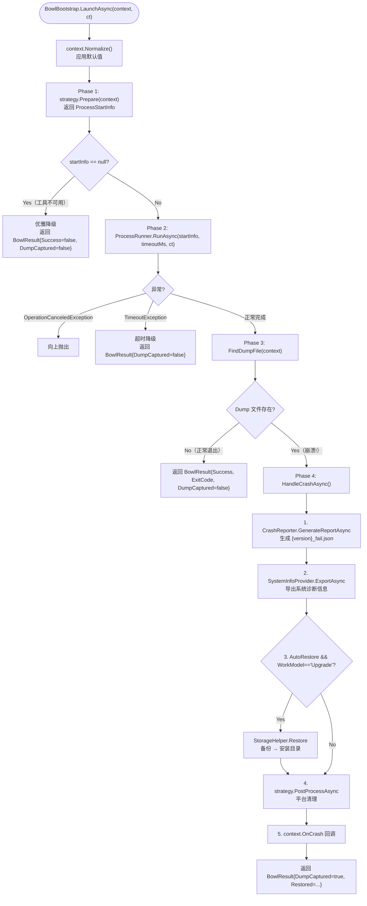
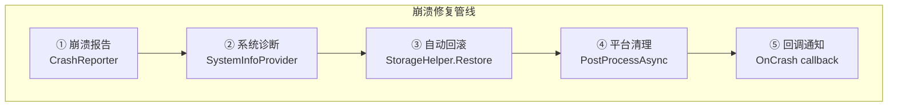

# GeneralUpdate.Bowl — 执行流程详解

> **目标读者：** 需要理解 Bowl 崩溃守护机制的开发者
>
> **阅读完你将理解：**
> - Bowl 在 GeneralUpdate 升级闭环中的定位与职责
> - 从 LaunchAsync 到崩溃处理完成的完整执行链路
> - ProcDump 进程监控的双阶段设计（Prepare → Run）
> - Dump 文件的检测逻辑与崩溃判定规则
> - 崩溃发生后的五步修复管线（报告 → 诊断 → 回滚 → 清理 → 回调）
> - Upgrade 模式与 Normal 模式的行为差异
> - 跨平台策略（Windows / Linux / macOS）的适配机制
> - 优雅降级与容错设计

---

## 目录

1. [架构总览](#1-架构总览)
2. [入口：BowlBootstrap 的依赖注入设计](#2-入口bowlbootstrap-的依赖注入设计)
3. [BowlContext：不可变执行上下文](#3-bowlcontext不可变执行上下文)
4. [LaunchAsync：监控主流程详解](#4-launchasync监控主流程详解)
5. [Phase 1：Strategy.Prepare — 平台策略准备](#5-phase-1strategyprepare--平台策略准备)
6. [Phase 2：ProcessRunner — 子进程运行与超时控制](#6-phase-2processrunner--子进程运行与超时控制)
7. [Phase 3：FindDumpFile — Dump 检测与崩溃判定](#7-phase-3finddumpfile--dump-检测与崩溃判定)
8. [Phase 4：HandleCrashAsync — 崩溃修复管线](#8-phase-4handlecrashasync--崩溃修复管线)
9. [Upgrade vs Normal：两种工作模式对比](#9-upgrade-vs-normal两种工作模式对比)
10. [平台策略适配：Windows / Linux / macOS](#10-平台策略适配windows--linux--macos)
11. [容错与优雅降级](#11-容错与优雅降级)
12. [与 GeneralUpdate.Core 的集成](#12-与-generalupdatecore-的集成)
13. [关键代码路径索引](#13-关键代码路径索引)

---

## 1. 架构总览

### 1.1 Bowl 在升级闭环中的位置

Bowl 是 GeneralUpdate **升级闭环的最后一道防线**。它不参与下载、解压或文件替换——这些是 Core 的职责。Bowl 的唯一任务是：在新版本文件落地后、主程序启动时，监控目标进程是否在启动阶段崩溃。

```
┌──────────────────────────────────────────────────────────────┐
│                    GeneralUpdate 升级闭环                      │
│                                                              │
│  ┌──────────┐    ┌──────────┐    ┌──────────┐    ┌─────────┐│
│  │ Core     │───▶│ Upgrade  │───▶│ 启动新版本│───▶│  Bowl   ││
│  │ 下载+验证 │    │ 应用补丁  │    │ 主程序    │    │ 崩溃守护 ││
│  └──────────┘    └──────────┘    └──────────┘    └────┬────┘│
│                                                       │     │
│                                          ┌────────────▼───┐ │
│                                          │ 正常退出 → 完成  │ │
│                                          │ 崩溃    → 修复  │ │
│                                          └────────────────┘ │
└──────────────────────────────────────────────────────────────┘
```

### 1.2 三层依赖架构

Bowl 采用**策略 + 报告 + 诊断**的三层依赖注入设计：

```
┌──────────────────────────────────────────────────────────┐
│                   BowlBootstrap（编排层）                  │
│                                                          │
│  ┌──────────────────┐  ┌──────────────┐  ┌────────────┐ │
│  │ IBowlStrategy    │  │ICrashReporter│  │ISystemInfo  │ │
│  │ 平台监控策略      │  │ 崩溃报告生成  │  │ Provider    │ │
│  │                  │  │              │  │ 系统诊断导出│ │
│  └────────┬─────────┘  └──────┬───────┘  └─────┬──────┘ │
│           │                   │                 │        │
│  ┌────────▼─────────┐  ┌──────▼───────┐  ┌─────▼──────┐ │
│  │WindowsBowl       │  │ CrashReporter│  │WindowsSystem│ │
│  │Strategy          │  │ → JSON 报告   │  │InfoProvider │ │
│  │(procdump.exe)    │  │              │  │(export.bat) │ │
│  ├──────────────────┤  └──────────────┘  ├────────────┤ │
│  │LinuxBowlStrategy │                    │LinuxSystem │ │
│  │(procdump包安装)   │                    │InfoProvider│ │
│  ├──────────────────┤                    └────────────┘ │
│  │MacBowlStrategy   │                                    │
│  │(lldb)            │                                    │
│  └──────────────────┘                                    │
└──────────────────────────────────────────────────────────┘
```

### 1.3 核心设计原则

| 原则 | 说明 |
|------|------|
| **只监控不更新** | Bowl 不下载、不解压、不替换文件，只监控进程崩溃状态 |
| **策略模式** | `IBowlStrategy` 封装平台差异，Windows 用 ProcDump，Linux 用 ProcDump，macOS 用 lldb |
| **优雅降级** | 任何步骤失败都不影响后续步骤执行——报告生成失败仍会尝试回滚，回滚失败仍会触发回调 |
| **崩溃判定 = Dump 存在** | 崩溃的唯一判定标准是 Dump 文件是否存在。有 Dump = 崩溃，无 Dump = 正常退出 |
| **不可变上下文** | `BowlContext` 是 `readonly record struct`，通过 `Normalize()` 产生标准化副本 |

### 1.4 两种工作模式

| 模式 | WorkModel | 行为 |
|------|-----------|------|
| **Upgrade** | `"Upgrade"` | 监控新版本启动 → 崩溃时自动回滚备份 → 标记失败版本 → 写环境变量 |
| **Normal** | `"Normal"` | 独立监控模式 → 崩溃时生成报告和诊断 → 不自动回滚 → 不标记失败版本 |

---

## 2. 入口：BowlBootstrap 的依赖注入设计

`BowlBootstrap` 提供两个构造函数：无参构造自动装配默认实现，三参构造支持 DI 注入。

### 2.1 双构造函数

```csharp
// 开箱即用：自动检测平台策略 + 默认报告器/诊断器
public BowlBootstrap()
    : this(
        StrategyFactory.Create(),       // 根据 RuntimeInformation 自动选择
        new CrashReporter(),            // JSON 崩溃报告
        SystemInfoProviderFactory.Create()) // 平台系统诊断
{ }

// DI 友好：所有依赖可替换、可 Mock
internal BowlBootstrap(
    IBowlStrategy strategy,
    ICrashReporter crashReporter,
    ISystemInfoProvider systemInfoProvider)
{
    _strategy = strategy;
    _crashReporter = crashReporter;
    _systemInfoProvider = systemInfoProvider;
}
```

### 2.2 策略工厂决策树

```
StrategyFactory.Create()
  │
  ├── IsWindows()  ──▶ WindowsBowlStrategy
  │                     使用 procdump.exe / procdump64.exe
  │                     通过 -e 参数附加到目标进程
  │
  ├── IsLinux()    ──▶ LinuxBowlStrategy
  │                     检测 procdump 可用性
  │                     自动识别发行版（deb/rpm）
  │                     按需安装 procdump 包
  │
  └── IsMacOS()    ──▶ MacBowlStrategy
                        使用 /usr/bin/lldb
                        受 SIP 和调试权限限制
```

---

## 3. BowlContext：不可变执行上下文

`BowlContext` 是 `readonly record struct`，承载所有监控参数。通过 `Normalize()` 方法应用默认值。

### 3.1 核心字段

| 字段 | 类型 | 默认值 | 说明 |
|------|------|--------|------|
| `ProcessNameOrId` | `string` | — **(必填)** | 目标进程名或 PID |
| `TargetPath` | `string` | — | 目标安装路径 |
| `FailDirectory` | `string` | `TargetPath/fails/` | Dump 和报告输出目录 |
| `BackupDirectory` | `string` | `TargetPath/.backups/latest/` | 备份目录（升级模式回滚源） |
| `DumpFileName` | `string` | `{进程名}.dmp` | 期望的 Dump 文件名 |
| `TimeoutMs` | `int` | `30000` (30s) | 监控超时时间 |
| `DumpType` | `DumpType` | `Full` | Dump 类型：Full / Mini / Heap |
| `WorkModel` | `string` | `"Upgrade"` | 工作模式：Upgrade / Normal |
| `AutoRestore` | `bool` | `true` | 崩溃后是否自动回滚备份 |
| `ExtendedField` | `string` | — | 扩展字段（通常存版本号） |
| `OnCrash` | `Func<CrashInfo, CT, Task>` | `null` | 崩溃回调 |

### 3.2 Normalize() 默认值应用

```csharp
context = context.Normalize();
// 等效于：
// if (string.IsNullOrEmpty(context.WorkModel)) context = context with { WorkModel = "Upgrade" };
// if (context.TimeoutMs <= 0) context = context with { TimeoutMs = 30000 };
// if (context.DumpType == default) context = context with { DumpType = DumpType.Full };
// if (string.IsNullOrEmpty(context.FailDirectory)) 
//     context = context with { FailDirectory = Path.Combine(context.TargetPath, "fails") };
// if (string.IsNullOrEmpty(context.DumpFileName))
//     context = context with { DumpFileName = $"{context.ProcessNameOrId}.dmp" };
```

---

## 4. LaunchAsync：监控主流程详解

`LaunchAsync` 是 Bowl 的唯一公开方法，封装了从策略准备到崩溃修复的完整链路。

### 4.1 全流程总图



### 4.2 BowlResult 返回值

```csharp
public readonly record struct BowlResult
{
    public bool Success { get; init; }        // 进程是否正常退出
    public int ExitCode { get; init; }         // 进程退出码
    public bool DumpCaptured { get; init; }    // 是否捕获到 Dump
    public string? DumpFilePath { get; init; } // Dump 文件路径
    public string? CrashReportPath { get; init; } // 崩溃报告路径
    public bool Restored { get; init; }        // 是否执行了回滚
}
```

---

## 5. Phase 1：Strategy.Prepare — 平台策略准备

`Prepare` 方法的职责是：根据平台差异，构造启动 ProcDump（或 lldb）子进程所需的 `ProcessStartInfo`。**如果工具不可用，返回 `null` 表示优雅降级**。

### 5.1 WindowsBowlStrategy

```csharp
// Windows 策略：选择正确的 procdump 架构版本
public ProcessStartInfo? Prepare(BowlContext context)
{
    var procDumpPath = GetProcDumpPath(); // 根据进程位数选择 procdump.exe / procdump64.exe
    if (!File.Exists(procDumpPath))
        return null; // 工具缺失 → 优雅降级

    return new ProcessStartInfo
    {
        FileName = procDumpPath,
        Arguments = $"-e -ma -accepteula {context.ProcessNameOrId} {dumpOutputPath}",
        // -e: 仅捕获未处理异常
        // -ma: Full Dump
        // -accepteula: 自动接受 EULA
    };
}
```

### 5.2 LinuxBowlStrategy

```csharp
// Linux 策略：先检测 procdump 是否可用，不可用则尝试自动安装
public ProcessStartInfo? Prepare(BowlContext context)
{
    if (!IsProcDumpAvailable())
    {
        var installed = TryInstallProcDump(); // 识别发行版，执行 install.sh 或包管理器
        if (!installed) return null; // 安装失败 → 优雅降级
    }

    return new ProcessStartInfo
    {
        FileName = "procdump",
        Arguments = $"-e -ma {context.ProcessNameOrId} {dumpOutputPath}"
    };
}
```

### 5.3 MacBowlStrategy

macOS 策略使用系统内置的 `lldb`，但由于 SIP（系统完整性保护）限制，需要额外的调试权限。通常仅在开发/调试环境中可用。

---

## 6. Phase 2：ProcessRunner — 子进程运行与超时控制

`ProcessRunner` 是一个异步包装器，负责启动子进程、收集输出、等待退出或超时。

### 6.1 执行模型

```
ProcessRunner.RunAsync(startInfo, timeoutMs, ct)
  │
  ├── Process.Start(startInfo)
  │     RedirectStandardOutput = true
  │     RedirectStandardError = true
  │
  ├── 并发执行：
  │     Task 1: process.WaitForExitAsync(ct)  → 等待进程退出
  │     Task 2: Task.Delay(timeoutMs, ct)     → 超时计时器
  │
  ├── 收集 stdout/stderr 行 → List<string> OutputLines
  │
  └── 返回 ProcessExitResult { ExitCode, OutputLines }
```

### 6.2 异常处理

| 场景 | 行为 |
|------|------|
| ct 被取消 | 抛出 `OperationCanceledException`（向上传播） |
| 超时 | 抛出 `TimeoutException`（BowlBootstrap 捕获后优雅降级） |
| 进程正常退出 | 返回 ExitCode 和输出行 |

---

## 7. Phase 3：FindDumpFile — Dump 检测与崩溃判定

崩溃判定的逻辑极其简单：

```csharp
private static string? FindDumpFile(BowlContext context)
{
    var path = Path.Combine(context.FailDirectory, context.DumpFileName);
    return File.Exists(path) ? path : null;
}
```

**核心规则：有 Dump 文件 = 崩溃，无 Dump 文件 = 正常退出。**

这个设计利用了 ProcDump 的 `-e` 参数行为——ProcDump 只在目标进程发生未处理异常时才生成 Dump 文件。如果进程正常退出，ProcDump 不会生成任何文件，自然也不会触发崩溃处理流程。

---

## 8. Phase 4：HandleCrashAsync — 崩溃修复管线

这是 Bowl 最核心的部分。当 Dump 文件被检测到时，启动五步修复管线：



### 8.1 步骤 1：生成崩溃报告

```csharp
// CrashReporter.GenerateReportAsync
// 输出：{FailDirectory}/{version}_fail.json
var crashReportPath = await _crashReporter.GenerateReportAsync(
    context, exitResult.OutputLines, ct);
```

报告内容包含：
- 监控参数快照（进程名、版本、超时等）
- ProcDump 输出行
- 时间戳

**容错设计：** 报告生成失败不会中断后续步骤。异常被捕获并记录日志，管线继续执行。

### 8.2 步骤 2：导出系统诊断

```csharp
await _systemInfoProvider.ExportAsync(context.FailDirectory, ct);
```

**Windows：** 运行内置的 `export.bat`，收集：
- 驱动列表（`driverquery`）
- 系统信息（`systeminfo`）
- 最近的系统事件日志

**Linux/macOS：** 收集 `dmesg`、`journalctl` 等系统日志。

**容错设计：** 诊断导出失败不中断后续步骤。

### 8.3 步骤 3：自动回滚（仅 Upgrade 模式）

```csharp
if (context.AutoRestore && context.WorkModel == "Upgrade")
{
    StorageHelper.Restore(context.BackupDirectory, context.TargetPath);
    restored = true;
}
```

`StorageHelper.Restore` 将备份目录的内容覆盖复制到安装目录，实现一键回退到旧版本。

**前置条件：**
- `AutoRestore = true`（默认值）
- `WorkModel = "Upgrade"`（Normal 模式不自动回滚）
- 备份目录必须存在（Core 在更新前已创建）

**容错设计：** 回滚失败不中断后续步骤——即使回滚失败，仍然会触发 OnCrash 回调。

### 8.4 步骤 4：平台清理

```csharp
await _strategy.PostProcessAsync(context, exitResult, ct);
```

平台特定的后处理：
- **Windows：** 清理临时 ProcDump 文件
- **Linux：** 终止残留的 procdump 进程
- **macOS：** 清理 lldb 会话文件

### 8.5 步骤 5：回调通知

```csharp
if (context.OnCrash != null)
{
    var crashInfo = new CrashInfo
    {
        DumpFilePath = dumpPath,
        CrashReportPath = crashReportPath,
        Version = context.ExtendedField,
        ExitCode = exitResult.ExitCode,
    };
    await context.OnCrash(crashInfo, ct);
}
```

业务方可以在回调中：
- 上传 Dump 和报告到崩溃收集服务
- 记录审计日志
- 通知用户
- 触发告警

---

## 9. Upgrade vs Normal：两种工作模式对比

| 维度 | Upgrade 模式 | Normal 模式 |
|------|-------------|------------|
| **使用场景** | 升级后启动健康检查 | 通用进程崩溃监控 |
| **崩溃报告** | ✅ 生成 | ✅ 生成 |
| **系统诊断** | ✅ 导出 | ✅ 导出 |
| **自动回滚** | ✅ `StorageHelper.Restore` | ❌ 跳过 |
| **失败版本标记** | ✅ 写 `UpgradeFail` | ❌ 不标记 |
| **环境变量** | ✅ 设 `GU_UPGRADE_FAIL` | ❌ 不设 |
| **OnCrash 回调** | ✅ 触发 | ✅ 触发 |

### 9.1 与 Core 的联动（Upgrade 模式）

```
Core 升级流程
  │
  ├── 备份安装目录 → .backups/backup-{ts}
  ├── 下载 + 应用更新
  ├── 写 IPC 文件
  ├── 拉起 Upgrade 进程
  │
  └── 启动 Bowl（Upgrade 模式）
        │
        ├── 监控新版本主程序启动
        │
        ├── 正常启动 → 无 Dump → 返回 Success → 升级完成 ✅
        │
        └── 启动崩溃 → 有 Dump → 进入修复管线
              ├── 回滚到 .backups/
              ├── 写 {version}_fail.json
              └── 设环境变量 GU_UPGRADE_FAIL={version}
                    │
                    └── Core 下次启动读取环境变量
                          → CheckFail() 命中
                          → 跳过该版本
                          → 等待服务端提供更高版本
```

---

## 10. 平台策略适配：Windows / Linux / macOS

### 10.1 策略对比

| 维度 | Windows | Linux | macOS |
|------|---------|-------|-------|
| **监控工具** | `procdump.exe` / `procdump64.exe` | `procdump` (deb/rpm) | `/usr/bin/lldb` |
| **工具获取** | 内置在 NuGet 包中 | 自动检测 + `install.sh` 安装 | 系统内置 |
| **Dump 参数** | `-e -ma` | `-e -ma` | lldb 脚本 |
| **架构选择** | 根据进程位数自动选择 x86/x64/ARM64 | 不区分 | 不区分 |
| **权限要求** | 管理员权限（调试权限） | root（ptrace 权限） | SIP 授权 |
| **系统诊断** | `export.bat`：驱动/系统信息/事件日志 | `dmesg` / `journalctl` | `sysdiagnose` |
| **支持级别** | 完整支持 | 完整支持（需网络安装工具） | 基础支持（受 SIP 限制） |

### 10.2 StrategyFactory 自动检测

```csharp
public static IBowlStrategy Create()
{
    if (RuntimeInformation.IsOSPlatform(OSPlatform.Windows))
        return new WindowsBowlStrategy();
    if (RuntimeInformation.IsOSPlatform(OSPlatform.Linux))
        return new LinuxBowlStrategy();
    if (RuntimeInformation.IsOSPlatform(OSPlatform.OSX))
        return new MacBowlStrategy();
    throw new PlatformNotSupportedException();
}
```

---

## 11. 容错与优雅降级

Bowl 的设计哲学是：**任何单一组件失败都不应阻止其他组件的执行**。

### 11.1 降级层级

```
Level 0: 策略无法准备工具
  → 返回 BowlResult{Success=false, DumpCaptured=false}
  → 不崩溃、不抛异常
  → 调用方自行决定后续行为

Level 1: 子进程超时
  → 返回 BowlResult{DumpCaptured=false}
  → 视为"未捕获到崩溃"
  → 不做回滚处理

Level 2: 报告生成失败
  → 记录日志
  → 继续执行后续步骤

Level 3: 系统诊断失败
  → 记录日志
  → 继续执行后续步骤

Level 4: 自动回滚失败
  → 记录日志
  → 继续执行回调

Level 5: OnCrash 回调异常
  → 记录日志
  → 不影响 BowlResult 返回
```

### 11.2 异常传播策略

| 异常类型 | 行为 |
|----------|------|
| `OperationCanceledException` | **唯一向上传播的异常** —— 调用方取消必须被尊重 |
| `TimeoutException` | 被 BowlBootstrap 捕获，优雅降级 |
| 其他所有异常 | 被各步骤独立捕获，记录日志后继续执行 |

---

## 12. 与 GeneralUpdate.Core 的集成

### 12.1 调用时机

Bowl 应在 Core 完成文件替换之后、启动新版本主程序之前被调用：

```csharp
// Core ClientStrategy 中的典型调用模式
public async Task LaunchAsync()
{
    // ... Core 完成下载、验证、应用更新 ...

    // 启动 Bowl 守护新版本
    var bowlContext = new BowlContext
    {
        ProcessNameOrId = "MyApp",
        TargetPath = installPath,
        BackupDirectory = backupPath,
        WorkModel = "Upgrade",
        ExtendedField = newVersion,
        AutoRestore = true,
        OnCrash = async (info, ct) =>
        {
            // 上传崩溃诊断包
            await UploadCrashReportAsync(info, ct);
        }
    };

    var bowl = new BowlBootstrap();
    var result = await bowl.LaunchAsync(bowlContext);

    if (!result.Success && result.DumpCaptured)
    {
        // 崩溃已发生，回滚已执行
        // Core 下次启动时会通过 UpgradeFail 标记跳过此版本
    }
}
```

### 12.2 与 Core 共享的状态

| 状态通道 | 写入方 | 读取方 | 用途 |
|----------|--------|--------|------|
| `{version}_fail.json` | Bowl | Core + 业务 | 崩溃报告持久化 |
| 环境变量 `GU_UPGRADE_FAIL` | Bowl | Core | 失败版本跳过 |
| `.backups/` 目录 | Core（创建） | Bowl（回滚） | 备份与恢复 |

---

## 13. 关键代码路径索引

| 组件 | 文件 | 关键方法 |
|------|------|----------|
| 入口编排 | `BowlBootstrap.cs` | `LaunchAsync()` → `HandleCrashAsync()` |
| 执行上下文 | `BowlContext.cs` | `Normalize()` |
| 崩溃报告 | `Internal/CrashReporter.cs` | `GenerateReportAsync()` |
| 系统诊断 | `Internal/WindowsSystemInfoProvider.cs` | `ExportAsync()` |
| 文件回滚 | `FileSystem/StorageHelper.cs` | `Restore()` |
| Windows 策略 | `Strategies/WindowsBowlStrategy.cs` | `Prepare()` / `PostProcessAsync()` |
| Linux 策略 | `Strategies/LinuxBowlStrategy.cs` | `Prepare()` / `PostProcessAsync()` |
| Mac 策略 | `Strategies/MacBowlStrategy.cs` | `Prepare()` / `PostProcessAsync()` |
| 进程运行器 | `Strategies/ProcessRunner.cs` | `RunAsync()` |
| 策略工厂 | `Strategies/StrategyFactory.cs` | `Create()` |
| 崩溃 DTO | `Internal/Crash.cs` | — |
| Dump 类型 | `DumpType.cs` | `Full` / `Mini` / `Heap` |
| 日志追踪 | `Tracer/GeneralTracer.cs` | `Info()` / `Warn()` / `Error()` |
