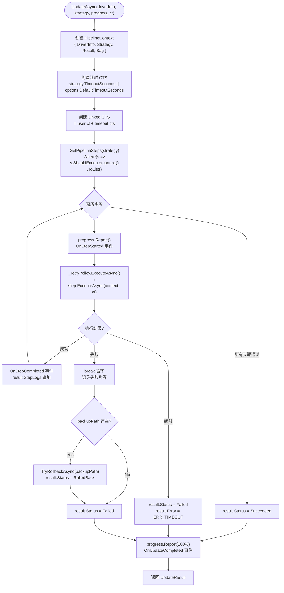
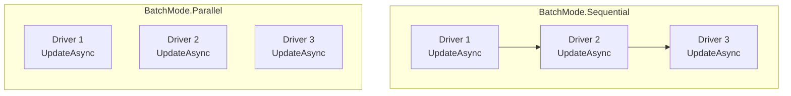

# GeneralUpdate.Drivelution — 执行流程详解

> **目标读者：** 需要理解 Drivelution 驱动更新引擎内部机制的开发者
>
> **阅读完你将理解：**
> - Drivelution 的跨平台抽象架构与工厂模式设计
> - `BaseDriverUpdater` 模板方法如何编排统一流水线
> - 平台检测 → 权限检查 → 验证 → 备份 → 安装 → 验证 → 回滚的完整链路
> - `IPipelineStep` 的可组合流水线设计
> - 重试策略（RetryPolicy）与超时控制机制
> - Windows（pnputil）、Linux（insmod/dpkg/rpm）、macOS（kextload/installer）的平台差异
> - 批量更新（BatchUpdateAsync）的顺序/并行执行模式
> - 异常到结构化 ErrorInfo 的映射机制

---

## 目录

1. [架构总览](#1-架构总览)
2. [入口：GeneralDrivelution 静态外观](#2-入口generaldrivelution-静态外观)
3. [工厂：DrivelutionFactory 平台检测](#3-工厂drivelutionfactory-平台检测)
4. [BaseDriverUpdater：模板方法流水线](#4-basedriverupdater模板方法流水线)
5. [IPipelineStep：可组合流水线步骤](#5-ipipelinestep可组合流水线步骤)
6. [重试与超时：RetryPolicy 与 CancellationToken](#6-重试与超时retrypolicy-与-cancellationtoken)
7. [平台安装实现：Windows / Linux / macOS](#7-平台安装实现windows--linux--macos)
8. [回滚机制：TryRollbackAsync](#8-回滚机制tryrollbackasync)
9. [批量更新：BatchUpdateAsync](#9-批量更新batchupdateasync)
10. [异常映射：MapExceptionToErrorInfo](#10-异常映射mapexceptiontoerrorinfo)
11. [关键代码路径索引](#11-关键代码路径索引)

---

## 1. 架构总览

### 1.1 三层抽象设计

Drivelution 采用**外观 → 模板方法 → 平台实现**的三层抽象：

```
┌──────────────────────────────────────────────────────────────┐
│                   第一层：静态外观                              │
│                  GeneralDrivelution                          │
│     Create() / QuickUpdateAsync() / ValidateAsync()          │
│     BatchUpdateAsync() / GetPlatformInfo()                   │
├──────────────────────────────────────────────────────────────┤
│                   第二层：工厂 + 接口                           │
│  ┌────────────────────┐    ┌────────────────────────────┐    │
│  │ DrivelutionFactory │    │ IGeneralDrivelution        │    │
│  │ 平台检测 → 创建实例  │    │ UpdateAsync / ValidateAsync │    │
│  └────────┬───────────┘    │ BackupAsync / RollbackAsync │    │
│           │                └─────────────┬──────────────┘    │
│           │                              │                    │
│           └──────────────┬───────────────┘                    │
│                          ▼                                    │
│                   第三层：平台实现                              │
│  ┌────────────────┐ ┌──────────────┐ ┌──────────────────┐    │
│  │WindowsGeneral  │ │LinuxGeneral  │ │MacOsGeneral      │    │
│  │Drivelution     │ │Drivelution   │ │Drivelution       │    │
│  │pnputil.exe     │ │insmod/dpkg   │ │kextload/installer│    │
│  └────────────────┘ └──────────────┘ └──────────────────┘    │
│                                                              │
│              所有实现继承 BaseDriverUpdater                    │
│              共享统一的流水线编排逻辑                           │
└──────────────────────────────────────────────────────────────┘
```

### 1.2 核心设计原则

| 原则 | 说明 |
|------|------|
| **模板方法模式** | `BaseDriverUpdater.UpdateAsync()` 定义流水线骨架，子类只需实现 `InstallCoreAsync()` |
| **策略模式** | `UpdateStrategy` 控制备份、重试、超时、重启等行为 |
| **工厂模式** | `DrivelutionFactory.Create()` 自动检测 OS 并创建对应实现 |
| **流水线模式** | `IPipelineStep` 可组合、可替换、可跳过（`ShouldExecute`） |
| **Bag 上下文** | `PipelineContext.Bag` (Dictionary) 在步骤间共享中间数据 |

### 1.3 统一流水线

```
Windows:  [CheckPermissions] → Validate → Backup → Install → Verify
Linux:    [CheckSudo]        → Validate → Backup → Install → Verify
macOS:    [CheckPermissions] → Validate → Backup → Install → Verify
```

每个步骤都有：条件判断（ShouldExecute）→ 执行（ExecuteAsync）→ 结果判断 → 失败回滚。

---

## 2. 入口：GeneralDrivelution 静态外观

`GeneralDrivelution` 是一个**静态外观类**，提供所有公开 API。它委托给工厂创建平台实现。

### 2.1 API 全景

```csharp
public static class GeneralDrivelution
{
    // 工厂方法
    static IGeneralDrivelution Create(DrivelutionOptions? options = null);
    static IGeneralDrivelution Create(IServiceProvider serviceProvider);  // DI 支持

    // 便捷方法
    static Task<UpdateResult> QuickUpdateAsync(DriverInfo, UpdateStrategy?, IProgress?, CT);
    static Task<bool> ValidateAsync(DriverInfo, CT);
    static Task<List<DriverInfo>> GetDriversFromDirectoryAsync(string path, string? pattern, CT);
    static Task<BatchUpdateResult> BatchUpdateAsync(IEnumerable<DriverInfo>, UpdateStrategy, BatchMode, IProgress?, CT);
    static PlatformInfo GetPlatformInfo();
}
```

### 2.2 QuickUpdateAsync 默认策略

```csharp
public static async Task<UpdateResult> QuickUpdateAsync(
    DriverInfo driverInfo,
    UpdateStrategy? strategy = null, ...)
{
    strategy ??= new UpdateStrategy
    {
        RequireBackup = true,        // 默认开启备份
        RetryCount = 3,              // 默认重试 3 次
        RetryIntervalSeconds = 5     // 默认间隔 5 秒
    };

    var updater = Create();          // 自动检测平台
    return await updater.UpdateAsync(driverInfo, strategy, progress, ct);
}
```

---

## 3. 工厂：DrivelutionFactory 平台检测

```csharp
public static IGeneralDrivelution Create(DrivelutionOptions? options = null)
{
    if (RuntimeInformation.IsOSPlatform(OSPlatform.Windows))
        return new WindowsGeneralDrivelution(options);

    if (RuntimeInformation.IsOSPlatform(OSPlatform.Linux))
        return new LinuxGeneralDrivelution(options);

    if (RuntimeInformation.IsOSPlatform(OSPlatform.OSX))
        return new MacOsGeneralDrivelution(options);

    throw new PlatformNotSupportedException("Current platform is not supported.");
}
```

工厂同时提供 `IsPlatformSupported()`、`GetCurrentPlatform()` 等查询方法。

---

## 4. BaseDriverUpdater：模板方法流水线

`BaseDriverUpdater` 是 Drivelution 的核心。它实现了 `IGeneralDrivelution` 接口，定义了完整的更新流水线模板。

### 4.1 UpdateAsync 全流程



### 4.2 模板方法 Hook

子类需要实现的核心抽象方法：

```csharp
// 唯一必须实现的抽象方法——平台特定的安装逻辑
protected abstract Task InstallCoreAsync(
    DriverInfo driverInfo,
    UpdateStrategy strategy,
    CancellationToken cancellationToken);
```

可选的虚方法覆盖：

| 虚方法 | 默认行为 | 覆盖场景 |
|--------|----------|----------|
| `GetPipelineSteps(strategy)` | `[Validate, Backup, Install, Verify]` | Windows 插入 CheckPermissions，Linux 插入 CheckSudo |
| `VerifyInstallationAsync(driverInfo, ct)` | `return true` | 平台特定的安装后验证 |
| `GetDefaultSearchPattern()` | `"*.*"` | Windows 返回 `"*.inf"`，Linux 返回 `"*.ko"` |
| `ParseDriverFromFile(filePath)` | 基础解析 | 平台特定的驱动文件解析（INF / modinfo） |

---

## 5. IPipelineStep：可组合流水线步骤

### 5.1 步骤接口

```csharp
public interface IPipelineStep
{
    string StepName { get; }
    bool ShouldExecute(PipelineContext context);
    Task<PipelineResult> ExecuteAsync(PipelineContext context, CancellationToken ct);
}

public class PipelineResult
{
    public bool Success { get; set; }
    public string? ErrorMessage { get; set; }
    public Exception? Exception { get; set; }
}
```

### 5.2 内置步骤（DefaultPipelineSteps）

```csharp
public static class DefaultPipelineSteps
{
    // Validate：哈希校验 + 签名校验 + 兼容性检查
    public static IPipelineStep CreateValidateStep(IDriverValidator validator);

    // Backup：将当前驱动文件备份到指定路径
    public static IPipelineStep CreateBackupStep(IDriverBackup backup);

    // Install：委托给 InstallCoreAsync（平台特定）
    public static IPipelineStep CreateInstallStep(Func<DriverInfo, UpdateStrategy, CT, Task> installCore);

    // Verify：安装后验证（可覆盖）
    public static IPipelineStep CreateVerifyStep(Func<DriverInfo, CT, Task<bool>> verify);
}
```

### 5.3 DelegateStep：轻量自定义步骤

```csharp
public class DelegateStep : IPipelineStep
{
    // 通过委托快速创建自定义步骤，无需新建类
    public DelegateStep(string name, Func<PipelineContext, bool> shouldExecute,
                        Func<PipelineContext, CT, Task<PipelineResult>> execute);
}
```

---

## 6. 重试与超时：RetryPolicy 与 CancellationToken

### 6.1 重试策略

```csharp
public class RetryPolicy
{
    public int MaxRetries { get; init; }         // 最大重试次数（默认 3）
    public int RetryIntervalMs { get; init; }    // 重试间隔（默认 5000ms）
    public bool UseExponentialBackoff { get; init; } // 指数退避

    public async Task<PipelineResult> ExecuteAsync(
        Func<CancellationToken, Task<PipelineResult>> action,
        CancellationToken ct)
    {
        for (int attempt = 0; attempt <= MaxRetries; attempt++)
        {
            var result = await action(ct);
            if (result.Success) return result;

            if (attempt < MaxRetries)
            {
                var delay = UseExponentialBackoff
                    ? RetryIntervalMs * Math.Pow(2, attempt)
                    : RetryIntervalMs;
                await Task.Delay((int)delay, ct);
            }
        }
        // 所有重试耗尽，返回最后一次失败结果
    }
}
```

### 6.2 超时控制

```csharp
// 双重 CancellationToken 联动
var timeoutSeconds = strategy.TimeoutSeconds > 0
    ? strategy.TimeoutSeconds
    : _options.DefaultTimeoutSeconds;

using var timeoutCts = new CancellationTokenSource(TimeSpan.FromSeconds(timeoutSeconds));
using var linkedCts = CancellationTokenSource.CreateLinkedTokenSource(
    cancellationToken, timeoutCts.Token);
```

超时后：
- `linkedCts.Token` 被取消
- 当前步骤的 `ExecuteAsync` 收到 `OperationCanceledException`
- `BaseDriverUpdater` 捕获后返回 `UpdateStatus.Failed` + `ErrorType.Timeout`

---

## 7. 平台安装实现：Windows / Linux / macOS

### 7.1 Windows：pnputil

```csharp
// WindowsGeneralDrivelution.InstallCoreAsync
protected override async Task InstallCoreAsync(DriverInfo driverInfo, ...)
{
    // pnputil /add-driver <inf文件> /install
    var args = $"/add-driver \"{driverInfo.FilePath}\" /install";
    var result = await CommandRunner.RunAsync("pnputil.exe", args, ct);

    if (result.ExitCode != 0)
        throw new DriverInstallationException(
            $"pnputil failed with exit code {result.ExitCode}: {result.StdErr}");
}
```

Windows 平台额外步骤：
- **CheckPermissions：** 检查是否以管理员权限运行
- **INF 解析：** 从 `.inf` 文件中提取驱动名称、版本、签名信息

### 7.2 Linux：多种包格式

```csharp
// LinuxGeneralDrivelution.InstallCoreAsync
protected override async Task InstallCoreAsync(DriverInfo driverInfo, ...)
{
    var ext = Path.GetExtension(driverInfo.FilePath).ToLowerInvariant();

    switch (ext)
    {
        case ".ko":   // 内核模块
            await CommandRunner.RunAsync("insmod", driverInfo.FilePath, ct);
            break;
        case ".deb":  // Debian 包
            await CommandRunner.RunAsync("dpkg", $"-i {driverInfo.FilePath}", ct);
            break;
        case ".rpm":  // RPM 包
            // 优先 dnf，回退 rpm
            await CommandRunner.RunAsync("dnf", $"install -y {driverInfo.FilePath}", ct);
            break;
    }
}
```

Linux 平台额外步骤：
- **CheckSudo：** 检查是否有 root 权限
- **modinfo 解析：** 从 `.ko` 文件中提取模块信息

### 7.3 macOS：kext/dext/pkg

```csharp
// MacOsGeneralDrivelution.InstallCoreAsync
protected override async Task InstallCoreAsync(DriverInfo driverInfo, ...)
{
    var ext = Path.GetExtension(driverInfo.FilePath).ToLowerInvariant();

    switch (ext)
    {
        case ".kext":  // 内核扩展
            await CommandRunner.RunAsync("kextload", driverInfo.FilePath, ct);
            break;
        case ".dext":  // 系统扩展（DriverKit）
            await CommandRunner.RunAsync("systemextensionsctl", $"install ...", ct);
            break;
        case ".pkg":   // 安装包
            await CommandRunner.RunAsync("installer", $"-pkg {driverInfo.FilePath} -target /", ct);
            break;
    }
}
```

### 7.4 CommandRunner：安全的进程执行

```csharp
// 使用 ArgumentList 避免 shell 注入
public async Task<CommandResult> RunAsync(string fileName, string arguments, CT ct)
{
    var psi = new ProcessStartInfo
    {
        FileName = fileName,
        RedirectStandardOutput = true,
        RedirectStandardError = true,
        UseShellExecute = false,
    };
    // 使用 ArgumentList 而不是 Arguments 字符串拼接
    foreach (var arg in ParseArguments(arguments))
        psi.ArgumentList.Add(arg);
    // ...
}
```

---

## 8. 回滚机制：TryRollbackAsync

### 8.1 触发条件

回滚在以下条件同时满足时触发：
1. 流水线中某步骤执行失败
2. `PipelineContext.Bag["BackupPath"]` 存在（Backup 步骤已成功写入）
3. 或 `result.BackupPath` 不为空

### 8.2 执行流程

```
TryRollbackAsync(backupPath, CancellationToken.None)
  │
  ├── 检查备份目录是否存在
  │     └── 不存在 → 返回 false
  │
  ├── 检查备份目录内容
  │
  └── 返回 true/false
  │
  └── result.RolledBack = true
      result.Status = UpdateStatus.RolledBack
```

**注意：** 回滚使用 `CancellationToken.None`，确保即使原始操作已超时，回滚仍有机会执行。

---

## 9. 批量更新：BatchUpdateAsync

### 9.1 两种执行模式



### 9.2 顺序模式实现

```csharp
// BaseDriverUpdater.BatchUpdateAsync (Sequential)
for (int i = 0; i < driverList.Count; i++)
{
    progress?.Report(new UpdateProgress { /* 批次进度 */ });
    var updateResult = await UpdateAsync(driver, strategy, cancellationToken: ct);
    result.Results.Add(new DriverUpdateEntry { DriverInfo = driver, Success = updateResult.Success, Result = updateResult });
}
```

### 9.3 并行模式实现

```csharp
// BaseDriverUpdater.BatchUpdateAsync (Parallel)
var tasks = driverList.Select(async (driver, index) =>
{
    var updateResult = await UpdateAsync(driver, strategy, cancellationToken: ct);
    Interlocked.Increment(ref completed);
    return new DriverUpdateEntry { ... };
}).ToList();

var entries = await Task.WhenAll(tasks);
```

### 9.4 聚合结果

```csharp
result.SucceededCount = result.Results.Count(r => r.Success);
result.FailedCount = result.Results.Count(r => !r.Success);
result.AllSucceeded = result.FailedCount == 0;
result.Duration = DateTime.UtcNow - startTime;
```

---

## 10. 异常映射：MapExceptionToErrorInfo

Drivelution 将异常类型映射为结构化的 `ErrorInfo`：

| 异常类型 | ErrorType | Code | CanRetry | 建议解决方案 |
|----------|-----------|------|----------|-------------|
| `DriverPermissionException` | `PermissionDenied` | `ERR_PERM` | false | 以管理员/root 权限重启应用 |
| `DriverValidationException` | `HashValidationFailed` | `ERR_VALID` | false | 检查驱动文件完整性 |
| `DriverInstallationException` (CanRetry) | `InstallationFailed` | `ERR_INSTALL_RETRY` | true | 验证驱动兼容性后重试 |
| `DriverInstallationException` (!CanRetry) | `InstallationFailed` | `ERR_INSTALL` | false | 验证驱动兼容性 |
| `DriverBackupException` | `BackupFailed` | `ERR_BACKUP` | false | 检查磁盘空间和权限 |
| `DriverRollbackException` | `RollbackFailed` | `ERR_ROLLBACK` | false | 检查备份目录完整性 |
| `OperationCanceledException` | `Timeout` | `ERR_TIMEOUT` | true | 增加 TimeoutSeconds |
| 其他 | `Unknown` | `ERR_UNKNOWN` | false | 检查日志 |

---

## 11. 关键代码路径索引

| 组件 | 文件 | 关键方法 |
|------|------|----------|
| 静态外观 | `GeneralDrivelution.cs` | `Create()` / `QuickUpdateAsync()` / `BatchUpdateAsync()` |
| 工厂 | `Core/DrivelutionFactory.cs` | `Create()` |
| 模板方法 | `Core/Pipeline/BaseDriverUpdater.cs` | `UpdateAsync()` / `GetPipelineSteps()` / `TryRollbackAsync()` |
| 流水线步骤接口 | `Core/Pipeline/IPipelineStep.cs` | `ShouldExecute()` / `ExecuteAsync()` |
| 内置步骤 | `Core/Pipeline/DefaultPipelineSteps.cs` | `CreateValidateStep()` / `CreateBackupStep()` / `CreateInstallStep()` |
| 流水线上下文 | `Core/Pipeline/PipelineContext.cs` | `DriverInfo` / `Strategy` / `Bag` |
| 重试策略 | `Core/Pipeline/RetryPolicy.cs` | `ExecuteAsync()` |
| Windows 实现 | `Windows/Implementation/WindowsGeneralDrivelution.cs` | `InstallCoreAsync()` |
| Linux 实现 | `Linux/Implementation/LinuxGeneralDrivelution.cs` | `InstallCoreAsync()` |
| macOS 实现 | `MacOS/Implementation/MacOsGeneralDrivelution.cs` | `InstallCoreAsync()` |
| 命令执行器 | `Core/Execution/CommandRunner.cs` | `RunAsync()` |
| 兼容性检查 | `Core/Utilities/CompatibilityChecker.cs` | `GetCurrentOS()` / `GetCurrentArchitecture()` |
| 驱动信息 | `Abstractions/Models/DriverInfo.cs` | — |
| 更新策略 | `Abstractions/Models/UpdateStrategy.cs` | — |
| 更新结果 | `Abstractions/Models/UpdateResult.cs` | — |
