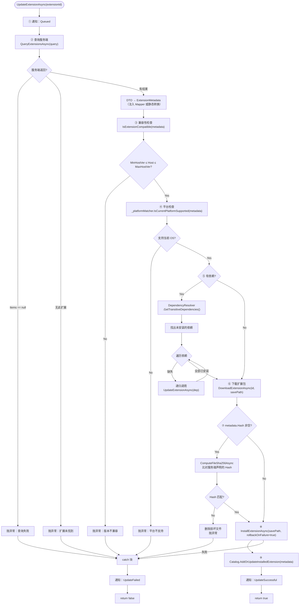
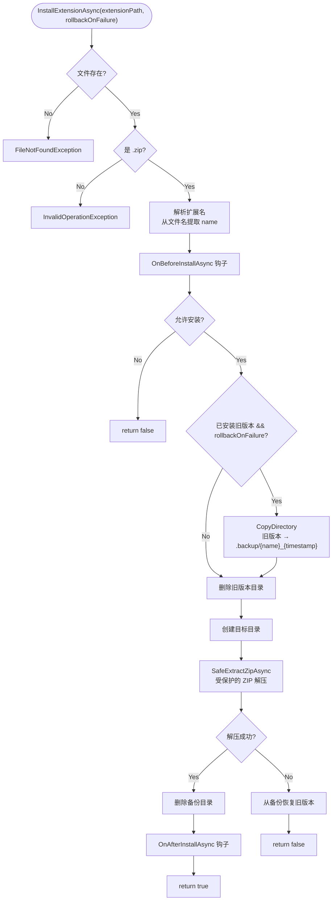

# GeneralUpdate.Extension — 执行流程详解

> **目标读者：** 需要理解 Extension 扩展管理引擎内部机制的开发者
>
> **阅读完你将理解：**
> - `GeneralExtensionHost` 的 DI 注入架构与遗留兼容模式
> - `UpdateExtensionAsync` 的完整九阶段执行链路
> - 依赖解析器（DependencyResolver）的拓扑排序与循环检测机制
> - 版本兼容性检查与平台匹配的判定逻辑
> - `InstallExtensionAsync` 的备份→清理→解压→原子写入流程
> - Zip Slip 路径穿越防护的实现细节
> - Extension Catalog 的原子写入与崩溃安全设计
> - 下载队列管理器（DownloadQueueManager）的并发控制
> - 生命周期钩子（IExtensionLifecycleHooks）的 8 个事件注入点

---

## 目录

1. [架构总览](#1-架构总览)
2. [入口：GeneralExtensionHost 的双构造函数设计](#2-入口generalextensionhost-的双构造函数设计)
3. [ExtensionHostBuilder：DI Builder 模式](#3-extensionhostbuilderdi-builder-模式)
4. [UpdateExtensionAsync：一键更新完整流程](#4-updateextensionasync一键更新完整流程)
5. [依赖解析：DependencyResolver 深度解析](#5-依赖解析dependencyresolver-深度解析)
6. [兼容性检查：版本 + 平台双校验](#6-兼容性检查版本--平台双校验)
7. [下载：DownloadQueueManager 并发控制](#7-下载downloadqueuemanager-并发控制)
8. [安装：InstallExtensionAsync 安全保障](#8-安装installextensionasync-安全保障)
9. [Catalog：原子写入与崩溃安全](#9-catalog原子写入与崩溃安全)
10. [生命周期钩子：8 个事件注入点](#10-生命周期钩子8-个事件注入点)
11. [关键代码路径索引](#11-关键代码路径索引)

---

## 1. 架构总览

### 1.1 六层服务架构

Extension 采用**依赖注入 + Builder 模式**，所有服务均可替换：

```
┌──────────────────────────────────────────────────────────────┐
│                  GeneralExtensionHost（编排层）                │
│                                                              │
│  ┌──────────────┐  ┌──────────────┐  ┌──────────────────┐   │
│  │ IExtension    │  │ IExtension   │  │ IVersion          │   │
│  │ HttpClient    │  │ Catalog      │  │ Compatibility     │   │
│  │ 服务端 API 通信│  │ 本地扩展清单  │  │ Checker           │   │
│  └──────┬───────┘  └──────┬───────┘  │ 版本兼容性检查      │   │
│         │                 │           └────────┬─────────┘   │
│  ┌──────▼───────┐  ┌──────▼───────┐  ┌────────▼─────────┐   │
│  │ IDownload    │  │ IDependency  │  │ IPlatformMatcher │   │
│  │ QueueManager │  │ Resolver     │  │ 平台匹配          │   │
│  │ 下载队列+并发  │  │ 依赖拓扑排序  │  │                  │   │
│  └──────────────┘  └──────────────┘  └──────────────────┘   │
│                                                              │
│  ┌──────────────────────────────────────────────────────┐   │
│  │ IExtensionLifecycleHooks（可选）                      │   │
│  │ 安装前/后、激活前/后、停用前/后、卸载前/后              │   │
│  └──────────────────────────────────────────────────────┘   │
└──────────────────────────────────────────────────────────────┘
```

### 1.2 核心设计原则

| 原则 | 说明 |
|------|------|
| **全 DI 可替换** | 每个服务都有接口，通过构造函数注入，方便单元测试和自定义 |
| **Builder 模式** | `ExtensionHostBuilder` 提供流畅的配置 API，支持 `ConfigureServices` |
| **遗留兼容** | 保留无参构造函数，内部自动创建默认实现，老代码无需修改 |
| **原子写入** | Catalog 的 `manifest.json` 先写 `.tmp` 再重命名，崩溃时不会损坏 |
| **Zip Slip 防护** | `SafeExtractZipAsync` 验证每个条目的目标路径不超出安装目录 |
| **递归依赖安装** | 缺失依赖自动递归调用 `UpdateExtensionAsync`，确保依赖链完整 |

---

## 2. 入口：GeneralExtensionHost 的双构造函数设计

### 2.1 DI 构造函数（推荐）

```csharp
public GeneralExtensionHost(
    ExtensionHostOptions options,
    IExtensionHttpClient httpClient,         // HTTP 通信
    IExtensionCatalog catalog,               // 本地清单
    IVersionCompatibilityChecker compatibilityChecker, // 版本兼容
    IDownloadQueueManager downloadQueue,     // 下载队列
    IDependencyResolver dependencyResolver,  // 依赖解析
    IPlatformMatcher platformMatcher,        // 平台匹配
    IExtensionLifecycleHooks? lifecycleHooks = null,   // 生命周期钩子
    IExtensionMetadataMapper? metadataMapper = null)   // DTO 映射器
```

### 2.2 遗留构造函数（向后兼容）

```csharp
public GeneralExtensionHost(ExtensionHostOptions options)
{
    // 自动创建默认实现
    _httpClient = new ExtensionHttpClient(options.ServerUrl, options.Scheme, options.Token);
    ExtensionCatalog = new ExtensionCatalog(options.CatalogPath ?? options.ExtensionsDirectory);
    _compatibilityChecker = new VersionCompatibilityChecker();
    _downloadQueue = new DownloadQueueManager();
    _dependencyResolver = new DependencyResolver(ExtensionCatalog);
    _platformMatcher = new PlatformMatcher();
    // ...
}
```

### 2.3 初始化流程

```
构造函数
  │
  ├── 解析 HostVersion（宿主程序版本）
  ├── 解析 ExtensionsDirectory（扩展安装根目录）
  ├── 创建 BackupDirectory = ExtensionsDirectory/.backup
  │
  ├── 注入所有服务依赖
  │
  ├── 订阅 DownloadQueue.DownloadStatusChanged
  │     → 转发为 ExtensionUpdateStatusChanged 事件
  │
  ├── 设置 DownloadQueue.DownloadHandler
  │     → 委托给 _httpClient.DownloadExtensionAsync
  │
  ├── Directory.CreateDirectory(ExtensionsDirectory)
  ├── Directory.CreateDirectory(BackupDirectory)
  │
  └── ExtensionCatalog.LoadInstalledExtensions()
        → 从 manifest.json 文件加载已安装扩展列表
```

---

## 3. ExtensionHostBuilder：DI Builder 模式

```csharp
var host = new ExtensionHostBuilder()
    .ConfigureOptions(options =>
    {
        options.HostVersion = "2.0.0";
        options.ExtensionsDirectory = "./extensions";
        options.ServerUrl = "https://api.example.com";
    })
    .ConfigureServices(services =>
    {
        services.AddSingleton<IExtensionHttpClient, CustomHttpClient>();  // 替换 HTTP 客户端
        services.AddSingleton<IExtensionLifecycleHooks, MyLifecycleHooks>(); // 注入生命周期钩子
    })
    .Build();
```

Builder 内部维护 `ServiceCollection`，在 `Build()` 时创建 `IServiceProvider` 并解析所有依赖。

---

## 4. UpdateExtensionAsync：一键更新完整流程

这是 Extension 最核心的方法。它串起查询 → 兼容性 → 平台 → 依赖递归 → 下载 → 哈希校验 → 安全安装 → Catalog 更新 → 事件通知的全流程。

### 4.1 全流程总图



### 4.2 步骤详解

#### 步骤 ②：查询并映射

```csharp
var response = await QueryExtensionsAsync(query);          // HTTP GET /api/extensions?id=xxx
var serverExtension = response.Body.Items.FirstOrDefault(); // 从分页结果中筛选
var metadata = _metadataMapper?.ToMetadata(serverExtension) // DTO → 领域模型
               ?? ToMetadata(serverExtension);              // 回退静态方法
```

#### 步骤 ③：版本兼容性检查

```csharp
public bool IsExtensionCompatible(ExtensionMetadata extension)
{
    return _compatibilityChecker.IsCompatible(extension, _hostVersion);
    // 内部逻辑：
    //   MinHostVersion ≤ HostVersion ≤ MaxHostVersion
    //   使用 SemVer 2.0 比较
}
```

#### 步骤 ④：平台匹配

```csharp
public bool IsCurrentPlatformSupported(ExtensionMetadata metadata)
{
    var currentPlatform = GetCurrentPlatformFlags(); // Windows=1, Linux=2, macOS=4, Android=8...
    return (metadata.SupportedPlatforms & currentPlatform) != 0;
}
```

---

## 5. 依赖解析：DependencyResolver 深度解析

### 5.1 拓扑排序

```csharp
public List<string> GetTransitiveDependencies(List<string> directDependencies)
{
    // 1. 构建依赖图（邻接表）
    // 2. Kahn 算法拓扑排序
    // 3. 检测循环依赖
    // 4. 返回安装顺序（被依赖的优先安装）
}
```

### 5.2 依赖安装决策树

```
DependencyResolver.GetTransitiveDependencies(deps)
  │
  ├── 展开传递依赖（A 依赖 B，B 依赖 C → 返回 [C, B, A]）
  │
  ├── 检测循环依赖（A → B → A）
  │     └── 检测到环 → 抛出异常
  │
  └── 返回拓扑排序列表

调用方：
  var missingDeps = sortedDeps.Where(d => Catalog.GetInstalledExtensionById(d) == null);

  foreach (var dep in sortedDeps)
  {
      if (missingDeps.Contains(dep))
          await UpdateExtensionAsync(dep);  // 递归安装缺失的依赖
  }
```

**关键设计：** 依赖安装失败会抛出异常，导致父扩展的更新流程也终止——这保证了依赖完整性，避免安装了扩展但缺少依赖的情况。

---

## 6. 兼容性检查：版本 + 平台双校验

### 6.1 版本兼容性（SemVer 2.0）

| 条件 | 说明 |
|------|------|
| `HostVersion < MinHostVersion` | ❌ 宿主太旧，扩展需要更高版本 |
| `HostVersion > MaxHostVersion` | ❌ 宿主太新，扩展尚未适配 |
| `MinHostVersion ≤ HostVersion ≤ MaxHostVersion` | ✅ 兼容 |

### 6.2 平台匹配（位标志）

```csharp
[Flags]
public enum TargetPlatform
{
    Windows = 1,
    Linux   = 2,
    macOS   = 4,
    Android = 8,
    iOS     = 16,
    All     = Windows | Linux | macOS | Android | iOS
}
```

`PlatformMatcher` 通过 `RuntimeInformation.IsOSPlatform()` 自动检测当前 OS，然后与扩展的 `SupportedPlatforms` 做位与运算。

---

## 7. 下载：DownloadQueueManager 并发控制

### 7.1 架构

```
DownloadQueueManager
  │
  ├── SemaphoreSlim(3)  // 默认最多 3 个并发下载
  │
  ├── DownloadHandler 委托
  │     → _httpClient.DownloadExtensionAsync(id, path, progress, ct)
  │
  └── DownloadStatusChanged 事件
        → 转发到 GeneralExtensionHost.ExtensionUpdateStatusChanged
```

### 7.2 下载流程

```csharp
public async Task<bool> DownloadExtensionAsync(string extensionId, string savePath)
{
    var progress = new Progress<int>(p =>
    {
        ExtensionUpdateStatusChanged?.Invoke(this, new ExtensionUpdateEventArgs
        {
            ExtensionId = extensionId,
            Status = ExtensionUpdateStatus.Updating,
            Progress = p
        });
    });

    return await _httpClient.DownloadExtensionAsync(extensionId, savePath, progress);
}
```

---

## 8. 安装：InstallExtensionAsync 安全保障

### 8.1 安装流程



### 8.2 Zip Slip 防护

```csharp
private static async Task SafeExtractZipAsync(string zipPath, string destinationDir)
{
    var fullDestDir = Path.GetFullPath(destinationDir)
        .TrimEnd(Path.DirectorySeparatorChar, Path.AltDirectorySeparatorChar);

    using var archive = ZipFile.OpenRead(zipPath);
    foreach (var entry in archive.Entries)
    {
        var destinationPath = Path.GetFullPath(Path.Combine(fullDestDir, entry.FullName));

        // 核心防护：验证解析后的路径仍在目标目录内
        if (!destinationPath.StartsWith(fullDestDir + Path.DirectorySeparatorChar)
            && destinationPath != fullDestDir)
        {
            // 检测到路径穿越攻击 → 跳过此条目
            continue;
        }

        if (string.IsNullOrEmpty(entry.Name))
            Directory.CreateDirectory(destinationPath);  // 目录条目
        else
            entry.ExtractToFile(destinationPath, overwrite: true); // 文件条目
    }
}
```

**攻击示例：** 恶意 ZIP 包含条目 `../../../etc/malicious.dll` → `destinationPath` 解析为 `C:\etc\malicious.dll` → `StartsWith(fullDestDir)` 为 false → 被跳过。

---

## 9. Catalog：原子写入与崩溃安全

### 9.1 原子写入策略

```csharp
// ExtensionCatalog.AddOrUpdateInstalledExtension
public void AddOrUpdateInstalledExtension(ExtensionMetadata metadata)
{
    // 1. 更新内存中的字典
    _installedExtensions[metadata.Id] = metadata;

    // 2. 先写临时文件
    var tempPath = manifestPath + ".tmp";
    var json = JsonConvert.SerializeObject(_installedExtensions.Values);
    File.WriteAllText(tempPath, json);

    // 3. 原子重命名（崩溃安全）
    File.Move(tempPath, manifestPath, overwrite: true);
}
```

**为什么安全：** 如果在 `File.WriteAllText(tempPath)` 期间崩溃 → `manifest.json` 未被修改 → 下次启动加载的是旧但完整的数据。如果在 `File.Move` 期间崩溃 → 文件系统保证重命名是原子的。

### 9.2 每个扩展独立 manifest

每个扩展目录下都有独立的 `manifest.json`：
```
extensions/
  ├── demo-extension/
  │   ├── manifest.json     ← 此扩展的元数据
  │   └── ... (扩展文件)
  ├── report-module/
  │   ├── manifest.json
  │   └── ...
  └── .backup/              ← 备份目录
```

---

## 10. 生命周期钩子：8 个事件注入点

```csharp
public interface IExtensionLifecycleHooks
{
    // 安装
    Task<bool> OnBeforeInstallAsync(ExtensionMetadata metadata, string packagePath);
    Task OnAfterInstallAsync(ExtensionMetadata metadata);

    // 激活
    Task OnBeforeActivateAsync(string extensionId, CancellationToken ct);
    Task OnAfterActivateAsync(string extensionId, CancellationToken ct);

    // 停用
    Task OnBeforeDeactivateAsync(string extensionId, CancellationToken ct);
    Task OnAfterDeactivateAsync(string extensionId, CancellationToken ct);

    // 卸载
    Task<bool> OnBeforeUninstallAsync(ExtensionMetadata metadata, CancellationToken ct);
    Task OnAfterUninstallAsync(string extensionId, CancellationToken ct);
}
```

### 10.1 钩子返回值语义

| 钩子 | 返回 false 的行为 |
|------|------------------|
| `OnBeforeInstallAsync` | 取消安装，返回 false |
| `OnBeforeUninstallAsync` | 取消卸载，返回 false |
| 其他 After 钩子 | 仅通知，返回值不影响流程 |

### 10.2 典型使用场景

```csharp
public class MyLifecycleHooks : IExtensionLifecycleHooks
{
    public async Task<bool> OnBeforeInstallAsync(ExtensionMetadata metadata, string packagePath)
    {
        // 检查许可证是否有效
        if (!await LicenseService.ValidateAsync(metadata.Id))
            return false; // 阻止安装
        return true;
    }

    public async Task OnAfterInstallAsync(ExtensionMetadata metadata)
    {
        // 记录审计日志
        await AuditLog.WriteAsync($"Extension installed: {metadata.Id}");
    }
}
```

---

## 11. 关键代码路径索引

| 组件 | 文件 | 关键方法 |
|------|------|----------|
| 扩展主机（编排） | `Core/GeneralExtensionHost.cs` | `UpdateExtensionAsync()` / `InstallExtensionAsync()` / `SafeExtractZipAsync()` |
| 主机接口 | `Core/IExtensionHost.cs` | — |
| Builder | `Core/ExtensionHostBuilder.cs` | `ConfigureOptions()` / `ConfigureServices()` / `Build()` |
| 工厂 | `Core/ExtensionServiceFactory.cs` | — |
| 生命周期钩子 | `Core/IExtensionLifecycleHooks.cs` | 8 个钩子方法 |
| Catalog | `Catalog/ExtensionCatalog.cs` | `AddOrUpdateInstalledExtension()` / `LoadInstalledExtensions()` |
| 下载队列 | `Download/DownloadQueueManager.cs` | `SemaphoreSlim` 并发控制 |
| 依赖解析 | `Dependencies/DependencyResolver.cs` | `GetTransitiveDependencies()` |
| 平台匹配 | `Compatibility/PlatformMatcher.cs` | `IsCurrentPlatformSupported()` |
| 版本兼容检查 | `Compatibility/VersionCompatibilityChecker.cs` | `IsCompatible()` |
| HTTP 通信 | `Communication/ExtensionHttpClient.cs` | `QueryExtensionsAsync()` / `DownloadExtensionAsync()` |
| 扩展元数据 | `Common/Models/ExtensionMetadata.cs` | — |
| 日志追踪 | `GeneralTracer.cs` | — |
