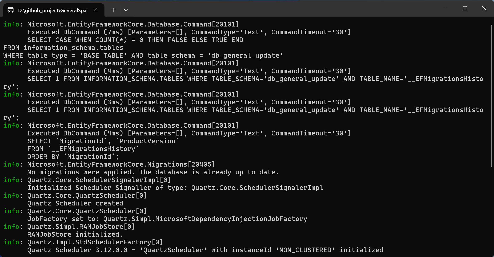

## Product Introduction

The GeneralLibrary team has developed the GeneralSpacestation service for enterprise applications, addressing issues related to automatic update management. All components involved in the entire system are self-developed, MIT-licensed, or open-source components friendly for commercial use, strictly avoiding legal risks in commercial use.

The entire service includes the following:

| Name                             | Description                                            | Cost               | Details                                                    |
| -------------------------------- | ------------------------------------------------------ | ------------------ | ---------------------------------------------------------- |
| GeneralUpdate                    | Desktop client automatic update solution               | Free               | https://github.com/GeneralLibrary/GeneralUpdate            |
| GeneralUpdate-Sample             | Sample usage code                                      | Free               | https://github.com/GeneralLibrary/GeneralUpdate-Samples    |
| GeneralUpdate.Admin              | Visual solution for automatic update management        | Paid               | https://www.justerzhu.cn/                                  |
| GeneralSpacestation              | Solution for automatic update management               | Paid               | https://www.justerzhu.cn/                                  |
| Online/Offline Training Sessions | Helps enterprises quickly get started with the product | Complimentary/Paid | Scan the code for consultation/can be purchased separately |
| User Manual                      | Helps enterprises quickly get started with the product | Complimentary/Paid | Scan the code for consultation/can be purchased separately |
| Project Integration/Consultation | Helps enterprises quickly get started with the product | Complimentary/Paid | Scan the code for consultation/can be purchased separately |

## Features

### GeneralUpdate.Admin Display

### GeneralSpacestation

## Solution

## Contact Us

Below are the contact details for enterprise inquiries, quotations, and business cooperation (please indicate your purpose when adding as a friend, casual chat is declined, adding on WeChat is recommended).

