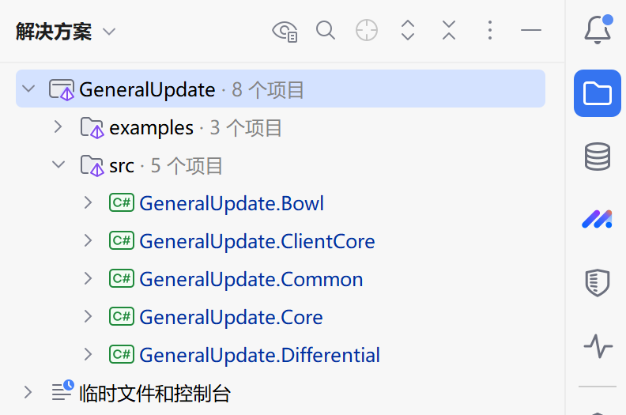
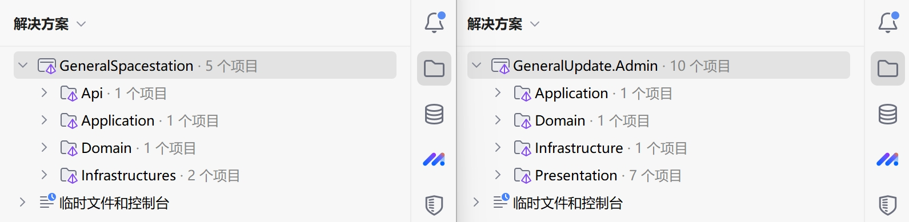
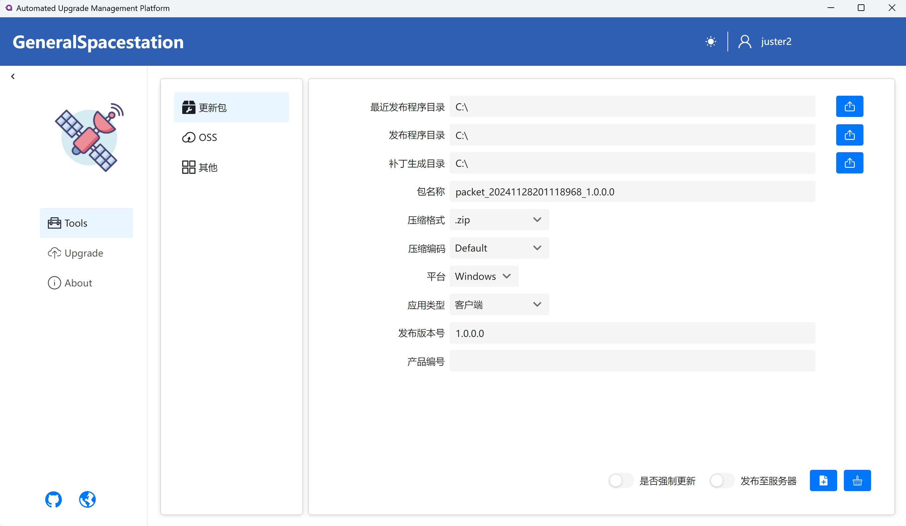
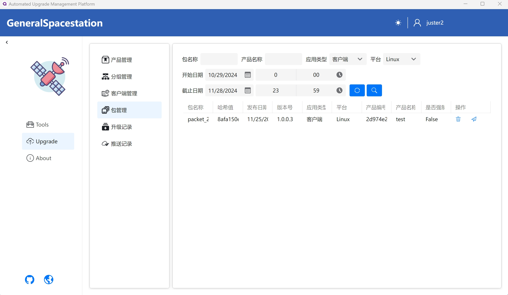

import Tabs from '@theme/Tabs';
import TabItem from '@theme/TabItem';

<iframe
  src="//player.bilibili.com/player.html?bvid=BV12P9dBiEEh&page=1"
  width="100%"
  height="480"
  style={{ borderRadius: '8px', border: 'none' }}
  allowFullScreen
  scrolling="no"
/>


## 版本与价格

TSLH™ GeneralSpacestation 采用**年度付费模式**，购买或续费即可获得当年版本的永久授权。所有版本均提供部署指导与用户操作手册。

<Tabs className="pricing-tabs">
  <TabItem value="subscription" label="订阅版">

**按需付费，灵活可控**

| 项目 | 说明 |
|------|------|
| 付费模式 | 流量费 + 服务费 |
| 流量包 | 9 元 / 100 GB（有效期 1 个月） |
| 服务费 | 流量包总价的 10% |
| 席位 | 不限制 |
| 技术支持 | 公共频道 |
| Beta 版本优先 | ✓ |

> 流量包价格随供应商调整可能变动，支持按需灵活采购。

  </TabItem>
  <TabItem value="personal" label="个人版">

**轻量起步，独立开发者首选**

| 项目 | 说明 |
|------|------|
| 首年 | ¥599 |
| 续费 | ¥299 / 年 |
| 永久授权 | ✓（含后续一年更新） |
| 席位 | 1 个 |
| 技术支持 | 公共频道 |
| 专属技术支持 | — |

  </TabItem>
  <TabItem value="enterprise" label="企业版">

**专业服务，企业级全场景覆盖**

| 项目 | 说明 |
|------|------|
| 首年 | ¥2599 |
| 续费 | ¥1299 / 年 |
| 永久授权 | ✓（含后续一年更新） |
| 专属技术支持 | 1 个席位 |
| Beta 版本优先 | ✓ |
| 公共频道支持 | ✓ |

  </TabItem>
</Tabs>

### 优惠政策

- **阶梯定价锁价**：所有用户首次购买后永久锁定该价格，续费不涨价
- **合作展示折扣**：使用本产品开发项目并授权展示合作关系，永久享受 **10% 折扣**
- **定制开发**：特殊需求支持单独洽谈付费定制

---

## 产品概述

TSLH™ GeneralSpacestation 是**客户端全生命周期升级管理服务**，聚焦企业客户端更新包管理、版本发布、推送管控、日志追踪等核心场景，一站式解决更新繁琐、流量浪费、发布混乱、追溯困难等问题。

- **适用场景**：桌面客户端、移动端应用的自动升级管理，包括版本发布、灰度推送、更新追踪
- **部署模式**：私有化本地部署，数据不出企业内网
- **核心价值**：降低客户端运维成本、精准控制版本发布范围、完整追溯升级链路

### 体系构成

| 组件 | 说明 | 是否收费 |
|------|------|----------|
| GeneralSpacestation | 自动升级管理服务解决方案（服务端） | 是 |
| GeneralUpdate.Admin | 自动升级管理可视化客户端 | 是 |
| GeneralUpdate | 桌面客户端自动升级组件 | 否（开源） |
| GeneralUpdate-Samples | GeneralUpdate 使用代码示例 | 否（开源） |

> **在线文档**：[https://www.justerzhu.cn/](https://www.justerzhu.cn/)  
> **开源仓库**：[GitHub - GeneralUpdate](https://github.com/GeneralLibrary/GeneralUpdate) · [GitHub - GeneralSpacestation](https://github.com/TSLH-Technology/GeneralSpacestation)

---

## 核心功能

### 智能分组灰度发布

按区域、产品线、门店、试点客户灵活编组，精准控制更新范围，降低发布风险。支持**分组冻结**，被冻结的分组无法接收升级推送，用于误发补丁后的紧急阻止。

### 补丁包管理

三种制作模式覆盖全场景：

| 模式 | 说明 | 适用场景 |
|------|------|----------|
| 自动构建 | 读取发布命令文件，系统自动执行发布并生成历史版本 | 标准化发布流程 |
| 手动构建 | 手动指定目录，通过文件差异对比生成差分补丁 | 灵活定制场景 |
| 全量构建 | 直接压缩指定目录全部文件 | 首次发布或完整覆盖 |

- **二进制差分压缩**，仅同步变更文件，补丁体积极小（KB 级），大幅节省带宽与存储成本
- 支持 ZIP 格式、断点续传，单次更新失败后下次启动可继续下载

### 三级管理体系

```
产品管理 → 分组管理 → 客户端管理
```

同一产品下按区域、门店或试点范围划分子组，各分组下管理实际客户端设备，通过应用密钥（App Key）唯一标识，实现精细化数据隔离。

### 灵活版本推送

| 推送方式 | 说明 |
|----------|------|
| 立即推送 | 选择分组后即时下发更新通知 |
| 定时推送 | 指定发布日期和时间，到时自动推送 |
| 强制更新 | 标记补丁包为强制更新，客户端不可跳过 |
| 可选更新 | 客户端可自行选择是否执行升级 |

### 全链路日志追溯

- **升级记录**：客户端升级操作全程记录，含状态（成功/失败/升级中）、版本号、操作时间
- **推送记录**：管理员推送操作留痕，含操作人、推送时间、目标分组
- 支持按产品、版本、时间范围、状态等多维度查询

### OSS 极简升级模式

一键生成版本配置文件，无需编写服务端代码。客户端直接根据 OSS 文件服务器的版本信息判断是否更新，大幅降低新手接入门槛。

### 扩展管理

支持将插件或扩展目录压缩为扩展包上传至服务端统一管理，支持依赖关系声明、平台筛选和预发布标记，满足插件化架构需求。

### 多语言与主题

支持中文 / 英文界面切换，明 / 暗双主题，可折叠菜单，操作空间更大。

---

## 解决方案架构





---

## 界面展示






---

## 可定制方案

除标准版本外，我们提供以下增值服务，满足企业个性化需求：

| 服务 | 说明 |
|------|------|
| 定制开发 | 根据业务需求定制功能模块，单独洽谈付费 |
| 项目对接 | 技术团队一对一接入指导，助企业快速上手 |
| 培训支持 | 线上 / 线下产品培训会议 |
| 部署指导 | 私有化部署全程技术支持 |

> 💡 商务咨询请扫描下方二维码（推荐微信添加），加好友请注明来意。


