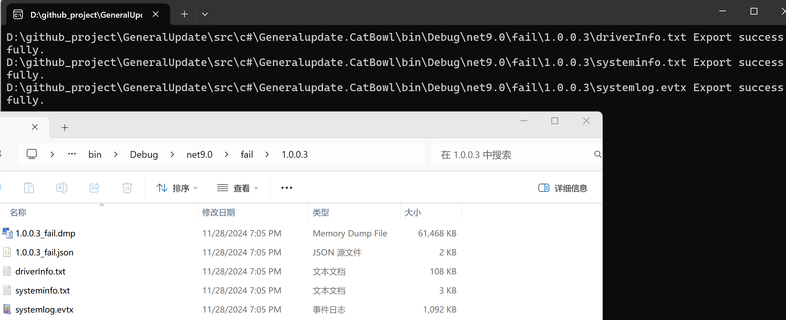
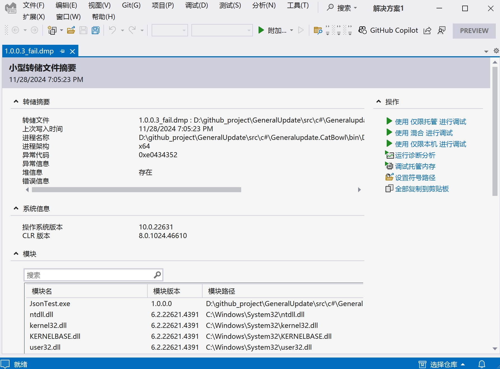
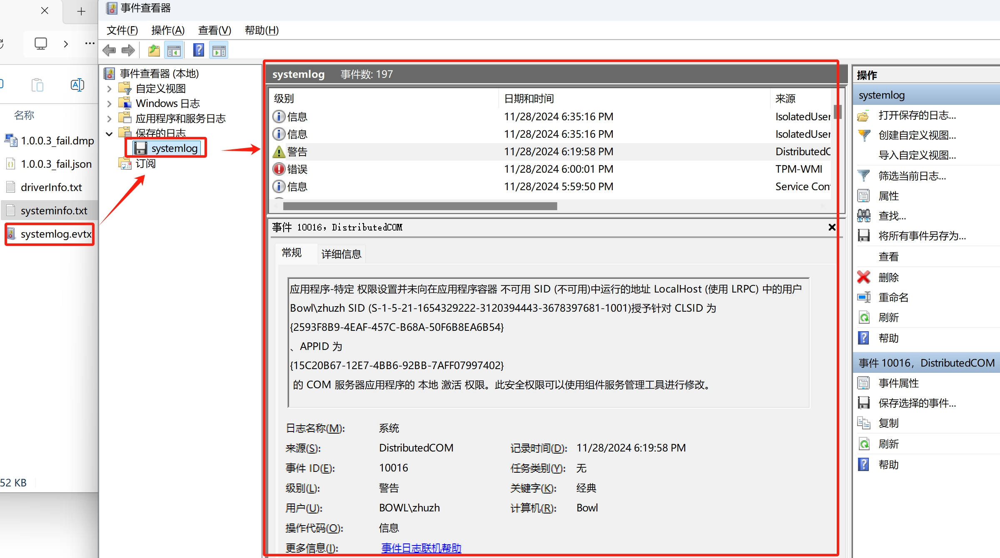

# GeneralUpdate.Bowl

## 组件概览

**GeneralUpdate.Bowl** 是一个独立的进程监控组件，在升级流程结束前启动，负责启动主客户端应用程序并监控其运行状态。该组件提供了完整的崩溃监控和诊断能力，当被监控的应用程序发生异常时，会自动导出Dump文件、驱动信息、系统信息和事件日志，帮助开发者快速定位问题。

**命名空间：** `GeneralUpdate.Bowl`  
**程序集：** `GeneralUpdate.Bowl.dll`

```csharp
public sealed class Bowl
```

---

## 核心特性

### 1. 进程监控
- 实时监控目标应用程序的运行状态
- 自动检测进程崩溃和异常退出

### 2. 崩溃诊断
- 自动生成Dump文件（.dmp）用于崩溃分析
- 导出详细的系统和驱动信息
- 收集Windows系统事件日志

### 3. 版本化管理
- 按版本号分类存储故障信息
- 支持升级和正常两种工作模式

---

## 快速开始

### 安装

通过 NuGet 安装 GeneralUpdate.Bowl：

```bash
dotnet add package GeneralUpdate.Bowl
```

### 初始化与使用

以下示例展示了如何使用 Bowl 组件监控应用程序：

```csharp
using GeneralUpdate.Bowl;
using GeneralUpdate.Bowl.Strategys;

var installPath = AppDomain.CurrentDomain.BaseDirectory;
var lastVersion = "1.0.0.3";
var processInfo = new MonitorParameter
{
    ProcessNameOrId = "YourApp.exe",
    DumpFileName = $"{lastVersion}_fail.dmp",
    FailFileName = $"{lastVersion}_fail.json",
    TargetPath = installPath,
    FailDirectory = Path.Combine(installPath, "fail", lastVersion),
    BackupDirectory = Path.Combine(installPath, lastVersion),
    WorkModel = "Normal"  // 使用 Normal 模式独立监控
};
Bowl.Launch(processInfo);
```

---

## 核心 API 参考

### Launch 方法

启动进程监控功能。

**方法签名：**

```csharp
public static void Launch(MonitorParameter? monitorParameter = null)
```

**参数：**

#### MonitorParameter 类

```csharp
public class MonitorParameter
{   
    /// <summary>
    /// 被监控的目录
    /// </summary>
    public string TargetPath { get; set; }
    
    /// <summary>
    /// 导出异常信息的目录
    /// </summary>
    public string FailDirectory { get; set; }
    
    /// <summary>
    /// 备份目录
    /// </summary>
    public string BackupDirectory { get; set; }
    
    /// <summary>
    /// 被监控进程的名称或ID
    /// </summary>
    public string ProcessNameOrId { get; set; }
 
    /// <summary>
    /// Dump 文件名
    /// </summary>
    public string DumpFileName { get; set; }
    
    /// <summary>
    /// 升级包版本信息（.json）文件名
    /// </summary>
    public string FailFileName { get; set; }

    /// <summary>
    /// 工作模式：
    /// - Upgrade: 升级模式，主要用于与 GeneralUpdate 配合使用，内部逻辑处理，默认模式启动时请勿随意修改
    /// - Normal: 正常模式，可独立使用监控单个程序，程序崩溃时导出崩溃信息
    /// </summary>
    public string WorkModel { get; set; } = "Upgrade";
}
```

---

## 实际使用示例

### 示例 1：独立模式监控应用

```csharp
using GeneralUpdate.Bowl;
using GeneralUpdate.Bowl.Strategys;

// 配置监控参数
var installPath = AppDomain.CurrentDomain.BaseDirectory;
var currentVersion = "1.0.0.5";

var monitorConfig = new MonitorParameter
{
    ProcessNameOrId = "MyApplication.exe",
    DumpFileName = $"{currentVersion}_crash.dmp",
    FailFileName = $"{currentVersion}_crash.json",
    TargetPath = installPath,
    FailDirectory = Path.Combine(installPath, "crash_reports", currentVersion),
    BackupDirectory = Path.Combine(installPath, "backups", currentVersion),
    WorkModel = "Normal"  // 独立监控模式
};

// 启动监控
Bowl.Launch(monitorConfig);
```

### 示例 2：结合 GeneralUpdate 使用

```csharp
using GeneralUpdate.Bowl;
using GeneralUpdate.Bowl.Strategys;

// 在升级完成后启动 Bowl 监控
var installPath = AppDomain.CurrentDomain.BaseDirectory;
var upgradedVersion = "2.0.0.1";

var upgradeMonitor = new MonitorParameter
{
    ProcessNameOrId = "UpdatedApp.exe",
    DumpFileName = $"{upgradedVersion}_fail.dmp",
    FailFileName = $"{upgradedVersion}_fail.json",
    TargetPath = installPath,
    FailDirectory = Path.Combine(installPath, "fail", upgradedVersion),
    BackupDirectory = Path.Combine(installPath, upgradedVersion),
    WorkModel = "Upgrade"  // 升级模式
};

Bowl.Launch(upgradeMonitor);
```

---

## 崩溃信息捕获

当检测到崩溃时，以下文件将在运行目录中生成：

- 📒 **Dump 文件** (`x.0.0.*_fail.dmp`)
- 📒 **升级包版本信息** (`x.0.0.*_fail.json`)
- 📒 **驱动信息** (`driverInfo.txt`)
- 📒 **操作系统/硬件信息** (`systeminfo.txt`)
- 📒 **系统事件日志** (`systemlog.evtx`)

这些文件将按版本号分类导出到 "fail" 目录中。



### 1. Dump 文件

Dump 文件包含崩溃时刻的内存快照，可用于调试分析：



### 2. 版本信息文件

JSON 格式的详细崩溃报告，包含参数配置和 ProcDump 输出：

```json
{
"Parameter": {
"TargetPath": "D:\\github_project\\GeneralUpdate\\src\\c#\\Generalupdate.CatBowl\\bin\\Debug\\net9.0\\",
"FailDirectory": "D:\\github_project\\GeneralUpdate\\src\\c#\\Generalupdate.CatBowl\\bin\\Debug\\net9.0\\fail\\1.0.0.3",
"BackupDirectory": "D:\\github_project\\GeneralUpdate\\src\\c#\\Generalupdate.CatBowl\\bin\\Debug\\net9.0\\1.0.0.3",
"ProcessNameOrId": "JsonTest.exe",
"DumpFileName": "1.0.0.3_fail.dmp",
"FailFileName": "1.0.0.3_fail.json",
"WorkModel": "Normal",
"ExtendedField": null
},
"ProcdumpOutPutLines": [
        "ProcDump v11.0 - Sysinternals process dump utility",
        "Copyright (C) 2009-2022 Mark Russinovich and Andrew Richards",
        "Sysinternals - www.sysinternals.com", 
        "Process:               JsonTest.exe (19712)", 
        "Process image:  D:\\github_project\\GeneralUpdate\\src\\c#\\Generalupdate.CatBowl\\bin\\Debug\\net9.0\\JsonTest.exe", "CPU threshold:         n/a", 
        "Performance counter:   n/a", "Commit threshold:      n/a",
        "Threshold seconds:     n/a", "Hung window check:     Disabled", "Log debug strings:     Disabled", 
        "Exception monitor:     Unhandled", "Exception filter:      [Includes]", 
        "                       *", 
        "                       [Excludes]", 
        "Terminate monitor:     Disabled", 
        "Cloning type:          Disabled", 
        "Concurrent limit:      n/a", 
        "Avoid outage:          n/a", 
        "Number of dumps:       1", 
        "Dump folder:           D:\\github_project\\GeneralUpdate\\src\\c#\\Generalupdate.CatBowl\\bin\\Debug\\net9.0\\fail\\1.0.0.3\\", 
        "Dump filename/mask:    1.0.0.3_fail", 
        "Queue to WER:          Disabled", "Kill after dump:       Disabled", 
        "Press Ctrl-C to end monitoring without terminating the process.", 
        "[19:05:23] Exception: E0434352.CLR", "[19:05:23] Unhandled: E0434352.CLR", 
        "[19:05:23] Dump 1 initiated: D:\\github_project\\GeneralUpdate\\src\\c#\\Generalupdate.CatBowl\\bin\\Debug\\net9.0\\fail\\1.0.0.3\\1.0.0.3_fail.dmp", 
        "[19:05:23] Dump 1 writing: Estimated dump file size is 62 MB.", 
        "[19:05:23] Dump 1 complete: 62 MB written in 0.1 seconds", 
        "[19:05:23] Dump count reached."]
}
```

### 3. 驱动信息文件

包含系统中所有驱动程序的详细信息：

```text
Module Name   Display Name            Description               Driver Type  Start Mode   State       Status    
============ ====================== ====================== ============= ========== ========== ==========
360AntiAttac 360Safe Anti Attack Se 360Safe Anti Attack Se Kernel        System     Running    OK        
360AntiHacke 360Safe Anti Hacker Se 360Safe Anti Hacker Se Kernel        System     Running    OK        
// ...更多驱动信息
```

### 4. 系统信息文件

完整的操作系统和硬件配置信息：

```text
Host Name:           ****
OS Name:             Microsoft Windows 11 Pro
OS Version:          10.0.*** Build 22***
System Manufacturer: ASUS
System Model:        System Product Name
Processor(s):        Intel** Family * Model ***
Total Physical Memory: 16,194 MB
// ...更多系统信息
```

### 5. 系统事件日志

Windows 事件查看器格式的系统日志（.evtx 文件）：



---

## 注意事项与警告

### ⚠️ 重要提示

1. **工作模式选择**
   - `Upgrade` 模式：专门用于与 GeneralUpdate 框架集成，包含内部逻辑处理
   - `Normal` 模式：可独立使用，适合监控任何 .NET 应用程序

2. **权限要求**
   - Bowl 需要足够的权限来生成 Dump 文件和读取系统信息
   - 建议以管理员权限运行需要监控的应用程序

3. **磁盘空间**
   - Dump 文件可能占用大量磁盘空间（通常 50-200 MB）
   - 确保 FailDirectory 所在磁盘有足够的可用空间

4. **依赖项**
   - Bowl 使用 ProcDump 工具生成 Dump 文件，该工具已内置在组件中
   - 无需额外安装依赖项

### 💡 最佳实践

- **版本号管理**：为每个版本使用独立的故障目录，便于问题追踪
- **日志清理**：定期清理旧版本的故障信息，避免磁盘空间耗尽
- **测试验证**：在生产环境部署前，在测试环境验证监控功能

---

## 适用平台

| 产品             | 版本              |
| --------------- | ----------------- |
| .NET            | 5, 6, 7, 8, 9, 10  |
| .NET Framework  | 4.6.1             |
| .NET Standard   | 2.0               |
| .NET Core       | 2.0               |
| ASP.NET         | Any               |

---

## 相关资源

- **示例代码**：[查看 GitHub 示例](https://github.com/GeneralLibrary/GeneralUpdate-Samples/tree/main/src/Bowl)
- **视频教程**：[观看 Bilibili 教程](https://www.bilibili.com/video/BV1c8iyYZE7P)
- **主仓库**：[GeneralUpdate 项目](https://github.com/GeneralLibrary/GeneralUpdate)
