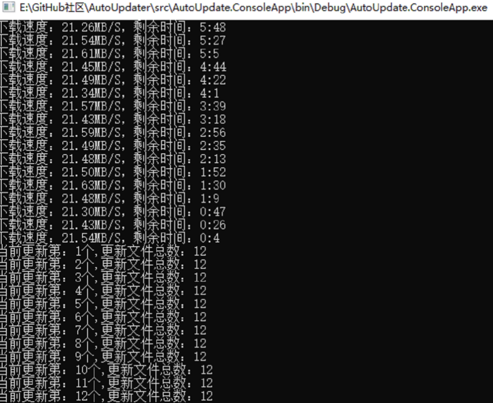

# GeneralUpdate.Core

## 组件概览

**GeneralUpdate.Core** 是 GeneralUpdate 框架最核心的组件之一,提供了完整的升级执行能力。与 ClientCore 不同,Core 组件作为独立的升级助手程序运行,负责在主程序关闭后执行实际的文件替换、版本升级和系统更新操作。通过进程启动和参数传递的方式,Core 接收来自 ClientCore 的更新指令,并安全地完成主程序的升级任务。

**命名空间:** `GeneralUpdate.Core`  
**程序集:** `GeneralUpdate.Core.dll`

```csharp
public class GeneralUpdateBootstrap : AbstractBootstrap<GeneralUpdateBootstrap, IStrategy>
```

---

## 核心特性

### 1. 文件替换与版本管理
- 安全的文件替换机制,避免文件占用问题
- 支持多版本增量升级
- 自动处理文件依赖关系

### 2. 驱动升级支持
- 可选的驱动程序升级功能
- 字段映射表配置
- 安全的驱动安装流程

### 3. 完整的事件通知
- 下载进度实时监控
- 多版本下载管理
- 异常和错误完整捕获

### 4. 跨平台支持
- Windows、Linux、macOS 平台全支持
- 自动平台检测和策略适配



---

## 快速开始

### 安装

通过 NuGet 安装 GeneralUpdate.Core:

```bash
dotnet add package GeneralUpdate.Core
```

### 初始化与使用

以下示例展示了如何在升级助手程序中配置和启动升级流程:

```csharp
using GeneralUpdate.Common.Download;
using GeneralUpdate.Common.Internal;
using GeneralUpdate.Common.Shared.Object;
using GeneralUpdate.Core;

try
{
    Console.WriteLine($"升级程序初始化,{DateTime.Now}!");
    Console.WriteLine("当前运行目录:" + Thread.GetDomain().BaseDirectory);
    
    // 启动升级流程
    await new GeneralUpdateBootstrap()
        // 监听下载统计信息
        .AddListenerMultiDownloadStatistics(OnMultiDownloadStatistics)
        // 监听单个下载完成
        .AddListenerMultiDownloadCompleted(OnMultiDownloadCompleted)
        // 监听所有下载完成
        .AddListenerMultiAllDownloadCompleted(OnMultiAllDownloadCompleted)
        // 监听下载错误
        .AddListenerMultiDownloadError(OnMultiDownloadError)
        // 监听异常
        .AddListenerException(OnException)
        // 启动异步升级
        .LaunchAsync();
        
    Console.WriteLine($"升级程序已启动,{DateTime.Now}!");
    await Task.Delay(2000);
}
catch (Exception e)
{
    Console.WriteLine(e.Message + "\n" + e.StackTrace);
}

// 事件处理方法
void OnMultiDownloadStatistics(object arg1, MultiDownloadStatisticsEventArgs arg2)
{
    var version = arg2.Version as VersionInfo;
    Console.WriteLine($"当前下载版本:{version.Version},下载速度:{arg2.Speed}," +
                     $"剩余时间:{arg2.Remaining},进度:{arg2.ProgressPercentage}%");
}

void OnMultiDownloadCompleted(object arg1, MultiDownloadCompletedEventArgs arg2)
{
    var version = arg2.Version as VersionInfo;
    Console.WriteLine(arg2.IsComplated ? 
        $"版本 {version.Version} 下载完成!" : 
        $"版本 {version.Version} 下载失败!");
}

void OnMultiAllDownloadCompleted(object arg1, MultiAllDownloadCompletedEventArgs arg2)
{
    Console.WriteLine(arg2.IsAllDownloadCompleted ? 
        "所有下载任务已完成!" : 
        $"下载任务失败!失败数量:{arg2.FailedVersions.Count}");
}

void OnMultiDownloadError(object arg1, MultiDownloadErrorEventArgs arg2)
{
    var version = arg2.Version as VersionInfo;
    Console.WriteLine($"版本 {version.Version} 下载错误:{arg2.Exception}");
}

void OnException(object arg1, ExceptionEventArgs arg2)
{
    Console.WriteLine($"升级异常:{arg2.Exception}");
}
```

---

## 核心 API 参考

### GeneralUpdateBootstrap 类方法

#### LaunchAsync 方法

异步启动升级流程。

```csharp
public async Task<GeneralUpdateBootstrap> LaunchAsync()
```

**返回值:**
- 返回当前 GeneralUpdateBootstrap 实例,支持链式调用

#### Option 方法

设置升级选项。

```csharp
public GeneralUpdateBootstrap Option(UpdateOption option, object value)
```

**参数:**
- `option`: 升级选项枚举
- `value`: 选项值

**示例:**
```csharp
.Option(UpdateOption.Drive, true)  // 启用驱动升级
```

#### AddListenerMultiDownloadStatistics 方法

监听下载统计信息(速度、进度、剩余时间等)。

```csharp
public GeneralUpdateBootstrap AddListenerMultiDownloadStatistics(
    Action<object, MultiDownloadStatisticsEventArgs> callbackAction)
```

#### AddListenerMultiDownloadCompleted 方法

监听单个更新包下载完成事件。

```csharp
public GeneralUpdateBootstrap AddListenerMultiDownloadCompleted(
    Action<object, MultiDownloadCompletedEventArgs> callbackAction)
```

#### AddListenerMultiAllDownloadCompleted 方法

监听所有版本下载完成事件。

```csharp
public GeneralUpdateBootstrap AddListenerMultiAllDownloadCompleted(
    Action<object, MultiAllDownloadCompletedEventArgs> callbackAction)
```

#### AddListenerMultiDownloadError 方法

监听每个版本下载错误事件。

```csharp
public GeneralUpdateBootstrap AddListenerMultiDownloadError(
    Action<object, MultiDownloadErrorEventArgs> callbackAction)
```

#### AddListenerException 方法

监听升级组件内部所有异常。

```csharp
public GeneralUpdateBootstrap AddListenerException(
    Action<object, ExceptionEventArgs> callbackAction)
```

---

## 配置类详解

### UpdateOption 枚举

```csharp
public enum UpdateOption
{
    /// <summary>
    /// 是否启用驱动升级功能
    /// </summary>
    Drive
}
```

### Packet 类

升级包信息类,由 ClientCore 通过参数传递给 Core:

```csharp
public class Packet
{
    /// <summary>
    /// 主更新检查 API 地址
    /// </summary>
    public string MainUpdateUrl { get; set; }
    
    /// <summary>
    /// 应用类型:1=客户端应用,2=更新应用
    /// </summary>
    public int AppType { get; set; }
    
    /// <summary>
    /// 更新检查 API 地址
    /// </summary>
    public string UpdateUrl { get; set; }
    
    /// <summary>
    /// 需要启动的应用程序名称
    /// </summary>
    public string AppName { get; set; }
    
    /// <summary>
    /// 主应用程序名称
    /// </summary>
    public string MainAppName { get; set; }
    
    /// <summary>
    /// 更新包文件格式(默认为 Zip)
    /// </summary>
    public string Format { get; set; }
    
    /// <summary>
    /// 是否需要升级更新应用
    /// </summary>
    public bool IsUpgradeUpdate { get; set; }
    
    /// <summary>
    /// 是否需要更新主应用
    /// </summary>
    public bool IsMainUpdate { get; set; }
    
    /// <summary>
    /// 更新日志网页 URL
    /// </summary>
    public string UpdateLogUrl { get; set; }
    
    /// <summary>
    /// 需要更新的版本信息列表
    /// </summary>
    public List<VersionInfo> UpdateVersions { get; set; }
    
    /// <summary>
    /// 文件操作编码格式
    /// </summary>
    public Encoding Encoding { get; set; }
    
    /// <summary>
    /// 下载超时时间(秒)
    /// </summary>
    public int DownloadTimeOut { get; set; }
    
    /// <summary>
    /// 应用密钥,与服务器约定
    /// </summary>
    public string AppSecretKey { get; set; }
    
    /// <summary>
    /// 当前客户端版本
    /// </summary>
    public string ClientVersion { get; set; }
    
    /// <summary>
    /// 最新版本
    /// </summary>
    public string LastVersion { get; set; }
    
    /// <summary>
    /// 安装路径(用于更新文件逻辑)
    /// </summary>
    public string InstallPath { get; set; }
    
    /// <summary>
    /// 下载文件的临时存储路径
    /// </summary>
    public string TempPath { get; set; }
    
    /// <summary>
    /// 升级终端程序的配置参数(Base64 编码)
    /// </summary>
    public string ProcessBase64 { get; set; }
    
    /// <summary>
    /// 当前策略所属平台(Windows/Linux/Mac)
    /// </summary>
    public string Platform { get; set; }
    
    /// <summary>
    /// 黑名单文件列表
    /// </summary>
    public List<string> BlackFiles { get; set; }
    
    /// <summary>
    /// 黑名单文件格式列表
    /// </summary>
    public List<string> BlackFormats { get; set; }
    
    /// <summary>
    /// 是否启用驱动升级功能
    /// </summary>
    public bool DriveEnabled { get; set; }
}
```

---

## 实际使用示例

### 示例 1:基本升级流程

```csharp
using GeneralUpdate.Common.Download;
using GeneralUpdate.Common.Internal;
using GeneralUpdate.Common.Shared.Object;
using GeneralUpdate.Core;

try
{
    Console.WriteLine("升级程序初始化...");
    
    // 启动升级流程
    await new GeneralUpdateBootstrap()
        .AddListenerMultiDownloadStatistics((sender, args) =>
        {
            var version = args.Version as VersionInfo;
            Console.WriteLine($"[{version.Version}] 下载进度: {args.ProgressPercentage}%");
        })
        .AddListenerException((sender, args) =>
        {
            Console.WriteLine($"升级异常: {args.Exception.Message}");
        })
        .LaunchAsync();
        
    Console.WriteLine("升级完成!");
}
catch (Exception e)
{
    Console.WriteLine($"升级失败: {e.Message}");
}
```

### 示例 2：启用驱动升级

驱动升级通过 `GeneralUpdate.ClientCore` 中的 `Configinfo.DriverDirectory` 字段传入驱动目录，`GeneralUpdate.Core` 中的 `DrivelutionMiddleware` 会自动处理驱动安装。

在 `ClientCore` 侧配置：

```csharp
using GeneralUpdate.ClientCore;
using GeneralUpdate.Common.Shared.Object;

var config = new Configinfo
{
    UpdateUrl = "http://your-server.com/api/update/check",
    ClientVersion = "1.0.0.0",
    InstallPath = AppDomain.CurrentDomain.BaseDirectory,
    // 指定包含驱动文件的目录
    DriverDirectory = @"C:\Drivers\Updates"
};

await new GeneralClientBootstrap()
    .SetConfig(config)
    .AddListenerException((sender, args) =>
    {
        Console.WriteLine($"更新异常: {args.Exception.Message}");
    })
    .LaunchAsync();
```

在 `Core`（升级助手）侧，无需额外配置，`DrivelutionMiddleware` 会自动从 `PipelineContext` 获取驱动目录并执行驱动安装：

```csharp
using GeneralUpdate.Core;

await new GeneralUpdateBootstrap()
    .Option(UpdateOption.Drive, true)  // 启用驱动升级
    .AddListenerException((sender, args) =>
    {
        Console.WriteLine($"升级异常: {args.Exception.Message}");
    })
    .LaunchAsync();
```

### 示例 3:完整事件监听

```csharp
using GeneralUpdate.Core;
using GeneralUpdate.Common.Download;
using GeneralUpdate.Common.Shared.Object;

await new GeneralUpdateBootstrap()
    // 下载统计
    .AddListenerMultiDownloadStatistics((sender, args) =>
    {
        var version = args.Version as VersionInfo;
        Console.WriteLine($"[{version.Version}]");
        Console.WriteLine($"  速度: {args.Speed}");
        Console.WriteLine($"  进度: {args.ProgressPercentage}%");
        Console.WriteLine($"  已下载: {args.BytesReceived} / {args.TotalBytesToReceive}");
        Console.WriteLine($"  剩余时间: {args.Remaining}");
    })
    // 单个下载完成
    .AddListenerMultiDownloadCompleted((sender, args) =>
    {
        var version = args.Version as VersionInfo;
        string status = args.IsComplated ? "✓ 成功" : "✗ 失败";
        Console.WriteLine($"版本 {version.Version} 下载{status}");
    })
    // 所有下载完成
    .AddListenerMultiAllDownloadCompleted((sender, args) =>
    {
        if (args.IsAllDownloadCompleted)
        {
            Console.WriteLine("✓ 所有版本下载完成,开始安装...");
        }
        else
        {
            Console.WriteLine($"✗ 下载失败,{args.FailedVersions.Count} 个版本失败:");
            foreach (var version in args.FailedVersions)
            {
                Console.WriteLine($"  - {version}");
            }
        }
    })
    // 下载错误
    .AddListenerMultiDownloadError((sender, args) =>
    {
        var version = args.Version as VersionInfo;
        Console.WriteLine($"✗ 版本 {version.Version} 错误:");
        Console.WriteLine($"  {args.Exception.Message}");
    })
    // 异常处理
    .AddListenerException((sender, args) =>
    {
        Console.WriteLine("⚠ 升级过程异常:");
        Console.WriteLine($"  错误: {args.Exception.Message}");
        Console.WriteLine($"  堆栈: {args.Exception.StackTrace}");
    })
    .LaunchAsync();
```

### 示例 4:自定义升级流程

```csharp
using GeneralUpdate.Core;
using GeneralUpdate.Common.Download;
using GeneralUpdate.Common.Shared.Object;

// 记录升级开始时间
var startTime = DateTime.Now;
var downloadedVersions = new List<string>();

await new GeneralUpdateBootstrap()
    .AddListenerMultiDownloadCompleted((sender, args) =>
    {
        if (args.IsComplated)
        {
            var version = args.Version as VersionInfo;
            downloadedVersions.Add(version.Version);
        }
    })
    .AddListenerMultiAllDownloadCompleted((sender, args) =>
    {
        if (args.IsAllDownloadCompleted)
        {
            var duration = DateTime.Now - startTime;
            Console.WriteLine($"升级完成!");
            Console.WriteLine($"总耗时: {duration.TotalSeconds:F2} 秒");
            Console.WriteLine($"已更新版本: {string.Join(", ", downloadedVersions)}");
        }
    })
    .AddListenerException((sender, args) =>
    {
        // 记录日志到文件
        File.AppendAllText("upgrade_error.log", 
            $"[{DateTime.Now}] {args.Exception}\n");
    })
    .LaunchAsync();
```

---

## 注意事项与警告

### ⚠️ 重要提示

1. **进程隔离**
   - Core 必须作为独立进程运行,不能在主程序中直接调用
   - 升级时主程序必须完全关闭,否则文件替换会失败

2. **参数传递**
   - ClientCore 通过 Base64 编码的参数传递配置给 Core
   - 确保参数传递过程中不会被截断或损坏

3. **文件权限**
   - 在 Windows 上可能需要管理员权限替换系统目录中的文件
   - 在 Linux/macOS 上需要适当的文件系统权限

4. **驱动升级**
   - 驱动升级功能需要系统级权限
   - 建议在测试环境充分验证后再使用

5. **回滚机制**
   - Core 不直接提供回滚功能,但保留了备份文件
   - 如需回滚,可使用 ClientCore 的备份功能

### 💡 最佳实践

- **日志记录**:实现完整的异常监听,记录升级过程中的所有问题
- **超时设置**:根据网络环境合理设置下载超时时间
- **进度反馈**:向用户显示升级进度,提升用户体验
- **错误处理**:升级失败时提供清晰的错误信息和解决方案
- **测试验证**:在各种网络条件下测试升级流程的稳定性

---

## 适用平台

| 产品                | 版本               |
| ------------------ | ----------------- |
| .NET               | 5, 6, 7, 8, 9     |
| .NET Framework     | 4.6.1             |
| .NET Standard      | 2.0               |
| .NET Core          | 2.0               |

---

## 相关资源

- **示例代码**:[查看 GitHub 示例](https://github.com/GeneralLibrary/GeneralUpdate-Samples/blob/main/src/Upgrade/Program.cs)
- **主仓库**:[GeneralUpdate 项目](https://github.com/GeneralLibrary/GeneralUpdate)
- **相关组件**:[GeneralUpdate.ClientCore](./GeneralUpdate.ClientCore.md) | [GeneralUpdate.Bowl](./GeneralUpdate.Bowl.md)
