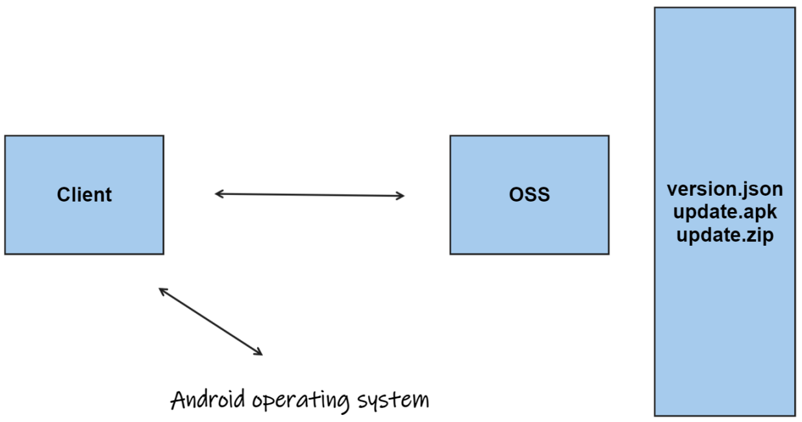

### Definition

Namespace: GeneralUpdate.Maui.OSS

Assembly: GeneralUpdate.Maui.OSS.dll


The GeneralUpdate.Maui.OSS component is used to implement the update mechanism for .NET MAUI, currently only supporting automatic upgrades on the Android platform.

```c#
public sealed class GeneralUpdateOSS
```

NuGet Installation

```shell
NuGet\Install-Package GeneralUpdate.Maui.OSS -Version 1.0.0
```

### Example




1. Prepare the version.json configuration file and the update file (update.apk), which is the new version of the apk (or .abb).

2. When the client starts, it directly requests the OSS server or file server to download the version.json file.

```json
{ 
    "PubTime": 1680444916,
    "Name": "com.companyname.generalupdate.ossclient",
    "MD5": "9bf414990a67e74f11752d03f49b15d8", 
    "Version": "1.0.5", 
    "Url": "http://192.168.50.203/com.companyname.generalupdate.ossclient.apk" 
} 
```

3. After downloading locally, parse the version information content to determine if an update is needed. 4. If an update is needed, download update.apk. 5. After the download is complete, execute the installation, which is handled by the Android operating system. After execution, run the new version of the app.

The following example defines methods, including how to use GeneralUpdateOSS.

```c#
Task.Run(async () =>
{
    var url = "http://192.168.50.203";
    var apk = "com.companyname.generalupdate.ossclient.apk";
    var authority = "com.generalupdate.oss.fileprovider";
    var currentVersion = "1.0.0.0";
    var versionFileName = "version.json";
    GeneralUpdateOSS.AddListenerDownloadProcess(OnOSSDownload);
    GeneralUpdateOSS.AddListenerException(OnException);
    await GeneralUpdateOSS.Start<Strategy>(new ParamsAndroid(url, apk, authority, currentVersion, versionFileName));
});
```

### Annotations

GeneralUpdateOSS provides the following capabilities.

#### Properties

| Properties    | Description                                           |
| ------------- | ----------------------------------------------------- |
| ParamsAndroid | Update configuration parameters for Android platform. |

#### Methods

| Method                       | Description                                |
| ---------------------------- | ------------------------------------------ |
| Start()                      | Start the OSS update for Android platform. |
| AddListenerDownloadProcess() | Monitor download progress.                 |
| AddListenerException()       | Listen for internal exception information. |

### 🌴ParamsAndroid

**Properties**

**Url**: string - The API server request address.

**Apk**: string - The Android apk name.

**CurrentVersion**: string - The current version.

**Authority**: string - The apk author.

**VersionFileName**: string - The version file name.

### 🌼Start()

**Method**

Start the OSS update for the Android platform.

```c#
public static async Task Start<TStrategy>(ParamsAndroid parameter) where TStrategy : AbstractStrategy, new();
```

**Parameter Type**

ParamsAndroid: Update configuration parameters for the Android platform. For detailed content, refer to this document 🌴ParamsAndroid.

**Parameter**

**parameter**: ParamsAndroid - Update configuration parameters for the Android platform.

### 🌼AddListenerDownloadProcess()

**Method**

Monitor download progress.

```c#
public static void AddListenerDownloadProcess(Action<object, OSSDownloadArgs> callbackAction);
```

**Parameter Type**

**sender**: object 

Operation handle.

**args**: OSSDownloadArgs

Download progress notification parameters.

**Parameter**

```c#
callbackAction Action<object, OSSDownloadArgs> 
```

Listen for current version download progress event callback parameters.

### 🌼AddListenerException()

**Method**

Listen for internal exception information.

```c#
public static void AddListenerException(Action<object, ExceptionEventArgs> callbackAction);
```

**Parameter Type**

**sender**: object 

Operation handle.

**args**: ExceptionEventArgs

Update exception parameters.

**Parameter**

```c#
callbackAction Action<object, ExceptionEventArgs> 
```

Listen for current version download progress event callback parameters.

### Applies to

| Product   | Version          |
| --------- | ---------------- |
| .NET      | 7, 8, 9          |
| .NET MAUI | .NET 8 - Android |