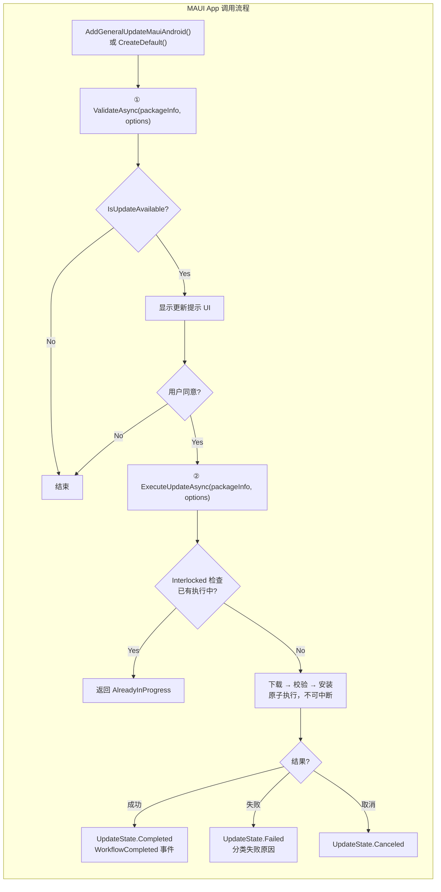
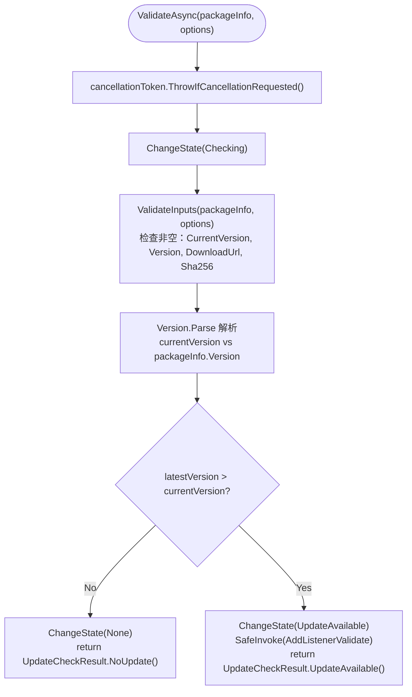
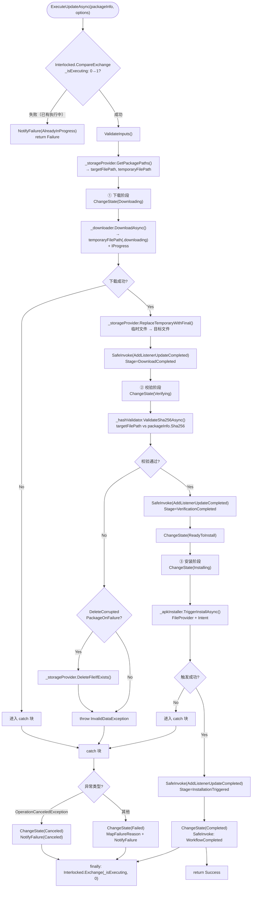

# GeneralUpdate.Maui.Android — 执行流程详解

> **目标读者：** 需要在 .NET MAUI Android 应用中集成自动更新的开发者
>
> **阅读完你将理解：**
> - `AndroidBootstrap` 的合并式两步 API 设计意图（ValidateAsync → ExecuteUpdateAsync）
> - `HttpRangeDownloader` 的可恢复下载机制：Range 请求 + 临时文件 + 原子替换
> - `ExecuteUpdateAsync` 内部的 Interlocked 并发保护与状态原子转换
> - SHA256 校验失败后自动清理损坏文件的策略
> - Android Package Installer 的 FileProvider + Intent 触发流程
> - `AddGeneralUpdateMauiAndroid()` DI 注册扩展的设计
> - 与 Avalonia.Android 在 API 风格和 DI 策略上的核心差异
> - 异常到 `UpdateFailureReason` 的分类映射

---

## 目录

1. [架构总览](#1-架构总览)
2. [入口：DI 优先的工厂设计](#2-入口di-优先的工厂设计)
3. [AndroidBootstrap：合并式两步 API](#3-androidbootstrap合并式两步-api)
4. [Step 1：ValidateAsync — 版本校验](#4-step-1validateasync--版本校验)
5. [Step 2：ExecuteUpdateAsync — 原子执行完整更新](#5-step-2executeupdateasync--原子执行完整更新)
6. [可恢复下载：HttpRangeDownloader 深度解析](#6-可恢复下载httprangedownloader-深度解析)
7. [SHA256 校验与损坏文件清理](#7-sha256-校验与损坏文件清理)
8. [APK 安装：平台守卫的 Installer](#8-apk-安装平台守卫的-installer)
9. [并发安全：Interlocked 原子操作](#9-并发安全interlocked-原子操作)
10. [SafeInvoke：防御式事件触发](#10-safeinvoke防御式事件触发)
11. [异常映射：MapFailureReason 分类机制](#11-异常映射mapfailurereason-分类机制)
12. [与 Avalonia.Android 的设计对比](#12-与-avaloniaandroid-的设计对比)
13. [关键代码路径索引](#13-关键代码路径索引)

---

## 1. 架构总览

### 1.1 五服务 DI 优先架构

Maui.Android 采用**DI 优先 + 手动装配并存**的设计：

```
┌──────────────────────────────────────────────────────────────┐
│              GeneralUpdateBootstrap（静态工厂）                │
│   CreateDefault() → IAndroidBootstrap                       │
│   AddGeneralUpdateMauiAndroid(services) → IServiceCollection │
├──────────────────────────────────────────────────────────────┤
│                   AndroidBootstrap（编排层）                   │
│                                                              │
│  ┌──────────────┐  ┌──────────────┐  ┌──────────────────┐   │
│  │ IUpdate      │  │ IHash        │  │ IApkInstaller    │   │
│  │ Downloader   │  │ Validator    │  │ FileProvider     │   │
│  │ HTTP 可恢复   │  │ SHA256 校验   │  │ Intent 触发      │   │
│  └──────────────┘  └──────────────┘  └──────────────────┘   │
│                                                              │
│  ┌──────────────┐  ┌──────────────────────────────────────┐ │
│  │ IUpdate      │  │ HttpDownloadOptions                   │ │
│  │ Storage      │  │ SSL / 代理 / 超时 / 重试 / 认证       │ │
│  │ Provider     │  └──────────────────────────────────────┘ │
│  │ 路径+原子替换 │                                            │
│  └──────────────┘                                            │
└──────────────────────────────────────────────────────────────┘
```

### 1.2 与 Avalonia.Android 的核心差异

| 维度 | Maui.Android | Avalonia.Android |
|------|-------------|-------------------|
| **API 风格** | 两步合并式（Validate + ExecuteUpdate） | 三步显式（Validate + DownloadAndVerify + LaunchInstaller） |
| **DI 策略** | DI 优先，`AddGeneralUpdateMauiAndroid()` | 手动装配优先，`CreateDefault()` |
| **并发保护** | `Interlocked` 原子操作 + 状态原子转换 | `SemaphoreSlim(1,1)` 操作门 |
| **事件安全** | `SafeInvoke` 迭代委托列表 | `IUpdateEventDispatcher` 调度 |
| **平台守卫** | `#if ANDROID` 编译时守卫 | 运行时平台检查 |
| **下载临时文件** | `.downloading` 扩展名 | `.part` + `.json` sidecar |
| **进度报告** | `IProgress<DownloadStatistics>` | `EventHandler<DownloadProgressChangedEventArgs>` |
| **完成阶段** | 4 阶段事件（Download/Verify/Install/Workflow） | 2 事件（Completed/Failed） |

---

## 2. 入口：DI 优先的工厂设计

### 2.1 DI 注册扩展

```csharp
public static class GeneralUpdateBootstrap
{
    // DI 优先：一键注册所有服务
    public static IServiceCollection AddGeneralUpdateMauiAndroid(
        this IServiceCollection services,
        HttpClient? httpClient = null)
    {
        services.AddSingleton<IUpdateDownloader>(sp =>
            new HttpRangeDownloader(httpClient ?? new HttpClient()));
        services.AddSingleton<IHashValidator, Sha256Validator>();
        services.AddSingleton<IApkInstaller, AndroidApkInstaller>();
        services.AddSingleton<IUpdateStorageProvider, UpdateFileStore>();
        services.AddSingleton<IUpdateLogger, DefaultUpdateLogger>();
        services.AddSingleton<IAndroidBootstrap, AndroidBootstrap>();
        return services;
    }

    // 手动装配：非 DI 场景
    public static IAndroidBootstrap CreateDefault(
        HttpClient? httpClient = null,
        IUpdateLogger? logger = null,
        HttpDownloadOptions? httpOptions = null)
    {
        var client = httpClient ?? new HttpClient();
        return new AndroidBootstrap(
            new HttpRangeDownloader(client),
            new Sha256Validator(),
            new AndroidApkInstaller(),
            new UpdateFileStore(),
            logger);
    }
}
```

### 2.2 MAUI 应用中的典型注册

```csharp
// MauiProgram.cs
public static MauiApp CreateMauiApp()
{
    var builder = MauiApp.CreateBuilder();
    builder.Services.AddGeneralUpdateMauiAndroid();
    // ...
    return builder.Build();
}

// 使用
public class UpdateService
{
    private readonly IAndroidBootstrap _bootstrap;

    public UpdateService(IAndroidBootstrap bootstrap)
    {
        _bootstrap = bootstrap;
    }
}
```

---

## 3. AndroidBootstrap：合并式两步 API

### 3.1 完整生命周期



### 3.2 状态机

```
None → Checking → UpdateAvailable → Downloading → Verifying → ReadyToInstall → Installing → Completed
                                                         ↓              ↓
                                                     Failed/         Failed/
                                                     Canceled        Canceled
```

状态通过 `Interlocked.Exchange` 原子转换：

```csharp
public UpdateState CurrentState => (UpdateState)Volatile.Read(ref _currentState);

private void ChangeState(UpdateState state)
{
    Interlocked.Exchange(ref _currentState, (int)state);
}
```

---

## 4. Step 1：ValidateAsync — 版本校验



### 4.1 输入验证

```csharp
private static void ValidateInputs(UpdatePackageInfo packageInfo, UpdateOptions options)
{
    ArgumentNullException.ThrowIfNull(packageInfo);
    ArgumentNullException.ThrowIfNull(options);

    if (string.IsNullOrWhiteSpace(options.CurrentVersion))
        throw new ArgumentException("Current version cannot be null or empty.");

    if (string.IsNullOrWhiteSpace(packageInfo.Version))
        throw new ArgumentException("Update package version cannot be null or empty.");

    if (string.IsNullOrWhiteSpace(packageInfo.DownloadUrl))
        throw new ArgumentException("Update package download url cannot be null or empty.");

    if (string.IsNullOrWhiteSpace(packageInfo.Sha256))
        throw new ArgumentException("Update package SHA256 cannot be null or empty.");
}
```

**安全设计：** SHA256 为必填项——Maui.Android 不允许跳过完整性校验。

---

## 5. Step 2：ExecuteUpdateAsync — 原子执行完整更新

这是 Maui.Android 最核心的方法。它将下载、校验、安装合并在一个原子操作中。

### 5.1 全流程总图



### 5.2 四个完成阶段

| 阶段 | UpdateCompletionStage | 触发时机 |
|------|----------------------|----------|
| 下载完成 | `DownloadCompleted` | 文件下载完成 + 原子替换后 |
| 校验完成 | `VerificationCompleted` | SHA256 校验通过后 |
| 安装触发 | `InstallationTriggered` | Android Installer Intent 发出后 |
| 流程完成 | `WorkflowCompleted` | 所有步骤成功，状态设为 Completed |

---

## 6. 可恢复下载：HttpRangeDownloader 深度解析

### 6.1 下载流程

```
HttpRangeDownloader.DownloadAsync()
  │
  ├── HEAD 请求探测
  │     Content-Length, Accept-Ranges, ETag
  │
  ├── 检查已有部分下载
  │     临时文件路径：{targetFilePath}.downloading
  │
  ├── 续传判断
  │     如果临时文件存在：
  │       → 文件大小 ≤ Content-Length → Range: bytes={size}-
  │       → 否则删除临时文件，从头下载
  │
  ├── GET with Range
  │     流式写入临时文件（追加模式）
  │     实时报告进度：字节数、总大小、速度
  │
  └── 进度报告
        通过 IProgress<DownloadStatistics> 回调
```

### 6.2 DownloadStatistics

```csharp
public class DownloadStatistics
{
    public long BytesDownloaded { get; set; }
    public long? TotalBytes { get; set; }
    public double DownloadSpeedBytesPerSecond { get; set; }
    public int ProgressPercentage { get; set; }
    public TimeSpan? EstimatedTimeRemaining { get; set; }
}
```

### 6.3 原子文件替换

```csharp
// UpdateFileStore.ReplaceTemporaryWithFinal
public void ReplaceTemporaryWithFinal(string temporaryPath, string targetPath)
{
    if (File.Exists(targetPath))
        File.Delete(targetPath);

    File.Move(temporaryPath, targetPath); // 原子重命名
}
```

---

## 7. SHA256 校验与损坏文件清理

### 7.1 校验流程

```csharp
var hashResult = await _hashValidator.ValidateSha256Async(
    targetFilePath, packageInfo.Sha256, progress: null, cancellationToken);

if (!hashResult.IsSuccess)
{
    // 清理策略：仅当配置允许时删除
    if (options.DeleteCorruptedPackageOnFailure)
    {
        _storageProvider.DeleteFileIfExists(targetFilePath);
    }

    throw new InvalidDataException(hashResult.FailureReason ?? "Integrity check failed.");
}
```

### 7.2 损坏文件处理策略

| `DeleteCorruptedPackageOnFailure` | 行为 |
|-----------------------------------|------|
| `true`（默认） | 删除损坏文件 → 下次更新重新下载 |
| `false` | 保留文件 → 方便开发者手动排查 |

---

## 8. APK 安装：平台守卫的 Installer

### 8.1 编译时平台守卫

```csharp
public class AndroidApkInstaller : IApkInstaller
{
    public Task TriggerInstallAsync(string filePath, InstallOptions options, CancellationToken ct)
    {
#if ANDROID
        // Android 平台实现
        var context = Android.App.Application.Context;
        var file = new Java.IO.File(filePath);

        if (Android.OS.Build.VERSION.SdkInt >= Android.OS.BuildVersionCodes.O)
        {
            if (!context.PackageManager.CanRequestPackageInstalls())
                throw new UnauthorizedAccessException("Install permission not granted.");
        }

        var uri = AndroidX.Core.Content.FileProvider.GetUriForFile(
            context, options.FileProviderAuthority, file);

        var intent = new Android.Content.Intent(Android.Content.Intent.ActionView);
        intent.SetDataAndType(uri, "application/vnd.android.package-archive");
        intent.AddFlags(Android.Content.ActivityFlags.GrantReadUriPermission);
        intent.AddFlags(Android.Content.ActivityFlags.NewTask);

        context.StartActivity(intent);
        return Task.CompletedTask;
#else
        throw new PlatformNotSupportedException("APK installation is only supported on Android.");
#endif
    }
}
```

### 8.2 安装权限检查（API 26+）

```csharp
if (Android.OS.Build.VERSION.SdkInt >= Android.OS.BuildVersionCodes.O)
{
    if (!context.PackageManager.CanRequestPackageInstalls())
    {
        // 引导用户到设置页面开启"安装未知应用"权限
        var intent = new Android.Content.Intent(
            Android.Provider.Settings.ActionManageUnknownAppSources);
        context.StartActivity(intent);
        throw new UnauthorizedAccessException("Install permission not granted.");
    }
}
```

---

## 9. 并发安全：Interlocked 原子操作

### 9.1 执行互斥

```csharp
private int _isExecuting;

public async Task<UpdateExecutionResult> ExecuteUpdateAsync(...)
{
    // 原子地尝试将 _isExecuting 从 0 改为 1
    if (Interlocked.CompareExchange(ref _isExecuting, 1, 0) != 0)
    {
        // 已有执行中 → 直接拒绝
        NotifyFailure(UpdateFailureReason.AlreadyInProgress, "An update execution is already in progress.", ...);
        return UpdateExecutionResult.Failure(UpdateFailureReason.AlreadyInProgress, "...");
    }

    try
    {
        // 执行更新...
    }
    finally
    {
        // 确保在任何情况下释放
        Interlocked.Exchange(ref _isExecuting, 0);
    }
}
```

### 9.2 状态原子读取

```csharp
private int _currentState = (int)UpdateState.None;

public UpdateState CurrentState => (UpdateState)Volatile.Read(ref _currentState);
```

**设计优势：** 相比 `SemaphoreSlim`，`Interlocked` 更轻量——没有异步等待开销，不会死锁，天然适合这种"要么执行要么拒绝"的场景。

---

## 10. SafeInvoke：防御式事件触发

```csharp
private void SafeInvoke<TEventArgs>(
    EventHandler<TEventArgs>? eventHandler,
    TEventArgs eventArgs,
    string eventName) where TEventArgs : EventArgs
{
    if (eventHandler is null) return;

    foreach (EventHandler<TEventArgs> subscriber in eventHandler.GetInvocationList())
    {
        try
        {
            subscriber(this, eventArgs);
        }
        catch (Exception ex)
        {
            _logger.LogError($"Unhandled exception in {eventName} listener.", ex);
            // 一个订阅者的异常不影响其他订阅者
        }
    }
}
```

**关键保障：** 如果事件有多个订阅者，其中一个抛出异常，其他订阅者仍能收到通知。

---

## 11. 异常映射：MapFailureReason 分类机制

```csharp
private static UpdateFailureReason MapFailureReason(Exception ex)
{
    return ex switch
    {
        ArgumentException          => UpdateFailureReason.InvalidInput,
        HttpRequestException       => UpdateFailureReason.Network,
        InvalidDataException       => UpdateFailureReason.IntegrityCheckFailed,
        IOException                => UpdateFailureReason.FileAccess,
        UnauthorizedAccessException => UpdateFailureReason.InstallPermissionDenied,
        OperationCanceledException => UpdateFailureReason.Canceled,
        _                          => UpdateFailureReason.Unknown
    };
}
```

### 11.1 失败原因枚举

| UpdateFailureReason | 触发条件 | 建议操作 |
|---------------------|----------|----------|
| `None` | — | — |
| `InvalidInput` | 参数为空或格式错误 | 检查 CurrentVersion / Version / DownloadUrl / Sha256 |
| `Network` | HTTP 请求失败 | 检查网络连接和服务端可用性 |
| `IntegrityCheckFailed` | SHA256 不匹配或文件损坏 | 重新下载；检查 CDN 缓存 |
| `FileAccess` | 读写文件失败 | 检查磁盘空间和目录权限 |
| `InstallPermissionDenied` | 缺少 INSTALL_PACKAGES 权限 | 引导用户到设置页面授权 |
| `AlreadyInProgress` | 并发调用 ExecuteUpdateAsync | 等待当前更新完成或重启 |
| `Canceled` | 用户取消或超时 | 允许用户重试 |
| `Unknown` | 未分类异常 | 查看日志详情 |

---

## 12. 与 Avalonia.Android 的设计对比

### 12.1 架构哲学差异

| 维度 | Maui.Android | Avalonia.Android |
|------|-------------|-------------------|
| **框架定位** | MAUI DI 生态深度集成 | 框架无关的通用设计 |
| **API 粒度** | 合并式（少 API，内部原子化） | 显式式（多 API，调用方控制） |
| **并发模型** | `Interlocked` 原子操作 | `SemaphoreSlim` 异步门 |
| **事件模型** | 4 阶段完成事件 | 2 事件（Completed + Failed） |
| **SHA256** | 强制必填 | 可选（但强烈建议） |
| **文件大小验证** | 不单独验证 | 双重验证（大小 + SHA256） |
| **进度接口** | `IProgress<DownloadStatistics>` | `EventHandler<DownloadProgressChangedEventArgs>` |
| **编译守卫** | `#if ANDROID` | 运行时检查 |
| **最低 API** | API 21 (Android 5.0) | API 26 (Android 8.0) |

### 12.2 选择建议

- **使用 Maui.Android** 如果你：使用 MAUI 框架、需要 DI 集成、偏好简洁的合并式 API
- **使用 Avalonia.Android** 如果你：使用 Avalonia 框架、需要在每步之间插入自定义逻辑、需要 Sidecar 断点续传

---

## 13. 关键代码路径索引

| 组件 | 文件 | 关键方法 |
|------|------|----------|
| DI 注册 + 工厂 | `Services/GeneralUpdateBootstrap.cs` | `AddGeneralUpdateMauiAndroid()` / `CreateDefault()` |
| 编排器 | `Services/AndroidBootstrap.cs` | `ValidateAsync()` / `ExecuteUpdateAsync()` / `SafeInvoke()` |
| 编排器接口 | `Abstractions/IAndroidBootstrap.cs` | — |
| 可恢复下载器 | `Services/HttpRangeDownloader.cs` | `DownloadAsync()` / HEAD 探测 / Range 请求 |
| SHA256 校验 | `Services/Sha256Validator.cs` | `ValidateSha256Async()` |
| APK 安装器 | `Platform/Android/AndroidApkInstaller.cs` | `TriggerInstallAsync()` / `#if ANDROID` |
| 文件存储 | `Services/UpdateFileStore.cs` | `GetPackagePaths()` / `ReplaceTemporaryWithFinal()` / `DeleteFileIfExists()` |
| 速度计算 | `Utilities/SpeedCalculator.cs` | 下载速度计量 |
| 更新选项 | `Models/UpdateOptions.cs` | CurrentVersion / DownloadDirectory / DeleteCorruptedPackageOnFailure |
| 下载统计 | `Models/DownloadStatistics.cs` | BytesDownloaded / TotalBytes / Speed / Percentage |
| 完成阶段 | `Enums/UpdateCompletionStage.cs` | DownloadCompleted / VerificationCompleted / InstallationTriggered / WorkflowCompleted |
| 失败原因 | `Enums/UpdateFailureReason.cs` | — |
| 日志接口 | `Abstractions/IUpdateLogger.cs` | — |
