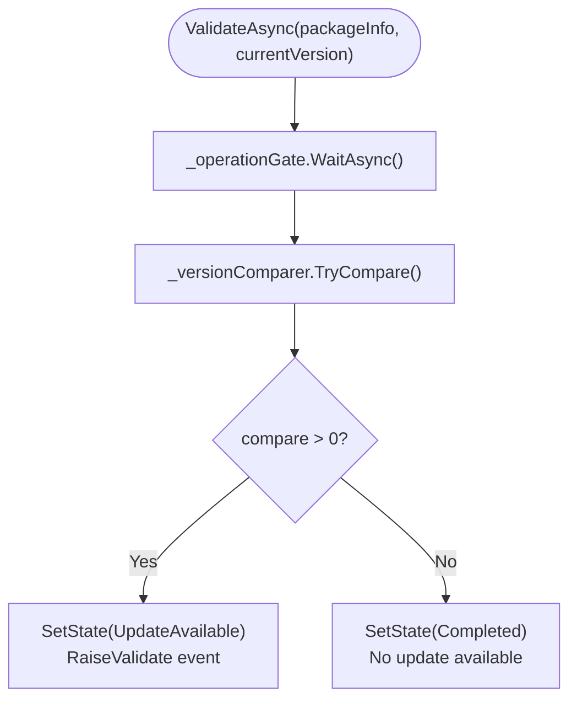
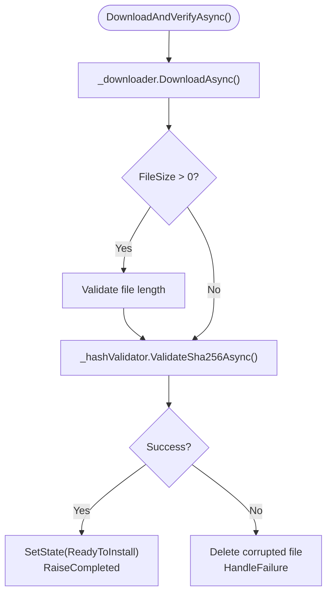
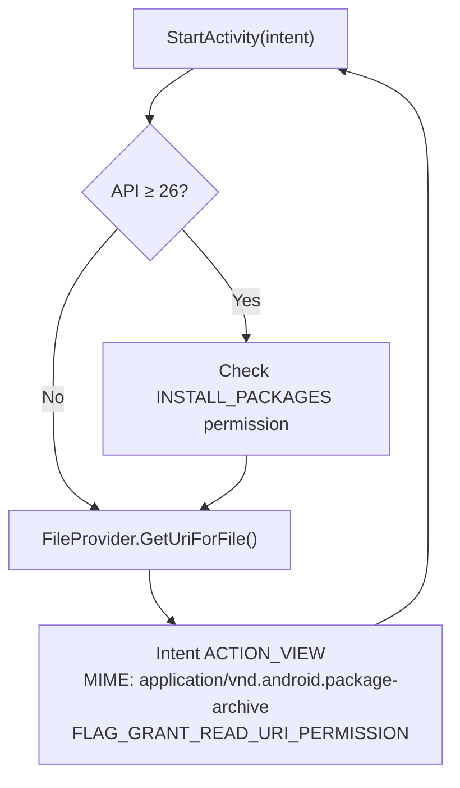

# GeneralUpdate.Avalonia.Android — Execution Flow Deep Dive

> **Target Audience:** Developers integrating auto-update into Avalonia Android apps
>
> **After reading you will understand:**
> - `AndroidBootstrap`'s explicit three-step API design intent (Validate → DownloadAndVerify → LaunchInstaller)
> - `HttpResumableApkDownloader`'s resume mechanism: Range requests + Sidecar metadata + atomic rename
> - SHA256 verification with file size dual validation
> - Android APK installation via FileProvider URI authorization flow
> - `SemaphoreSlim(1,1)` concurrency protection and thread safety design
> - `IUpdateEventDispatcher` UI thread dispatch mechanism
> - Multi-protocol authentication architecture (HMAC / Bearer / API Key / Basic)

---

## Table of Contents

1. [Architecture Overview](#1-architecture-overview)
2. [Entry: GeneralUpdateBootstrap Factory](#2-entry-generalupdatebootstrap-factory)
3. [AndroidBootstrap: Three-Step Explicit API](#3-androidbootstrap-three-step-explicit-api)
4. [Step 1: ValidateAsync — Version Check](#4-step-1-validateasync--version-check)
5. [Step 2: DownloadAndVerifyAsync — Download & Verify](#5-step-2-downloadandverifyasync--download--verify)
6. [Resumable Download: HttpResumableApkDownloader Deep Dive](#6-resumable-download-httpresumableapkdownloader-deep-dive)
7. [Hash Verification & File Size Validation](#7-hash-verification--file-size-validation)
8. [Step 3: LaunchInstallerAsync — APK Install Trigger](#8-step-3-launchinstallasync--apk-install-trigger)
9. [Concurrency Safety & Thread Model](#9-concurrency-safety--thread-model)
10. [Event Dispatch & UI Thread](#10-event-dispatch--ui-thread)
11. [Multi-Protocol Authentication](#11-multi-protocol-authentication)
12. [Key Code Path Index](#12-key-code-path-index)

---

## 1. Architecture Overview

### 1.1 Six-Service Replaceable Architecture

Avalonia.Android uses a **full interface abstraction + factory assembly** design:

```
┌──────────────────────────────────────────────────────────────┐
│              GeneralUpdateBootstrap (Static Factory)           │
│              CreateDefault(options) → IAndroidBootstrap       │
├──────────────────────────────────────────────────────────────┤
│              AndroidBootstrap (Orchestration Layer)            │
│                                                              │
│  ┌──────────────┐  ┌──────────────┐  ┌──────────────────┐   │
│  │ IVersion     │  │ IUpdate      │  │ IHashValidator   │   │
│  │ Comparer     │  │ Downloader   │  │ SHA256 verify    │   │
│  └──────────────┘  └──────────────┘  └──────────────────┘   │
│                                                              │
│  ┌──────────────┐  ┌──────────────┐  ┌──────────────────┐   │
│  │ IApkInstaller│  │ IFileStorage │  │ IUpdateEvent     │   │
│  │ FileProvider │  │ FS abstraction│  │ Dispatcher       │   │
│  └──────────────┘  └──────────────┘  └──────────────────┘   │
└──────────────────────────────────────────────────────────────┘
```

### 1.2 Three-Step API Design Philosophy

Unlike Maui.Android's combined API, Avalonia.Android uses an **explicit three-step API**:

| Step | Method | Responsibility | Caller Control Point |
|------|--------|---------------|---------------------|
| 1 | `ValidateAsync` | Version comparison | Decide whether to continue |
| 2 | `DownloadAndVerifyAsync` | Download + SHA256 verify | Show progress UI |
| 3 | `LaunchInstallerAsync` | Trigger system installer | User confirmation |

---

## 2. Entry: GeneralUpdateBootstrap Factory

```csharp
public static IAndroidBootstrap CreateDefault(AndroidUpdateOptions? options = null)
{
    return new AndroidBootstrap(
        versionComparer: new SystemVersionComparer(),
        downloader: new HttpResumableApkDownloader(options.HttpOptions),
        hashValidator: new Sha256HashValidator(),
        apkInstaller: new AndroidApkInstaller(),
        fileStorage: new PhysicalFileStorage(),
        eventDispatcher: new ImmediateEventDispatcher(),
        logger: new NoOpUpdateLogger()
    );
}
```

---

## 3. AndroidBootstrap: Three-Step Explicit API

### State Machine

```
None → Checking → UpdateAvailable → Downloading → Verifying → ReadyToInstall → Installing → Completed
```

State is thread-safely updated via `SetState()` and queryable via `GetSnapshot()`:

```csharp
public UpdateStateSnapshot GetSnapshot()
{
    lock (_sync) { return _snapshot; }
}
```

---

## 4. Step 1: ValidateAsync — Version Check



Uses `IVersionComparer` interface (default: `SystemVersionComparer` using `System.Version`).

---

## 5. Step 2: DownloadAndVerifyAsync — Download & Verify



---

## 6. Resumable Download: HttpResumableApkDownloader

### Core Mechanism

```
Phase 1: HEAD request → Accept-Ranges, ETag, Content-Length
Phase 2: Check partial download → {filename}.part + {filename}.json (sidecar)
Phase 3: Resume consistency check → URL, SHA256, size, ETag match?
Phase 4: GET with Range → Range: bytes={downloaded}-
Phase 5: Atomic rename → {filename}.part → {filename}.apk, delete sidecar
```

### Sidecar Metadata

```json
{
    "url": "https://cdn.example.com/app-v2.0.apk",
    "sha256": "a1b2c3d4...",
    "downloadedBytes": 15728640,
    "totalBytes": 52428800,
    "etag": "\"abc123\"",
    "lastModified": "2026-06-01T12:00:00Z"
}
```

---

## 7. Hash Verification & File Size Validation

Dual validation in order:
1. File size check (if metadata provides `FileSize`) → mismatch → delete file, `FileIoError`
2. SHA256 check (if metadata provides `Sha256`) → mismatch → delete file, `HashMismatch`

---

## 8. Step 3: LaunchInstallerAsync — APK Install Trigger



### FileProvider Configuration

```xml
<!-- AndroidManifest.xml -->
<provider
    android:name="androidx.core.content.FileProvider"
    android:authorities="${applicationId}.fileprovider"
    android:exported="false"
    android:grantUriPermissions="true">
    <meta-data
        android:name="android.support.FILE_PROVIDER_PATHS"
        android:resource="@xml/file_paths" />
</provider>
```

---

## 9. Concurrency Safety & Thread Model

### SemaphoreSlim Operation Gate

```csharp
private readonly SemaphoreSlim _operationGate = new(1, 1);

public async Task<UpdateCheckResult> ValidateAsync(...)
{
    await _operationGate.WaitAsync(cancellationToken);
    try { /* critical section */ }
    finally { _operationGate.Release(); }
}
```

**Design intent:** Three steps independently acquire and release the lock, allowing the caller to do UI operations between steps.

---

## 10. Event Dispatch & UI Thread

```csharp
public interface IUpdateEventDispatcher
{
    void Dispatch(Action action);
}

// Default: ImmediateEventDispatcher (direct execution)
// Avalonia: Avalonia.Threading.Dispatcher.UIThread.Post(action)
```

Events: `AddListenerValidate`, `AddListenerDownloadProgressChanged`, `AddListenerUpdateCompleted`, `AddListenerUpdateFailed`.

---

## 11. Multi-Protocol Authentication

| Scheme | Header |
|--------|--------|
| **HMAC-SHA256** | `Authorization: HMAC-SHA256 {signature}` |
| **Bearer Token** | `Authorization: Bearer {token}` |
| **API Key** | `X-API-Key: {key}` |
| **HTTP Basic** | `Authorization: Basic {base64}` |

Per-package auth takes priority over global auth.

---

## 12. Key Code Path Index

| Component | File | Key Methods |
|-----------|------|-------------|
| Static Factory | `GeneralUpdateBootstrap.cs` | `CreateDefault()` |
| Orchestrator | `Services/AndroidBootstrap.cs` | `ValidateAsync()` / `DownloadAndVerifyAsync()` / `LaunchInstallerAsync()` |
| Resumable Downloader | `Services/HttpResumableApkDownloader.cs` | `DownloadAsync()` / HEAD / Range |
| SHA256 Validator | `Services/Sha256HashValidator.cs` | `ValidateSha256Async()` |
| APK Installer | `Services/AndroidApkInstaller.cs` | `LaunchInstallAsync()` / FileProvider |
| Version Comparer | `Services/SystemVersionComparer.cs` | `TryCompare()` |
| Event Dispatcher | `Services/ImmediateEventDispatcher.cs` | `Dispatch()` |
| Speed Calculator | `Utilities/SpeedCalculator.cs` | Sliding window speed |
| Auth Interface | `Abstractions/IHttpAuthProvider.cs` | `ApplyAuth()` |
