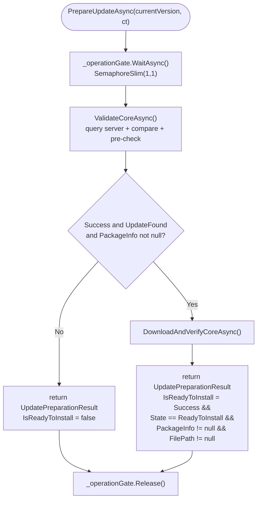
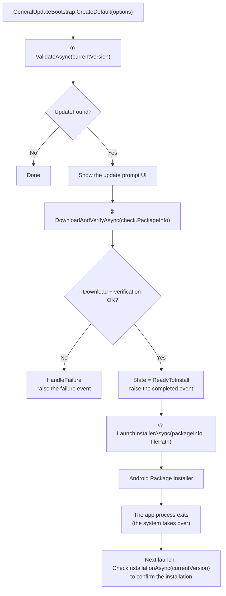
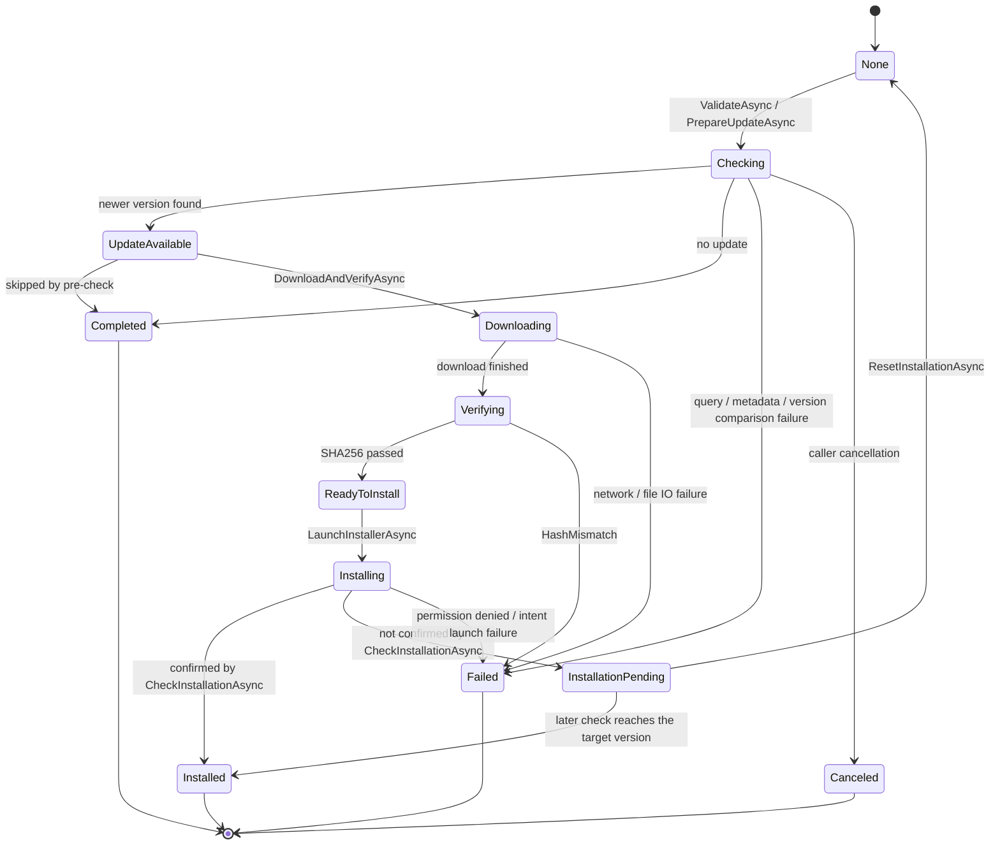
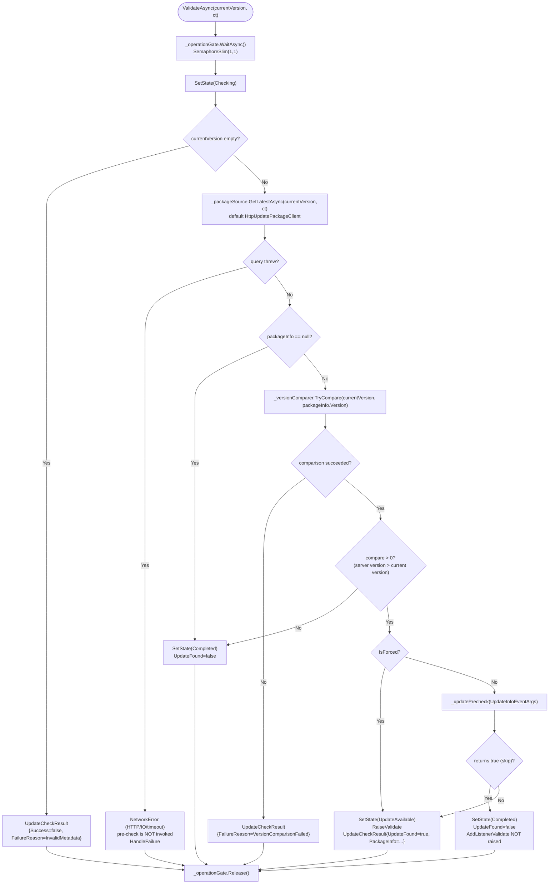
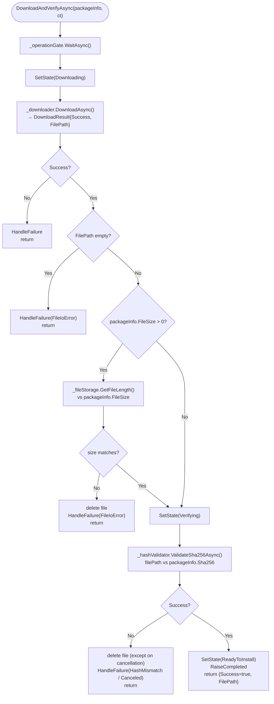
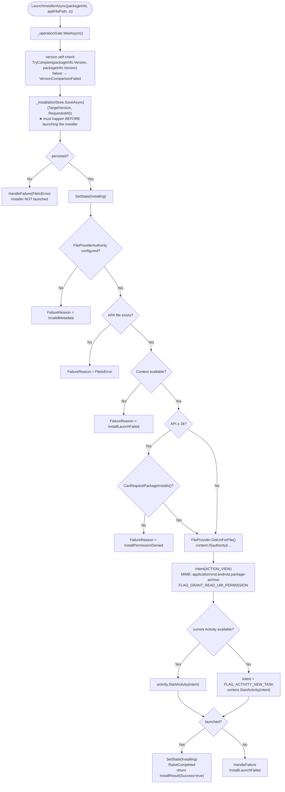
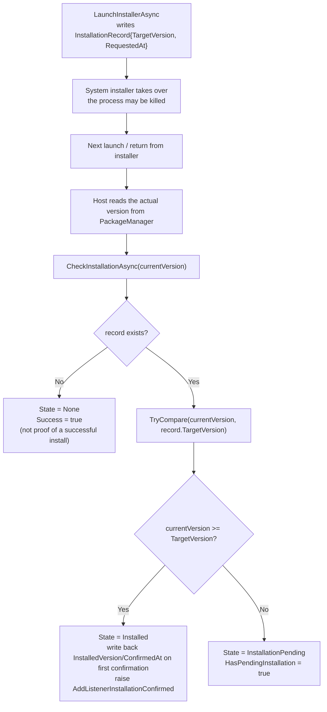

# GeneralUpdate.Avalonia.Android — Execution Flow Deep Dive

> **Target Audience:** Developers integrating auto-update into Avalonia Android apps
>
> **After reading you will understand:**
> - How `ValidateAsync` queries the server and picks the newest APK (the caller only supplies the current version)
> - How to choose between `PrepareUpdateAsync` and the phased three-step API
> - `HttpResumableApkDownloader` internals: HEAD probe + Range requests + sidecar metadata + atomic rename
> - Dual verification of file size and SHA256
> - Android APK installation via the FileProvider URI authorization flow
> - The installation result loop: why "the installer launched" is not "the installation succeeded"
> - `SemaphoreSlim(1,1)` operation gate and `Dispose` lifetime contracts
> - `IUpdateEventDispatcher` UI thread dispatch mechanism
> - Multi-protocol authentication architecture (HMAC / Bearer / API Key / Basic) and where credentials are sent

---

## Table of Contents

1. [Architecture overview](#1-architecture-overview)
2. [Entry point: the GeneralUpdateBootstrap factory](#2-entry-point-the-generalupdatebootstrap-factory)
3. [Two calling styles: one-shot and phased](#3-two-calling-styles-one-shot-and-phased)
4. [ValidateAsync — server query and version validation](#4-validateasync--server-query-and-version-validation)
5. [DownloadAndVerifyAsync — download and verification](#5-downloadandverifyasync--download-and-verification)
6. [Resumable download: HttpResumableApkDownloader internals](#6-resumable-download-httpresumableapkdownloader-internals)
7. [Hash and file size verification](#7-hash-and-file-size-verification)
8. [LaunchInstallerAsync — APK installation handoff](#8-launchinstallerasync--apk-installation-handoff)
9. [The installation result loop](#9-the-installation-result-loop)
10. [Concurrency and threading model](#10-concurrency-and-threading-model)
11. [Event dispatching and the UI thread](#11-event-dispatching-and-the-ui-thread)
12. [Multi-protocol authentication](#12-multi-protocol-authentication)
13. [Key code path index](#13-key-code-path-index)

---

## 1. Architecture Overview

### 1.1 Full abstraction plus factory assembly

Avalonia.Android uses **interface abstractions assembled by a factory** — every core capability has an interface that can be replaced independently:

```
┌──────────────────────────────────────────────────────────────────────┐
│                    GeneralUpdateBootstrap (static factory)            │
│                    CreateDefault(options, ...) → IAndroidBootstrap   │
├──────────────────────────────────────────────────────────────────────┤
│                     AndroidBootstrap (orchestration)                  │
│                                                                      │
│  ┌────────────────┐  ┌────────────────┐  ┌────────────────────┐     │
│  │ IVersion       │  │ IUpdatePackage │  │ IUpdateDownloader  │     │
│  │ Comparer       │  │ Source         │  │ Resumable HTTP     │     │
│  │ Version rules  │  │ Server query   │  │ download           │     │
│  └────────────────┘  └────────────────┘  └────────────────────┘     │
│                                                                      │
│  ┌────────────────┐  ┌────────────────┐  ┌────────────────────┐     │
│  │ IHashValidator │  │ IApkInstaller  │  │ IFileStorage       │     │
│  │ SHA256         │  │ System         │  │ File system        │     │
│  │                │  │ installer      │  │                    │     │
│  └────────────────┘  └────────────────┘  └────────────────────┘     │
│                                                                      │
│  ┌────────────────────┐  ┌────────────────────┐  ┌───────────────┐  │
│  │ IInstallationStore │  │ IUpdateEvent       │  │ IUpdateLogger │  │
│  │ Installation       │  │ Dispatcher         │  │ Logging       │  │
│  │ record persistence │  │ UI thread dispatch │  │               │  │
│  └────────────────────┘  └────────────────────┘  └───────────────┘  │
│                                                                      │
│  ┌──────────────────────────────────────────────────────────────┐   │
│  │ HttpDownloadOptions (cross-cutting)                           │   │
│  │ SSL policy / proxy / timeout / retry / auth                   │   │
│  └──────────────────────────────────────────────────────────────┘   │
└──────────────────────────────────────────────────────────────────────┘
```

The default implementation behind each abstraction is listed in the
[component reference](GeneralUpdate.Avalonia.Android#41-extensible-capabilities-at-a-glance).

### 1.2 Two calling styles

| Style | Method | When to use |
|-------|--------|-------------|
| **One-shot** | `PrepareUpdateAsync(currentVersion, ct)` | The host only needs "a verified APK ready to install"; query, comparison, pre-check, download and verification run under one operation lock |
| **Phased** | `ValidateAsync` → `DownloadAndVerifyAsync` → `LaunchInstallerAsync` | You need to show a prompt after the check, a progress bar during download, and ask for confirmation before installing |

| Step | Method | Responsibility | Caller control point |
|------|--------|----------------|----------------------|
| 0 | `ValidateAsync(currentVersion, ct)` | Query the server + compare versions + pre-check | Decide whether to continue |
| 1 | `DownloadAndVerifyAsync(packageInfo, ct)` | Download + size check + SHA256 check | Show progress UI |
| 2 | `LaunchInstallerAsync(packageInfo, path, ct)` | Persist the installation record + launch the system installer | Call after user confirmation |
| — | `CheckInstallationAsync(currentVersion, ct)` | Offline reconciliation of the previous install | Call at startup / on return |

:::info Key difference from earlier versions
Since `v0.0.1-beta.10`, `ValidateAsync` **no longer accepts an `UpdatePackageInfo`**: package metadata is discovered by
the component from `AndroidUpdateOptions.UpdateServer` (or an injected `IUpdatePackageSource`). The caller only supplies
the version installed on the device, then passes `UpdateCheckResult.PackageInfo` to the download and install methods.
:::

---

## 2. Entry Point: the GeneralUpdateBootstrap Factory

```csharp
public static class GeneralUpdateBootstrap
{
    public static IAndroidBootstrap CreateDefault(
        AndroidUpdateOptions options,
        IAndroidContextProvider? contextProvider = null,     // DefaultAndroidContextProvider
        IAndroidActivityProvider? activityProvider = null,   // NullAndroidActivityProvider
        HttpClient? httpClient = null,                       // borrowed, host-owned
        IVersionComparer? versionComparer = null,            // SystemVersionComparer
        IUpdateEventDispatcher? eventDispatcher = null,      // ImmediateEventDispatcher
        IUpdateLogger? logger = null,                        // NoOpUpdateLogger
        HttpDownloadOptions? httpOptions = null,             // SSL / proxy / timeout / retry / auth
        IUpdatePackageSource? packageSource = null,          // HttpUpdatePackageClient
        IInstallationStore? installationStore = null)        // JsonFileInstallationStore
    {
        // 1. Resolve the download directory: options.DownloadDirectoryPath → <CacheDir>/update → <TempPath>/update
        // 2. Resolve the installation record path: options.InstallationStateFilePath → <FilesDir>/update/installation.json
        // 3. Create one shared HttpClient (a supplied client is borrowed and never reconfigured)
        // 4. Assemble downloader / packageSource / hashValidator / installer / store and return AndroidBootstrap
    }
}
```

Two side effects are worth noting:

1. **The download directory and installation record path are written back into `options`** (through a `with` copy) so the downloader and installer share the same resolved paths
2. **`DownloadBufferSize <= 0` throws `ArgumentOutOfRangeException` immediately**; when the Android context is unavailable and `InstallationStateFilePath` was not set explicitly, an `InvalidOperationException` is thrown

---

## 3. Two Calling Styles: One-Shot and Phased

### 3.1 One-shot: PrepareUpdateAsync


```mermaid
flowchart TB
    START(["PrepareUpdateAsync(currentVersion, ct)"]) --> GATE["_operationGate.WaitAsync()\nSemaphoreSlim(1,1)"]
    GATE --> VAL["ValidateCoreAsync()\nquery server + compare + pre-check"]
    VAL --> CHK{"Success and UpdateFound\nand PackageInfo not null?"}
    CHK -- "No" --> RET1["return UpdatePreparationResult\nIsReadyToInstall = false"]
    CHK -- "Yes" --> DL["DownloadAndVerifyCoreAsync()"]
    DL --> RET2["return UpdatePreparationResult\nIsReadyToInstall = Success &&\nState == ReadyToInstall &&\nPackageInfo != null && FilePath != null"]
    RET1 --> RELEASE["_operationGate.Release()"]
    RET2 --> RELEASE
```

`PrepareUpdateAsync` **never** opens the installer or a permission page: it only brings the APK to a "verified, ready to install"
state. When there is no update or the pre-check skips it, `Success = true`, `IsReadyToInstall = false` and `UpdateFound = false`.

### 3.2 Phased: the explicit three-step API


```mermaid
flowchart TB
    CREATE["GeneralUpdateBootstrap.CreateDefault(options)"] --> VAL["① ValidateAsync(currentVersion)"]

    VAL --> VAL_RES{"UpdateFound?"}
    VAL_RES -- "No" --> DONE["Done"]
    VAL_RES -- "Yes" --> UI["Show the update prompt UI"]

    UI --> DL["② DownloadAndVerifyAsync(check.PackageInfo)"]

    DL --> DL_RES{"Download + verification OK?"}
    DL_RES -- "No" --> FAIL["HandleFailure\nraise the failure event"]
    DL_RES -- "Yes" --> READY["State = ReadyToInstall\nraise the completed event"]

    READY --> INSTALL["③ LaunchInstallerAsync(packageInfo, filePath)"]
    INSTALL --> SYS["Android Package Installer"]
    SYS --> APP_EXIT["The app process exits\n(the system takes over)"]
    APP_EXIT --> NEXT["Next launch: CheckInstallationAsync(currentVersion)\nto confirm the installation"]
```

### 3.3 Lifecycle and state machine


```mermaid
stateDiagram-v2
    [*] --> None
    None --> Checking: ValidateAsync / PrepareUpdateAsync
    Checking --> UpdateAvailable: newer version found
    Checking --> Completed: no update
    Checking --> Failed: query / metadata / version comparison failure
    Checking --> Canceled: caller cancellation
    UpdateAvailable --> Completed: skipped by pre-check
    UpdateAvailable --> Downloading: DownloadAndVerifyAsync
    Downloading --> Verifying: download finished
    Downloading --> Failed: network / file IO failure
    Verifying --> ReadyToInstall: SHA256 passed
    Verifying --> Failed: HashMismatch
    ReadyToInstall --> Installing: LaunchInstallerAsync
    Installing --> Installed: confirmed by CheckInstallationAsync
    Installing --> InstallationPending: not confirmed by CheckInstallationAsync
    InstallationPending --> Installed: later check reaches the target version
    Installing --> Failed: permission denied / intent launch failure
    InstallationPending --> None: ResetInstallationAsync
    Installed --> [*]
    Completed --> [*]
    Failed --> [*]
    Canceled --> [*]
```

State is updated by `SetState()` under a lock and can be read at any time with `GetSnapshot()`:

```csharp
public UpdateStateSnapshot GetSnapshot()
{
    lock (_sync)
    {
        return _snapshot; // { State, FailureReason, Message }
    }
}
```

---

## 4. ValidateAsync — Server Query and Version Validation

### 4.1 Full flow


```mermaid
flowchart TB
    START(["ValidateAsync(currentVersion, ct)"]) --> GATE["_operationGate.WaitAsync()\nSemaphoreSlim(1,1)"]
    GATE --> SET1["SetState(Checking)"]

    SET1 --> EMPTY{"currentVersion empty?"}
    EMPTY -- "Yes" --> FAIL1["UpdateCheckResult\n{Success=false, FailureReason=InvalidMetadata}"]
    EMPTY -- "No" --> QUERY["_packageSource.GetLatestAsync(currentVersion, ct)\ndefault HttpUpdatePackageClient"]

    QUERY --> QUERY_OK{"query threw?"}
    QUERY_OK -- "Yes" --> FAIL_Q["NetworkError (HTTP/IO/timeout)\npre-check is NOT invoked\nHandleFailure"]
    QUERY_OK -- "No" --> NULLP{"packageInfo == null?"}

    NULLP -- "Yes" --> NOUPDATE["SetState(Completed)\nUpdateFound=false"]
    NULLP -- "No" --> COMPARE["_versionComparer.TryCompare(currentVersion, packageInfo.Version)"]

    COMPARE --> COMP_OK{"comparison succeeded?"}
    COMP_OK -- "No" --> FAIL2["UpdateCheckResult\n{FailureReason=VersionComparisonFailed}"]
    COMP_OK -- "Yes" --> RESULT{"compare > 0?\n(server version > current version)"}

    RESULT -- "No" --> NOUPDATE
    RESULT -- "Yes" --> PRECHECK{"IsForced?"}
    PRECHECK -- "Yes" --> AVAIL
    PRECHECK -- "No" --> CB["_updatePrecheck(UpdateInfoEventArgs)"]
    CB --> SKIP{"returns true (skip)?"}
    SKIP -- "Yes" --> SKIPPED["SetState(Completed)\nUpdateFound=false\nAddListenerValidate NOT raised"]
    SKIP -- "No" --> AVAIL["SetState(UpdateAvailable)\nRaiseValidate\nUpdateCheckResult{UpdateFound=true, PackageInfo=...}"]

    AVAIL --> RELEASE["_operationGate.Release()"]
    SKIPPED --> RELEASE
    NOUPDATE --> RELEASE
    FAIL1 --> RELEASE
    FAIL2 --> RELEASE
    FAIL_Q --> RELEASE
```

### 4.2 Server query protocols

`IUpdatePackageSource` is the query entry point; the default `HttpUpdatePackageClient` supports two modes:

| Mode | Trigger | Behavior |
|------|---------|----------|
| GeneralUpdate verification protocol | `UpdateServer.UseJsonEndpoint = false` (default) | `POST` body `version / appKey / appType / platform / productId`, response `{"code":200,"body":[...]}` |
| Static JSON | `UpdateServer.UseJsonEndpoint = true` | `GET` a single `UpdatePackageInfo`; HTTP 204 or `null` means no update |

Package filtering under the default protocol:

```
for each entry in body
  ├── entry.IsFreeze == true           → skip (frozen packages are not pushed)
  ├── entry.PackageType ∉ {null, 0, 2} → skip (not a full package)
  ├── entry.Format is not apk/.apk     → skip (URL must end with .apk when omitted)
  ├── ValidateMetadata() fails         → throw InvalidDataException
  └── otherwise → compare with the current latest and keep the higher version
```

`ValidateMetadata()` requires a non-empty `Version`, an absolute HTTP(S) `DownloadUrl`, `FileSize >= 0` and a 64-character
hexadecimal `Sha256`.

### 4.3 Failure classification

| Exception | Reported result |
|-----------|-----------------|
| `HttpRequestException` / `OperationCanceledException` / `IOException` / `TimeoutException` | `FailureReason = NetworkError` |
| `JsonException` / `InvalidDataException` / `ArgumentException` | `FailureReason = InvalidMetadata` |
| No `UpdateServer` and no injected package source | `InvalidDataException("Configure UpdateServer or supply an IUpdatePackageSource.")` → `InvalidMetadata` |
| Caller cancellation during the request | `State = Canceled`, `FailureReason = Canceled` |
| Caller cancellation while waiting for the operation lock | `OperationCanceledException` is thrown (no result object) |

:::warning Query failures never trigger the pre-check
Transport, protocol and metadata errors are reported only through `UpdateCheckResult.Success = false`, `FailureReason` and
`AddListenerUpdateFailed`. The pre-check callback is not invoked, so business logic cannot mistake a failed query for
"an update is available".
:::

### 4.4 Version comparer

```csharp
public interface IVersionComparer
{
    bool TryCompare(string currentVersion, string targetVersion,
                    out int compareResult, out string? errorMessage);
    // compareResult > 0: targetVersion is newer (update available)
    // compareResult = 0: equal
    // compareResult < 0: targetVersion is older (downgrade)
}
```

The default `SystemVersionComparer` uses `System.Version` for semantic comparison. It is also reused while picking the
newest package from the response `body`.

---

## 5. DownloadAndVerifyAsync — Download and Verification


```mermaid
flowchart TB
    START(["DownloadAndVerifyAsync(packageInfo, ct)"]) --> GATE["_operationGate.WaitAsync()"]
    GATE --> SET_DL["SetState(Downloading)"]

    SET_DL --> DOWNLOAD["_downloader.DownloadAsync()\n→ DownloadResult{Success, FilePath}"]

    DOWNLOAD --> DL_OK{"Success?"}
    DL_OK -- "No" --> FAIL["HandleFailure\nreturn"]

    DL_OK -- "Yes" --> HAS_PATH{"FilePath empty?"}
    HAS_PATH -- "Yes" --> FAIL_PATH["HandleFailure(FileIoError)\nreturn"]

    HAS_PATH -- "No" --> SIZE{"packageInfo.FileSize > 0?"}
    SIZE -- "Yes" --> CHECK_SIZE["_fileStorage.GetFileLength()\nvs packageInfo.FileSize"]
    CHECK_SIZE --> SIZE_OK{"size matches?"}
    SIZE_OK -- "No" --> DEL_SIZE["delete file\nHandleFailure(FileIoError)\nreturn"]

    SIZE_OK -- "Yes" --> HASH
    SIZE -- "No" --> HASH["SetState(Verifying)"]
    HASH --> DO_HASH["_hashValidator.ValidateSha256Async()\nfilePath vs packageInfo.Sha256"]

    DO_HASH --> HASH_OK{"Success?"}
    HASH_OK -- "No" --> DEL_HASH["delete file (except on cancellation)\nHandleFailure(HashMismatch / Canceled)\nreturn"]

    HASH_OK -- "Yes" --> COMPLETE["SetState(ReadyToInstall)\nRaiseCompleted\nreturn {Success=true, FilePath}"]
```

`DownloadAndVerifyAsync` takes `packageInfo` as a parameter, so it can be used with the result of `ValidateAsync` or called
standalone when the package metadata comes from another business channel.

---

## 6. Resumable Download: HttpResumableApkDownloader Internals

### 6.1 Mechanics

```
Download pipeline
  │
  ├── Phase 0: upfront metadata validation
  │     DownloadUrl must be absolute HTTP(S) and Sha256 non-empty, else → InvalidMetadata
  │     Non-HTTPS without AllowInsecureHttpDownloads → InvalidMetadata
  │
  ├── Phase 1: HEAD probe
  │     Accept-Ranges / ETag / Content-Length / Last-Modified
  │     HEAD returning 405/501 falls back to a GET probe
  │
  ├── Phase 2: detect a partial download
  │     {filename}.part + {filename}.json (sidecar)
  │
  ├── Phase 3: resume consistency check
  │     file name / ETag / LastModified mismatch → discard the temp file and restart
  │     invalid sidecar JSON → discard and restart
  │
  ├── Phase 4: GET with Range
  │     fresh download: GET {url}
  │     resume:         GET {url} + Range: bytes={existingLength}-
  │     server answers 200 OK (no Range support) → discard and restart
  │     stream into {filename}.part and report progress continuously
  │
  ├── Phase 5: atomic rename
  │     {filename}.part → final file name (overwrite)
  │     delete the sidecar
  │
  └── Progress reporting
        downloaded bytes, total size, speed (bytes/s), percentage, status (Downloading/Resuming/Download completed)
```

### 6.2 Sidecar metadata

Persisted fields of `DownloadResumeMetadata` (the downloaded byte count is no longer stored — the length comes from the
`.part` file itself):

```json
{
  "downloadUrl": "https://cdn.example.com/app-v2.0.apk",
  "expectedSha256": "a1b2c3d4...",
  "expectedFileSize": 52428800,
  "fileName": "app-v2.0.apk",
  "etag": "\"abc123\"",
  "lastModified": "2026-06-01T12:00:00Z"
}
```

### 6.3 Speed measurement

Speed measurement is inlined in the downloader (sliding window whose length is controlled by
`AndroidUpdateOptions.SpeedSmoothingWindowSeconds`, default 4 seconds) and is surfaced as
`DownloadProgressInfo.DownloadSpeedBytesPerSecond`.

### 6.4 Retry policy

| Situation | Retried |
|-----------|---------|
| Transient network failures on HEAD / GET / response stream (timeout, 429, 5xx, no status code) | Yes, with resume |
| Metadata query failures | No |
| Permanent HTTP errors (for example 401) | No |
| Caller cancellation | No |

`MaxRetryAttempts` defaults to 3, meaning "1 initial attempt + 2 retries"; backoff is
`min(30s, RetryBaseDelay * 2^attempt)`.

---

## 7. Hash and File Size Verification

### 7.1 Dual verification

```
DownloadAndVerifyAsync verification order:
  1. FilePath not empty                → otherwise FileIoError
  2. File size check (when FileSize > 0)
     → mismatch → delete the file, return FileIoError
  3. SHA256 check
     → mismatch → delete the file, return HashMismatch
     → cancellation → return Canceled (keep the file so it can be resumed)
```

### 7.2 Sha256HashValidator

```csharp
public sealed class Sha256HashValidator : IHashValidator
{
    public Sha256HashValidator(UpdateLanguage language = UpdateLanguage.English);

    public async Task<HashValidationResult> ValidateSha256Async(
        string filePath, string expectedSha256, CancellationToken ct = default)
    {
        // 1. empty expectedSha256 → Success = false
        // 2. file not found       → Success = false
        // 3. compute the actual SHA256 and compare OrdinalIgnoreCase
        //    → mismatch: FailureReason = HashMismatch, ActualSha256 / ExpectedSha256 filled in
    }
}
```

---

## 8. LaunchInstallerAsync — APK Installation Handoff

### 8.1 Android installation flow


```mermaid
flowchart TB
    START(["LaunchInstallerAsync(packageInfo, apkFilePath, ct)"]) --> GATE["_operationGate.WaitAsync()"]
    GATE --> VC["version self-check\nTryCompare(packageInfo.Version, packageInfo.Version)\nfailure → VersionComparisonFailed"]
    VC --> SAVE["_installationStore.SaveAsync(\n{TargetVersion, RequestedAt})\n★ must happen BEFORE launching the installer"]
    SAVE --> SAVE_OK{"persisted?"}
    SAVE_OK -- "No" --> FAIL_SAVE["HandleFailure(FileIoError)\ninstaller NOT launched"]
    SAVE_OK -- "Yes" --> SET["SetState(Installing)"]

    SET --> AUTH{"FileProviderAuthority configured?"}
    AUTH -- "No" --> FAIL_AUTH["FailureReason = InvalidMetadata"]
    AUTH -- "Yes" --> EXISTS{"APK file exists?"}
    EXISTS -- "No" --> FAIL_IO["FailureReason = FileIoError"]
    EXISTS -- "Yes" --> CTX{"Context available?"}
    CTX -- "No" --> FAIL_CTX["FailureReason = InstallLaunchFailed"]
    CTX -- "Yes" --> API{"API ≥ 26?"}

    API -- "Yes" --> PERM{"CanRequestPackageInstalls()?"}
    PERM -- "No" --> FAIL_PERM["FailureReason = InstallPermissionDenied"]
    PERM -- "Yes" --> URI
    API -- "No" --> URI["FileProvider.GetUriForFile()\ncontent://{authority}/..."]

    URI --> INTENT["Intent(ACTION_VIEW)\nMIME: application/vnd.android.package-archive\nFLAG_GRANT_READ_URI_PERMISSION"]
    INTENT --> WHICH{"current Activity available?"}
    WHICH -- "Yes" --> ACT["activity.StartActivity(intent)"]
    WHICH -- "No" --> APP["intent + FLAG_ACTIVITY_NEW_TASK\ncontext.StartActivity(intent)"]

    ACT --> RESULT
    APP --> RESULT{"launched?"}
    RESULT -- "Yes" --> OK["SetState(Installing)\nRaiseCompleted\nreturn InstallResult{Success=true}"]
    RESULT -- "No" --> FAIL_START["HandleFailure\nInstallLaunchFailed"]
```

:::warning Persist the record before launching the installer
The installation record is written atomically **before** the installer is launched, because Android may kill the current
process as soon as installation starts. Launching first and recording afterwards would make the target version unknowable
after a restart. If the write fails, the component returns `FileIoError` and does not launch the installer.
:::

### 8.2 FileProvider configuration

In `AndroidManifest.xml` (`authorities` must equal `AndroidUpdateOptions.FileProviderAuthority`):

```xml
<provider
    android:name="androidx.core.content.FileProvider"
    android:authorities="com.example.app.generalupdate.fileprovider"
    android:exported="false"
    android:grantUriPermissions="true">
    <meta-data
        android:name="android.support.FILE_PROVIDER_PATHS"
        android:resource="@xml/generalupdate_file_paths" />
</provider>
```

In `Resources/xml/generalupdate_file_paths.xml`, the paths must cover `DownloadDirectoryPath` (default `<CacheDir>/update`):

```xml
<?xml version="1.0" encoding="utf-8"?>
<paths>
    <cache-path name="update_cache" path="update/" />
    <files-path name="update_files" path="update/" />
</paths>
```

---

## 9. The Installation Result Loop

### 9.1 Why it is needed

`LaunchInstallerAsync` returning `Success = true` only means the **installer intent was launched**. The user may cancel,
the installation may fail, or the process may be killed after a successful install. To know whether the update actually took
effect, the host must reconcile the persisted **target version** with the version read from PackageManager on the next
launch or on return from the installer.


```mermaid
flowchart TB
    A["LaunchInstallerAsync\nwrites InstallationRecord{TargetVersion, RequestedAt}"] --> B["System installer takes over\nthe process may be killed"]
    B --> C["Next launch / return from installer"]
    C --> D["Host reads the actual version from PackageManager"]
    D --> E["CheckInstallationAsync(currentVersion)"]
    E --> F{"record exists?"}
    F -- "No" --> G["State = None\nSuccess = true\n(not proof of a successful install)"]
    F -- "Yes" --> H["TryCompare(currentVersion, record.TargetVersion)"]
    H --> I{"currentVersion >= TargetVersion?"}
    I -- "Yes" --> J["State = Installed\nwrite back InstalledVersion/ConfirmedAt on first confirmation\nraise AddListenerInstallationConfirmed"]
    I -- "No" --> K["State = InstallationPending\nHasPendingInstallation = true"]
```

### 9.2 States and handling

| Result | Meaning | Suggested handling |
|--------|---------|--------------------|
| `Success && State == None` | No installation record | No prompt; continue with the normal update check |
| `HasPendingInstallation` | The installed version is still below the target | Re-check and retry; never reset the record automatically |
| `IsInstalled` | The device reached or exceeded the target | Report success; the confirmation is persisted and will not be raised again |
| `!Success` | Invalid device version, or record read/write failure | Reported through `AddListenerUpdateFailed`; clear it with `ResetInstallationAsync()` after user confirmation |

Reconciliation does not touch the network. `AddListenerInstallationConfirmed` is **raised only on the first durable
confirmation**; repeated checks or process restarts do not re-raise it, and it is not a reliable message queue — UI state
should be restored from the returned `InstallationCheckResult`.

### 9.3 Record storage

The default `JsonFileInstallationStore` writes `<FilesDir>/update/installation.json`:

- Writes use a **temporary file plus an atomic `File.Move(overwrite: true)`**, followed by a flush to disk
- The path can be overridden with `AndroidUpdateOptions.InstallationStateFilePath`; do not place it in the download cache, which Android may clear
- The record contains only `TargetVersion` / `RequestedAt` / `InstalledVersion` / `ConfirmedAt` — **no download tokens or credentials**
- `LoadAsync` throws `InvalidDataException` for corrupt JSON or an invalid record, so the component reports `FileIoError` instead of pretending there is no record
- Only `ResetInstallationAsync()` clears the record (including a corrupt one), and it never modifies the installed app

```csharp
public interface IInstallationStore
{
    Task<InstallationRecord?> LoadAsync(CancellationToken ct = default);
    Task SaveAsync(InstallationRecord record, CancellationToken ct = default);
    Task ClearAsync(CancellationToken ct = default);
}
```

---

## 10. Concurrency and Threading Model

### 10.1 SemaphoreSlim operation gate

```csharp
private readonly SemaphoreSlim _operationGate = new(1, 1);

public async Task<UpdateCheckResult> ValidateAsync(string currentVersion, CancellationToken ct = default)
{
    ThrowIfDisposed();
    await _operationGate.WaitAsync(ct).ConfigureAwait(false);
    try
    {
        ThrowIfDisposed();
        return await ValidateCoreAsync(currentVersion, ct).ConfigureAwait(false);
    }
    finally
    {
        ReleaseOperation();
    }
}
```

**Design intent:**

- All public operations (`PrepareUpdateAsync` / `ValidateAsync` / `DownloadAndVerifyAsync` / `LaunchInstallerAsync` / `CheckInstallationAsync` / `ResetInstallationAsync`) share one gate, so only one runs at a time
- Concurrent calls do not fail — they **wait in line**; cancellation while waiting throws `OperationCanceledException`
- `PrepareUpdateAsync` chains query, comparison, pre-check, download and verification inside a **single critical section**, so no other operation can rewrite state in between

### 10.2 Dispose lifetime

```csharp
public void Dispose()
{
    lock (_sync)
    {
        if (_disposed) return;
        _disposed = true;
        if (_operationGate.CurrentCount != 0)   // no operation in flight → release immediately
            DisposeResources();
    }
}
```

| Behavior | Description |
|----------|-------------|
| Calling any method after `Dispose` | Throws `ObjectDisposedException` |
| `Dispose` while an operation is running | Marks the instance disposed, **rejects new and queued calls**, and defers resource release until the active operation exits |
| Does `Dispose` cancel the active operation | **No**; cancel the `CancellationToken` and await completion first |
| Release scope | Only downloader and package source that are `IDisposable` and owned by the bootstrap; host-owned dependencies such as the store remain the host's responsibility |
| External `HttpClient` | Always host-owned; the component never disposes it (when no client is supplied the component creates and disposes its own) |

### 10.3 Thread-safe state snapshot

```csharp
private readonly object _sync = new();
private UpdateStateSnapshot _snapshot = new(UpdateState.None, UpdateFailureReason.None, null);

private void SetState(UpdateState state, UpdateFailureReason failureReason, string? message)
{
    lock (_sync)
    {
        _snapshot = new UpdateStateSnapshot(state, failureReason, message);
    }
}
```

### 10.4 Message localization

Every built-in message passes through `UpdateMessages.Get(language, message)`, where the language comes from
`AndroidUpdateOptions.Language` (`English` / `Chinese`). Branch on `FailureReason`, never on message text.

---

## 11. Event Dispatching and the UI Thread

### 11.1 IUpdateEventDispatcher

```csharp
public interface IUpdateEventDispatcher
{
    void Dispatch(Action callback);
}
```

The default `ImmediateEventDispatcher` invokes the delegate inline. Replace it with an Avalonia UI-thread dispatcher:

```csharp
public sealed class AvaloniaEventDispatcher : IUpdateEventDispatcher
{
    public void Dispatch(Action callback)
    {
        if (Avalonia.Threading.Dispatcher.UIThread.CheckAccess())
            callback();
        else
            Avalonia.Threading.Dispatcher.UIThread.Post(callback);
    }
}
```

All events (including `AddListenerInstallationConfirmed`) are raised through this dispatcher.

### 11.2 Event surface

| Event | EventArgs | Raised when |
|-------|-----------|-------------|
| `AddListenerValidate` | `ValidateEventArgs` (`PackageInfo`, `CurrentVersion`) | An update is available (not raised when the pre-check skips it) |
| `AddListenerDownloadProgressChanged` | `DownloadProgressChangedEventArgs` | Download progress (speed, bytes, remaining, percentage, status) |
| `AddListenerUpdateCompleted` | `UpdateCompletedEventArgs` (`Result`) | Download+verification finished (`ReadyToInstall`) or the installer was launched (`Installing`) |
| `AddListenerInstallationConfirmed` | `InstallationConfirmedEventArgs` (`Result`) | `CheckInstallationAsync` **first** durably confirms the install |
| `AddListenerUpdateFailed` | `UpdateFailedEventArgs` (`Result`) | Any step failed (including cancellation) |

### 11.3 Update pre-check

```csharp
IAndroidBootstrap AddListenerUpdatePrecheck(Func<UpdateInfoEventArgs, bool> func);
```

`UpdateInfoEventArgs` carries `PackageInfo`, `CurrentVersion`, `Result` and `IsForced`. Returning `true` skips the update,
`false` continues; forced updates bypass the callback. The semantics match `GeneralUpdate.Core`'s `ClientStrategy.CanSkip`.

---

## 12. Multi-Protocol Authentication

### 12.1 Schemes

```csharp
public interface IHttpAuthProvider
{
    Task ApplyAuthAsync(HttpRequestMessage request, CancellationToken token = default);
}
```

| Scheme | Implementation | Actual headers |
|--------|----------------|----------------|
| **HMAC-SHA256** | `HmacAuthProvider` | `X-Update-Timestamp` + `X-Update-Signature` (HMACSHA256 over `body\|timestamp`) |
| **Bearer Token** | `BearerTokenAuthProvider` | `Authorization: Bearer {token}` |
| **API Key** | `ApiKeyAuthProvider` | `X-Api-Key: {key}` (header name is configurable) |
| **HTTP Basic** | `BasicAuthProvider` | `Authorization: Basic {base64}` |
| None | `NoOpAuthProvider` | Leaves the request untouched |

`HttpAuthProviderFactory.Create(scheme, token, secretKey, basicUsername, basicPassword)` builds one from an `AuthScheme`
or a string identifier.

### 12.2 Global vs per-package

```csharp
// Global auth: passed through CreateDefault's httpOptions
var bootstrap = GeneralUpdateBootstrap.CreateDefault(
    options,
    httpOptions: new HttpDownloadOptions
    {
        AuthProvider = new BearerTokenAuthProvider("global-token")
    });

// Per-package auth: comes from the server response or business data; takes precedence
var packageInfo = new UpdatePackageInfo
{
    Version = "2.3.0",
    DownloadUrl = "https://cdn.example.com/app.apk",
    Sha256 = "……64 hex characters……",
    AuthScheme = AuthScheme.Bearer,
    AuthToken = "per-package-token"
};
```

### 12.3 Scope and security constraints

| Constraint | Description |
|------------|-------------|
| Same-origin restriction | Global auth is only sent to HTTPS download URLs **on the same origin** as the verification endpoint; cross-origin downloads do not receive it |
| Plaintext HTTP | APK downloads over HTTP are rejected by default (`InvalidMetadata`); even with `AllowInsecureHttpDownloads`, global auth is never sent over HTTP |
| Per-package credentials | The `authScheme` / `authToken` from the server apply only to that package's download request |
| External client | With an external `HttpClient`, TLS/proxy must be configured on its handler; combining `httpOptions` TLS/proxy with a supplied client throws `ArgumentException` |

---

## 13. Key Code Path Index

| Component | File | Key members |
|-----------|------|-------------|
| Static factory | `GeneralUpdateBootstrap.cs` | `CreateDefault()` |
| Orchestrator | `Services/AndroidBootstrap.cs` | `PrepareUpdateAsync()` / `ValidateAsync()` / `DownloadAndVerifyAsync()` / `LaunchInstallerAsync()` / `CheckInstallationAsync()` / `ResetInstallationAsync()` |
| Orchestrator interface | `Abstractions/IAndroidBootstrap.cs` | — |
| Server package source | `Services/HttpUpdatePackageClient.cs` | `GetLatestAsync()` / `GetPackageInfoAsync()` / protocol mapping |
| Package source interface | `Abstractions/IUpdatePackageSource.cs` | `GetLatestAsync()` |
| Resumable downloader | `Services/HttpResumableApkDownloader.cs` | `DownloadAsync()` / HEAD probe / Range request / sliding-window speed |
| SHA256 validation | `Services/Sha256HashValidator.cs` | `ValidateSha256Async()` |
| APK installer | `Services/AndroidApkInstaller.cs` | `LaunchInstallAsync()` / FileProvider URI / install permission check |
| Version comparer | `Services/SystemVersionComparer.cs` | `TryCompare()` |
| File storage | `Services/PhysicalFileStorage.cs` | `GetFileLength()` / `MoveFile()` / `DeleteFile()` |
| Installation store | `Services/JsonFileInstallationStore.cs` | `LoadAsync()` / `SaveAsync()` (atomic) / `ClearAsync()` |
| Installation store interface | `Abstractions/IInstallationStore.cs` | — |
| Event dispatcher | `Services/ImmediateEventDispatcher.cs` | `Dispatch()` |
| HTTP client factory | `Services/UpdateHttpClientFactory.cs` | `Create()` / ownership and conflict detection |
| Download options | `Models/HttpDownloadOptions.cs` | SSL / proxy / timeout / retry / auth |
| Update options | `Models/AndroidUpdateOptions.cs` | UpdateServer / DownloadDirectory / InstallationStateFilePath / Language |
| Server options | `Models/UpdateServerOptions.cs` | Verification protocol and JSON endpoint configuration |
| Auth interface and providers | `Abstractions/IHttpAuthProvider.cs`, `Services/AuthProviders.cs` | `ApplyAuthAsync()` / `HttpAuthProviderFactory` |
| SSL policies | `Abstractions/ISslValidationPolicy.cs`, `Services/SslValidationPolicies.cs` | `AllowAllSslValidationPolicy` / `StrictSslValidationPolicy` |

---

## Related Resources

- [GeneralUpdate.Avalonia.Android component reference](GeneralUpdate.Avalonia.Android)
- [Avalonia Android cookbook](../quickstart/Avalonia%20Android%20cookbook)
- [GeneralUpdate.Avalonia repository](https://github.com/GeneralLibrary/GeneralUpdate.Avalonia)
