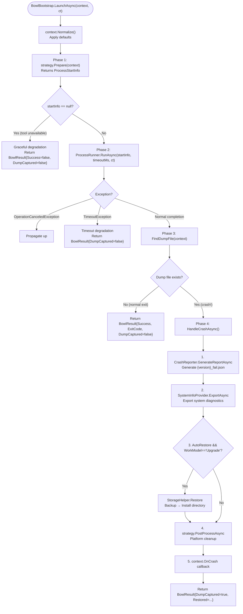
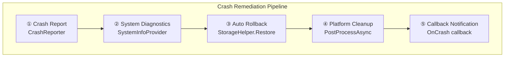

# GeneralUpdate.Bowl — Execution Flow Deep Dive

> **Target Audience:** Developers who need to understand Bowl's crash surveillance mechanism
>
> **After reading you will understand:**
> - Bowl's role and responsibilities in the GeneralUpdate upgrade closed loop
> - The complete execution chain from LaunchAsync to crash handling completion
> - The two-phase design of ProcDump process monitoring (Prepare → Run)
> - Dump file detection logic and crash determination rules
> - The five-step remediation pipeline when a crash is detected (Report → Diagnostics → Rollback → Cleanup → Callback)
> - Behavioral differences between Upgrade and Normal modes
> - Cross-platform strategy adaptation (Windows / Linux / macOS)
> - Graceful degradation and fault tolerance design

---

## Table of Contents

1. [Architecture Overview](#1-architecture-overview)
2. [Entry Point: BowlBootstrap's Dependency Injection Design](#2-entry-point-bowlbootstraps-dependency-injection-design)
3. [BowlContext: Immutable Execution Context](#3-bowlcontext-immutable-execution-context)
4. [LaunchAsync: Monitoring Main Flow](#4-launchasync-monitoring-main-flow)
5. [Phase 1: Strategy.Prepare — Platform Strategy Preparation](#5-phase-1-strategyprepare--platform-strategy-preparation)
6. [Phase 2: ProcessRunner — Child Process Execution & Timeout Control](#6-phase-2-processrunner--child-process-execution--timeout-control)
7. [Phase 3: FindDumpFile — Dump Detection & Crash Determination](#7-phase-3-finddumpfile--dump-detection--crash-determination)
8. [Phase 4: HandleCrashAsync — Crash Remediation Pipeline](#8-phase-4-handlecrashasync--crash-remediation-pipeline)
9. [Upgrade vs Normal: Two Working Modes](#9-upgrade-vs-normal-two-working-modes)
10. [Platform Strategy Adaptation: Windows / Linux / macOS](#10-platform-strategy-adaptation-windows--linux--macos)
11. [Fault Tolerance & Graceful Degradation](#11-fault-tolerance--graceful-degradation)
12. [Integration with GeneralUpdate.Core](#12-integration-with-generalupdatecore)
13. [Key Code Path Index](#13-key-code-path-index)

---

## 1. Architecture Overview

### 1.1 Bowl's Position in the Upgrade Closed Loop

Bowl is the **last line of defense** in the GeneralUpdate upgrade closed loop. It does not participate in downloading, extracting, or replacing files — those are Core's responsibilities. Bowl's only job is: after new version files are deployed and the main process starts, monitor whether the target process crashes during startup.

```
┌──────────────────────────────────────────────────────────────┐
│                  GeneralUpdate Upgrade Closed Loop             │
│                                                              │
│  ┌──────────┐    ┌──────────┐    ┌──────────┐    ┌─────────┐│
│  │ Core     │───▶│ Upgrade  │───▶│ Launch   │───▶│  Bowl   ││
│  │ Download │    │ Apply    │    │ New Ver  │    │ Crash   ││
│  │ +Verify  │    │ Patches  │    │ Main App │    │ Guard   ││
│  └──────────┘    └──────────┘    └──────────┘    └────┬────┘│
│                                                       │     │
│                                          ┌────────────▼───┐ │
│                                          │ Normal Exit→OK │ │
│                                          │ Crash→Remediate│ │
│                                          └────────────────┘ │
└──────────────────────────────────────────────────────────────┘
```

### 1.2 Three-Layer Dependency Architecture

Bowl uses a **Strategy + Reporter + Diagnostics** three-layer DI design:

```
┌──────────────────────────────────────────────────────────┐
│                BowlBootstrap (Orchestration Layer)         │
│                                                          │
│  ┌──────────────────┐  ┌──────────────┐  ┌────────────┐ │
│  │ IBowlStrategy    │  │ICrashReporter│  │ISystemInfo  │ │
│  │ Platform monitor │  │ Crash report │  │ Provider    │ │
│  │ strategy         │  │ generation   │  │ System diag │ │
│  └────────┬─────────┘  └──────┬───────┘  └─────┬──────┘ │
│           │                   │                 │        │
│  ┌────────▼─────────┐  ┌──────▼───────┐  ┌─────▼──────┐ │
│  │WindowsBowl       │  │ CrashReporter│  │WindowsSystem│ │
│  │Strategy          │  │ → JSON report│  │InfoProvider │ │
│  │(procdump.exe)    │  │              │  │(export.bat) │ │
│  ├──────────────────┤  └──────────────┘  ├────────────┤ │
│  │LinuxBowlStrategy │                    │LinuxSystem │ │
│  │(procdump pkg)    │                    │InfoProvider│ │
│  ├──────────────────┤                    └────────────┘ │
│  │MacBowlStrategy   │                                    │
│  │(lldb)            │                                    │
│  └──────────────────┘                                    │
└──────────────────────────────────────────────────────────┘
```

### 1.3 Core Design Principles

| Principle | Description |
|-----------|-------------|
| **Monitor Only, No Update** | Bowl never downloads, extracts, or replaces files — only monitors process crash status |
| **Strategy Pattern** | `IBowlStrategy` encapsulates platform differences: ProcDump for Windows/Linux, lldb for macOS |
| **Graceful Degradation** | Failure of any step does not block subsequent steps — report failure won't prevent rollback, rollback failure won't prevent callback |
| **Crash = Dump Exists** | The sole criterion for crash determination is whether a dump file exists |
| **Immutable Context** | `BowlContext` is a `readonly record struct`, normalized via `Normalize()` |

### 1.4 Two Working Modes

| Mode | WorkModel | Behavior |
|------|-----------|----------|
| **Upgrade** | `"Upgrade"` | Monitor new version startup → auto-rollback on crash → mark failed version → set env var |
| **Normal** | `"Normal"` | Standalone monitoring → generate reports and diagnostics on crash → no auto-rollback → no failure marking |

---

## 2. Entry Point: BowlBootstrap's Dependency Injection Design

`BowlBootstrap` provides two constructors: a parameterless one for auto-wiring defaults, and a three-parameter one for DI injection.

### 2.1 Dual Constructors

```csharp
// Out of the box: auto-detect platform strategy + default reporter/diagnostics provider
public BowlBootstrap()
    : this(
        StrategyFactory.Create(),        // Auto-select based on RuntimeInformation
        new CrashReporter(),             // JSON crash report
        SystemInfoProviderFactory.Create()) // Platform system diagnostics
{ }

// DI friendly: all dependencies replaceable and mockable
internal BowlBootstrap(
    IBowlStrategy strategy,
    ICrashReporter crashReporter,
    ISystemInfoProvider systemInfoProvider)
{
    _strategy = strategy;
    _crashReporter = crashReporter;
    _systemInfoProvider = systemInfoProvider;
}
```

### 2.2 Strategy Factory Decision Tree

```
StrategyFactory.Create()
  │
  ├── IsWindows()  ──▶ WindowsBowlStrategy
  │                     Uses procdump.exe / procdump64.exe
  │                     Attaches to target process via -e flag
  │
  ├── IsLinux()    ──▶ LinuxBowlStrategy
  │                     Probes procdump availability
  │                     Auto-detects distro (deb/rpm)
  │                     Installs procdump package on demand
  │
  └── IsMacOS()    ──▶ MacBowlStrategy
                        Uses /usr/bin/lldb
                        Limited by SIP and debug permissions
```

---

## 3. BowlContext: Immutable Execution Context

`BowlContext` is a `readonly record struct` carrying all surveillance parameters. Defaults are applied via `Normalize()`.

### 3.1 Core Fields

| Field | Type | Default | Description |
|-------|------|---------|-------------|
| `ProcessNameOrId` | `string` | — **(required)** | Target process name or PID |
| `TargetPath` | `string` | — | Target installation path |
| `FailDirectory` | `string` | `TargetPath/fails/` | Dump and report output directory |
| `BackupDirectory` | `string` | `TargetPath/.backups/latest/` | Backup directory (rollback source in Upgrade mode) |
| `DumpFileName` | `string` | `{processName}.dmp` | Expected dump file name |
| `TimeoutMs` | `int` | `30000` (30s) | Monitoring timeout |
| `DumpType` | `DumpType` | `Full` | Dump type: Full / Mini / Heap |
| `WorkModel` | `string` | `"Upgrade"` | Working mode: Upgrade / Normal |
| `AutoRestore` | `bool` | `true` | Auto-rollback backup on crash |
| `ExtendedField` | `string` | — | Extended field (typically stores version) |
| `OnCrash` | `Func<CrashInfo, CT, Task>` | `null` | Crash callback |

---

## 4. LaunchAsync: Monitoring Main Flow

`LaunchAsync` is Bowl's only public method, encapsulating the complete chain from strategy preparation to crash remediation.

### 4.1 Full Flow Diagram



---

## 5. Phase 1: Strategy.Prepare — Platform Strategy Preparation

The `Prepare` method's responsibility is to construct the `ProcessStartInfo` needed to launch the ProcDump (or lldb) child process based on platform differences. **If the tool is unavailable, return `null` for graceful degradation.**

### 5.1 WindowsBowlStrategy

```csharp
// Windows strategy: select the correct procdump architecture version
public ProcessStartInfo? Prepare(BowlContext context)
{
    var procDumpPath = GetProcDumpPath(); // Choose based on process bitness
    if (!File.Exists(procDumpPath))
        return null; // Tool missing → graceful degradation

    return new ProcessStartInfo
    {
        FileName = procDumpPath,
        Arguments = $"-e -ma -accepteula {context.ProcessNameOrId} {dumpOutputPath}",
        // -e: capture unhandled exceptions only
        // -ma: Full Dump
        // -accepteula: auto-accept EULA
    };
}
```

### 5.2 LinuxBowlStrategy

```csharp
// Linux strategy: probe procdump availability, attempt auto-install if missing
public ProcessStartInfo? Prepare(BowlContext context)
{
    if (!IsProcDumpAvailable())
    {
        var installed = TryInstallProcDump(); // Detect distro, run install.sh or package manager
        if (!installed) return null; // Install failed → graceful degradation
    }

    return new ProcessStartInfo
    {
        FileName = "procdump",
        Arguments = $"-e -ma {context.ProcessNameOrId} {dumpOutputPath}"
    };
}
```

---

## 6. Phase 2: ProcessRunner — Child Process Execution & Timeout Control

`ProcessRunner` is an async wrapper responsible for launching the child process, collecting output, and waiting for exit or timeout.

### 6.1 Execution Model

```
ProcessRunner.RunAsync(startInfo, timeoutMs, ct)
  │
  ├── Process.Start(startInfo)
  │     RedirectStandardOutput = true
  │     RedirectStandardError = true
  │
  ├── Concurrent execution:
  │     Task 1: process.WaitForExitAsync(ct)  → Wait for process exit
  │     Task 2: Task.Delay(timeoutMs, ct)     → Timeout timer
  │
  ├── Collect stdout/stderr lines → List<string> OutputLines
  │
  └── Return ProcessExitResult { ExitCode, OutputLines }
```

---

## 7. Phase 3: FindDumpFile — Dump Detection & Crash Determination

The crash determination logic is extremely simple:

```csharp
private static string? FindDumpFile(BowlContext context)
{
    var path = Path.Combine(context.FailDirectory, context.DumpFileName);
    return File.Exists(path) ? path : null;
}
```

**Core rule: Dump file exists = Crash, No dump file = Normal exit.**

This design leverages ProcDump's `-e` flag behavior — ProcDump only generates a dump file when the target process encounters an unhandled exception. If the process exits normally, ProcDump produces no files, thus never triggering the crash handling flow.

---

## 8. Phase 4: HandleCrashAsync — Crash Remediation Pipeline

When a dump file is detected, the five-step remediation pipeline starts:



### 8.1 Step 1: Generate Crash Report

```csharp
// CrashReporter.GenerateReportAsync
// Output: {FailDirectory}/{version}_fail.json
var crashReportPath = await _crashReporter.GenerateReportAsync(
    context, exitResult.OutputLines, ct);
```

Report contents: monitoring parameter snapshot, ProcDump output lines, timestamp.

**Fault tolerance:** Report generation failure does not block subsequent steps — exceptions are caught and logged.

### 8.2 Step 2: Export System Diagnostics

```csharp
await _systemInfoProvider.ExportAsync(context.FailDirectory, ct);
```

**Windows:** Runs built-in `export.bat` collecting driver list, system info, recent event logs.
**Linux/macOS:** Collects `dmesg`, `journalctl`, and other system logs.

**Fault tolerance:** Diagnostic export failure does not block subsequent steps.

### 8.3 Step 3: Auto Rollback (Upgrade mode only)

```csharp
if (context.AutoRestore && context.WorkModel == "Upgrade")
{
    StorageHelper.Restore(context.BackupDirectory, context.TargetPath);
    restored = true;
}
```

`StorageHelper.Restore` copies backup directory contents over the install directory.

**Preconditions:** `AutoRestore = true` (default), `WorkModel = "Upgrade"`, backup directory must exist.

### 8.4 Step 4: Platform Cleanup

```csharp
await _strategy.PostProcessAsync(context, exitResult, ct);
```

Platform-specific: Windows cleans temp ProcDump files, Linux terminates residual procdump processes, macOS cleans lldb session files.

### 8.5 Step 5: Callback Notification

```csharp
if (context.OnCrash != null)
{
    var crashInfo = new CrashInfo
    {
        DumpFilePath = dumpPath,
        CrashReportPath = crashReportPath,
        Version = context.ExtendedField,
        ExitCode = exitResult.ExitCode,
    };
    await context.OnCrash(crashInfo, ct);
}
```

---

## 9. Upgrade vs Normal: Two Working Modes

| Dimension | Upgrade Mode | Normal Mode |
|-----------|-------------|------------|
| **Use Case** | Post-upgrade startup health check | General process crash monitoring |
| **Crash Report** | ✅ Generated | ✅ Generated |
| **System Diagnostics** | ✅ Exported | ✅ Exported |
| **Auto Rollback** | ✅ `StorageHelper.Restore` | ❌ Skipped |
| **Failed Version Mark** | ✅ Write `UpgradeFail` | ❌ Not marked |
| **Environment Variable** | ✅ Set `GU_UPGRADE_FAIL` | ❌ Not set |
| **OnCrash Callback** | ✅ Invoked | ✅ Invoked |

---

## 10. Platform Strategy Adaptation: Windows / Linux / macOS

| Dimension | Windows | Linux | macOS |
|-----------|---------|-------|-------|
| **Monitor Tool** | `procdump.exe` / `procdump64.exe` | `procdump` (deb/rpm) | `/usr/bin/lldb` |
| **Tool Acquisition** | Bundled in NuGet | Auto-detect + `install.sh` | System built-in |
| **Dump Args** | `-e -ma` | `-e -ma` | lldb script |
| **Arch Selection** | Auto x86/x64/ARM64 by process | Not differentiated | Not differentiated |
| **Permissions** | Admin (debug privilege) | root (ptrace) | SIP authorization |
| **System Diagnostics** | `export.bat`: drivers/sysinfo/events | `dmesg` / `journalctl` | `sysdiagnose` |

---

## 11. Fault Tolerance & Graceful Degradation

Bowl's design philosophy: **no single component failure should prevent other components from executing.**

### Degradation Levels

```
Level 0: Strategy cannot prepare tooling
  → Return BowlResult{Success=false, DumpCaptured=false}
  → No crash, no exception thrown

Level 1: Child process timeout
  → Return BowlResult{DumpCaptured=false}
  → Treated as "no crash captured", no rollback

Level 2: Report generation failure
  → Logged, continue to next step

Level 3: System diagnostics failure
  → Logged, continue to next step

Level 4: Auto rollback failure
  → Logged, continue to callback

Level 5: OnCrash callback exception
  → Logged, does not affect BowlResult return
```

---

## 12. Integration with GeneralUpdate.Core

### 12.1 Call Timing

Bowl should be called after Core completes file replacement and before launching the new version:

```csharp
var bowlContext = new BowlContext
{
    ProcessNameOrId = "MyApp",
    TargetPath = installPath,
    BackupDirectory = backupPath,
    WorkModel = "Upgrade",
    ExtendedField = newVersion,
    AutoRestore = true,
    OnCrash = async (info, ct) =>
    {
        await UploadCrashReportAsync(info, ct);
    }
};

var bowl = new BowlBootstrap();
var result = await bowl.LaunchAsync(bowlContext);
```

### 12.2 Shared State with Core

| State Channel | Writer | Reader | Purpose |
|---------------|--------|--------|---------|
| `{version}_fail.json` | Bowl | Core + Business | Persistent crash report |
| Env var `GU_UPGRADE_FAIL` | Bowl | Core | Failed version skip |
| `.backups/` directory | Core (create) | Bowl (rollback) | Backup & restore |

---

## 13. Key Code Path Index

| Component | File | Key Methods |
|-----------|------|-------------|
| Entry Orchestrator | `BowlBootstrap.cs` | `LaunchAsync()` → `HandleCrashAsync()` |
| Execution Context | `BowlContext.cs` | `Normalize()` |
| Crash Reporter | `Internal/CrashReporter.cs` | `GenerateReportAsync()` |
| System Diagnostics | `Internal/WindowsSystemInfoProvider.cs` | `ExportAsync()` |
| File Rollback | `FileSystem/StorageHelper.cs` | `Restore()` |
| Windows Strategy | `Strategies/WindowsBowlStrategy.cs` | `Prepare()` / `PostProcessAsync()` |
| Linux Strategy | `Strategies/LinuxBowlStrategy.cs` | `Prepare()` / `PostProcessAsync()` |
| Mac Strategy | `Strategies/MacBowlStrategy.cs` | `Prepare()` / `PostProcessAsync()` |
| Process Runner | `Strategies/ProcessRunner.cs` | `RunAsync()` |
| Strategy Factory | `Strategies/StrategyFactory.cs` | `Create()` |
| Crash DTO | `Internal/Crash.cs` | — |
| Dump Type | `DumpType.cs` | `Full` / `Mini` / `Heap` |
| Logger | `Tracer/GeneralTracer.cs` | `Info()` / `Warn()` / `Error()` |
