# GeneralUpdate.Core — Execution Flow Deep Dive

> **Target Audience:** Developers new to GeneralUpdate.Core
>
> **After reading you will understand:**
> - Overall architecture and layered design of the update system
> - Complete execution chain from app startup to update completion
> - Responsibilities of the Client and Upgrade processes
> - Selection logic and execution differences between Chain (diff) and Full packages
> - Middleware pipeline design and working principles
> - Automatic Full fallback mechanism when Chain fails
> - How IPC communication delivers update tasks across processes
> - Silent Mode delayed-update design intent

---

## Table of Contents

1. [Architecture Overview](#1-architecture-overview)
2. [Entry Point: Bootstrap's Dual Identity Design](#2-entry-point-bootstraps-dual-identity-design)
3. [ClientStrategy: Complete Update Flow](#3-clientstrategy-complete-update-flow)
4. [DownloadPlanBuilder: Download Planning & Chain/Full Decision](#4-downloadplanbuilder-download-planning--chainfull-decision)
5. [Download Engine: DefaultDownloadOrchestrator](#5-download-engine-defaultdownloadorchestrator)
6. [Middleware Pipeline: Hash → Compress → Patch](#6-middleware-pipeline-hash--compress--patch)
7. [DiffPipeline: Differential Engine Internals](#7-diffpipeline-differential-engine-internals)
8. [Chain→Full Fallback Mechanism](#8-chainfull-fallback-mechanism)
9. [IPC Communication Protocol](#9-ipc-communication-protocol)
10. [UpdateStrategy: Upgrade Process Execution Flow](#10-updatestrategy-upgrade-process-execution-flow)
11. [Silent Mode: Delayed Upgrade Mechanism](#11-silent-mode-delayed-upgrade-mechanism)
12. [OS Strategy Platform Differences](#12-os-strategy-platform-differences)
13. [Error Recovery Panorama](#13-error-recovery-panorama)
14. [Key Code Path Index](#14-key-code-path-index)

---

## 1. Architecture Overview

### 1.1 Three-Layer Architecture

GeneralUpdate.Core adopts a **three-layer dispatch + two-engine** design:

```
┌──────────────────────────────────────────────────────────┐
│                   Layer 1: Entry Dispatch                  │
│              GeneralUpdateBootstrap                       │
│    Dispatches to role strategies based on AppType         │
├──────────────────────────────────────────────────────────┤
│                   Layer 2: Role Strategy                   │
│  ┌─────────────┐  ┌──────────────┐  ┌───────────────┐    │
│  │ClientStrategy│  │UpdateStrategy│  │ OssStrategy   │    │
│  │  Download+   │  │  Read IPC+   │  │   OSS Mode    │    │
│  │  Dispatch    │  │  Apply       │  │               │    │
│  └──────┬──────┘  └──────┬───────┘  └───────┬───────┘    │
│         │                │                  │             │
│         └────────────────┼──────────────────┘             │
│                          ▼                                │
│                    Layer 3: OS Strategy                    │
│  ┌──────────────┐ ┌─────────────┐ ┌─────────────┐        │
│  │WindowsStrategy│ │LinuxStrategy│ │ MacStrategy │        │
│  └──────┬───────┘ └──────┬──────┘ └──────┬──────┘        │
│         │                │               │                │
│         └────────────────┼───────────────┘                │
│                          ▼                                │
│              Middleware Pipeline (per-version)              │
│              Hash → Compress → Patch                      │
├──────────────────────────────────────────────────────────┤
│                   Two Engines                              │
│  ┌─────────────────────┐  ┌─────────────────────────┐     │
│  │  Download Engine     │  │  Differential Engine    │     │
│  │  DefaultDownload     │  │  DiffPipeline          │     │
│  │  Orchestrator        │  │  + HDiffPatch          │     │
│  │  + Retry Policy      │  │  + Parallel Patch Apply│     │
│  └─────────────────────┘  └─────────────────────────┘     │
└──────────────────────────────────────────────────────────┘
```

### 1.2 Core Design Principles

| Principle | Description |
|-----------|-------------|
| **Client Unified Download** | All packages (Client + Upgrade + Chain + Full ZIPs) are downloaded at once by the Client process to `%TEMP%/main_temp/` |
| **Upgrade Applies Only** | The Upgrade process makes no network requests; it receives version info via encrypted IPC file and only runs the middleware pipeline |
| **Chain Fallback** | When Chain (diff) package application fails, it automatically retries with a pre-downloaded Full package in-place — no second server request needed |
| **Middleware Pipeline** | Each version runs independently through the `Hash → Compress → Patch` pipeline — single responsibility, testable, replaceable |

### 1.3 Two Package Types

| Type | PackageType | Content | Application Method |
|------|-------------|---------|-------------------|
| **Chain (Diff)** | 1 | `.patch` binary diff files + added files + delete manifest | Extract to temp `PatchPath` → combine old installed files + .patch via HDiffPatch to produce new files |
| **Full** | 2 | Complete application files | Directly extract over install directory, skipping PatchMiddleware |

### 1.4 Two Process Roles

| Process | AppType | Entry Strategy | Responsibilities |
|---------|---------|----------------|-----------------|
| Main app (e.g. `MyApp.exe`) | `Client` | `ClientStrategy` | Server version check, download all packages at once, self-upgrade (Upgrade package), write IPC file, launch Upgrade process, exit |
| Updater (e.g. `Updater.exe`) | `Upgrade` | `UpdateStrategy` | Read IPC file for version info, run pipeline to upgrade main app files, write back manifest, launch main app, exit |

---

## 2. Entry Point: Bootstrap's Dual Identity Design

`GeneralUpdateBootstrap` is the entry point for the entire update library. Its constructor attempts to read the IPC file **before any other method is called**.

### 2.1 Constructor as IPC Probe

```csharp
public GeneralUpdateBootstrap()
{
    InitializeFromEnvironment(); // Reads encrypted IPC file
}
```

What `InitializeFromEnvironment()` does:

```csharp
void InitializeFromEnvironment()
{
    var provider = new EncryptedFileProcessContractProvider();
    var contract = provider.Receive();  // Read %TEMP%/GeneralUpdate/ipc/process_info.enc

    if (contract == null) return; // No IPC file → this is not an Upgrade process

    // IPC file found → this is an Upgrade process
    // Fill internal config with IPC info
    _configInfo.UpdateAppName = contract.AppName;
    _configInfo.InstallPath = contract.InstallPath;
    _configInfo.UpdateVersions = contract.UpdateVersions;
    // ... other fields
}
```

### 2.2 LaunchAsync Dispatch

```
                    ┌─────────────────────────┐
                    │   Constructor           │
                    │   InitializeFromEnv()   │
                    └────────────┬────────────┘
                                 │
                    ┌────────────┴────────────┐
                    │   Read IPC file         │
                    └────────────┬────────────┘
                                 │
                    ┌────────────┴────────────┐
                    │   Has IPC?              │
                    └────────────┬────────────┘
                         │               │
                         No              Yes
                         │               │
                   ┌─────▼──┐      ┌──────▼─────┐
                   │No IPC  │      │Has IPC     │
                   │data    │      │data filled │
                   └────┬───┘      └──────┬─────┘
                        │                 │
                   ┌────▼────┐      ┌─────▼────┐
                   │SetConfig│      │ LaunchAsy│
                   │or       │      │ nc(AppTyp│
                   │SetSource│      │ e.Upgrade)│
                   │fill cfg │      │ → Update │
                   └────┬────┘      │ Strategy │
                        │           └──────────┘
                   ┌────▼────┐
                   │ LaunchAs│
                   │ync(AppTy│
                   │pe.Client│
                   │)→Client │
                   │Strategy │
                   └─────────┘
```

### 2.3 Key Insight

**The same `GeneralUpdateBootstrap` type follows completely different execution paths in the two processes:**

```
Client process:
  new GeneralUpdateBootstrap()
    → InitializeFromEnvironment() → No IPC file → _configInfo is empty
  .SetConfig(request)             → _configInfo set from user code
  .LaunchAsync(AppType.Client)    → ClientStrategy

Upgrade process:
  new GeneralUpdateBootstrap()
    → InitializeFromEnvironment() → IPC file found → _configInfo pre-filled
  .LaunchAsync(AppType.Upgrade)   → UpdateStrategy (uses config filled in constructor)
```

**This means the Upgrade process needs no command-line arguments or configuration files.** All information is passed via the IPC file.

---

## 3. ClientStrategy: Complete Update Flow

`ClientStrategy` is the most complex role strategy, responsible for the entire chain from version check to launching the upgrade process.

### 3.1 Complete Flow Diagram

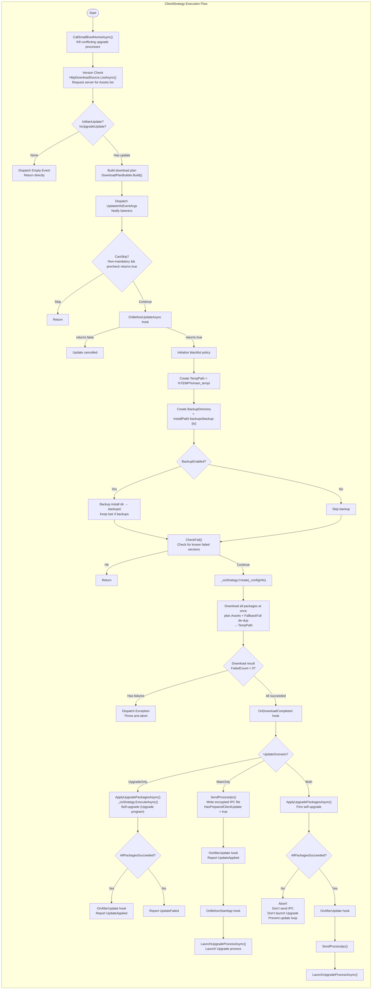

### 3.2 Step Details

#### Step 1: Clean Up Conflicting Processes (CallSmallBowlHomeAsync)

```csharp
// ClientStrategy.cs:985-1002
// Before starting the update, kill any running upgrade processes (Bowl)
// Prevent them from holding file locks that could block backup or replacement
private async Task CallSmallBowlHomeAsync(string processName)
{
    var processes = Process.GetProcessesByName(processName);
    foreach (var process in processes)
        await GracefulExit.ShutdownAsync(process);
}
```

#### Step 2: Version Check

```csharp
// Build download source (default HTTP)
var downloadSource = new HttpDownloadSource(
    _configInfo.UpdateUrl,           // Server URL
    _configInfo.ClientVersion,       // Current main app version
    _configInfo.UpgradeClientVersion, // Current upgrade program version
    _configInfo.AppSecretKey,        // App secret key
    GetPlatform(),                   // Platform type
    // ... other parameters
);

// Request server for available updates
var sourceResult = await downloadSource.ListAsync();
```

The server returns `List<DownloadAsset>`, each Asset containing:
- `Name`: Package name, also the ZIP filename (e.g. `1.0.1`)
- `Version`: Version number
- `Url`: Download URL
- `SHA256`: Hash for verification
- `Size`: File size
- `PackageType`: 1=Chain, 2=Full
- `AppType`: 1=Client, 2=Upgrade
- `IsFreeze`: Whether frozen (frozen packages don't participate in updates)
- `IsForcibly`: Whether forced update
- `MinClientVersion`: Minimum compatible version
- `FallbackFullName/Url/Hash/Version`: Corresponding fallback full package info

#### Step 3: Scenario Determination

```csharp
var scenario = (_configInfo.IsMainUpdate, _configInfo.IsUpgradeUpdate) switch
{
    (false, false) => UpdateScenario.None,         // No update needed
    (false, true)  => UpdateScenario.UpgradeOnly,   // Only upgrade program needs update
    (true, false)  => UpdateScenario.MainOnly,      // Only main app needs update
    (true, true)   => UpdateScenario.Both,          // Both need updating
};
```

#### Step 4: Backup

```csharp
// Backup install directory to .backups/
StorageManager.Backup(_configInfo.InstallPath, _configInfo.BackupDirectory, blacklist);
// Clean old backups, keep only the most recent 3
StorageManager.CleanBackup(_configInfo.InstallPath, keepVersions: 3);
```

Default blacklist excludes: `.backups`, `.git`, `.svn`, `bin`, `obj`, `node_modules`, etc.

#### Step 5: Download All Packages at Once

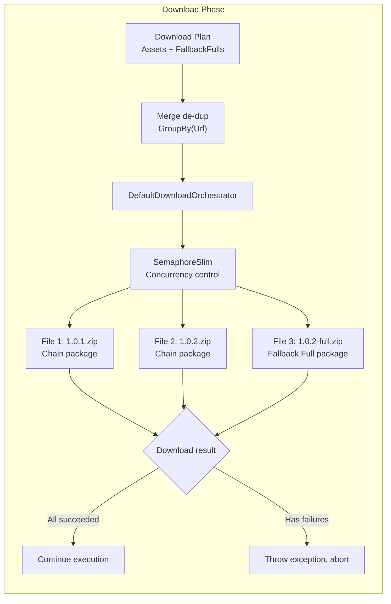

```csharp
// ClientStrategy.cs:589-597
// Merge chain packages and fallback packages, de-dup, download at once
var allAssets = plan.Assets.Concat(plan.FallbackFulls)
                          .GroupBy(a => a.Url)
                          .Select(g => g.First())
                          .ToList();
var mergedPlan = new DownloadPlan(allAssets, plan.IsForcibly);
var downloadReport = await ExecuteDownloadAsync(mergedPlan);

if (downloadReport.FailedCount > 0)
    throw new InvalidOperationException("Download failed!");
```

**Key point:** Chain packages and their Fallback Full packages are **downloaded simultaneously** — there is no two-phase retry of "download chain first, then download full on failure." This design provides better UX: on download failure, the entire batch can be retried immediately instead of one-by-one.

#### Step 6: Scenario Dispatch

Execution paths for the three scenarios:

```
┌─────────────────────────────────────────────────────────────────┐
│ UpgradeOnly                                                      │
│                                                                  │
│  ApplyUpgradePackagesAsync()                                     │
│    ↓                                                             │
│  _osStrategy.Create(_configInfo)                                 │
│    ↓                                                             │
│  _osStrategy.ExecuteAsync()                                      │
│    ↓                                                             │
│  OS strategy runs Hash → Compress → Patch for each upgrade version│
│    ↓                                                             │
│  AllPackagesSucceeded → WriteBackUpgradeVersion()                │
└─────────────────────────────────────────────────────────────────┘

┌─────────────────────────────────────────────────────────────────┐
│ MainOnly                                                         │
│                                                                  │
│  SendProcessIpc()                                                │
│    ↓                                                             │
│  Write AES-encrypted IPC file to %TEMP%/GeneralUpdate/ipc/process_info.enc│
│    ↓                                                             │
│  LaunchUpgradeProcessAsync()                                     │
│    ↓                                                             │
│  Launch Upgrade process → current Client process continues or exits │
└─────────────────────────────────────────────────────────────────┘

┌─────────────────────────────────────────────────────────────────┐
│ Both                                                             │
│                                                                  │
│  ApplyUpgradePackagesAsync()  ─── self-upgrade first             │
│    ↓ abort on failure                                            │
│  SendProcessIpc()              ─── then write IPC                │
│    ↓                                                             │
│  LaunchUpgradeProcessAsync()   ─── finally launch Upgrade process │
└─────────────────────────────────────────────────────────────────┘
```

---

## 4. DownloadPlanBuilder: Download Planning & Chain/Full Decision

`DownloadPlanBuilder` is a static utility class responsible for determining which packages to download from the server's Asset list.

### 4.1 Complete Decision Flow

```mermaid
flowchart TB
    subgraph BUILDER["DownloadPlanBuilder.Build()"]
        IN["Assets List\nfrom server ListAsync()"] --> F1["Filter IsFreeze\nExclude frozen packages"]

        F1 --> F2["Check IsForcibly\nMark entire plan as forced if any"]

        F2 --> F3["Filter versions by AppType\n• Client packages → vs ClientVersion\n• Upgrade packages → vs UpgradeVersion\n• Keep only pv > localVersion"]

        F3 --> F4["MinClientVersion compat check\ncur >= min to allow update"]

        F4 --> F5["Sort ascending by version\nApply from smallest to largest"]

        F5 --> SPLIT{"Separate Chain and Full"}

        SPLIT --> CHAIN_LIST["Chain Candidates\nPackageType=1 or Unspecified"]
        SPLIT --> FULL_LIST["Full Candidates\nPackageType=2"]

        CHAIN_LIST --> DECIDE{Both present?}
        FULL_LIST --> DECIDE

        DECIDE -- "Chain only" --> ONLY_CHAIN["Return DownloadPlan(Chain)\nNo fallback packages"]
        DECIDE -- "Full only" --> ONLY_FULL["Return DownloadPlan(Full)"]

        DECIDE -- "Both present" --> SIZE_CHECK{"All Chain packages\ntotal size\n>= 80% of BestFull?"}

        SIZE_CHECK -- Yes --> SWITCH_FULL["Strategy: diff no longer beneficial\nUse the largest Full package\nSkip all Chain packages"]
        SWITCH_FULL --> RETURN_FULL["Return DownloadPlan(BestFull)"]

        SIZE_CHECK -- No --> MATCH_FALLBACK["Strategy: diff saves bandwidth\nFor each Chain package\nmatch a Full package as fallback"]

        MATCH_FALLBACK --> MATCH_DETAIL["Matching rules:\n1. Same AppType\n2. Full version >= Chain version\n3. Take the smallest compatible version"]

        MATCH_DETAIL --> BUILD_PLAN["Build DownloadPlan\n• Assets = Chain packages (with FallbackFull* attached)\n• FallbackFulls = matched Full packages, de-duplicated"]

        BUILD_PLAN --> RETURN_CHAIN["Return"]
    end
```

### 4.2 Package Switch Threshold Logic

Core code for the 80% threshold:

```csharp
// DownloadPlanBuilder.cs:174-196
if (chainCandidates.Count > 0 && fullCandidates.Count > 0)
{
    // Take the largest-version Full package as reference
    var bestFull = fullCandidates.OrderByDescending(v => v).First();

    // Calculate total size of Chain packages for the same AppType
    long chainTotal = chainCandidates
        .Where(a => a.AppType == bestFull.AppType)
        .Sum(a => a.Size);

    // If Chain total >= 80% of Full
    if (chainTotal >= (long)(bestFull.Size * 0.8))
    {
        // Use Full package directly — less to download, more reliable
        return new DownloadPlan(new[] { bestFull }, isForcibly);
    }
}
```

**Why this threshold?**

| Scenario | Chain size | Full size | Ratio | Decision | Reason |
|----------|-----------|-----------|-------|----------|--------|
| Only a few lines changed | 1 MB | 50 MB | 2% | Chain | Diff saves 98% bandwidth |
| Large file changes | 42 MB | 50 MB | 84% | **Full** | Diff saves only 16%, not worth the complexity and risk |
| Many new files | 35 MB | 50 MB | 70% | Chain | Saves 30%, worthwhile |

### 4.3 Fallback Package Matching Rules

When total Chain size < 80% of Full size, use Chain + FallbackFull mode:

```csharp
// DownloadPlanBuilder.cs:204-237
var chainWithFallback = chainCandidates.Select(chain =>
{
    // Find the smallest Full package with same AppType and version >= chain version
    var match = fullCandidates
        .Where(f => f.AppType == chain.AppType)
        .OrderBy(f => f.Version)           // Smallest version first
        .FirstOrDefault(f => f.Version >= chain.Version);

    if (match != null)
    {
        // Attach FallbackFull metadata to this Chain package
        return chain with
        {
            FallbackFullName    = match.Name,
            FallbackFullUrl     = match.Url,
            FallbackFullHash    = match.SHA256,
            FallbackFullVersion = match.Version
        };
    }
    return chain; // No matching Full package — no fallback capability
});
```

---

## 5. Download Engine: DefaultDownloadOrchestrator

### 5.1 Architecture

```
ClientStrategy
     │
     ▼
IDownloadOrchestrator (interface)
     │
     ├── DefaultDownloadOrchestrator (default implementation)
     │       │
     │       ├── IDownloadPolicy      → Retry policy (backoff algorithm)
     │       ├── IDownloadExecutor    → Actual HTTP download
     │       └── IDownloadPipeline    → Post-download processing (SHA256 verification)
     │
     └── Custom Orchestrator (replaceable)
```

### 5.2 Execution Logic

```mermaid
flowchart TB
    subgraph ORCH["DefaultDownloadOrchestrator.ExecuteAsync()"]
        O_IN["DownloadPlan + TempPath"] --> O_CONCUR["Determine concurrency\n• Serial mode → 1\n• Normal mode → Clamp(Options, 1, CPU*2)"]

        O_CONCUR --> O_SEM["Create SemaphoreSlim(concurrency)"]

        O_SEM --> O_LOOP["For each DownloadAsset"]

        O_LOOP --> O_WAIT["Wait for Semaphore slot\nTimeout 1 minute"]

        O_WAIT -- "Timeout" --> O_FAIL["Mark as failed"]

        O_WAIT -- "Got slot" --> O_NAME["Resolve filename\n{Name}{Format}\ne.g. 1.0.1.zip"]

        O_NAME --> O_HTTP["HttpDownloadExecutor.DownloadAsync()\nSupports HTTP Range resume"]

        O_HTTP --> O_VERIFY["Post-download pipeline\nDefault = SHA256 verification"]

        O_VERIFY --> O_CHECK{"Hash matches?"}

        O_CHECK -- "Match" --> O_OK["Mark success"]
        O_CHECK -- "Mismatch" --> O_RETRY["Trigger retry policy\nExponential backoff\nDefault max 3 retries"]

        O_RETRY --> O_HTTP
        O_RETRY -- "Retries exhausted" --> O_FAIL

        O_OK --> O_RELEASE["Release Semaphore"]
        O_FAIL --> O_RELEASE

        O_RELEASE --> O_NEXT["Next Asset"]

        O_NEXT --> O_REPORT["All Assets complete\nAggregate DownloadReport\nSuccessCount / FailedCount"]
    end
```

### 5.3 Key Design Points

**Resume Download:** Uses HTTP Range headers — if a download is interrupted, only the missing portion is re-downloaded.

**Retry Policy:**
- Default max 3 retries
- Interval = `RetryInterval * 2^(N-1)` (exponential backoff)
- Default initial interval 1 second

**Concurrency Control:**
- `DiffMode.Serial` → forces serial execution
- Normal mode → `Clamp(MaxConcurrency, 1, Environment.ProcessorCount * 2)`

---

## 6. Middleware Pipeline: Hash → Compress → Patch

The middleware pipeline is the core processing pattern of GeneralUpdate.Core. Each version runs through the complete pipeline independently.

### 6.1 Pipeline Construction

The pipeline is built by the OS strategy:

```csharp
// WindowsStrategy.cs
protected override PipelineBuilder BuildPipeline(PipelineContext context)
{
    var needsPatch = context.Get<bool>("PatchEnabled")
                    && context.Get<int>("PackageType") != (int)PackageType.Full;

    return new PipelineBuilder(context)
        .UseMiddleware<HashMiddleware>()       // 1. Integrity verification
        .UseMiddleware<CompressMiddleware>()   // 2. Extraction
        .UseMiddlewareIf<PatchMiddleware>(     // 3. Diff application (Chain packages only)
            needsPatch: needsPatch);
}
```

### 6.2 PipelineContext: Data Contract Between Middleware

`PipelineContext` is a `ConcurrentDictionary<string, object>`. All middleware exchange data through it:

| Key | Writer | Consumer | Description |
|-----|--------|----------|-------------|
| `ZipFilePath` | AbstractStrategy | HashMiddleware, CompressMiddleware | Full ZIP path `TempPath/{name}.zip` |
| `Hash` | AbstractStrategy | HashMiddleware | Expected SHA256 |
| `Format` | AbstractStrategy | CompressMiddleware | Compression format (currently only Zip) |
| `Encoding` | AbstractStrategy | CompressMiddleware | File encoding |
| `SourcePath` | AbstractStrategy | CompressMiddleware, PatchMiddleware | Install directory |
| `PatchPath` | AbstractStrategy | CompressMiddleware, PatchMiddleware | Chain package temp extract directory |
| `PatchEnabled` | AbstractStrategy | OS strategy (during BuildPipeline) | Whether diff is enabled |
| `PackageType` | AbstractStrategy | OS strategy, CompressMiddleware | 1=Chain, 2=Full |
| `DiffPipeline` | AbstractStrategy | PatchMiddleware | Parallel diff engine |

### 6.3 Chain vs Full Execution Differences

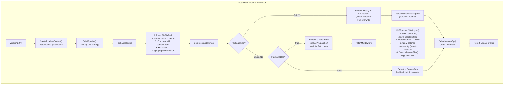

### 6.4 Middleware Implementation Details

#### HashMiddleware

```csharp
public async Task InvokeAsync(PipelineContext context)
{
    var zipPath = context.Get<string>("ZipFilePath");
    var expectedHash = context.Get<string>("Hash");

    var actualHash = ComputeSHA256(zipPath); // Compute ZIP file SHA256

    if (!string.Equals(actualHash, expectedHash, StringComparison.OrdinalIgnoreCase))
        throw new CryptographicException("File hash mismatch!");
}
```

#### CompressMiddleware

```csharp
public async Task InvokeAsync(PipelineContext context)
{
    var packageType = context.Get<int>("PackageType");
    var zipPath = context.Get<string>("ZipFilePath");
    var sourcePath = context.Get<string>("SourcePath");
    var patchPath = context.Get<string>("PatchPath");
    var patchEnabled = context.Get<bool>("PatchEnabled");
    var format = context.Get<Format>("Format");
    var encoding = context.Get<Encoding>("Encoding");

    if (packageType == (int)PackageType.Full)
    {
        // Full package → extract directly to install directory
        CompressProvider.Decompress(zipPath, sourcePath, format, encoding);
    }
    else if (patchEnabled)
    {
        // Chain package + patch enabled → extract to PatchPath
        CompressProvider.Decompress(zipPath, patchPath, format, encoding);
    }
    else
    {
        // Chain package + patch disabled → fall back to full extract
        CompressProvider.Decompress(zipPath, sourcePath, format, encoding);
    }
}
```

#### PatchMiddleware

```csharp
public async Task InvokeAsync(PipelineContext context)
{
    var sourcePath = context.Get<string>("SourcePath");
    var patchPath = context.Get<string>("PatchPath");
    var diffPipeline = context.Get<DiffPipeline>("DiffPipeline");

    // Invoke diff engine to apply patches
    await diffPipeline.DirtyAsync(sourcePath, patchPath,
        progress: new DiffProgressReporter(this),
        cancellationToken: CancellationToken.None);
}
```

### 6.5 Pipeline Main Loop

The OS strategy (`AbstractStrategy`) iterates through all versions and runs the pipeline:

```csharp
// AbstractStrategy.cs:149-287
public async Task ExecuteAsync()
{
    foreach (var version in _configinfo.UpdateVersions)
    {
        var context = CreatePipelineContext(version, patchPath);
        var pipelineBuilder = BuildPipeline(context);
        await pipelineBuilder.Build(); // Run middleware pipeline
        DeleteVersionZip(version);    // Delete processed ZIP
    }
}
```

**Note:** A failure in one version does not affect processing of other versions. However, the `AllPackagesSucceeded` flag tells the caller whether any version failed.

---

## 7. DiffPipeline: Differential Engine Internals

`DiffPipeline` is GeneralUpdate's differential engine, providing two operation modes:
- **CleanAsync**: Server-side — compares old and new version directories, generates `.patch` files
- **DirtyAsync**: Client-side — applies `.patch` files to an installed directory

### 7.1 Main Flow

```mermaid
flowchart TB
    subgraph CLEAN["CleanAsync — Server generates patches"]
        C_IN["sourcePath (old version dir)\ntargetPath (new version dir)\npatchPath (output dir)"]

        C_IN --> C_VALIDATE["ValidateDirectories()\nVerify all three directories exist"]

        C_VALIDATE --> C_COMPARE["_cleanMatcher.Compare(source, target)\n→ DifferentNodes (changed files)\n→ LeftNodes (old version file index)"]

        C_COMPARE --> C_SEM["SemaphoreSlim(MaxDegreeOfParallelism)\nDefault parallelism = 2"]

        C_SEM --> C_LOOP["For each changed file"]

        C_LOOP --> C_MATCH["_cleanMatcher.Match(file, leftNodes)\nFind corresponding file in old version"]

        C_MATCH --> C_FOUND{"Old file found?"}

        C_FOUND -- "Has old file" --> C_HASH{"HashEquals(old, new)?"}
        C_HASH -- "Hash matches" --> C_SKIP["Skip — content unchanged\nNo patch generated"]
        C_HASH -- "Different" --> C_SIZE["ValidateFileSize()\nCheck MaxInputFileSize limit"]
        C_SIZE --> C_DIFF["_binaryDiffer.CleanAsync(\n  old, new, tempPatchPath, ct)\n→ Generate .patch file\nDefault = HDiffPatch algorithm"]

        C_FOUND -- "No old file" --> C_COPY["File.Copy(new → patchPath)\nNew file copied directly"]

        C_COPY --> C_PROGRESS["report Progress\nInterlocked.Increment → DiffProgress"]
        C_DIFF --> C_PROGRESS
        C_SKIP --> C_PROGRESS

        C_PROGRESS --> C_NEXT["Next file"]

        C_NEXT --> C_EXCEPT["_cleanMatcher.Except(source, target)\nFind files present in old but deleted in new"]

        C_EXCEPT --> C_DELETE_JSON["Serialize generalupdate.delete.json\nEach record:\n  relative path\n  SHA256 hash"]
    end
```

```mermaid
flowchart TB
    subgraph DIRTY["DirtyAsync — Client applies patches"]
        D_IN["appPath (installed old version dir)\npatchPath (patch dir)"]

        D_IN --> D_DELETE["HandleDeleteList()"]

        D_DELETE --> D_DEL_FIND["Find in patchPath\ngeneralupdate.delete.json"]
        D_DEL_FIND --> D_DEL_PARSE["Deserialize → List<FileNode>"]
        D_DEL_PARSE --> D_DEL_HASH["Build SHA256 HashSet\nO(1) matching"]

        D_DEL_HASH --> D_DEL_SCAN["Scan appPath files\n(excluding .patch files)"]
        D_DEL_SCAN --> D_DEL_CHECK{"File SHA256\nin HashSet?"}

        D_DEL_CHECK -- Yes --> D_DEL_EXEC["File.SetAttributes(Normal)\nFile.Delete()"]
        D_DEL_CHECK -- No --> D_DEL_SKIP["Skip"]

        D_DEL_EXEC --> D_MATCH
        D_DEL_SKIP --> D_MATCH

        D_MATCH["_dirtyMatcher.Match(oldFile, patchFiles)\nMatch each install dir file with a .patch file"]

        D_MATCH --> D_SEM["SemaphoreSlim(MaxDegreeOfParallelism)"]

        D_SEM --> D_LOOP["For each match pair\n(oldFile, patchFile)"]

        D_LOOP --> D_APPLY["ApplyPatch(oldFile, patchFile)"]

        D_APPLY --> D_TEMP["Generate random temp file path\nPath.Combine(dir, RandomFileName_oldFileName)"]

        D_TEMP --> D_BIN["_binaryDiffer.DirtyAsync(\n  oldFilePath, tempPath, patchFilePath, ct)\nHDiffPatch reverse apply"]

        D_BIN --> D_ATOMIC["Atomic replace"]
        D_ATOMIC --> D_ATOMIC_1["1. File.SetAttributes(old, Normal)"]
        D_ATOMIC_1 --> D_ATOMIC_2["2. File.Delete(old)"]
        D_ATOMIC_2 --> D_ATOMIC_3["3. File.Move(temp, old)"]

        D_ATOMIC --> D_PROGRESS["report Progress"]

        D_PROGRESS --> D_NEXT["Next file"]

        D_NEXT --> D_UNKNOWN["CopyUnknownFiles(appPath, patchPath)"]

        D_UNKNOWN --> D_UNKNOWN_CMP["Compare appPath vs patchPath\nFind files in patchPath not in appPath"]
        D_UNKNOWN_CMP --> D_UNKNOWN_FILTER["Exclude blacklisted formats\nLike .patch, .json"]
        D_UNKNOWN_FILTER --> D_UNKNOWN_PATH["Compute relative path\nStartsWith + Substring\nAnti Path Traversal"]
        D_UNKNOWN_PATH --> D_UNKNOWN_COPY["Same temp → atomic replace strategy"]
        D_UNKNOWN_COPY --> D_UNKNOWN_CLEANUP["Delete patchPath directory"]
    end
```

### 7.2 Atomic Replace Strategy (ApplyPatch)

```csharp
private async Task ApplyPatch(string appFilePath, string patchFilePath, CancellationToken ct)
{
    // 1. Generate random temp filename
    var tempPath = Path.Combine(
        Path.GetDirectoryName(appFilePath)!,
        $"{Path.GetRandomFileName()}_{Path.GetFileName(appFilePath)}");

    // 2. Apply HDiffPatch → write to temp file
    await _binaryDiffer.DirtyAsync(appFilePath, tempPath, patchFilePath, ct);

    // 3. Atomic replace
    if (File.Exists(tempPath))
    {
        File.SetAttributes(appFilePath, FileAttributes.Normal); // Handle read-only files
        File.Delete(appFilePath);                                // Delete original
        File.Move(tempPath, appFilePath);                        // Temp → final location
    }
}
```

**Why atomic replace?**

```
❌ Direct overwrite:
   Process crashes mid-write → file partially corrupted → app won't start

✅ Temp file strategy:
   1. Write completely to temp file (if crash, original file is intact)
   2. Delete original file
   3. Move temp file to final location
   If crash between steps 2 and 3 → file may be missing
   But this is safe for future updates — next update will re-download
```

### 7.3 Delete File Identification Strategy

Deletion is matched by file content SHA256 hash, not by filename:

```csharp
// Read the list of deleted file hashes from generalupdate.delete.json
// Scan the current install directory, compute SHA256 for each file
// If match → delete

var deleteHashes = new HashSet<string>(/* read from JSON */);
foreach (var file in appFiles)
{
    var fileHash = hashAlgorithm.ComputeHash(file.FullName);
    if (deleteHashes.Contains(fileHash))
        File.Delete(file.FullName);
}
```

**Benefit:** Even if a file is renamed, it won't be deleted as long as its content hasn't changed.

### 7.4 Parallel Control

```csharp
using var semaphore = new SemaphoreSlim(_options.MaxDegreeOfParallelism); // Default=2

var tasks = matchedPairs.Select(pair => Task.Run(async () =>
{
    await semaphore.WaitAsync(ct);
    try
    {
        await ApplyPatch(...);
    }
    catch (Exception ex) when (!_options.StopOnFirstError)
    {
        // StopOnFirstError=false (default) → individual file failure doesn't block everything
        // Report error through Progress, continue processing other files
    }
    finally
    {
        semaphore.Release();
    }
}));

await Task.WhenAll(tasks);
```

---

## 8. Chain→Full Fallback Mechanism

This is GeneralUpdate.Core's most advanced fault-tolerance mechanism, implemented in `AbstractStrategy.ExecuteAsync()`.

### 8.1 Complete Flow

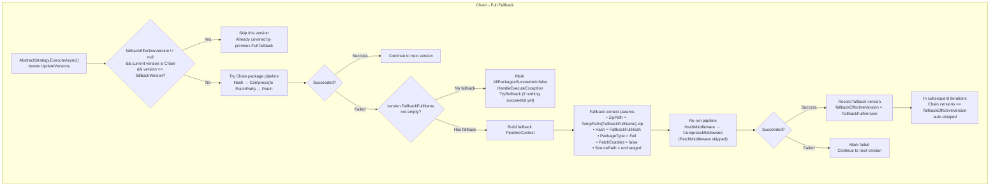

### 8.2 Version Tracking to Skip Subsequent Chain Packages

```csharp
// AbstractStrategy.cs:168-185
SemVersion? fallbackEffectiveVersion = null;

foreach (var version in _configinfo.UpdateVersions)
{
    // If a Full fallback was previously applied
    // Skip all Chain packages <= that version
    if (fallbackEffectiveVersion != null
        && version.PackageType == (int)PackageType.Chain
        && versionSv <= fallbackEffectiveVersion)
    {
        continue; // Already covered, skip
    }

    try
    {
        await pipelineBuilder.Build(); // Chain attempt
    }
    catch when (version.PackageType == Chain && FallbackFullName != null)
    {
        // Chain failed → retry with Full
        await fallbackBuilder.Build();
        fallbackEffectiveVersion = ffv; // Record fallback version
    }
}
```

### 8.3 Edge Case Examples

**Scenario: 3 Chain packages, all fall back to the same Full package**

```
Version list: 1.0.1(chain), 1.0.2(chain), 1.0.3(chain)
Full package: 1.0.3-full (FallbackFull for all chain packages)

Execution:
1. 1.0.1 chain → failed → fallback to 1.0.3-full → fallbackEffectiveVersion = 1.0.3
2. 1.0.2 chain → skip (1.0.2 <= 1.0.3)
3. 1.0.3 chain → skip (1.0.3 <= 1.0.3)
```

**Scenario: Some Chain packages fail, each has a different Full package**

```
Version list: 1.0.1(chain, fallback=1.0.1-full), 1.0.2(chain, fallback=1.0.2-full)
Execution:
1. 1.0.1 chain → success → continue
2. 1.0.2 chain → failed → fallback to 1.0.2-full → fallbackEffectiveVersion = 1.0.2
```

**Scenario: Chain packages succeed, no fallback needed**

```
Version list: 1.0.1(chain), 1.0.2(chain)
Execution:
1. 1.0.1 chain → success
2. 1.0.2 chain → success
→ fallbackEffectiveVersion stays null, nothing to skip
```

---

## 9. IPC Communication Protocol

IPC (Inter-Process Communication) is the data transfer mechanism between the Client process and the Upgrade process.

### 9.1 Communication Flow

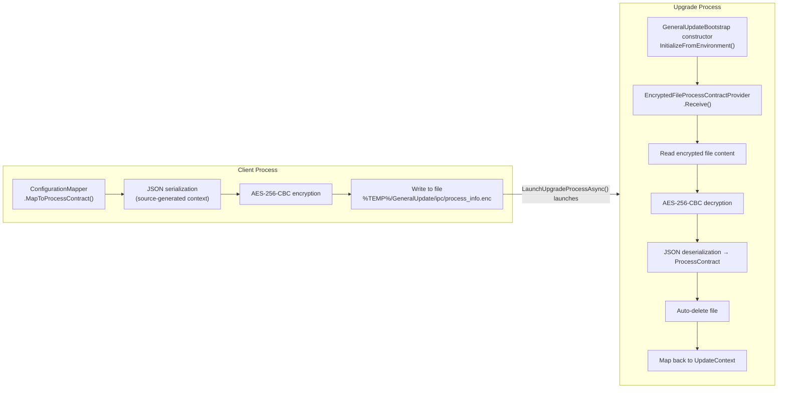

### 9.2 Encryption Details

```csharp
// IpcEncryption.cs
// Uses AES-256-CBC encryption
// Key: SHA256("GeneralUpdate.ProcessContract.IPC.v1") → 32 bytes
// IV:   Fixed 16 bytes (starts with 0x47, rest 0x00)
// File path: %TEMP%/GeneralUpdate/ipc/process_info.enc

public static void EncryptToFile(byte[] plainBytes, string filePath, byte[] key, byte[] iv)
{
    using var aes = Aes.Create();
    aes.Key = key;
    aes.IV = iv;
    using var encryptor = aes.CreateEncryptor();
    var cipher = encryptor.TransformFinalBlock(plainBytes, 0, plainBytes.Length);

    // FileShare.Read allows the receiver to start reading before writing completes
    using var fs = new FileStream(filePath, FileMode.Create, FileAccess.Write, FileShare.Read);
    fs.Write(cipher, 0, cipher.Length);
}
```

### 9.3 ProcessContract Field Mapping

| ProcessContract | Source | Meaning | Consumer |
|----------------|--------|---------|----------|
| `UpdateAppName` | `_configInfo.MainAppName` | Name of the program to launch after update | OS strategy's StartAppAsync |
| `InstallPath` | `_configInfo.InstallPath` | Install directory | Pipeline's SourcePath |
| `CurrentVersion` | `_configInfo.ClientVersion` | Current main app version | Logging/reporting |
| `LastVersion` | `_configInfo.LastVersion` | Target version | Logging/reporting |
| `UpdateVersions` | `clientVersions` list | List of packages to apply | Pipeline input |
| `TempPath` | `main_temp` directory | Directory containing ZIP files | Pipeline's ZipFilePath |
| `UpdatePath` | `_configInfo.UpdatePath` | Upgrade program directory | Path resolution |
| `Encoding` | `_configInfo.Encoding` | File encoding | CompressMiddleware |
| `CompressFormat` | `_configInfo.Format` | Compression format | CompressMiddleware |
| `DownloadTimeOut` | `_configInfo.DownloadTimeOut` | Download timeout | Orchestrator (reserved) |
| `BackupDirectory` | `_configInfo.BackupDirectory` | .backups directory | Logging/reporting |
| `ReportUrl` | `_configInfo.ReportUrl` | Status report URL | UpdateStrategy |
| `LaunchClientAfterUpdate` | `_configInfo.LaunchClientAfterUpdate` | Whether to auto-launch main app after update | UpdateStrategy |
| `ReportType` | 1 or 2 | 1=active polling 2=push notification | Report type differentiation |

---

## 10. UpdateStrategy: Upgrade Process Execution Flow

`UpdateStrategy` is the strategy for the Upgrade process. Its biggest difference from `ClientStrategy`: **it makes zero network requests**.

### 10.1 Complete Flow

```mermaid
flowchart TB
    subgraph UPGRADE_EXEC["UpdateStrategy Execution Flow"]
        START["GeneralUpdateBootstrap constructor\nInitializeFromEnvironment() reads IPC"] --> OK{"IPC file valid?"}
        OK -- No --> EXIT_WAIT["Exit and wait\n(not an Upgrade process)"]
        OK -- Yes --> LAUNCH["LaunchAsync(AppType.Upgrade)"]

        LAUNCH --> OS_CREATE["_osStrategy.Create(_configInfo)"]

        OS_CREATE --> HOOK_BEFORE["OnBeforeUpdateAsync hook"]
        HOOK_BEFORE --> HOOK_R{"Returns false?"}
        HOOK_R -- Yes --> EXIT_CANCEL["Cancel update"]
        HOOK_R -- No --> EXECUTE["_osStrategy.ExecuteAsync()"]

        EXECUTE --> PIPELINE["For each Client version\nrun middleware pipeline in loop"]

        PIPELINE --> CHK_RESULT{"AllPackagesSucceeded?"}

        CHK_RESULT -- Yes --> WRITE_MANIFEST["Write back generalupdate.manifest.json\nUpdate ClientVersion"]

        WRITE_MANIFEST --> HOOK_AFTER["OnAfterUpdate hook"]

        HOOK_AFTER --> HOOK_START["OnBeforeStartApp hook"]
        HOOK_START --> LAUNCH_APP["_osStrategy.StartAppAsync()\nLaunch main app"]

        LAUNCH_APP --> GRACEFUL["GracefulExit.CurrentProcessAsync()\nUpgrade process exits"]

        CHK_RESULT -- No --> SKIP_LAUNCH["Skip main app launch\nPrevent update loop"]
    end
```

### 10.2 Why Doesn't the Upgrade Process Make Network Requests?

```csharp
// UpdateStrategy.cs core logic
public async Task ExecuteAsync()
{
    // No IDownloadSource.ListAsync() call
    // No IDownloadOrchestrator.ExecuteAsync() call
    // All data is already in _configInfo, from the IPC file

    // Directly run the pipeline
    _osStrategy.Create(_configInfo);
    await _osStrategy.ExecuteAsync();

    // Check result
    if ((_osStrategy as AbstractStrategy)?.AllPackagesSucceeded == true)
    {
        // Write back manifest
        ManifestInfo.TryUpdateVersion(installPath, clientVersion: latestVersion);
        // Launch main app
        await _osStrategy.StartAppAsync();
    }
    // If failed → don't write manifest, don't launch main app
    // Next Client start will re-detect the update
}
```

**Design Intent:** The Upgrade process is a "short-lived, one-shot process."
- It doesn't need network capability (smaller binary size)
- It doesn't need to know the server address (security: smaller attack surface)
- It only needs to read local files and perform file operations

### 10.3 Preventing Update Loops

`AllPackagesSucceeded` is an important safety gate:

```
Client process                       Upgrade process
     │                                    │
     ├─ Version check: 1.0.0 → 1.0.1     │
     ├─ Download 1.0.1.zip               │
     ├─ IPC → launch Upgrade ──────→     │
     │                                    ├─ Apply 1.0.1 → ✅ success
     │                                    ├─ Write manifest: 1.0.1
     │                                    └─ Launch main app 1.0.1
     │                                         │
     └── Old process exits ←─────────────────┘
                                               │
                                          New version main app starts
                                          Version is already latest
```

If Upgrade process fails:

```
Upgrade process
     ├─ Apply 1.0.1 → ❌ failed
     ├─ AllPackagesSucceeded = false
     ├─ Don't write manifest (version still 1.0.0)
     └─ Don't launch main app

    Next Client start:
     ├─ Version check: 1.0.0 → 1.0.1 (still needs update)
     └─ Try again
```

---

## 11. Silent Mode: Delayed Upgrade Mechanism

Silent Mode is a variant of the standard update flow — the only difference is **the timing of launching the Upgrade process changes from "immediately" to "on process exit."**

### 11.1 Standard Mode vs Silent Mode

```
Standard mode:
  [Download → IPC → Launch Upgrade → Exit] → Upgrade runs → Launch main app

Silent mode:
  [Download → IPC → User continues working → Process exits → Launch Upgrade] → Upgrade runs → Launch main app
```

Silent mode follows the same flow, just split into two phases:

```
PollLoopAsync (background thread):
  ClientStrategy.ExecuteAsync() → HasPreparedClientUpdate = true → IPC written → loop exits
  (User is completely unaware, continues using the app normally)

AppDomain.ProcessExit (on process exit):
  SilentPollOrchestrator.OnProcessExit → LaunchUpgradeProcessSync()
  → Upgrade process starts → applies update → version updated on next launch
```

### 11.2 Complete Flow Diagram

```mermaid
flowchart TB
    subgraph SILENT["Silent Mode Complete Timeline"]

        S_START["GeneralUpdateBootstrap\n.LaunchSilentAsync()"] --> S_SETUP["Create SilentPollOrchestrator\nstrategy.LaunchAfterPrepare = false"]

        S_SETUP --> S_REGISTER["Register AppDomain.ProcessExit\nevent handler"]
        S_REGISTER --> S_BG["Start background PollLoopAsync\nTask.Run"]

        subgraph BG_LOOP["Background polling thread"]
            LOOP_CHECK["Check CancellationToken\n&& _prepared == 0"]

            LOOP_CHECK --> LOOP_EXEC["ClientStrategy.ExecuteAsync()\nFull run: check→download→IPC"]

            LOOP_EXEC --> LOOP_PREP{"HasPreparedClientUpdate?"}

            LOOP_PREP -- "Yes" --> LOOP_DONE["_prepared = 1\nIPC file written\nExit loop"]

            LOOP_PREP -- "No" --> LOOP_WAIT["Task.Delay(PollInterval)\nDefault 1 hour"]

            LOOP_WAIT --> LOOP_CHECK
        end

        LOOP_DONE --> S_WAIT["App runs normally\nUser unaware"]
        S_WAIT --> S_EXIT["App exits"]

        S_EXIT --> PROCESS_EXIT["AppDomain.ProcessExit triggered"]

        PROCESS_EXIT --> ON_EXIT["OnProcessExit()"]

        ON_EXIT --> CHECK{"._prepared == 1\n&& _updaterStarted == 0?"}

        CHECK -- Yes --> LAUNCH_SYNC["ClientStrategy.LaunchUpgradeProcessSync()"]

        LAUNCH_SYNC --> SYNC_STEPS["1. Run OnBeforeStartApp hook\n2. Resolve upgrade program path with OS strategy\n3. Process.Start(Upgrade.exe)\n4. Don't call GracefulExit (process already exiting)"]

        SYNC_STEPS --> UPGRADE_START["Upgrade process starts\nRead IPC → apply update → launch main app on next start"]
    end
```

### 11.3 TryLaunchUpgrade — Fallback Method

```csharp
// SilentPollOrchestrator.cs:187-210
// If AppDomain.ProcessExit is unreliable (e.g., Ctrl+C)
// Can manually call this method to launch the upgrade process
public bool TryLaunchUpgrade()
{
    if (_prepared != 1 || Interlocked.Exchange(ref _updaterStarted, 1) == 1)
        return false;

    _strategy.LaunchUpgradeProcessSync();
    return true;
}
```

---

## 12. OS Strategy Platform Differences

| Aspect | Windows | Linux | macOS |
|--------|---------|-------|-------|
| **Pipeline Building** | `Hash→Compress→Patch(IfNeeded)` | Same | Same |
| **Launch Main App** | Launch app + optional Bowl daemon → `GracefulExit.CurrentProcessAsync()` | Launch app only → `GracefulExit` | Launch app only, additional `File.Exists` check |
| **Path Case Sensitivity** | Case-insensitive | Case-sensitive | Case-insensitive (APFS default) |
| **Bowl Support** | ✅ Supports crash daemon | ❌ | ❌ |

Bowl is a Windows-only crash daemon process. When the main app exits unexpectedly, Bowl can detect this and re-launch it. During the update flow, Bowl is killed first by `CallSmallBowlHomeAsync()` in ClientStrategy to avoid file locks.

---

## 13. Error Recovery Panorama

| Error Scenario | Catch Location | Handling | Consequence |
|---------------|----------------|----------|-------------|
| **Download failure** | `ClientStrategy.DownloadAndApplyAsync()` | Check `FailedCount > 0`, throw exception | Bubbles up to `ExecuteAsync()` catch → triggers error hook + reports failure |
| **Chain pipeline fails (has FallbackFull)** | `AbstractStrategy.ExecuteAsync()` catch when | **Rebuild PipelineContext**, set PackageType=Full, re-run Hash→Compress | Update succeeds eventually, `fallbackEffectiveVersion` records fallback version |
| **Chain pipeline fails (no FallbackFull)** | `AbstractStrategy.ExecuteAsync()` catch | `AllPackagesSucceeded=false`, triggers `HandleExecuteException`, `TryRollback()` if nothing succeeded yet | That version fails, continue next version |
| **Fallback Full also fails** | `AbstractStrategy.ExecuteAsync()` catch (inner try) | `AllPackagesSucceeded=false`, continue next version | That version fails |
| **Upgrade package fails (Both scenario)** | `ClientStrategy.cs` Both branch | **Abort** IPC sending + Upgrade process launch | Prevents Upgrade process from getting stale TempPath |
| **Upgrade process pipeline fails** | `UpdateStrategy.ExecuteAsync()` | `AllPackagesSucceeded=false`, skip manifest write-back, skip main app launch | Next Client start re-detects the update |
| **Rollback fails** | `AbstractStrategy.TryRollback()` | Log only, doesn't block | Install directory may be in inconsistent state |
| **ZIP hash mismatch** | `HashMiddleware` | `CryptographicException` | Version pipeline fails immediately, triggers Chain→Full fallback or version failure |
| **File locked** | `IpcEncryption.DecryptFromFile()` | Catch `IOException`, return null | IPC file not ready, Upgrade process waits or exits |

### Rollback Logic

```csharp
// AbstractStrategy.cs:504-532
private void TryRollback()
{
    // Only called when "no version has succeeded in this batch yet"
    // If a version has already been successfully applied and overwritten files,
    // rolling back would undo valid work, causing cross-version downgrade

    if (!_appliedAnyVersion)
    {
        // Try to restore from .backups/
        StorageManager.Restore(backupDir, _configInfo.InstallPath);
    }
}
```

---

## 14. Key Code Path Index

| Step | File | Key Line |
|------|------|----------|
| Entry dispatch | `Bootstrap/GeneralUpdateBootstrap.cs` | `LaunchAsync()` @L125 |
| Upgrade path IPC reading | `Bootstrap/GeneralUpdateBootstrap.cs` | `InitializeFromEnvironment()` @L357 |
| Client role full workflow | `Strategy/ClientStrategy.cs` | `ExecuteStandardWorkflowAsync()` @L396 |
| Scenario determination | `Strategy/ClientStrategy.cs` | Scenario switch @L452-458 |
| Batch download | `Strategy/ClientStrategy.cs` | `DownloadAndApplyAsync()` @L589-597 |
| Self-upgrade Upgrade package | `Strategy/ClientStrategy.cs` | `ApplyUpgradePackagesAsync()` @L723-737 |
| IPC write file | `Strategy/ClientStrategy.cs` | `SendProcessIpc()` @L751-765 |
| Launch Upgrade process | `Strategy/ClientStrategy.cs` | `LaunchUpgradeProcessAsync()` @L777-789 |
| Download plan building | `Download/DownloadPlanBuilder.cs` | `Build()` @L111 |
| Chain vs Full threshold decision | `Download/DownloadPlanBuilder.cs` | @L174-196 |
| Fallback package matching | `Download/DownloadPlanBuilder.cs` | @L200-238 |
| Default download orchestration | `Download/Orchestrators/DefaultDownloadOrchestrator.cs` | `ExecuteAsync()` |
| Parallel pipeline loop + Chain→Full fallback | `Strategy/AbstractStrategy.cs` | `ExecuteAsync()` @L149-287 |
| Pipeline context assembly | `Strategy/AbstractStrategy.cs` | `CreatePipelineContext()` @L322-346 |
| Windows pipeline building | `Strategy/WindowsStrategy.cs` | `BuildPipeline()` |
| Hash verification middleware | `Pipeline/HashMiddleware.cs` | `InvokeAsync()` |
| Extract middleware (chain/full branching) | `Pipeline/CompressMiddleware.cs` | `InvokeAsync()` |
| Patch application middleware | `Pipeline/PatchMiddleware.cs` | `InvokeAsync()` |
| Server-side diff generation | `Pipeline/DiffPipeline.cs` | `CleanAsync()` |
| Client-side diff application | `Pipeline/DiffPipeline.cs` | `DirtyAsync()` |
| Atomic replace | `Pipeline/DiffPipeline.cs` | `ApplyPatch()` |
| Delete file handling | `Pipeline/DiffPipeline.cs` | `HandleDeleteList()` |
| New file copying | `Pipeline/DiffPipeline.cs` | `CopyUnknownFiles()` |
| Encrypt write file | `Ipc/IpcEncryption.cs` | `EncryptToFile()` |
| Decrypt read file | `Ipc/IpcEncryption.cs` | `DecryptFromFile()` |
| IPC Provider | `Ipc/IProcessInfoProvider.cs` | `EncryptedFileProcessContractProvider` |
| ProcessContract definition | `Configuration/ProcessContract.cs` | All fields |
| Configuration mapping | `Configuration/ConfigurationMapper.cs` | `MapToProcessContract()` |
| Silent mode polling | `Silent/SilentPollOrchestrator.cs` | `PollLoopAsync()` @L116 |
| Silent mode exit launch | `Silent/SilentPollOrchestrator.cs` | `OnProcessExit()` @L156 |
| Upgrade role | `Strategy/UpdateStrategy.cs` | `ExecuteAsync()` |
| Pipeline context data contract | `Pipeline/PipelineContext.cs` | ConcurrentDictionary |
| OS strategy resolution | `Bootstrap/OsStrategyResolver.cs` | `Resolve()` / `GetPlatform()` |
| Event manager | `Event/EventManager.cs` | `Dispatch()` / `AddListener()` |
| Diff progress bridge | `Pipeline/DiffProgressReporter.cs` | `Report()` |

---

> This document covers the complete execution flow of GeneralUpdate.Core. If you find any inaccuracies or areas that need supplementing, please submit an Issue or PR.
