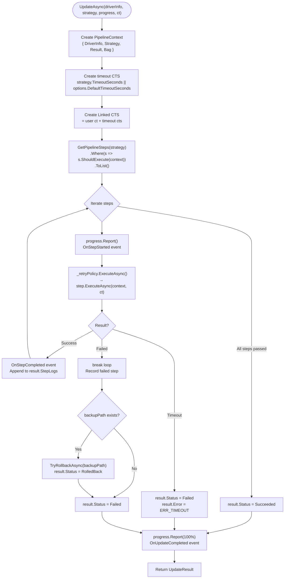

# GeneralUpdate.Drivelution — Execution Flow Deep Dive

> **Target Audience:** Developers who need to understand Drivelution's internal driver update engine
>
> **After reading you will understand:**
> - Drivelution's cross-platform abstraction architecture and factory pattern design
> - How `BaseDriverUpdater` template method orchestrates the unified pipeline
> - The complete chain: platform detection → permission check → validate → backup → install → verify → rollback
> - `IPipelineStep` composable pipeline design
> - Retry policy (RetryPolicy) and timeout control mechanisms
> - Platform differences: Windows (pnputil), Linux (insmod/dpkg/rpm), macOS (kextload/installer)
> - Batch update (BatchUpdateAsync) sequential/parallel execution modes
> - Exception-to-structured-ErrorInfo mapping mechanism

---

## Table of Contents

1. [Architecture Overview](#1-architecture-overview)
2. [Entry Point: GeneralDrivelution Static Facade](#2-entry-point-generaldrivelution-static-facade)
3. [Factory: DrivelutionFactory Platform Detection](#3-factory-drivelutionfactory-platform-detection)
4. [BaseDriverUpdater: Template Method Pipeline](#4-basedriverupdater-template-method-pipeline)
5. [IPipelineStep: Composable Pipeline Steps](#5-ipipelinestep-composable-pipeline-steps)
6. [Retry & Timeout: RetryPolicy & CancellationToken](#6-retry--timeout-retrypolicy--cancellationtoken)
7. [Platform Install Implementations: Windows / Linux / macOS](#7-platform-install-implementations-windows--linux--macos)
8. [Rollback Mechanism: TryRollbackAsync](#8-rollback-mechanism-tryrollbackasync)
9. [Batch Updates: BatchUpdateAsync](#9-batch-updates-batchupdateasync)
10. [Exception Mapping: MapExceptionToErrorInfo](#10-exception-mapping-mapexceptiontoerrorinfo)
11. [Key Code Path Index](#11-key-code-path-index)

---

## 1. Architecture Overview

### 1.1 Three-Layer Abstraction Design

Drivelution uses a **Facade → Template Method → Platform Implementation** three-layer abstraction:

```
┌──────────────────────────────────────────────────────────────┐
│                  Layer 1: Static Facade                        │
│                GeneralDrivelution                             │
│   Create() / QuickUpdateAsync() / ValidateAsync()             │
│   BatchUpdateAsync() / GetPlatformInfo()                      │
├──────────────────────────────────────────────────────────────┤
│                  Layer 2: Factory + Interface                  │
│  ┌────────────────────┐    ┌────────────────────────────┐    │
│  │ DrivelutionFactory │    │ IGeneralDrivelution        │    │
│  │ Platform detect →  │    │ UpdateAsync / ValidateAsync│    │
│  │ create instance    │    │ BackupAsync / RollbackAsync│    │
│  └────────┬───────────┘    └─────────────┬──────────────┘    │
│           │                              │                    │
│           └──────────────┬───────────────┘                    │
│                          ▼                                    │
│                  Layer 3: Platform Implementations             │
│  ┌────────────────┐ ┌──────────────┐ ┌──────────────────┐    │
│  │WindowsGeneral  │ │LinuxGeneral  │ │MacOsGeneral      │    │
│  │Drivelution     │ │Drivelution   │ │Drivelution       │    │
│  │pnputil.exe     │ │insmod/dpkg   │ │kextload/installer│    │
│  └────────────────┘ └──────────────┘ └──────────────────┘    │
│                                                              │
│            All implementations inherit BaseDriverUpdater       │
│            sharing unified pipeline orchestration logic       │
└──────────────────────────────────────────────────────────────┘
```

### 1.2 Core Design Principles

| Principle | Description |
|-----------|-------------|
| **Template Method** | `BaseDriverUpdater.UpdateAsync()` defines pipeline skeleton; subclasses implement `InstallCoreAsync()` |
| **Strategy Pattern** | `UpdateStrategy` controls backup, retry, timeout, restart behavior |
| **Factory Pattern** | `DrivelutionFactory.Create()` auto-detects OS and creates corresponding implementation |
| **Pipeline Pattern** | `IPipelineStep` composable, replaceable, skippable (`ShouldExecute`) |
| **Bag Context** | `PipelineContext.Bag` (Dictionary) shares intermediate data between steps |

### 1.3 Unified Pipeline

```
Windows:  [CheckPermissions] → Validate → Backup → Install → Verify
Linux:    [CheckSudo]        → Validate → Backup → Install → Verify
macOS:    [CheckPermissions] → Validate → Backup → Install → Verify
```

Each step has: conditional check (ShouldExecute) → execution (ExecuteAsync) → result evaluation → failure rollback.

---

## 2. Entry Point: GeneralDrivelution Static Facade

`GeneralDrivelution` is a **static facade class** providing all public APIs. It delegates to the factory to create platform implementations.

```csharp
public static class GeneralDrivelution
{
    static IGeneralDrivelution Create(DrivelutionOptions? options = null);
    static IGeneralDrivelution Create(IServiceProvider serviceProvider);
    static Task<UpdateResult> QuickUpdateAsync(DriverInfo, UpdateStrategy?, IProgress?, CT);
    static Task<bool> ValidateAsync(DriverInfo, CT);
    static Task<List<DriverInfo>> GetDriversFromDirectoryAsync(string path, string? pattern, CT);
    static Task<BatchUpdateResult> BatchUpdateAsync(IEnumerable<DriverInfo>, UpdateStrategy, BatchMode, IProgress?, CT);
    static PlatformInfo GetPlatformInfo();
}
```

### QuickUpdateAsync Default Strategy

```csharp
strategy ??= new UpdateStrategy
{
    RequireBackup = true,        // Backup enabled by default
    RetryCount = 3,              // 3 retries by default
    RetryIntervalSeconds = 5     // 5s interval by default
};
```

---

## 3. Factory: DrivelutionFactory Platform Detection

```csharp
public static IGeneralDrivelution Create(DrivelutionOptions? options = null)
{
    if (RuntimeInformation.IsOSPlatform(OSPlatform.Windows))
        return new WindowsGeneralDrivelution(options);
    if (RuntimeInformation.IsOSPlatform(OSPlatform.Linux))
        return new LinuxGeneralDrivelution(options);
    if (RuntimeInformation.IsOSPlatform(OSPlatform.OSX))
        return new MacOsGeneralDrivelution(options);
    throw new PlatformNotSupportedException("Current platform is not supported.");
}
```

---

## 4. BaseDriverUpdater: Template Method Pipeline

`BaseDriverUpdater` is the core of Drivelution. It implements `IGeneralDrivelution` and defines the complete update pipeline template.

### 4.1 UpdateAsync Full Flow



### 4.2 Template Method Hooks

The only required abstract method:

```csharp
protected abstract Task InstallCoreAsync(
    DriverInfo driverInfo, UpdateStrategy strategy, CancellationToken ct);
```

Optional virtual method overrides:

| Virtual Method | Default | Override Scenario |
|----------------|---------|-------------------|
| `GetPipelineSteps(strategy)` | `[Validate, Backup, Install, Verify]` | Windows inserts CheckPermissions, Linux inserts CheckSudo |
| `VerifyInstallationAsync(driverInfo, ct)` | `return true` | Platform-specific post-install verification |
| `GetDefaultSearchPattern()` | `"*.*"` | Windows returns `"*.inf"`, Linux returns `"*.ko"` |

---

## 5. IPipelineStep: Composable Pipeline Steps

```csharp
public interface IPipelineStep
{
    string StepName { get; }
    bool ShouldExecute(PipelineContext context);
    Task<PipelineResult> ExecuteAsync(PipelineContext context, CancellationToken ct);
}
```

Built-in steps via `DefaultPipelineSteps`:
- **ValidateStep:** Hash + signature + compatibility checks
- **BackupStep:** Backup current driver files
- **InstallStep:** Delegate to `InstallCoreAsync` (platform-specific)
- **VerifyStep:** Post-install verification (overridable)

---

## 6. Retry & Timeout: RetryPolicy & CancellationToken

### 6.1 Retry Policy

```csharp
public class RetryPolicy
{
    public int MaxRetries { get; init; }
    public int RetryIntervalMs { get; init; }
    public bool UseExponentialBackoff { get; init; }

    public async Task<PipelineResult> ExecuteAsync(
        Func<CancellationToken, Task<PipelineResult>> action, CancellationToken ct)
    {
        for (int attempt = 0; attempt <= MaxRetries; attempt++)
        {
            var result = await action(ct);
            if (result.Success) return result;
            if (attempt < MaxRetries)
            {
                var delay = UseExponentialBackoff
                    ? RetryIntervalMs * Math.Pow(2, attempt)
                    : RetryIntervalMs;
                await Task.Delay((int)delay, ct);
            }
        }
    }
}
```

### 6.2 Timeout Control

```csharp
using var timeoutCts = new CancellationTokenSource(TimeSpan.FromSeconds(timeoutSeconds));
using var linkedCts = CancellationTokenSource.CreateLinkedTokenSource(
    cancellationToken, timeoutCts.Token);
```

---

## 7. Platform Install Implementations

### 7.1 Windows: pnputil

```csharp
// pnputil /add-driver <inf file> /install
var result = await CommandRunner.RunAsync("pnputil.exe",
    $"/add-driver \"{driverInfo.FilePath}\" /install", ct);
```

### 7.2 Linux: Multiple Package Formats

```csharp
switch (Path.GetExtension(driverInfo.FilePath).ToLowerInvariant())
{
    case ".ko":  // Kernel module: insmod
    case ".deb": // Debian package: dpkg -i
    case ".rpm": // RPM package: dnf install (fallback rpm -ivh)
}
```

### 7.3 macOS: kext/dext/pkg

```csharp
switch (Path.GetExtension(driverInfo.FilePath).ToLowerInvariant())
{
    case ".kext": // Kernel extension: kextload
    case ".dext": // System extension (DriverKit): systemextensionsctl
    case ".pkg":  // Installer package: installer -pkg
}
```

### 7.4 CommandRunner: Safe Process Execution

Uses `ArgumentList` instead of string concatenation to prevent shell injection.

---

## 8. Rollback Mechanism: TryRollbackAsync

Triggered when a pipeline step fails AND a backup path exists (from a successful Backup step). Uses `CancellationToken.None` to ensure rollback can proceed even if the original operation timed out.

---

## 9. Batch Updates: BatchUpdateAsync

| Mode | Behavior |
|------|----------|
| `BatchMode.Sequential` | Updates drivers one by one in order |
| `BatchMode.Parallel` | Updates all drivers concurrently via `Task.WhenAll` |

Aggregated result: `SucceededCount`, `FailedCount`, `AllSucceeded`, `Duration`.

---

## 10. Exception Mapping: MapExceptionToErrorInfo

| Exception Type | Code | CanRetry |
|----------------|------|----------|
| `DriverPermissionException` | `ERR_PERM` | false |
| `DriverValidationException` | `ERR_VALID` | false |
| `DriverInstallationException` (can retry) | `ERR_INSTALL_RETRY` | true |
| `DriverBackupException` | `ERR_BACKUP` | false |
| `DriverRollbackException` | `ERR_ROLLBACK` | false |
| `OperationCanceledException` | `ERR_TIMEOUT` | true |

---

## 11. Key Code Path Index

| Component | File | Key Methods |
|-----------|------|-------------|
| Static Facade | `GeneralDrivelution.cs` | `Create()` / `QuickUpdateAsync()` / `BatchUpdateAsync()` |
| Factory | `Core/DrivelutionFactory.cs` | `Create()` |
| Template Method | `Core/Pipeline/BaseDriverUpdater.cs` | `UpdateAsync()` / `GetPipelineSteps()` |
| Pipeline Step Interface | `Core/Pipeline/IPipelineStep.cs` | `ShouldExecute()` / `ExecuteAsync()` |
| Built-in Steps | `Core/Pipeline/DefaultPipelineSteps.cs` | `CreateValidateStep()` / `CreateBackupStep()` |
| Retry Policy | `Core/Pipeline/RetryPolicy.cs` | `ExecuteAsync()` |
| Windows Impl | `Windows/Implementation/WindowsGeneralDrivelution.cs` | `InstallCoreAsync()` |
| Linux Impl | `Linux/Implementation/LinuxGeneralDrivelution.cs` | `InstallCoreAsync()` |
| macOS Impl | `MacOS/Implementation/MacOsGeneralDrivelution.cs` | `InstallCoreAsync()` |
| Command Runner | `Core/Execution/CommandRunner.cs` | `RunAsync()` |
