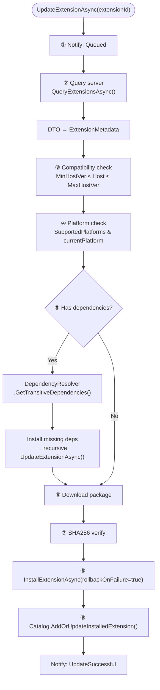

# GeneralUpdate.Extension — Execution Flow Deep Dive

> **Target Audience:** Developers who need to understand Extension's internal management engine
>
> **After reading you will understand:**
> - `GeneralExtensionHost`'s DI injection architecture and legacy compatibility mode
> - The complete nine-stage execution chain of `UpdateExtensionAsync`
> - DependencyResolver's topological sorting and circular dependency detection
> - Version compatibility checking and platform matching decision logic
> - `InstallExtensionAsync`'s backup → cleanup → extract → atomic write flow
> - Zip Slip path traversal protection implementation details
> - Extension Catalog's atomic write and crash-safe design
> - DownloadQueueManager's concurrency control
> - IExtensionLifecycleHooks' 8 event injection points

---

## Table of Contents

1. [Architecture Overview](#1-architecture-overview)
2. [Entry: GeneralExtensionHost's Dual Constructor Design](#2-entry-generalextensionhosts-dual-constructor-design)
3. [ExtensionHostBuilder: DI Builder Pattern](#3-extensionhostbuilder-di-builder-pattern)
4. [UpdateExtensionAsync: One-Click Update Complete Flow](#4-updateextensionasync-one-click-update-complete-flow)
5. [Dependency Resolution: DependencyResolver Deep Dive](#5-dependency-resolution-dependencyresolver-deep-dive)
6. [Compatibility Checks: Version + Platform Dual Validation](#6-compatibility-checks-version--platform-dual-validation)
7. [Download: DownloadQueueManager Concurrency Control](#7-download-downloadqueuemanager-concurrency-control)
8. [Install: InstallExtensionAsync Security Guarantees](#8-install-installextensionasync-security-guarantees)
9. [Catalog: Atomic Writes & Crash Safety](#9-catalog-atomic-writes--crash-safety)
10. [Lifecycle Hooks: 8 Event Injection Points](#10-lifecycle-hooks-8-event-injection-points)
11. [Key Code Path Index](#11-key-code-path-index)

---

## 1. Architecture Overview

### 1.1 Six-Layer Service Architecture

Extension uses a **DI + Builder pattern** design where all services are replaceable:

```
┌──────────────────────────────────────────────────────────────┐
│               GeneralExtensionHost (Orchestration Layer)      │
│                                                              │
│  ┌──────────────┐  ┌──────────────┐  ┌──────────────────┐   │
│  │ IExtension    │  │ IExtension   │  │ IVersion          │   │
│  │ HttpClient    │  │ Catalog      │  │ Compatibility     │   │
│  │ Server API    │  │ Local        │  │ Checker           │   │
│  │ communication │  │ manifest     │  │ Version check     │   │
│  └──────────────┘  └──────────────┘  └──────────────────┘   │
│                                                              │
│  ┌──────────────┐  ┌──────────────┐  ┌──────────────────┐   │
│  │ IDownload    │  │ IDependency  │  │ IPlatformMatcher │   │
│  │ QueueManager │  │ Resolver     │  │ Platform match   │   │
│  │ Concurrency  │  │ Topo sort    │  │                  │   │
│  └──────────────┘  └──────────────┘  └──────────────────┘   │
│                                                              │
│  ┌──────────────────────────────────────────────────────┐   │
│  │ IExtensionLifecycleHooks (Optional)                   │   │
│  │ Before/After Install, Activate, Deactivate, Uninstall │   │
│  └──────────────────────────────────────────────────────┘   │
└──────────────────────────────────────────────────────────────┘
```

### 1.2 Core Design Principles

| Principle | Description |
|-----------|-------------|
| **Full DI Replaceability** | Every service has an interface, injected via constructor, testable |
| **Builder Pattern** | `ExtensionHostBuilder` provides fluent config API with `ConfigureServices` |
| **Legacy Compatibility** | Parameterless constructor auto-creates defaults, old code unchanged |
| **Atomic Writes** | Catalog `manifest.json` writes to `.tmp` then renames, crash-safe |
| **Zip Slip Protection** | `SafeExtractZipAsync` validates each entry's destination path |
| **Recursive Dependency Install** | Missing dependencies auto-trigger recursive `UpdateExtensionAsync` |

---

## 2. Entry: GeneralExtensionHost's Dual Constructor Design

### DI Constructor (Recommended)

```csharp
public GeneralExtensionHost(
    ExtensionHostOptions options,
    IExtensionHttpClient httpClient,
    IExtensionCatalog catalog,
    IVersionCompatibilityChecker compatibilityChecker,
    IDownloadQueueManager downloadQueue,
    IDependencyResolver dependencyResolver,
    IPlatformMatcher platformMatcher,
    IExtensionLifecycleHooks? lifecycleHooks = null,
    IExtensionMetadataMapper? metadataMapper = null)
```

### Legacy Constructor (Backward Compatible)

```csharp
public GeneralExtensionHost(ExtensionHostOptions options)
{
    // Auto-creates default implementations
    _httpClient = new ExtensionHttpClient(options.ServerUrl, ...);
    ExtensionCatalog = new ExtensionCatalog(options.CatalogPath ?? options.ExtensionsDirectory);
    _compatibilityChecker = new VersionCompatibilityChecker();
    _downloadQueue = new DownloadQueueManager();
    _dependencyResolver = new DependencyResolver(ExtensionCatalog);
    _platformMatcher = new PlatformMatcher();
}
```

---

## 3. ExtensionHostBuilder: DI Builder Pattern

```csharp
var host = new ExtensionHostBuilder()
    .ConfigureOptions(options => {
        options.HostVersion = "2.0.0";
        options.ExtensionsDirectory = "./extensions";
        options.ServerUrl = "https://api.example.com";
    })
    .ConfigureServices(services => {
        services.AddSingleton<IExtensionHttpClient, CustomHttpClient>();
        services.AddSingleton<IExtensionLifecycleHooks, MyLifecycleHooks>();
    })
    .Build();
```

---

## 4. UpdateExtensionAsync: One-Click Update Complete Flow

This is Extension's core method, chaining: query → compatibility → platform → dependency recursion → download → hash verify → safe install → catalog update → event notification.



### Nine Stages Summary

| Stage | Operation | Failure Behavior |
|-------|-----------|-----------------|
| ① | Notify Queued | — |
| ② | Query Server | Throw |
| ③ | Version Compatibility | Throw |
| ④ | Platform Match | Throw |
| ⑤ | Dependency Resolution | Recursive install |
| ⑥ | Download | Throw |
| ⑦ | SHA256 Verify | Delete file, throw |
| ⑧ | Safe Install | Rollback on failure |
| ⑨ | Catalog Update | Atomic write |

---

## 5. Dependency Resolution: DependencyResolver Deep Dive

### Topological Sort

```csharp
public List<string> GetTransitiveDependencies(List<string> directDependencies)
{
    // 1. Build dependency graph (adjacency list)
    // 2. Kahn's algorithm for topological sort
    // 3. Detect circular dependencies (A → B → A)
    // 4. Return install order (dependencies first)
}
```

### Dependency Install Decision Tree

```
sortedDeps = DependencyResolver.GetTransitiveDependencies(deps)
missingDeps = sortedDeps.Where(d => Catalog.GetInstalledExtensionById(d) == null)

foreach dep in sortedDeps:
    if dep is missing:
        await UpdateExtensionAsync(dep)  // Recursive install
```

---

## 6. Compatibility Checks: Version + Platform Dual Validation

### Version Compatibility (SemVer 2.0)

| Condition | Result |
|-----------|--------|
| `HostVersion < MinHostVersion` | ❌ Host too old |
| `HostVersion > MaxHostVersion` | ❌ Host too new |
| `MinHostVersion ≤ HostVersion ≤ MaxHostVersion` | ✅ Compatible |

### Platform Matching (Flag Enum)

```csharp
[Flags]
public enum TargetPlatform
{
    Windows = 1, Linux = 2, macOS = 4, Android = 8, iOS = 16
}
```

`PlatformMatcher` uses bitwise AND: `(metadata.SupportedPlatforms & currentPlatform) != 0`.

---

## 7. Download: DownloadQueueManager Concurrency Control

Uses `SemaphoreSlim(3)` for max 3 concurrent downloads. Dispatches actual download via `DownloadHandler` delegate → `_httpClient.DownloadExtensionAsync()`.

---

## 8. Install: InstallExtensionAsync Security Guarantees

### Install Flow

1. Validate file exists and is `.zip`
2. Parse extension name from filename
3. `OnBeforeInstallAsync` hook (can cancel)
4. Backup existing version to `.backup/{name}_{timestamp}`
5. Remove old directory
6. **SafeExtractZipAsync** (Zip Slip protected)
7. On success: delete backup; On failure: restore from backup
8. `OnAfterInstallAsync` hook

### Zip Slip Protection

```csharp
var fullDestDir = Path.GetFullPath(destinationDir);
foreach (var entry in archive.Entries)
{
    var destinationPath = Path.GetFullPath(Path.Combine(fullDestDir, entry.FullName));
    if (!destinationPath.StartsWith(fullDestDir + Path.DirectorySeparatorChar)
        && destinationPath != fullDestDir)
    {
        continue; // Skip malicious entries attempting path traversal
    }
    entry.ExtractToFile(destinationPath, overwrite: true);
}
```

---

## 9. Catalog: Atomic Writes & Crash Safety

```csharp
// Write temp file first, then atomic rename
var tempPath = manifestPath + ".tmp";
File.WriteAllText(tempPath, json);
File.Move(tempPath, manifestPath, overwrite: true);
```

**Why safe:** If crash occurs during `WriteAllText(tempPath)` → `manifest.json` untouched. If during `File.Move` → filesystem guarantees rename atomicity.

---

## 10. Lifecycle Hooks: 8 Event Injection Points

```csharp
public interface IExtensionLifecycleHooks
{
    Task<bool> OnBeforeInstallAsync(ExtensionMetadata metadata, string packagePath);
    Task OnAfterInstallAsync(ExtensionMetadata metadata);
    Task OnBeforeActivateAsync(string extensionId, CancellationToken ct);
    Task OnAfterActivateAsync(string extensionId, CancellationToken ct);
    Task OnBeforeDeactivateAsync(string extensionId, CancellationToken ct);
    Task OnAfterDeactivateAsync(string extensionId, CancellationToken ct);
    Task<bool> OnBeforeUninstallAsync(ExtensionMetadata metadata, CancellationToken ct);
    Task OnAfterUninstallAsync(string extensionId, CancellationToken ct);
}
```

**Return value semantics:** `OnBeforeInstallAsync` and `OnBeforeUninstallAsync` returning `false` cancels the operation. All `After` hooks are notification-only.

---

## 11. Key Code Path Index

| Component | File | Key Methods |
|-----------|------|-------------|
| Extension Host | `Core/GeneralExtensionHost.cs` | `UpdateExtensionAsync()` / `InstallExtensionAsync()` / `SafeExtractZipAsync()` |
| Builder | `Core/ExtensionHostBuilder.cs` | `ConfigureOptions()` / `ConfigureServices()` / `Build()` |
| Lifecycle Hooks | `Core/IExtensionLifecycleHooks.cs` | 8 hook methods |
| Catalog | `Catalog/ExtensionCatalog.cs` | `AddOrUpdateInstalledExtension()` / `LoadInstalledExtensions()` |
| Download Queue | `Download/DownloadQueueManager.cs` | SemaphoreSlim concurrency |
| Dependency Resolver | `Dependencies/DependencyResolver.cs` | `GetTransitiveDependencies()` |
| Platform Matcher | `Compatibility/PlatformMatcher.cs` | `IsCurrentPlatformSupported()` |
| Version Checker | `Compatibility/VersionCompatibilityChecker.cs` | `IsCompatible()` |
| HTTP Client | `Communication/ExtensionHttpClient.cs` | `QueryExtensionsAsync()` / `DownloadExtensionAsync()` |
