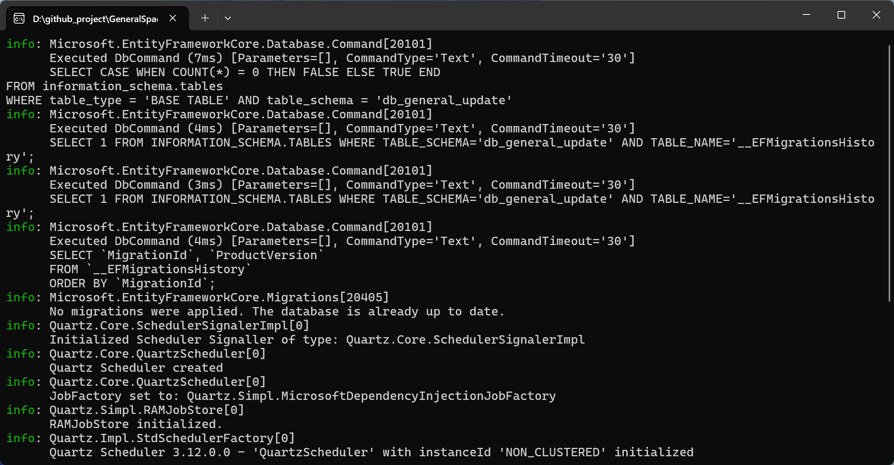

import Tabs from '@theme/Tabs';
import TabItem from '@theme/TabItem';

<iframe
  src="//player.bilibili.com/player.html?bvid=BV12P9dBiEEh&page=1"
  width="100%"
  height="480"
  style={{ borderRadius: '8px', border: 'none' }}
  allowFullScreen
  scrolling="no"
/>


## Pricing

TSLH™ GeneralSpacestation uses an **annual subscription model**. Purchase or renewal grants a perpetual license for the current version. All editions include deployment guidance and user documentation.

<Tabs className="pricing-tabs">
  <TabItem value="subscription" label="Pay-as-you-go">

**Flexible on-demand pricing**

| Item | Details |
|------|---------|
| Model | Traffic fee + service fee |
| Traffic Pack | ¥9 / 100 GB (1-month validity) |
| Service Fee | 10% of traffic pack total |
| Seats | Unlimited |
| Support | Public channel |
| Beta access | ✓ |

> Traffic pack pricing may vary with provider adjustments. Flexible on-demand purchasing supported.

  </TabItem>
  <TabItem value="personal" label="Personal">

**Lightweight start for indie developers**

| Item | Details |
|------|---------|
| First year | ¥599 |
| Renewal | ¥299 / year |
| Perpetual license | ✓ (includes 1 year of updates) |
| Seats | 1 |
| Support | Public channel |
| Dedicated support | — |

  </TabItem>
  <TabItem value="enterprise" label="Enterprise">

**Professional service for enterprise-scale coverage**

| Item | Details |
|------|---------|
| First year | ¥2599 |
| Renewal | ¥1299 / year |
| Perpetual license | ✓ (includes 1 year of updates) |
| Dedicated support | 1 seat |
| Beta access | ✓ |
| Public channel | ✓ |

  </TabItem>
</Tabs>

### Discounts

- **Price lock**: First purchase price is locked permanently — renewals never increase
- **Partnership discount**: Showcase your project built with GeneralSpacestation — enjoy a permanent **10% discount**
- **Custom development**: Tailored features available via separate negotiation

---

## Overview

TSLH™ GeneralSpacestation is an **enterprise client lifecycle upgrade management service**, addressing core scenarios such as update package management, version release, rollout control, and log tracking — solving fragmented updates, bandwidth waste, chaotic releases, and traceability issues in one platform.

- **Use cases**: Desktop and mobile client auto-update management — version releases, canary rollouts, update tracking
- **Deployment**: On-premises private deployment; data never leaves the corporate intranet
- **Core value**: Lower client O&M costs, precise version rollout control, complete upgrade chain traceability

### Components

| Component | Description | License |
|-----------|-------------|---------|
| GeneralSpacestation | Update management service (server-side Web API) | Paid |
| GeneralUpdate.Admin | Visual management desktop client (cross-platform) | Paid |
| GeneralUpdate | Desktop client auto-update component | Free (Open Source) |
| GeneralUpdate-Samples | Usage examples for GeneralUpdate | Free (Open Source) |

> **Documentation**: [https://www.justerzhu.cn/](https://www.justerzhu.cn/)  
> **GitHub**: [GeneralUpdate](https://github.com/GeneralLibrary/GeneralUpdate) · [GeneralSpacestation](https://github.com/TSLH-Technology/GeneralSpacestation)

---

## Features

### Smart Canary Rollouts

Flexibly group clients by region, product line, store, or pilot customer. Precisely control update scope to minimize release risk. **Group freeze** support allows emergency blocking of upgrades to frozen groups after an accidental patch.

### Patch Management

Three build modes for every scenario:

| Mode | Description | Best For |
|------|-------------|----------|
| Auto Build | Reads publish command file, auto-builds and records version history | Standardized release pipelines |
| Manual Build | Specify directories manually; differential comparison generates patches | Flexible ad-hoc scenarios |
| Full Build | Compress entire target directory | First release or full overwrite |

- **Binary delta compression** — only changed files synced, patches as small as KB-level, dramatically saving bandwidth and storage
- ZIP format, resumable downloads — interrupted updates resume on next launch

### Three-Tier Management

```
Product → Group → Client
```

Organize clients under products, subdivide by region, store, or pilot scope. Each client uniquely identified by App Key for fine-grained data isolation.

### Flexible Rollout

| Method | Description |
|--------|-------------|
| Instant Push | Immediately notify selected groups |
| Scheduled Push | Auto-push at specified date and time |
| Mandatory Update | Mark patch as required — client cannot skip |
| Optional Update | Clients choose whether to upgrade |

### End-to-End Logging

- **Upgrade logs**: Every client upgrade recorded — status (success/failed/in-progress), version, timestamp
- **Push logs**: Every admin push audited — operator, time, target group
- Multi-dimensional query by product, version, time range, status, and more

### OSS Minimal Upgrade Mode

One-click version config file generation — no server-side code required. Clients determine update eligibility directly from OSS-hosted version info, dramatically lowering the onboarding barrier.

### Extension Management

Compress plugin/extension directories into packages for centralized server management. Supports dependency declarations, platform filtering, and pre-release flags for plugin-based architectures.

### i18n & Themes

Chinese/English UI toggle, light/dark dual themes, collapsible menu for maximized workspace.

---

## Solution Architecture


---

## Screenshots




---

## Custom Solutions

Beyond standard editions, we offer value-added services for enterprise needs:

| Service | Description |
|---------|-------------|
| Custom Development | Tailored feature modules for your business — priced separately |
| Project Integration | One-on-one technical onboarding to accelerate adoption |
| Training | Online / offline product training sessions |
| Deployment Guidance | Full private deployment technical support |

> 💡 For business inquiries, scan the QR code below (WeChat recommended). Please state your purpose when adding.


