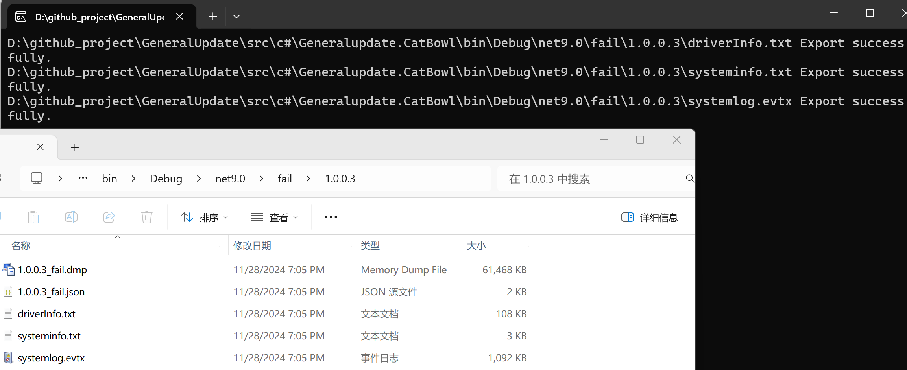
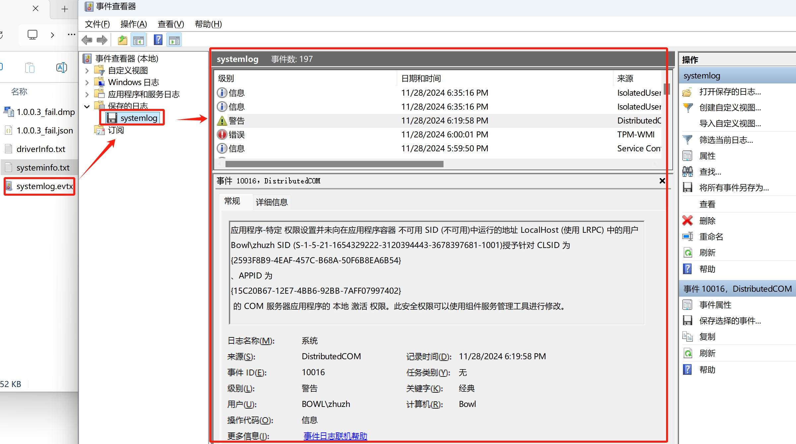

# GeneralUpdate.Bowl

## Component Overview

**GeneralUpdate.Bowl** is an independent process monitoring component that launches before the end of the upgrade process. It is responsible for starting the main client application and monitoring its running status. This component provides comprehensive crash monitoring and diagnostic capabilities. When the monitored application encounters an exception, it automatically exports Dump files, driver information, system information, and event logs to help developers quickly locate issues.

**Namespace:** `GeneralUpdate.Bowl`  
**Assembly:** `GeneralUpdate.Bowl.dll`

```csharp
public sealed class Bowl
```

---

## Core Features

### 1. Process Monitoring
- Real-time monitoring of target application status
- Automatic detection of process crashes and abnormal exits

### 2. Crash Diagnostics
- Automatic generation of Dump files (.dmp) for crash analysis
- Export detailed system and driver information
- Collect Windows system event logs

### 3. Version Management
- Store failure information categorized by version number
- Support both upgrade and normal working modes

---

## Quick Start

### Installation

Install GeneralUpdate.Bowl via NuGet:

```bash
dotnet add package GeneralUpdate.Bowl
```

### Initialization and Usage

The following example demonstrates how to use the Bowl component to monitor an application:

```csharp
using GeneralUpdate.Bowl;
using GeneralUpdate.Bowl.Strategys;

var installPath = AppDomain.CurrentDomain.BaseDirectory;
var lastVersion = "1.0.0.3";
var processInfo = new MonitorParameter
{
    ProcessNameOrId = "YourApp.exe",
    DumpFileName = $"{lastVersion}_fail.dmp",
    FailFileName = $"{lastVersion}_fail.json",
    TargetPath = installPath,
    FailDirectory = Path.Combine(installPath, "fail", lastVersion),
    BackupDirectory = Path.Combine(installPath, lastVersion),
    WorkModel = "Normal"  // Use Normal mode for standalone monitoring
};
Bowl.Launch(processInfo);
```

---

## Core API Reference

### Launch Method

Start the process monitoring functionality.

**Method Signature:**

```csharp
public static void Launch(MonitorParameter? monitorParameter = null)
```

**Parameters:**

#### MonitorParameter Class

```csharp
public class MonitorParameter
{   
    /// <summary>
    /// Directory being monitored
    /// </summary>
    public string TargetPath { get; set; }
    
    /// <summary>
    /// Directory where captured exception information is exported
    /// </summary>
    public string FailDirectory { get; set; }
    
    /// <summary>
    /// Backup directory
    /// </summary>
    public string BackupDirectory { get; set; }
    
    /// <summary>
    /// Name or ID of the process being monitored
    /// </summary>
    public string ProcessNameOrId { get; set; }
 
    /// <summary>
    /// Dump file name
    /// </summary>
    public string DumpFileName { get; set; }
    
    /// <summary>
    /// Upgrade package version information (.json) file name
    /// </summary>
    public string FailFileName { get; set; }

    /// <summary>
    /// Work Mode:
    /// - Upgrade: Upgrade mode, primarily used in conjunction with GeneralUpdate for internal logic handling. 
    ///           Do not modify arbitrarily when the default mode is activated.
    /// - Normal: Normal mode, can be used independently to monitor a single program. 
    ///          Exports crash information when the program crashes.
    /// </summary>
    public string WorkModel { get; set; } = "Upgrade";
}
```

---

## Practical Usage Examples

### Example 1: Standalone Mode Application Monitoring

```csharp
using GeneralUpdate.Bowl;
using GeneralUpdate.Bowl.Strategys;

// Configure monitoring parameters
var installPath = AppDomain.CurrentDomain.BaseDirectory;
var currentVersion = "1.0.0.5";

var monitorConfig = new MonitorParameter
{
    ProcessNameOrId = "MyApplication.exe",
    DumpFileName = $"{currentVersion}_crash.dmp",
    FailFileName = $"{currentVersion}_crash.json",
    TargetPath = installPath,
    FailDirectory = Path.Combine(installPath, "crash_reports", currentVersion),
    BackupDirectory = Path.Combine(installPath, "backups", currentVersion),
    WorkModel = "Normal"  // Standalone monitoring mode
};

// Start monitoring
Bowl.Launch(monitorConfig);
```

### Example 2: Use with GeneralUpdate

```csharp
using GeneralUpdate.Bowl;
using GeneralUpdate.Bowl.Strategys;

// Start Bowl monitoring after upgrade completion
var installPath = AppDomain.CurrentDomain.BaseDirectory;
var upgradedVersion = "2.0.0.1";

var upgradeMonitor = new MonitorParameter
{
    ProcessNameOrId = "UpdatedApp.exe",
    DumpFileName = $"{upgradedVersion}_fail.dmp",
    FailFileName = $"{upgradedVersion}_fail.json",
    TargetPath = installPath,
    FailDirectory = Path.Combine(installPath, "fail", upgradedVersion),
    BackupDirectory = Path.Combine(installPath, upgradedVersion),
    WorkModel = "Upgrade"  // Upgrade mode
};

Bowl.Launch(upgradeMonitor);
```

---

## Crash Information Capture

When a crash is detected, the following files will be generated in the running directory:

- 📒 **Dump file** (`x.0.0.*_fail.dmp`)
- 📒 **Upgrade package version information** (`x.0.0.*_fail.json`)
- 📒 **Driver information** (`driverInfo.txt`)
- 📒 **Operating system/hardware information** (`systeminfo.txt`)
- 📒 **System event log** (`systemlog.evtx`)

These files will be exported to the "fail" directory, categorized by version number.



### 1. Dump File

The Dump file contains a memory snapshot at the moment of crash, which can be used for debugging analysis:


### 2. Version Information File

Detailed crash report in JSON format, including parameter configuration and ProcDump output:

```json
{
"Parameter": {
"TargetPath": "D:\\github_project\\GeneralUpdate\\src\\c#\\Generalupdate.CatBowl\\bin\\Debug\\net9.0\\",
"FailDirectory": "D:\\github_project\\GeneralUpdate\\src\\c#\\Generalupdate.CatBowl\\bin\\Debug\\net9.0\\fail\\1.0.0.3",
"BackupDirectory": "D:\\github_project\\GeneralUpdate\\src\\c#\\Generalupdate.CatBowl\\bin\\Debug\\net9.0\\1.0.0.3",
"ProcessNameOrId": "JsonTest.exe",
"DumpFileName": "1.0.0.3_fail.dmp",
"FailFileName": "1.0.0.3_fail.json",
"WorkModel": "Normal",
"ExtendedField": null
},
"ProcdumpOutPutLines": [
        "ProcDump v11.0 - Sysinternals process dump utility",
        "Copyright (C) 2009-2022 Mark Russinovich and Andrew Richards",
        "Sysinternals - www.sysinternals.com", 
        "Process:               JsonTest.exe (19712)", 
        "Process image:  D:\\github_project\\GeneralUpdate\\src\\c#\\Generalupdate.CatBowl\\bin\\Debug\\net9.0\\JsonTest.exe", "CPU threshold:         n/a", 
        "Performance counter:   n/a", "Commit threshold:      n/a",
        "Threshold seconds:     n/a", "Hung window check:     Disabled", "Log debug strings:     Disabled", 
        "Exception monitor:     Unhandled", "Exception filter:      [Includes]", 
        "                       *", 
        "                       [Excludes]", 
        "Terminate monitor:     Disabled", 
        "Cloning type:          Disabled", 
        "Concurrent limit:      n/a", 
        "Avoid outage:          n/a", 
        "Number of dumps:       1", 
        "Dump folder:           D:\\github_project\\GeneralUpdate\\src\\c#\\Generalupdate.CatBowl\\bin\\Debug\\net9.0\\fail\\1.0.0.3\\", 
        "Dump filename/mask:    1.0.0.3_fail", 
        "Queue to WER:          Disabled", "Kill after dump:       Disabled", 
        "Press Ctrl-C to end monitoring without terminating the process.", 
        "[19:05:23] Exception: E0434352.CLR", "[19:05:23] Unhandled: E0434352.CLR", 
        "[19:05:23] Dump 1 initiated: D:\\github_project\\GeneralUpdate\\src\\c#\\Generalupdate.CatBowl\\bin\\Debug\\net9.0\\fail\\1.0.0.3\\1.0.0.3_fail.dmp", 
        "[19:05:23] Dump 1 writing: Estimated dump file size is 62 MB.", 
        "[19:05:23] Dump 1 complete: 62 MB written in 0.1 seconds", 
        "[19:05:23] Dump count reached."]
}
```

### 3. Driver Information File

Contains detailed information about all drivers in the system:

```text
Module Name   Display Name            Description               Driver Type  Start Mode   State       Status    
============ ====================== ====================== ============= ========== ========== ==========
360AntiAttac 360Safe Anti Attack Se 360Safe Anti Attack Se Kernel        System     Running    OK        
360AntiHacke 360Safe Anti Hacker Se 360Safe Anti Hacker Se Kernel        System     Running    OK        
// ...more driver information
```

### 4. System Information File

Complete operating system and hardware configuration information:

```text
Host Name:           ****
OS Name:             Microsoft Windows 11 Pro
OS Version:          10.0.*** Build 22***
System Manufacturer: ASUS
System Model:        System Product Name
Processor(s):        Intel** Family * Model ***
Total Physical Memory: 16,194 MB
// ...more system information
```

### 5. System Event Log

System log in Windows Event Viewer format (.evtx file):



---

## Notes and Warnings

### ⚠️ Important Notes

1. **Work Mode Selection**
   - `Upgrade` mode: Specifically for integration with GeneralUpdate framework, includes internal logic processing
   - `Normal` mode: Can be used independently, suitable for monitoring any .NET application

2. **Permission Requirements**
   - Bowl requires sufficient permissions to generate Dump files and read system information
   - It is recommended to run the monitored application with administrator privileges

3. **Disk Space**
   - Dump files may consume significant disk space (typically 50-200 MB)
   - Ensure sufficient available space on the disk where FailDirectory is located

4. **Dependencies**
   - Bowl uses the ProcDump tool to generate Dump files, which is built into the component
   - No additional dependencies need to be installed

### 💡 Best Practices

- **Version Management**: Use separate failure directories for each version for easier issue tracking
- **Log Cleanup**: Regularly clean up failure information from old versions to avoid disk space exhaustion
- **Testing**: Verify monitoring functionality in a test environment before production deployment

---

## Applicable Platforms

| Product         | Version           |
| --------------- | ----------------- |
| .NET            | 5, 6, 7, 8, 9     |
| .NET Framework  | 4.6.1             |
| .NET Standard   | 2.0               |
| .NET Core       | 2.0               |
| ASP.NET         | Any               |

---

## Related Resources

- **Example Code**: [View GitHub Examples](https://github.com/GeneralLibrary/GeneralUpdate-Samples/tree/main/src/Bowl)
- **Video Tutorial**: [Watch Bilibili Tutorial](https://www.bilibili.com/video/BV1c8iyYZE7P)
- **Main Repository**: [GeneralUpdate Project](https://github.com/GeneralLibrary/GeneralUpdate)
