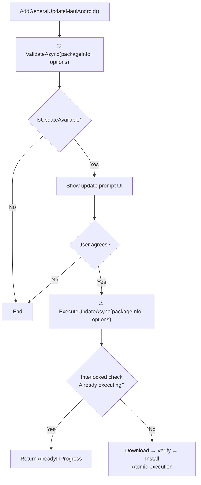
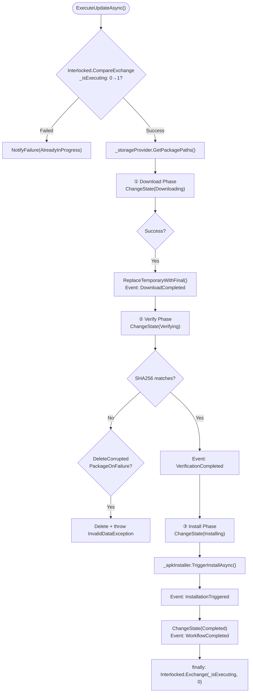

# GeneralUpdate.Maui.Android — Execution Flow Deep Dive

> **Target Audience:** Developers integrating auto-update into .NET MAUI Android apps
>
> **After reading you will understand:**
> - `AndroidBootstrap`'s combined two-step API design intent (ValidateAsync → ExecuteUpdateAsync)
> - `HttpRangeDownloader`'s recoverable download: Range requests + temp files + atomic replacement
> - `ExecuteUpdateAsync`'s internal Interlocked concurrency protection and atomic state transitions
> - SHA256 verification with automatic corrupted file cleanup
> - Android Package Installer's FileProvider + Intent trigger flow
> - `AddGeneralUpdateMauiAndroid()` DI registration extension design
> - Key design differences from Avalonia.Android in API style and DI strategy
> - Exception-to-`UpdateFailureReason` classification mapping

---

## Table of Contents

1. [Architecture Overview](#1-architecture-overview)
2. [Entry: DI-First Factory Design](#2-entry-di-first-factory-design)
3. [AndroidBootstrap: Combined Two-Step API](#3-androidbootstrap-combined-two-step-api)
4. [Step 1: ValidateAsync — Version Check](#4-step-1-validateasync--version-check)
5. [Step 2: ExecuteUpdateAsync — Atomic Complete Update](#5-step-2-executeupdateasync--atomic-complete-update)
6. [Recoverable Download: HttpRangeDownloader Deep Dive](#6-recoverable-download-httprangedownloader-deep-dive)
7. [SHA256 Verification & Corrupted File Cleanup](#7-sha256-verification--corrupted-file-cleanup)
8. [APK Install: Platform-Guarded Installer](#8-apk-install-platform-guarded-installer)
9. [Concurrency Safety: Interlocked Atomic Operations](#9-concurrency-safety-interlocked-atomic-operations)
10. [SafeInvoke: Defensive Event Firing](#10-safeinvoke-defensive-event-firing)
11. [Exception Mapping: MapFailureReason Classification](#11-exception-mapping-mapfailurereason-classification)
12. [Design Comparison with Avalonia.Android](#12-design-comparison-with-avaloniaandroid)
13. [Key Code Path Index](#13-key-code-path-index)

---

## 1. Architecture Overview

### 1.1 Five-Service DI-First Architecture

Maui.Android uses a **DI-first + manual assembly coexistence** design:

```
┌──────────────────────────────────────────────────────────────┐
│           GeneralUpdateBootstrap (Static Factory)              │
│   CreateDefault() → IAndroidBootstrap                        │
│   AddGeneralUpdateMauiAndroid(services) → IServiceCollection  │
├──────────────────────────────────────────────────────────────┤
│              AndroidBootstrap (Orchestration Layer)            │
│                                                              │
│  ┌──────────────┐  ┌──────────────┐  ┌──────────────────┐   │
│  │ IUpdate      │  │ IHash        │  │ IApkInstaller    │   │
│  │ Downloader   │  │ Validator    │  │ FileProvider     │   │
│  │ HTTP resume  │  │ SHA256       │  │ Intent trigger   │   │
│  └──────────────┘  └──────────────┘  └──────────────────┘   │
│                                                              │
│  ┌──────────────┐  ┌──────────────────────────────────────┐ │
│  │ IUpdate      │  │ HttpDownloadOptions                   │ │
│  │ Storage      │  │ SSL / Proxy / Timeout / Retry / Auth │ │
│  │ Provider     │  └──────────────────────────────────────┘ │
│  └──────────────┘                                            │
└──────────────────────────────────────────────────────────────┘
```

### 1.2 Core Differences from Avalonia.Android

| Dimension | Maui.Android | Avalonia.Android |
|-----------|-------------|-------------------|
| **API Style** | Two-step combined (Validate + ExecuteUpdate) | Three-step explicit (Validate + DownloadAndVerify + LaunchInstaller) |
| **DI Strategy** | DI-first, `AddGeneralUpdateMauiAndroid()` | Manual assembly first, `CreateDefault()` |
| **Concurrency** | `Interlocked` atomic ops | `SemaphoreSlim(1,1)` gate |
| **Event Safety** | `SafeInvoke` iterate delegates | `IUpdateEventDispatcher` dispatch |
| **Platform Guard** | `#if ANDROID` compile-time | Runtime platform check |
| **Temp File** | `.downloading` extension | `.part` + `.json` sidecar |
| **Progress** | `IProgress<DownloadStatistics>` | `EventHandler<DownloadProgressChangedEventArgs>` |
| **SHA256** | Required (mandatory) | Optional (strongly recommended) |
| **Min API** | API 21 (Android 5.0) | API 26 (Android 8.0) |

---

## 2. Entry: DI-First Factory Design

### DI Registration

```csharp
public static IServiceCollection AddGeneralUpdateMauiAndroid(
    this IServiceCollection services, HttpClient? httpClient = null)
{
    services.AddSingleton<IUpdateDownloader>(sp =>
        new HttpRangeDownloader(httpClient ?? new HttpClient()));
    services.AddSingleton<IHashValidator, Sha256Validator>();
    services.AddSingleton<IApkInstaller, AndroidApkInstaller>();
    services.AddSingleton<IUpdateStorageProvider, UpdateFileStore>();
    services.AddSingleton<IUpdateLogger, DefaultUpdateLogger>();
    services.AddSingleton<IAndroidBootstrap, AndroidBootstrap>();
    return services;
}
```

### Typical MAUI App Registration

```csharp
// MauiProgram.cs
builder.Services.AddGeneralUpdateMauiAndroid();
```

---

## 3. AndroidBootstrap: Combined Two-Step API

### Complete Lifecycle



### State Machine

```
None → Checking → UpdateAvailable → Downloading → Verifying → ReadyToInstall → Installing → Completed
```

Atomic state transitions via `Interlocked.Exchange`:

```csharp
private void ChangeState(UpdateState state)
{
    Interlocked.Exchange(ref _currentState, (int)state);
}
```

---

## 4. Step 1: ValidateAsync — Version Check

```csharp
ValidateInputs(packageInfo, options); // Validates non-null: CurrentVersion, Version, DownloadUrl, Sha256

var currentVersion = new Version(options.CurrentVersion);
var latestVersion = new Version(packageInfo.Version);

if (latestVersion <= currentVersion)
    return UpdateCheckResult.NoUpdate();

SafeInvoke(AddListenerValidate, new ValidateEventArgs(packageInfo));
return UpdateCheckResult.UpdateAvailable(packageInfo);
```

**Security design:** SHA256 is mandatory — Maui.Android does not allow skipping integrity verification.

---

## 5. Step 2: ExecuteUpdateAsync — Atomic Complete Update



### Four Completion Stages

| Stage | Enum Value | Trigger |
|-------|-----------|---------|
| Download Complete | `DownloadCompleted` | File downloaded + atomically replaced |
| Verification Complete | `VerificationCompleted` | SHA256 verified |
| Installation Triggered | `InstallationTriggered` | Android Installer Intent fired |
| Workflow Complete | `WorkflowCompleted` | All steps succeeded |

---

## 6. Recoverable Download: HttpRangeDownloader

```
HEAD request → Content-Length, Accept-Ranges, ETag
Check partial download → {targetFilePath}.downloading
If partial exists:
  → file size ≤ Content-Length → Range: bytes={size}-
  → otherwise delete and restart
GET with Range → stream to temp file → report progress
```

### Atomic File Replacement

```csharp
// UpdateFileStore.ReplaceTemporaryWithFinal
File.Move(temporaryPath, targetPath); // Atomic rename
```

---

## 7. SHA256 Verification & Corrupted File Cleanup

```csharp
var hashResult = await _hashValidator.ValidateSha256Async(
    targetFilePath, packageInfo.Sha256, ...);

if (!hashResult.IsSuccess)
{
    if (options.DeleteCorruptedPackageOnFailure)
        _storageProvider.DeleteFileIfExists(targetFilePath);
    throw new InvalidDataException("Integrity check failed.");
}
```

---

## 8. APK Install: Platform-Guarded Installer

```csharp
public Task TriggerInstallAsync(string filePath, InstallOptions options, CancellationToken ct)
{
#if ANDROID
    // Check INSTALL_PACKAGES permission (API 26+)
    // FileProvider.GetUriForFile()
    // Intent ACTION_VIEW + GRANT_READ_URI_PERMISSION + NEW_TASK
    // StartActivity(intent)
#else
    throw new PlatformNotSupportedException("APK installation is only supported on Android.");
#endif
}
```

---

## 9. Concurrency Safety: Interlocked Atomic Operations

```csharp
private int _isExecuting;

public async Task<UpdateExecutionResult> ExecuteUpdateAsync(...)
{
    if (Interlocked.CompareExchange(ref _isExecuting, 1, 0) != 0)
    {
        return UpdateExecutionResult.Failure(
            UpdateFailureReason.AlreadyInProgress, "...");
    }

    try { /* execute update */ }
    finally { Interlocked.Exchange(ref _isExecuting, 0); }
}
```

**Advantage over SemaphoreSlim:** Lighter weight — no async wait overhead, no deadlock risk, naturally suited for "execute or reject" scenarios.

---

## 10. SafeInvoke: Defensive Event Firing

```csharp
private void SafeInvoke<TEventArgs>(EventHandler<TEventArgs>? eventHandler, ...)
{
    if (eventHandler is null) return;
    foreach (EventHandler<TEventArgs> subscriber in eventHandler.GetInvocationList())
    {
        try { subscriber(this, eventArgs); }
        catch (Exception ex) { _logger.LogError(...); }
    }
}
```

**Key guarantee:** One subscriber's exception never blocks other subscribers.

---

## 11. Exception Mapping: MapFailureReason Classification

```csharp
private static UpdateFailureReason MapFailureReason(Exception ex) => ex switch
{
    ArgumentException          => UpdateFailureReason.InvalidInput,
    HttpRequestException       => UpdateFailureReason.Network,
    InvalidDataException       => UpdateFailureReason.IntegrityCheckFailed,
    IOException                => UpdateFailureReason.FileAccess,
    UnauthorizedAccessException => UpdateFailureReason.InstallPermissionDenied,
    OperationCanceledException => UpdateFailureReason.Canceled,
    _                          => UpdateFailureReason.Unknown
};
```

---

## 12. Design Comparison with Avalonia.Android

| Aspect | Maui.Android | Avalonia.Android |
|--------|-------------|-------------------|
| **Framework** | MAUI DI ecosystem deep integration | Framework-agnostic general design |
| **API Granularity** | Combined (fewer APIs, internal atomicity) | Explicit (more APIs, caller control) |
| **When to Choose** | Using MAUI, need DI, prefer simple API | Using Avalonia, need per-step custom logic, need Sidecar resume |

---

## 13. Key Code Path Index

| Component | File | Key Methods |
|-----------|------|-------------|
| DI + Factory | `Services/GeneralUpdateBootstrap.cs` | `AddGeneralUpdateMauiAndroid()` / `CreateDefault()` |
| Orchestrator | `Services/AndroidBootstrap.cs` | `ValidateAsync()` / `ExecuteUpdateAsync()` / `SafeInvoke()` |
| Downloader | `Services/HttpRangeDownloader.cs` | `DownloadAsync()` / HEAD / Range |
| SHA256 | `Services/Sha256Validator.cs` | `ValidateSha256Async()` |
| Installer | `Platform/Android/AndroidApkInstaller.cs` | `TriggerInstallAsync()` / `#if ANDROID` |
| Storage | `Services/UpdateFileStore.cs` | `GetPackagePaths()` / `ReplaceTemporaryWithFinal()` |
| Speed Calculator | `Utilities/SpeedCalculator.cs` | Download speed metering |
| Update Options | `Models/UpdateOptions.cs` | CurrentVersion / DeleteCorruptedPackageOnFailure |
| Completion Stages | `Enums/UpdateCompletionStage.cs` | DownloadCompleted / VerificationCompleted / InstallationTriggered / WorkflowCompleted |
