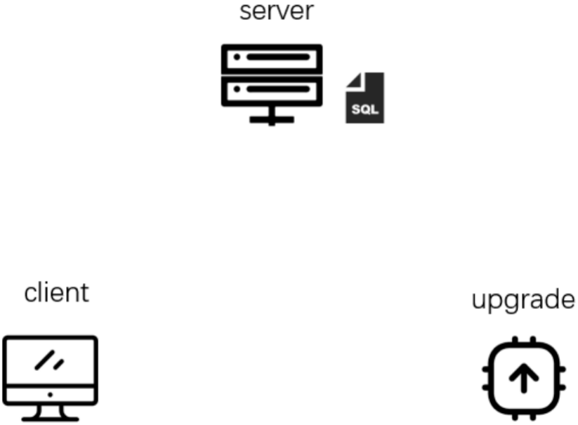

## 1. GeneralUpdate是什么？

**更新无限，升级无界。**

GeneralUpdate是一款基于.NET Standard2.0 Apache协议开源的跨平台应用程序自动升级组件。

| Github               | Gitee               | GitCode               |
| -------------------- | ------------------- | --------------------- |
|  |  |  |

【如果您所在的企业正在或准备使用遇到任何问题、选型非常欢迎进入讨论组进行沟通，联系方式在本页面底部。开发人员如果遇到紧急任务，请提前说明情况，您的询问将优先得到解决。】

## 2. GeneralUpdate提供什么？

##### 组件功能

| 功能           | 是否支持 | 备注                                                         |
| -------------- | -------- | ------------------------------------------------------------ |
| 断点续传       | 支持     | 单次更新失败时，下次一次启动时继续上一次更新下载更新包内容。（引用组件默认生效） |
| 逐版本更新     | 支持     | 客户端当前版本如果与服务器相差多个版本，则根据多个版本的发布日期逐个更新。（引用组件默认生效） |
| 二进制差分更新 | 支持     | 对比新老版本通过差分算法生成补丁文件。（引用组件默认生效）   |
| 增量更新功能   | 支持     | 相比上一个版本只更新当前修改过的文件，并且删除当前版本不存在的文件。（引用组件默认生效） |
| 强制更新       | 支持     | 打开客户端之后直接强制更新。                                 |
| 多分支更新     | 支持     | 当一个产品有多个分支时，需要根据不同的分支更新对应的内容。   |
| 最新版本推送   | 支持     | 基于Signal R实现，推送当前最新版本。                         |
| 多语言         | 支持     | 跨平台运行，组件语言无关，可作为更新”脚本”用于任何语言的应用程序。 |
| 跳过更新       | 支持     | 支持注入弹窗让用户决定是否更新本次发布，服务端决定强制时更新不生效。 |
| 相互升级       | 支持     | 主程序可更新升级程序，升级程序可更新主程序。                 |
| 黑名单         | 支持     | 在更新过程中会跳过黑名单中的文件列表和文件扩展名列表。       |
| OSS            | 支持     | 极简化更新，是一套独立的更新机制。只需要在文件服务器中放置version.json的版本配置文件。组件会根据配置文件中的版本信息进行更新下载。 |
| 回滚、备份     | 支持     | 更新之前会将客户端本地文件备份，如果客户端启动失败或崩溃则回滚覆盖。 |
| 驱动更新       | 支持     | 基于GeneralUpdate.Drivelution组件实现跨平台驱动自动更新，支持Windows、Linux平台。提供驱动验证、备份、回滚、签名验证、权限管理等完整功能。 |
| 扩展管理       | 支持     | 基于GeneralUpdate.Extension组件实现类似VS Code的扩展系统，管理Lua/Python等扩展插件。支持扩展目录管理、远程查询、下载队列、版本兼容性检查、多平台支持、依赖解析、回滚机制和事件通知等功能。 |
| 自定义方法列表 | 支持     | 注入一个自定义方法集合，该集合会在更新启动前执行。执行自定义方法列表如果出现任何异常，将通过异常订阅通知。（推荐在更新之前检查当前软件环境） |
| 多协议认证       | 支持     | 支持 HMAC-SHA256、Bearer Token、API Key、HTTP Basic 四种认证方案，可自定义扩展。 |
| 静默更新       | 支持     | 后台轮询版本、静默下载、进程退出时触发升级，用户无感知完成更新。 |
| 并发下载       | 支持     | 多资源包并发下载，支持断点续传和 SHA256 校验，可配置并发数。 |
| 文件树比对     | 支持     | 新旧版本目录结构级差异对比，生成增量文件清单。 |
| AOT            | 支持     | 支持AOT编译发布。                                            |
| 身份认证       | 支持     | HTTP请求服务器资源可传递（token）身份认证信息。              |

## 3.GeneralUpdate支持什么？

##### .NET框架

| 框架名称                   | 是否支持 |
| -------------------------- | -------- |
| .NET Core 2.0              | 支持     |
| .NET 5 ... to last version | 支持     |
| .NET Framework 4.6.1       | 支持     |

##### UI框架

| UI框架名称 | 是否支持              | 适配贡献者 |
| ---------- | --------------------- | ---------- |
| WPF        | 支持                  | JusterZhu  |
| UWP        | 商店模式下不可更新    | lindexi    |
| MAUI       | 目前仅支持Android平台 | JusterZhu  |
| Avalonia   | 支持                  | JusterZhu  |
| WinUI      | 支持                  | JusterZhu  |
| Console    | 支持                  | JusterZhu  |
| WinForms   | 支持                  | JusterZhu  |

##### 操作系统

| 操作系统名称                  | 是否支持 | 适配贡献者                         |
| ----------------------------- | -------- | ---------------------------------- |
| Windows                       | 支持     | JusterZhu                          |
| Linux                         | 支持     | JusterZhu                          |
| Android                       | 支持     | JusterZhu                          |
| 麒麟V10(飞腾S2500)            | 支持     | 溦                                 |
| 麒麟V10(飞腾FT-2000)          | 支持     | 姚圣伟                             |
| 麒麟V10(x64)                  | 支持     | 溦                                 |
| Ubuntu                        | 支持     | JusterZhu                          |
| 华为欧拉(EulerOS-鲲鹏Kunpeng) | 支持     | 姚圣伟                             |
| 龙芯(Loongnix LoongArch)      | 支持     | Avalonia中文社区（董彬 Rabbitism） |
| Apple Mac (M1)                | 支持     | JusterZhu                          |
| 统信UOS                       | 支持     | JusterZhu                          |

## 4.仓库

| 名称                  | 说明                 | 仓库                                                         |
| --------------------- | -------------------- | ------------------------------------------------------------ |
| GeneralUpdate         | 自动更新             | [GitHub](https://github.com/GeneralLibrary/GeneralUpdate) [Gitee](https://gitee.com/GeneralLibrary/GeneralUpdate) [GitCode](https://gitcode.com/GeneralLibrary/GeneralUpdate) |
| GeneralUpdate.Maui    | Maui自动更新（安卓） | [GitHub](https://github.com/GeneralLibrary/GeneralUpdate.Maui) [Gitee](https://gitee.com/GeneralLibrary/GeneralUpdate.Maui) [GitCode](https://gitcode.com/GeneralLibrary/GeneralUpdate-Maui) |
| GeneralUpdate.Tools   | 更新补丁包制作工具   | [GitHub](https://github.com/GeneralLibrary/GeneralUpdate.Tools) [Gitee](https://gitee.com/GeneralLibrary/GeneralUpdate.Tools) [GitCode](https://gitcode.com/GeneralLibrary/GeneralUpdate-Tools) |
| GeneralUpdate-Samples | 使用示例             | [GitHub](https://github.com/GeneralLibrary/GeneralUpdate-Samples) [Gitee](https://gitee.com/GeneralLibrary/GeneralUpdate-Samples) [GitCode](https://gitcode.com/GeneralLibrary/GeneralUpdate-Samples) |

## 5.统一语言

​                                                    

在开始使用GeneralUpdate之前我们需要先知道体系中的一些基础概念，同时请下载GeneralUpdate-Samples仓库到本地并进入`..\GeneralUpdate-Samples\src`目录下对照查看便于理解。

| 名称                | 说明                                                         | 解释                                                         |
| ------------------- | ------------------------------------------------------------ | ------------------------------------------------------------ |
| Client              | 被更新的客户端。                                             | 你想更新QQ那么QQ就是Client。                                 |
| Upgrade             | 升级程序是一个独立的进程。需要和Client放在同一级目录下，在使用（或编码） 的过程中不可以和任何业务或设计关联、必须保持独立引用。 | QQ 无法在运行时更新自身的文件，这时候Upgrade来完成这件事情。 |
| Packet              | 更新补丁包                                                   | 经常玩游戏的玩家会经常听到“补丁”的概念，补丁的作用通常用于更新游戏中的一些漏洞或者游戏内容，那么在这里也有同样的概念。更新补丁包里的内容是新旧版本中具有文件内容差异或新增文件、需要删除的文件。 |
| Server              | 服务端应用                                                   | 提供版本更新信息管理、补丁包管理、版本验证功能。（在Samples中只提供了简单示例并不能满足这些功能，需要企业或个人开发者自行实现或购买GeneralSpacestation服务）。 |
| GeneralUpdate.Tools | 更新补丁包制作工具                                           | 是本开源项目提供的打包工具，用于生成更新补丁包(.zip文件格式)。 |

##### 快速启动

- 快速启动： https://www.justerzhu.cn/docs/quickstart/quikstart

- 讲解视频： https://www.bilibili.com/video/BV1c8iyYZE7P
- 官方网站： https://www.justerzhu.cn/
- 帮助文档&官方网站源码仓库：https://github.com/GeneralLibrary/GeneralUpdate-Samples/tree/main/website/doc

##### 版本号执行标准

GeneralUpdate 遵循[语义化版本](https://semver.org/lang/zh-CN/)规范的核心原则（`MAJOR.MINOR.PATCH`），并基于 .NET `System.Version` 兼容性扩展了第四个 `Revision` 段（`MAJOR.MINOR.PATCH.REVISION`）。

- 语义化版本规范：https://semver.org/lang/zh-CN/
- Nuget 版本管理参考标准：https://docs.microsoft.com/zh-cn/nuget/concepts/package-versioning 
- 应用程序集版本管理参考标准：https://docs.microsoft.com/zh-cn/dotnet/standard/assembly/versioning

