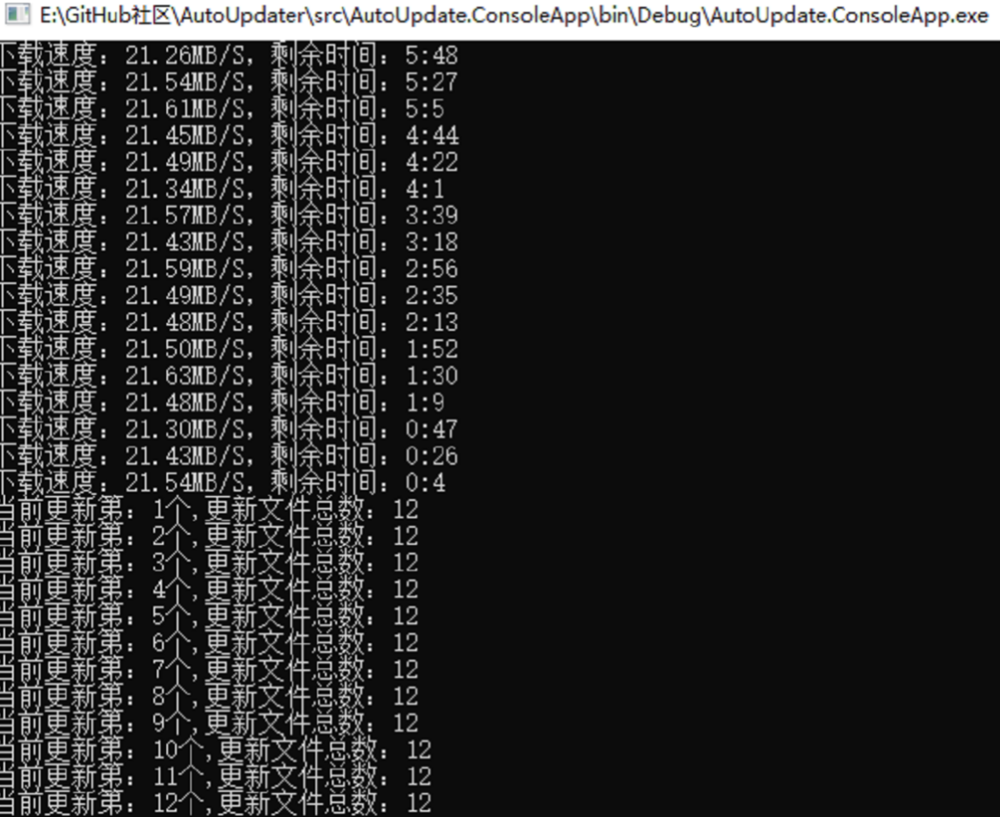

# GeneralUpdate.ClientCore

## 组件概览

**GeneralUpdate.ClientCore** 是 GeneralUpdate 框架的核心组件之一,提供了丰富的客户端更新功能。该组件运行在主应用程序中,负责检查更新、下载更新包、验证完整性,并在完成后启动升级助手(GeneralUpdate.Core)来执行实际的文件替换操作。ClientCore 的设计理念是让主程序能够安全地检查和准备更新,而不影响当前运行状态。

**命名空间:** `GeneralUpdate.ClientCore`  
**程序集:** `GeneralUpdate.ClientCore.dll`

```csharp
public class GeneralClientBootstrap : AbstractBootstrap<GeneralClientBootstrap, IStrategy>
```

---

## 核心特性

### 1. 多版本下载管理
- 支持同时下载多个版本的更新包
- 断点续传和下载速度限制
- 实时下载进度和统计信息

### 2. 灵活的配置选项
- 黑名单机制(文件、格式、目录)
- 自定义更新策略和操作
- 支持二进制差异更新和全量更新

### 3. 完整的事件通知
- 下载进度、完成、错误事件
- 支持用户自定义跳过更新选项
- 异常和错误全程监控

### 4. 多平台支持
- Windows、Linux、macOS 平台支持
- 自动平台检测和策略选择



---

## 快速开始

### 安装

通过 NuGet 安装 GeneralUpdate.ClientCore:

```bash
dotnet add package GeneralUpdate.ClientCore
```

### 初始化与使用

以下示例展示了如何在主程序中配置和启动更新检查:

```csharp
using System.Text;
using GeneralUpdate.ClientCore;
using GeneralUpdate.Common.Download;
using GeneralUpdate.Common.Internal;
using GeneralUpdate.Common.Internal.Bootstrap;
using GeneralUpdate.Common.Shared.Object;

try
{
    Console.WriteLine($"主程序初始化,{DateTime.Now}!");
    
    // 配置更新参数
    var configinfo = new Configinfo
    {
        // 更新验证 API 地址
        UpdateUrl = "http://127.0.0.1:5000/Upgrade/Verification",
        // 更新报告 API 地址
        ReportUrl = "http://127.0.0.1:5000/Upgrade/Report",
        // 主应用程序名称
        MainAppName = "ClientSample.exe",
        // 升级程序名称
        AppName = "UpgradeSample.exe",
        // 当前客户端版本
        ClientVersion = "1.0.0.0",
        // 升级端版本
        UpgradeClientVersion = "1.0.0.0",
        // 安装路径
        InstallPath = Thread.GetDomain().BaseDirectory,
        // 产品 ID(用于多产品分支管理)
        ProductId = "2d974e2a-31e6-4887-9bb1-b4689e98c77a",
        // 应用密钥(用于服务器验证)
        AppSecretKey = "dfeb5833-975e-4afb-88f1-6278ee9aeff6"
    };
    
    // 启动更新流程
    await new GeneralClientBootstrap()
        // 监听下载统计信息
        .AddListenerMultiDownloadStatistics(OnMultiDownloadStatistics)
        // 监听单个下载完成
        .AddListenerMultiDownloadCompleted(OnMultiDownloadCompleted)
        // 监听所有下载完成
        .AddListenerMultiAllDownloadCompleted(OnMultiAllDownloadCompleted)
        // 监听下载错误
        .AddListenerMultiDownloadError(OnMultiDownloadError)
        // 监听异常
        .AddListenerException(OnException)
        // 设置配置
        .SetConfig(configinfo)
        // 设置选项
        .Option(UpdateOption.DownloadTimeOut, 60)
        .Option(UpdateOption.Encoding, Encoding.Default)
        // 启动异步更新
        .LaunchAsync();
        
    Console.WriteLine($"主程序已启动,{DateTime.Now}!");
}
catch (Exception e)
{
    Console.WriteLine(e.Message + "\n" + e.StackTrace);
}

// 事件处理方法
void OnMultiDownloadStatistics(object arg1, MultiDownloadStatisticsEventArgs arg2)
{
    var version = arg2.Version as VersionInfo;
    Console.WriteLine($"下载版本:{version.Version},速度:{arg2.Speed}," +
                     $"剩余时间:{arg2.Remaining},进度:{arg2.ProgressPercentage}%");
}

void OnMultiDownloadCompleted(object arg1, MultiDownloadCompletedEventArgs arg2)
{
    var version = arg2.Version as VersionInfo;
    Console.WriteLine(arg2.IsComplated ? 
        $"版本 {version.Version} 下载完成!" : 
        $"版本 {version.Version} 下载失败!");
}

void OnMultiAllDownloadCompleted(object arg1, MultiAllDownloadCompletedEventArgs arg2)
{
    Console.WriteLine(arg2.IsAllDownloadCompleted ? 
        "所有下载任务已完成!" : 
        $"下载任务失败!失败数量:{arg2.FailedVersions.Count}");
}

void OnMultiDownloadError(object arg1, MultiDownloadErrorEventArgs arg2)
{
    var version = arg2.Version as VersionInfo;
    Console.WriteLine($"版本 {version.Version} 下载错误:{arg2.Exception}");
}

void OnException(object arg1, ExceptionEventArgs arg2)
{
    Console.WriteLine($"更新异常:{arg2.Exception}");
}
```

---

## 核心 API 参考

### GeneralClientBootstrap 类方法

#### LaunchAsync 方法

异步启动更新流程。

```csharp
public async Task<GeneralClientBootstrap> LaunchAsync()
```

#### SetConfig 方法

设置更新配置信息。

```csharp
public GeneralClientBootstrap SetConfig(Configinfo configinfo)
```

#### Option 方法

设置更新选项。

```csharp
public GeneralClientBootstrap Option(UpdateOption option, object value)
```

#### SetBlacklist 方法

设置更新黑名单,指定不需要更新的文件。

```csharp
public GeneralClientBootstrap SetBlacklist(List<string> blackFiles = null, 
                                           List<string> blackFormats = null)
```

#### AddListenerMultiDownloadStatistics 方法

监听下载统计信息(速度、进度、剩余时间等)。

```csharp
public GeneralClientBootstrap AddListenerMultiDownloadStatistics(
    Action<object, MultiDownloadStatisticsEventArgs> callbackAction)
```

#### AddListenerMultiDownloadCompleted 方法

监听单个更新包下载完成事件。

```csharp
public GeneralClientBootstrap AddListenerMultiDownloadCompleted(
    Action<object, MultiDownloadCompletedEventArgs> callbackAction)
```

#### AddListenerMultiAllDownloadCompleted 方法

监听所有下载任务完成事件。

```csharp
public GeneralClientBootstrap AddListenerMultiAllDownloadCompleted(
    Action<object, MultiAllDownloadCompletedEventArgs> callbackAction)
```

#### AddListenerMultiDownloadError 方法

监听下载错误事件。

```csharp
public GeneralClientBootstrap AddListenerMultiDownloadError(
    Action<object, MultiDownloadErrorEventArgs> callbackAction)
```

#### AddListenerException 方法

监听更新过程中的所有异常。

```csharp
public GeneralClientBootstrap AddListenerException(
    Action<object, ExceptionEventArgs> callbackAction)
```

#### AddCustomOption 方法

添加自定义异步操作,可在更新前后执行自定义逻辑。

```csharp
public GeneralClientBootstrap AddCustomOption(Func<Task> customFunc)
```

#### SetCustomSkipOption 方法

设置自定义跳过选项,允许用户决定是否继续更新。

```csharp
public GeneralClientBootstrap SetCustomSkipOption(Func<bool> customSkipFunc)
```

---

## 配置类详解

### Configinfo 类

```csharp
public class Configinfo
{
    /// <summary>
    /// 更新检查 API 地址
    /// </summary>
    public string UpdateUrl { get; set; }
    
    /// <summary>
    /// 更新状态报告 API 地址
    /// </summary>
    public string ReportUrl { get; set; }
    
    /// <summary>
    /// 需要启动的应用程序名称(升级程序)
    /// </summary>
    public string AppName { get; set; }
    
    /// <summary>
    /// 需要启动的主应用程序名称
    /// </summary>
    public string MainAppName { get; set; }
    
    /// <summary>
    /// 更新日志网页地址
    /// </summary>
    public string UpdateLogUrl { get; set; }
    
    /// <summary>
    /// 应用密钥,与服务器约定用于身份验证和产品分支
    /// </summary>
    public string AppSecretKey { get; set; }
    
    /// <summary>
    /// 当前客户端版本号
    /// </summary>
    public string ClientVersion { get; set; }
    
    /// <summary>
    /// 当前升级客户端版本号
    /// </summary>
    public string UpgradeClientVersion { get; set; }
    
    /// <summary>
    /// 安装路径(用于更新文件逻辑)
    /// </summary>
    public string InstallPath { get; set; }
    
    /// <summary>
    /// 黑名单文件列表,这些文件在更新时会被跳过
    /// </summary>
    public List<string> BlackFiles { get; set; }
    
    /// <summary>
    /// 黑名单文件格式列表,这些格式的文件在更新时会被跳过
    /// </summary>
    public List<string> BlackFormats { get; set; }
    
    /// <summary>
    /// 需要跳过的目录路径列表,这些目录不需要更新
    /// </summary>
    public List<string> SkipDirectorys { get; set; }
    
    /// <summary>
    /// 当前产品分支的唯一 ID
    /// </summary>
    public string ProductId { get; set; }
    
    /// <summary>
    /// Bowl 监控进程路径,更新完成后启动 Bowl 检查客户端是否正常启动
    /// </summary>
    public string Bowl { get; set; }
    
    /// <summary>
    /// HTTP 请求中用于传递 token 的 Scheme(如 Bearer)
    /// </summary>
    public string Scheme { get; set; }
    
    /// <summary>
    /// HTTP 请求中用于身份验证的 Token
    /// </summary>
    public string Token { get; set; }
    
    /// <summary>
    /// Linux 平台下的脚本,用于在更新完成后为文件分配权限
    /// </summary>
    public string Script { get; set; }
}
```

### UpdateOption 枚举

```csharp
public enum UpdateOption
{
    /// <summary>
    /// 更新包文件格式(默认为 Zip)
    /// </summary>
    Format,
    
    /// <summary>
    /// 压缩编码格式
    /// </summary>
    Encoding,
    
    /// <summary>
    /// 下载超时时间(秒)。如果不指定,默认超时时间为 30 秒
    /// </summary>
    DownloadTimeOut,
    
    /// <summary>
    /// 是否启用二进制差异更新功能,默认启用;设置为 false 则执行全量覆盖安装
    /// </summary>
    Patch,
    
    /// <summary>
    /// 是否在更新前启用备份功能,默认启用;设置为 false 则不进行备份
    /// </summary>
    BackUp
}
```

---

## 实际使用示例

### 示例 1:基本更新流程

```csharp
using GeneralUpdate.ClientCore;
using GeneralUpdate.Common.Internal;

var config = new Configinfo
{
    UpdateUrl = "http://your-server.com/api/update/check",
    ReportUrl = "http://your-server.com/api/update/report",
    MainAppName = "MyApp.exe",
    AppName = "Updater.exe",
    ClientVersion = "1.0.0.0",
    UpgradeClientVersion = "1.0.0.0",
    InstallPath = AppDomain.CurrentDomain.BaseDirectory,
    ProductId = "your-product-id",
    AppSecretKey = "your-secret-key"
};

await new GeneralClientBootstrap()
    .SetConfig(config)
    .AddListenerException((sender, args) => 
    {
        Console.WriteLine($"更新异常: {args.Exception.Message}");
    })
    .LaunchAsync();
```

### 示例 2:带黑名单的更新

```csharp
using GeneralUpdate.ClientCore;
using GeneralUpdate.Common.Internal;

var config = new Configinfo
{
    UpdateUrl = "http://your-server.com/api/update/check",
    ClientVersion = "1.0.0.0",
    InstallPath = AppDomain.CurrentDomain.BaseDirectory,
    // 黑名单配置
    BlackFiles = new List<string> { "config.json", "userdata.db" },
    BlackFormats = new List<string> { ".log", ".cache" },
    SkipDirectorys = new List<string> { "logs", "temp" }
};

await new GeneralClientBootstrap()
    .SetConfig(config)
    .LaunchAsync();
```

### 示例 3:自定义更新选项

```csharp
using System.Text;
using GeneralUpdate.ClientCore;
using GeneralUpdate.Common.Internal;
using GeneralUpdate.Common.Internal.Bootstrap;

var config = new Configinfo
{
    UpdateUrl = "http://your-server.com/api/update/check",
    ClientVersion = "1.0.0.0",
    InstallPath = AppDomain.CurrentDomain.BaseDirectory
};

await new GeneralClientBootstrap()
    .SetConfig(config)
    // 设置下载超时
    .Option(UpdateOption.DownloadTimeOut, 120)
    // 设置编码格式
    .Option(UpdateOption.Encoding, Encoding.UTF8)
    // 启用二进制差异更新
    .Option(UpdateOption.Patch, true)
    // 启用备份
    .Option(UpdateOption.BackUp, true)
    .LaunchAsync();
```

### 示例 4:完整的事件监听

```csharp
using GeneralUpdate.ClientCore;
using GeneralUpdate.Common.Download;
using GeneralUpdate.Common.Internal;
using GeneralUpdate.Common.Shared.Object;

var config = new Configinfo
{
    UpdateUrl = "http://your-server.com/api/update/check",
    ClientVersion = "1.0.0.0",
    InstallPath = AppDomain.CurrentDomain.BaseDirectory
};

await new GeneralClientBootstrap()
    .SetConfig(config)
    // 下载统计
    .AddListenerMultiDownloadStatistics((sender, args) =>
    {
        var version = args.Version as VersionInfo;
        Console.WriteLine($"[{version.Version}] 进度: {args.ProgressPercentage}% | " +
                         $"速度: {args.Speed} | 剩余: {args.Remaining}");
    })
    // 单个下载完成
    .AddListenerMultiDownloadCompleted((sender, args) =>
    {
        var version = args.Version as VersionInfo;
        if (args.IsComplated)
            Console.WriteLine($"✓ 版本 {version.Version} 下载成功");
        else
            Console.WriteLine($"✗ 版本 {version.Version} 下载失败");
    })
    // 所有下载完成
    .AddListenerMultiAllDownloadCompleted((sender, args) =>
    {
        if (args.IsAllDownloadCompleted)
            Console.WriteLine("✓ 所有更新包下载完成,准备安装...");
        else
            Console.WriteLine($"✗ 下载失败,共 {args.FailedVersions.Count} 个版本失败");
    })
    // 下载错误
    .AddListenerMultiDownloadError((sender, args) =>
    {
        var version = args.Version as VersionInfo;
        Console.WriteLine($"✗ 版本 {version.Version} 下载错误: {args.Exception.Message}");
    })
    // 异常处理
    .AddListenerException((sender, args) =>
    {
        Console.WriteLine($"⚠ 更新异常: {args.Exception.Message}\n{args.Exception.StackTrace}");
    })
    .LaunchAsync();
```

### 示例 5:自定义操作和跳过选项

```csharp
using GeneralUpdate.ClientCore;
using GeneralUpdate.Common.Internal;

var config = new Configinfo
{
    UpdateUrl = "http://your-server.com/api/update/check",
    ClientVersion = "1.0.0.0",
    InstallPath = AppDomain.CurrentDomain.BaseDirectory
};

await new GeneralClientBootstrap()
    .SetConfig(config)
    // 添加自定义操作(更新前检查环境)
    .AddCustomOption(async () =>
    {
        Console.WriteLine("正在检查运行环境...");
        await Task.Delay(1000);
        // 检查磁盘空间、依赖项等
        Console.WriteLine("环境检查完成");
    })
    // 设置用户跳过选项
    .SetCustomSkipOption(() =>
    {
        Console.WriteLine("发现新版本,是否更新?(y/n)");
        var input = Console.ReadLine();
        return input?.ToLower() == "y";
    })
    .LaunchAsync();
```

---

## 注意事项与警告

### ⚠️ 重要提示

1. **版本号格式**
   - 版本号必须遵循语义化版本规范(如 1.0.0.0)
   - 确保客户端和服务器端版本号格式一致

2. **网络连接**
   - 确保更新服务器地址可访问
   - 建议实现重试机制处理网络波动

3. **进程管理**
   - 更新过程会关闭主程序并启动升级助手
   - 确保保存所有用户数据后再执行更新

4. **权限要求**
   - 在 Windows 上可能需要管理员权限来替换文件
   - 在 Linux/macOS 上需要适当的文件系统权限

5. **黑名单使用**
   - 黑名单中的文件和目录不会被更新
   - 常用于保护配置文件、用户数据等

### 💡 最佳实践

- **备份策略**:始终启用 BackUp 选项,以便更新失败时可以回滚
- **差异更新**:启用 Patch 选项以减少下载量和更新时间
- **错误处理**:实现完整的异常监听和错误处理逻辑
- **用户体验**:在更新前提示用户并允许选择更新时机
- **测试验证**:在生产环境部署前充分测试更新流程

---

## 适用平台

| 产品                | 版本                  |
| ------------------ | -------------------- |
| .NET               | 5, 6, 7, 8, 9, 10    |
| .NET Framework     | 4.6.1                |
| .NET Standard      | 2.0                  |
| .NET Core          | 2.0                  |

---

## 相关资源

- **示例代码**:[查看 GitHub 示例](https://github.com/GeneralLibrary/GeneralUpdate-Samples/blob/main/src/Client/Program.cs)
- **主仓库**:[GeneralUpdate 项目](https://github.com/GeneralLibrary/GeneralUpdate)
