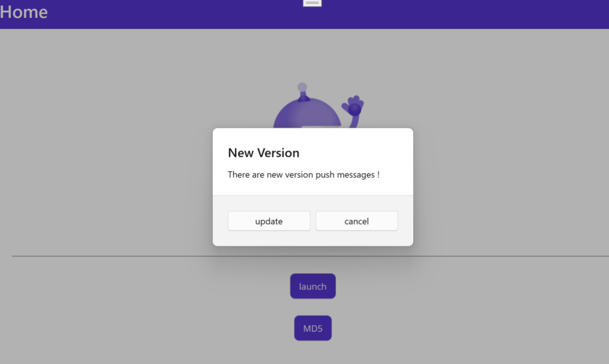
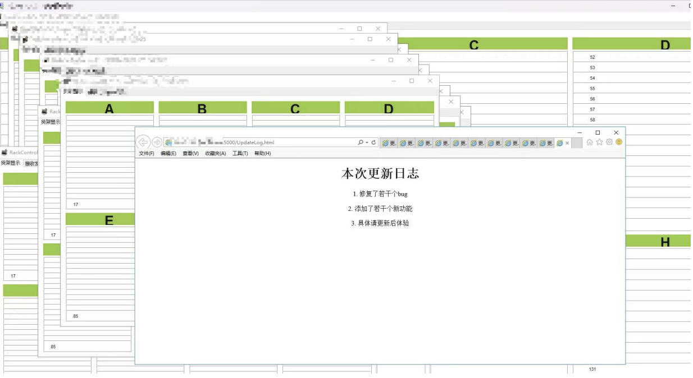

### 定义

命名空间：GeneralUpdate.ClientCore.Hubs

程序集：GeneralUpdate.ClientCore.dll


UpgradeHubService是基于SignalR实现的推送更新版本信息的机制，可以实现一对一和一对多的推送。

```c#
public class UpgradeHubService : IUpgradeHubService
```


### 示例

以下示例定义方法，包含VersionHub使用。

```c#
//1.常规使用方式
var hub = new UpgradeHubService("http://localhost:5000/UpgradeHub"
                , null,"dfeb5833-975e-4afb-88f1-6278ee9aeff6");
    hub.AddListenerReceive((message) =>
    {
        //message目前限定为Packet对象的json字符串
        Debug.WriteLine(message);
    });
await hub.StartAsync();

//2.在拥有依赖注入能力的项目中也可以依赖注入，例如：Prism
protected override void RegisterTypes(IContainerRegistry containerRegistry)
{
    // Register Services
    ontainerRegistry.Register<IUpgradeHubService, UpgradeHubService>();
}

public MainWindowViewModel(IUpgradeHubService service) 
{
    service.StartAsync();
    //...
}
```

**（1）点对点推送**




**（2）一次推送更新给多个客户端**




### 注解

UpgradeHubService提供接收服务器推送消息功能。


#### 方法

| Method                   |                                    |
| ------------------------ | ---------------------------------- |
| AddListenerReceive()     | 实时订阅服务端推送的最新版本信息。 |
| AddListenerOnline()      | 在线、离线监听通知                 |
| AddListenerReconnected() | 重新连接通知                       |
| AddListenerClosed()      | 关闭连接通知                       |
| StartAsync()             | 开启连接                           |
| StopAsync()              | 暂停连接                           |
| DisposeAsync()           | 释放Hub对象实例                    |


### 🌼UpgradeHubService()

**构造函数**

Hub构造函数初始化。

```c#
UpgradeHubService(string url, string? token = null, string? appkey = null)
```


**参数**

```c#
url string Hub的订阅地址。

token string Id4的认证流程所需要用到的token字符串。

appkey string 客户端密钥，唯一标识推荐值为Guid，可随机生成。
```


### 适用于

| 产品           | 版本          |
| -------------- | ------------- |
| .NET           | 5、6、7、8、9、10 |
| .NET Framework | 4.6.1         |
| .NET Standard  | 2.0           |
| .NET Core      | 2.0           |
| ASP.NET        | Any           |