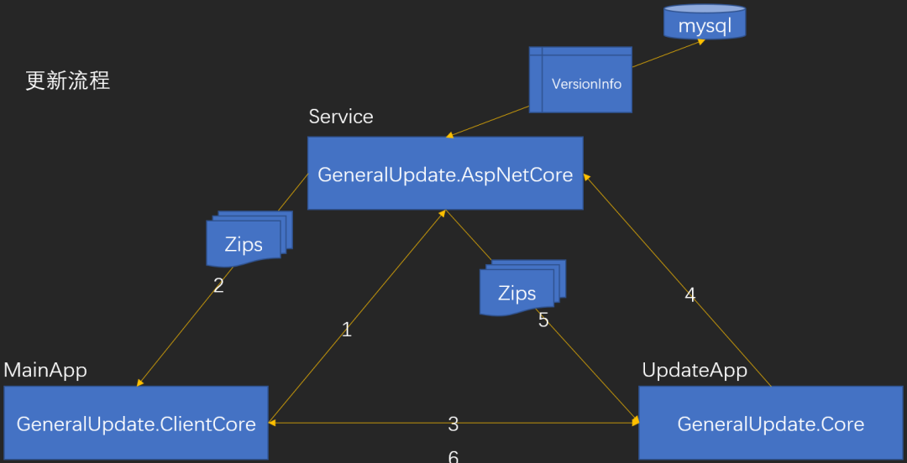
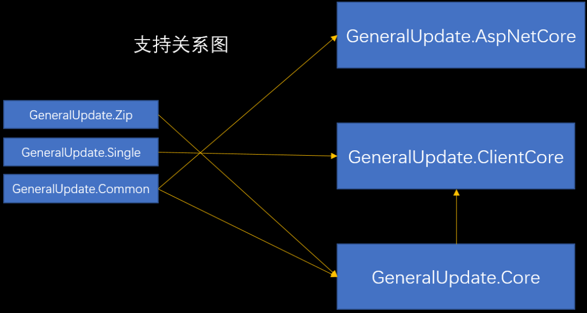

# 📒更新日志

## 📍2026-04-10

- 新增 `AddListenerUpdatePrecheck(Func<UpdateInfoEventArgs, bool>)` 到 `GeneralClientBootstrap` —— 统一的更新预检入口，接收完整版本信息并通过返回值决定是否跳过（`true` = 跳过，`false` = 继续）；替代旧的 `AddListenerUpdateInfo` + `SetCustomSkipOption` 组合。强制更新（`IsForcibly`）时，回调返回值被忽略，更新始终执行。
- 移除已废弃的 `SetCustomSkipOption`。
- 新增 `AddListenerUpdateInfo(Action<object, UpdateInfoEventArgs>)` 到 `GeneralClientBootstrap` 和 `GeneralUpdateBootstrap` —— 在版本验证完成后立即触发；`VersionInfo` 新增 `UpdateLog` 字段用于携带版本更新日志。
- 新增静默更新模式（`UpdateOption.EnableSilentUpdate`）—— 在后台每 20 分钟轮询检测新版本，静默准备更新包，在主程序退出后自动启动升级流程。
- 新增 `ConfiginfoBuilder` —— `Configinfo` 的零配置构建器，仅需 `UpdateUrl`、`Token`、`Scheme` 三个参数，其他字段自动从 `.csproj` 文件和运行时平台（Windows / Linux / macOS）检测。
- 新增 `DriverDirectory` 字段到 `Configinfo` / `BaseConfigInfo`，并通过 `ConfigurationMapper`、`ProcessInfo`、`PipelineContext` 传递至 `DrivelutionMiddleware`，以支持驱动更新功能。
- 移除 `GeneralUpdateBootstrap` 中已废弃的 `SetFieldMappings` 方法。
- 为 `GeneralUpdate.Bowl`、`GeneralUpdate.Extension`、`GeneralUpdate.Core`、`GeneralUpdate.ClientCore`、`GeneralUpdate.Drivelution` 补充完整的生命周期追踪（`GeneralTracer`）。
- 修复 `DefaultCleanMatcher.Match` 对不同目录下同名文件错误返回 `null` 的问题。
- 修复 `BinaryHandler.Dirty` 中遗留临时文件导致重复更新时补丁失败的问题。


## 📍2026-01-06 10.0.0

- 适配.NET10升级引用组件版本。
- 新增.NET 10 dotnet run x.cs脚本化运行GeneralUpdate。
- 重构部分功能。


## 📍2026-01-01 9.5.10

- 修复BinaryHandler中File.Move(_newfilePath, _oldfilePath);文件占用问题。
- 修复在 linux 下 Environments.GetEnvironmentVariable("ProcessInfo") 为空问题。
- 新增在Linux 中给更新后的文件设置可执行程序权限。
- 重构部分功能。


## 📍2025-02-20 9.1.6

- 修复OSS无需更新的时候直接关闭当前进程。


## 📍2025-01-13 9.1.5

- 修复LastVersion取值错误问题


## 📍2025-01-13 9.1.4

- 修复Environment.SetEnvironmentVariable函数带来的执行缓慢问题。
- 在黑名单中添加了以下ClientCore 和 Core共同引用的文件（整个打包、升级流程都不会操作这些文件）：

```c#
"Microsoft.Bcl.AsyncInterfaces.dll",
"System.Collections.Immutable.dll", 
"System.IO.Pipelines.dll", 
"System.Text.Encodings.Web.dll",
"System.Text.Json.dll"
```


## 📍2025-01-05 9.1.2

- 修复hash校验异常继续执行更新问题
- 解除Common组件和Differential组件与Bowl / ClientCore / Core引用，解决相互升级出现dll占用问题。

- 说明Common和Differential仅存在于GeneralUpdate解决方案中更新迭代，不再更新至Nuget平台。Common组件和Differential组件所有用的能力通过代码文件引用的方式继续存在于Bowl / ClientCore / Core组件中。开发者无需再关心Common和Differential组件是否引用。


## 📍2025-01-04 9.1.0

- 添加屏蔽指定文件夹跳过功能（指定参数会流转Client、Upgrade）。
- 添加http请求头传入Scheme 和 Token参数。
- 修复OSS Samples 更新失败问题。
- 修改OSS 功能更新完成不删除更新包问题。
- 修复 Samples 中 Client 和 Upgrade 只启动Client更新问题。（出现循环更新的现象是因为没有修改本地版本号）
- 所有Sample 从9.0.0升级库至9.1.0。


## 📍2024-11-28 9.0.0

- 更新所有组件C#语法均升级至C#13。

- 优化、重构、精简代码，以最少的代码实现功能降低代码阅读难度。

- 简化了GeneralClientBootstrap的传入参数复杂度。

- 移除Strategys参数设置，内置在组件内可自推断所在操作系统平台切换更新策略，开发者无需再关心更新策略设置。

- 新增驱动更新、备份、安装功能。

- 优化了自动升级流程，更新状态的四种工作流：

  1.客户端需要升级、升级端需要升级 

  2.客户端不需要升级、升级端不需要升级 

  3.客户端不需要升级、升级端需要升级 

  4.客户端需要升级、升级端不需要升级

- 如果更新失败的版本将会存储在本地，回滚之后再遇到失败版本则跳过更新。

- GeneralUpdate的OSS功能目前仅支持windows，仅支持zip压缩格式。

- 移除GeneralUpdateOSS通知所有事件。

- 新增GeneralUpdate.Bowl组件

- GeneralUpdate.Bowl包含回滚、监测、导出dump功能（Only windows，linux会陆续开放）。

- 新增GeneralUpdate.Common组件

- 移除GeneralUpdate.Zip组件

- 移除GeneralUpdate.AspnetCore组件

- 移除MultiDownloadProgressChangedEvent，将该事件的通知内容合并至MultiDownloadStatisticsEvent。

- 移除遗言功能，由GeneralUpdate.Bowl代替。

- 移除7z压缩格式支持，仅支持zip压缩格式。

- 移除ProgressType几种工作模式通知事件参数。

- 移除VersionHub，由UpgradeHubService替代（推送功能）。

- 更新组件内所有Hash值相关校验、生成均为SHA256算法，移除MD5算法。

- 新增更新前备份当前程序所有文件内容。

- 支持Ubuntu操作系统。

- 兼容并支持AOT编译，移除或重构所有不利于AOT编译或使用的代码。

- 所有组件版本号跟随.NET Core的框架版本号。并且统一共享一个版本号，不再各自维护单独的版本号。

- 更新Sample示例更新，使用bat脚本一键生成。

- 修复了若干issue中提出的bug。

- 转移GeneralUpdate.Maui.OSS和GeneralUpdate.OSS类库至新仓库GeneralUpdate.Maui。

- GeneralUpdate.Differential移除GeneralUpdate.Zip引用，并且移除所有压缩包处理能力。

- 新增升级流程上报服务器升级状态，升级状态为待更新、更新失败、更新成功。

- 重构GeneralUpdate.Tools为Avalonia版本，适配在Linux操作系统上制作差分补丁包。


## 📍2023-08-05

在企业产品发布到市场之前需要对功能进行测试，在大部分公司里自动升级功能不像产品功能一样有需求文档或者业务说明等文档。通常的要求就是能正常升级公司产品或能增量更新节约流量即可。这时候对测试经验不足的人员来说测试不充分或者大家都没有考虑到将会造成很多麻烦。（这里只是提供一种测试的思路，并非专业测试指导请辩证看待）

1.测试版本升级顺序

假设市场上所有的客户现在使用的程序版本是v1.0.0.0，我们即将发布v2.0.0.0。在发布之前就需要在测试环境中将两个版本升级测试一下。

- 下载更新包时
- 正在更新文件时
- 强制中断程序运行、断网、直接断电、模拟弱网、模拟崩溃等

2.加密文件无法升级

在GeneralUpdate中在两个版本中提取二进制差分更新补丁文件时，会出现加密文件无法被差分算法识别的情况这个时候需要考虑在生成差分补丁包时，将加密过的文件加入到（SetBlacklist）黑名单中或者考虑直接覆盖（直接打在压缩包里）。

3.失败回滚或者重新升级？

这方面也是企业中大家最在意的一点，自动升级虽然能带来诸多好处。但是升级失败会直接导致客户端根本没法使用这是非常致命的，后续我会考虑在GeneralUpdate中新增两种策略来解决这个问题。

- 策略一

升级之前将需要被更新的文件或目录进行备份，如果更新失败第二次启动则会将备份文件还原至原来的目录，并关闭自动升级的开关以防止文件还原之后再次进行自动升级。

- 策略二

这个是我内心中比较推荐的升级方式，因为自动升级程序的意义就是升级而不是回滚。目前初步的想法是新增遗言机制。为解决在更新时遇到异常情况，导致文件损坏更新的问题。1.每次更新完成，需返回给服务器更新状态。如果客户端在30分钟内没有任何反馈则判定为毁坏性更新失败。（文件损坏）2.升级程序每次启动时会读取上一次更新的遗言，如果上次更新为失败自动化下载、安装客户端安装包（压缩包）3.或者新增更新守护进程接收实时推送自动化下载、安装客户端安装包（压缩包）

4.项目结构调整

如果开发人员对项目结构发生了一些结构性质的修改。例如基于IoC思想搭建的客户端程序，例如Prism框架如果开发人员把其中的一个Module更换了文件夹的位置或者文件夹名称修改了，导致用户的客户端更新了之后IoC容器启动之后找不到该DLL的异常情况。更新时需要考虑到文件路径变化的问题。测试人员也有责任例行询问是否有该种类的变化。

5.作为最后闭环流程再测试

这个事项是非常需要注意的，如果前面就把自动升级先测试了。如果后续有bug修复或者其他变动都有可能会造成未知的异常情况出现。所以作为最后的闭环流程进行测试是比较推荐的（如有特殊情况按需要调整即可）。

6.弱网环境测试

弱网环境模拟可以借助NetLimiter和Clumsy来进行测试，具体使用方法可以参考我的这篇文章。

[https://mp.weixin.qq.com/s?__biz=MzI5MTg4NzIyNg==&mid=2247486705&idx=1&sn=b2eac543ea7f738bdbe8c3cc63da3488&chksm=ec088de4db7f04f25e5603d2309d61279b0f94ee6eef34129801755a86cf406f863896214b3c&token=1809721461&lang=zh_CN#rd](https://mp.weixin.qq.com/s?__biz=MzI5MTg4NzIyNg==&mid=2247486705&idx=1&sn=b2eac543ea7f738bdbe8c3cc63da3488&chksm=ec088de4db7f04f25e5603d2309d61279b0f94ee6eef34129801755a86cf406f863896214b3c&token=1809721461&lang=zh_CN&scene=21#wechat_redirect)

7.灰度发布

版本发布之前就需要做好测试。

- 如果面对的客户群体庞大则需要小范围的灰度发布，如果没有问题再选择发布给市场上所有客户。
- 如果是灰度升级版本，这个时候就不要设置为强制更新的版本了。让用户自己选择是否升级。

8.精准升级

在GeneralUpdate中目前已有的基于Signal R接收推送最新版本更新的方式。假设在市场上有很多客户，每个客户有很多台设备。那么其中客户A有10台电脑，只有其中一台电脑因为硬件或者软件环境出现了问题导致客户端的功能异常。这个时候需要紧急针对该台设备的情况进行修复，这个时候并不清楚这个修改会不会对现在已经正常运行的客户端程序有影响。这个时候可以考虑使用一对一的升级方式精准升级某台出问题的电脑。

9.老配置兼容新版本

在市场上如果存在各个分支的版本时，每次自动更新升级还需要考虑到本地配置文件的问题。如果升级到新版本的程序之后需要读配置文件这个时候，老版本的配置文件兼容不了也会造成问题。这个时候测试人员也需要注意该种场景。

规避这种问题的方式可以把大部分容易变动的配置放到服务端每次登录的时候去读取。把不容易变化的配置保存到本地。

10.自动化测试

自动升级的自动测试化测试的脚本编写也非常重要，在多分支、多版本的升级测试中节省时间,增加测试的准确性。


## 📍2023-07-23

开发者提问：

- （1）在更新过程中出现了断网、断电、电脑死机、突然蓝屏、程序假死等意外情况，导致应用程序无法正常进行更新或者无法正常启动如何解决？能否让更新程序回滚到这次更新之前？

答：这个问题分两块回答，（1）意外情况可以尝试重启应用程序断点下载更新，目前的情况来说如果在更新过程中出现文件损坏无法只能重新安装。后续会考虑增加一种机制处理更新异常情况无法启动客户端应用程序的问题。（2）不能，因为目前的想法来说自动升级程序的核心意义就是升级，如果回滚回去了升级可能就失去了意义。可能会希望及时发现问题，然后紧急更新一个安全的更新包让客户端逐版本更新直到成功。


- （2）如果更新包打包本身（更新包里本身就有异常文件）就有问题，更新完成之后程序无法正常启动。能不能回滚或者备份？

 答：不能，在该版本发布之前就需要做好测试。如果面对的客户群体庞大则需要小范围的灰度发布，如果没有问题再选择发布给市场上所有客户。


- （3）如果客户端本地保存了一些数据文件，在保留之前的数据的文件基础上需要新增一些内容，例如sqlite的.db文件更新之后被之前的.db文件被覆盖，如何解决？或者增量更新是否可以正常更新这些文件？

答：之前有开发过这样的功能，效果不好暂时下线了；后续需要重新设计再启用该类功能。组件目前的功能完成度暂时无法解决这个问题，只能覆盖。增量更新也有极大的可能更新不了这种情况。


## 📍2023-04-23

使用技术更新

黑名单功能，OSS新功能发布，针对windows和.NET MAUI Android 版本。修复了部分bug和重构了组件整体的事件管理通知机制。

1.发布内容

| 组件名称                   | 版本号（old） | 版本号（new） | 状态   |
| -------------------------- | ------------- | ------------- | ------ |
| GeneralUpdate.AspNetCore   | 1.4.1         | -             | -      |
| GeneralUpdate.ClientCore   | 2.8.9         | 2.12.9        | 新版本 |
| GeneralUpdate.Core         | 4.11.18       | 4.14.18       | 新版本 |
| GeneralUpdate.Differential | 1.3.0         | 1.4.1         | 新版本 |
| GeneralUpdate.Zip          | 1.3.0         | -             | -      |
| GeneralUpdate.Tool         | 2.2.5         | 2.3.5         | 新版本 |
| GeneralUpdate.Single       | 1.0.0         | -             | -      |
| GeneralUpdate.Maui.OSS     | 1.0.0         | 1.0.0         | 新版本 |


【1】组件GeneralUpdate.ClientCore

1.新增OSS更新功能

2.新增黑名单功能

3.重构事件，添加事件管理机制

4.修复，增量包只能识别新增，不能识别删除


【2】组件GeneralUpdate.Core

1.新增OSS更新功能

2.重构事件，添加事件管理机制

3.修复，增量包只能识别新增，不能识别删除


【3】组件GeneralUpdate.Differential

1.修复，增量包只能识别新增，不能识别删除

2.1 组件GeneralUpdate.ClientCore、组件GeneralUpdate.Core改动

1.事件订阅机制重构之后不再使用event+=订阅方式，通过事件EventManger添加事件监听。对于开发者来说只需要轻微的代码修改即可适应新版本。对于组件本身而言减少大量的代码，组合优于继承。

2.添加黑名单管理SetBlacklist方法，可以设置不想更新的某个具体文件或者某个类型的文件，组件内置默认黑名单文件：{ "Newtonsoft.Json.dll" } 默认黑名单文件扩展名：{ ".patch", ".7z", ".zip", ".rar", ".tar" , ".json" }。

```c#
           Task.Run(async () =>
          {
               //ClientStrategy该更新策略将完成1.自动升级组件自更新 2.启动更新组件 3.配置好ClientParameter无需再像之前的版本写args数组进程通讯了。
               //generalClientBootstrap.Config(baseUrl, "B8A7FADD-386C-46B0-B283-C9F963420C7C").
               var configinfo = GetWindowsConfiginfo();
               var generalClientBootstrap = await new GeneralClientBootstrap()
               //单个或多个更新包下载通知事件
              .AddListenerMultiDownloadProgress(OnMultiDownloadProgressChanged)
               //单个或多个更新包下载速度、剩余下载事件、当前下载版本信息通知事件
              .AddListenerMultiDownloadStatistics(OnMultiDownloadStatistics)
               //单个或多个更新包下载完成
              .AddListenerMultiDownloadCompleted(OnMultiDownloadCompleted)
               //完成所有的下载任务通知
              .AddListenerMultiAllDownloadCompleted(OnMultiAllDownloadCompleted)
               //下载过程出现的异常通知
              .AddListenerMultiDownloadError(OnMultiDownloadError)
               //整个更新过程出现的任何问题都会通过这个事件通知
              .AddListenerException(OnException)
              .Config(configinfo)
              .Option(UpdateOption.DownloadTimeOut, 60)
              .Option(UpdateOption.Encoding, Encoding.Default)
              .Option(UpdateOption.Format, Format.ZIP)
              .Strategy<WindowsStrategy>()
               //注入一个func让用户决定是否跳过本次更新，如果是强制更新则不生效
              .SetCustomOption(ShowCustomOption)
               //默认黑名单文件：{ "Newtonsoft.Json.dll" } 默认黑名单文件扩展名：{ ".patch", ".7z", ".zip", ".rar", ".tar" , ".json" }
               //如果不需要扩展，需要重新传入黑名单集合来覆盖。
              .SetBlacklist(GetBlackFiles(), GetBlackFormats())
              .LaunchTaskAsync();
          });
```


1.新增OSS功能

OSS的全称是对象存储服务（Object Storage Service），做服务端技术栈开发的小伙伴肯定对这个不陌生在各大云服务器厂商都会提供类似的服务,说简单点就是一个文件服务器。例如：阿里云OSS、腾讯云COS、华为云OBS，其实它们只是名字不一样功能服务都差不多。然后本更新组件新功能的实现思路非常相似那么就选择了OSS来为该功能命名，而且方便开发者一眼能get到这个功能的作用（需要使用组件GeneralUpdate.ClientCore、GeneralUpdate.Core）。


2.GeneralUpdate.OSS运行原理

1.准备version.json版本信息配置文件，更新文件（update.zip）更新文件和之前的打包方式一样。

```json
[
{
"PubTime": 1680443321,
"Name": "generalupdate.ossclient",
"MD5": "9bf414990a67e74f11752d03f49b15d8",
"Version": "1.0.4",
"Url": "http://192.168.50.203/update.zip"
},
{
"PubTime": 1680444916,
"Name": "generalupdate.ossclient",
"MD5": "JXC122DFXCZXZNMRFf11752d03f49b15d8",
"Version": "1.0.5",
"Url": "http://192.168.50.203/update2.zip"
}
]
```

2.Client启动时直接请求OSS服务器或文件服务器，下载version.json文件。

3.下载到本地之后解析版本信息内容判断是否需要更新，如果将信息通过进程启动传递Upgrade（Client自我关闭）。

4.Upgrade启动之后直接去下载update.zip，下载到本地之后直接解压覆盖本地文件。

5.Upgrade更新完成之后把Client启动起来，自我关闭。更新结束。

GeneralUpdateOSS的功能和GeneralUpdateBootstrap功能对比来说，使用的门槛非常低如果公司对自动更新的要求不高的话可以使用这个功能。一句话概括这个功能就是下载version.json根据文件里的内容去逐版本下载更新包，下载下来之后直接解压更新就结束了。


3.快速启动

Client（主客户端）使用代码示例：

```c#
Task.Run(async () =>
{
    var url = "http://192.168.50.203";
    var appName = "GeneralUpdate.Client";
    var version = "1.0.0.0";
    var versionFileName = "version.json";
    ParamsOSS @params = new ParamsOSS(url, appName, version, versionFileName);
    await GeneralClientOSS.Start(@params);
});
```


Upgrade(升级助手)使用代码示例：

```c#
private static void Main(string[] args)
{
  Task.Run(async () =>
  {
     //var url = "http://192.168.50.203";
     //var appName = "GeneralUpdate.Client";
     //var version = "1.0.0";
     //var versionFileName = "version.json";
     //SerializeUtil.Deserialize<ParamsOSS>(args[0]);
     //ParamsOSS @params = new ParamsOSS(url, appName, version, versionFileName);
     ParamsOSS @params = SerializeUtil.Deserialize<ParamsOSS>(args[0]);
     await GeneralUpdateOSS.Start<OSSStrategy>(@params,Encoding.Default);
  });
}
```


4.事件通知订阅

在OSS的更新过程中，保留了更新事件的参数和之前一样。

```c#
//code...
GeneralUpdateOSS.AddListenerMultiDownloadStatistics(OnMultiDownloadStatistics);

private static void OnMultiDownloadStatistics(object sender, MultiDownloadStatisticsEventArgs e)
{
  Console.WriteLine($" {e.Speed} , {e.Remaining.ToShortTimeString()}");
}
```


2.3  .NET MAUI OSS

MAUI OSS功能介绍和 11.OSS中介绍的是一样的。但是它是针对.NET MAUI编写的更新，使用的组件库是GeneralUpdate.Maui.OSS。目前只实现了MAUI Andorid平台的自动更新。

1.准备version.json版本信息配置文件，更新文件（update.apk）更新文件就直接是新版本的apk了(或.abb)。

```json
{
"PubTime": 1680444916,
"Name": "com.companyname.generalupdate.ossclient",
"MD5": "9bf414990a67e74f11752d03f49b15d8",
"Version": "1.0.5",
"Url": "http://192.168.50.203/com.companyname.generalupdate.ossclient.apk"
}
```

2.Client启动时直接请求OSS服务器或文件服务器，下载version.json文件。

3.下载到本地之后解析版本信息内容，判断是否需要更新。

4.需要更新则下载update.apk。

5.下载完成之后执行安装，这一步就交给了安卓操作系统执行。执行完成之后运行新版本app。


2.快速启动

```c#
//http://192.168.50.203/version.json
string url = "http://192.168.50.203";
string appName = "MainApplication.exe";
string currentVersion = "1.1.1.1";
string versionFileName = "versions.json";
GeneralUpdateOSS.AddListenerDownloadProcess(OnOSSDownload);
GeneralUpdateOSS.AddListenerException(OnException);
await GeneralUpdateOSS.Start<Strategy>(new ParamsAndroid(url, appName, "123456789", currentVersion, versionFileName));
```


3.事件通知订阅

```c#
GeneralUpdateOSS.AddListenerDownloadProcess(OnOSSDownload);
GeneralUpdateOSS.AddListenerException(OnException);

private void OnOSSDownload(object sender, OSSDownloadArgs e)
{
   Console.WriteLine($"{e.ReadLength},{e.TotalLength}");
}

private void OnException(object sender, ExceptionEventArgs exception)
{
   Console.WriteLine(exception.Exception.Message);
}
```


4. .NET MAUI Android 相关疑问处理引导文章

https://www.cnblogs.com/MASA/p/16612541.html

https://learn.microsoft.com/zh-cn/dotnet/maui/android/deployment/?view=net-maui-7.0

https://stackoverflow.com/questions/45940861/android-8-cleartext-http-traffic-not-permitted

https://note.youdao.com/ynoteshare/mobile.html?id=5c5d5cf8fe1d67419b09024255ff239c


5.运行效果

目前已运行测试机型、平台 。

1.在华为荣耀Px30非鸿蒙系统手机可运行。

2.Visual studio 2022 preview Pixe 5 - API33 (Android 13.0 - API 33) 可运行。


## 📍2023-01-17

开源项目调整

在github和gitee的两个开源平台分别建立了General开源组织，会将具有一定代码贡献的小伙伴邀请到组织中来并分配奖励。

将原有的GeneralUpdate 拆分成了三个项目，分别是：

- https://gitee.com/GeneralLibrary

- 自动升级项目 https://gitee.com/GeneralLibrary/GeneralUpdate
- 差分补丁包打包工具 https://gitee.com/GeneralLibrary/GeneralUpdate.Tools
- 使用示例 https://gitee.com/GeneralLibrary/GeneralUpdate-Samples


## 📍2022-10-09

发布内容

| 组件名称                   | 版本号（old） | 版本号（new） | 状态 |
| -------------------------- | ------------- | ------------- | ---- |
| GeneralUpdate.AspNetCore   | 1.1.0         | 1.4.1         | 正常 |
| GeneralUpdate.ClientCore   | 2.3.6         | 2.8.9         | 正常 |
| GeneralUpdate.Core         | 4.10.12       | 4.11.18       | 正常 |
| GeneralUpdate.Differential | 1.0.0         | 1.3.0         | 正常 |
| GeneralUpdate.Zip          | 1.0.0         | 1.3.0         | 正常 |
| GeneralUpdate.Tool         | 1.0.0         | 2.1.5         | 正常 |
| GeneralUpdate.Single       | 1.0.0         | -             | 正常 |


【1】组件GeneralUpdate.AspNetCore

（1）重构：将之前的version和validate方法合并为Update方法，将这一个方法完成版本验证和返回更新信息功能。

（2）新增：为配合GeneralUpdate.PacktTool自动上传发布功能，新增了upload方法。完成版本信息入库和更新包落文件服务器。

GeneralUpdate.AspNetCore组件添加文件上传接口 · Issue #I55NFC · Juster.zhu/GeneralUpdate - Gitee.com

（3）新增：该方法是为了配合客户端即使推送重要版本或服务端服务之间的更新，新增的push调用一次之后会通过Signal R推送更新信息。


【2】组件GeneralUpdate.ClientCore

（1）修复：AutoUpdate.Core与AutoUpdate.ClientCore文件冲突问题 · Issue #I5F2YM · Juster.zhu/GeneralUpdate - Gitee.com

（2）修复：更新组件无需更新报错 · Issue #I5F1VN · Juster.zhu/GeneralUpdate - Gitee.com

（3）重构：更新机制需适配多个操作系统平台 · Issue #I5LYQZ · Juster.zhu/GeneralUpdate - Gitee.com

（4）重构：重构版本验证机制 · Issue #I5LYQY · Juster.zhu/GeneralUpdate - Gitee.com

（5）新增：配置适应MAUI - Windows machice · Issue #I4TGJC · Juster.zhu/GeneralUpdate - Gitee.com

（6）修复：当主程序已经是最新时，是不是应该先判断，这时候就不用启动升级软件吧？ · Issue #I5O53P · Juster.zhu/GeneralUpdate - Gitee.com

（7）重构：

将

```
public GeneralClientBootstrap Config(ClientParmeter info)
```

修改为：

```
public GeneralClientBootstrap Config(Configinfo info)
```

只是改变了类名称，字段内容删除validaterul和versionurl。

（8）新增：

用户自定义方法，决定是否跳过本次更新的Task版本方法。

```c#
public GeneralClientBootstrap SetCustomOption(Func<Task<bool>> func)
```

（9）新增：

在更新配置中新增了枚举，将原来的字符串“.zip”修改为枚举Format.ZIP，防止用户输入字符串错误。

```c#
Option(UpdateOption.Format, Format.ZIP)
```


【3】组件GeneralUpdate.Core

（1）重构：更新机制需适配多个操作系统平台 · Issue #I5LYQZ · Juster.zhu/GeneralUpdate - Gitee.com

（2）重构：重构版本验证机制 · Issue #I5LYQY · Juster.zhu/GeneralUpdate - Gitee.com

（3）修复：当主程序已经是最新时，是不是应该先判断，这时候就不用启动升级软件吧？ · Issue #I5O53P · Juster.zhu/GeneralUpdate - Gitee.com

（4）修复：BUG: "GeneralUpdate.Core\Utils\FileUtil.cs" GetFileMD5 函数异常 · Issue #I5J0KA · Juster.zhu/GeneralUpdate - Gitee.com

（5）修复：多级文件夹结构更新失败问题 · Issue #I59QRI · Juster.zhu/GeneralUpdate - Gitee.com

（6）新增：在更新体系中添加客户端唯一标识 · Issue #I55NFP · Juster.zhu/GeneralUpdate - Gitee.com

（7）下线：json配置文件更新功能，将直接覆盖。等待重构完成再次上线。影响范围如下：

老哥，一点点建议 · Issue #I556BK · Juster.zhu/GeneralUpdate - Gitee.com

报错 · Issue #I53XYX · Juster.zhu/GeneralUpdate - Gitee.com

（8）调研：可行。

调研Mac环境下是否可以正常运行 · Issue #I4TGKK · Juster.zhu/GeneralUpdate - Gitee.com

（9）修复：bug："GeneralUpdate\src\GeneralUpdate.Core\Download\AbstractTask.cs" 第143行 · Issue #I4WQQ0 · Juster.zhu/GeneralUpdate - Gitee.com


【4】组件GeneralUpdate.Differential

重构：递归查找需更新文件，防止一些文件没有更新检测到。添加树形结构管理更新文件目录结构。

修复：只能更新第一层文件bug，现在可以递归更新所有目录下的文件夹和子文件夹内的文件列表。

修复：打包工具打包文件包含两个名称相同但后缀不同的文件时会出错 · Issue #I5O4OD · Juster.zhu/GeneralUpdate - Gitee.com


【5】组件GeneralUpdate.Zip

（1）修复：关于文件压缩的几个问题 · Issue #I5J4Y6 · Juster.zhu/GeneralUpdate - Gitee.com

（2）修复：word文件乱码 · Issue #I5O4S6 · Juster.zhu/GeneralUpdate - Gitee.com

（3）修复：下载包解压在C盘下Program Files (x86)时，没有权限操作怎么处理？ · Issue #I4ZKQ4 · Juster.zhu/GeneralUpdate - Gitee.com


【6】GeneralUpdate.PacketTool

（1）修复：打包工具打包时，没有考虑有子文件夹的问题 · Issue #I5O4P8 · Juster.zhu/GeneralUpdate - Gitee.com

（2）重构：重构文件功能体系 · Issue #I59Q5W · Juster.zhu/GeneralUpdate - Gitee.com

（3）重构：打包工具迁移到MAUI · Issue #I5QOLG · Juster.zhu/GeneralUpdate - Gitee.com

（4）新增：GeneralUpdate.Tool添加上传功能 · Issue #I55NF1 · Juster.zhu/GeneralUpdate - Gitee.com

（5）修复：当只修改文件内容时，PacketTool打包功能无效 · Issue #I5BERJ · Juster.zhu/GeneralUpdate - Gitee.com

（6）修复：文件解压后中文名显示乱码 · Issue #I502QQ · Juster.zhu/GeneralUpdate - Gitee.com


【7】测试用例 、示例代码

示例代码：

src/c#/GeneralUpdate.Api/Program.cs · Juster.zhu/GeneralUpdate - Gitee.com

src/c#/GeneralUpdate.Client/MainPage.xaml.cs · Juster.zhu/GeneralUpdate - Gitee.com

src/c#/GeneralUpdate.Upgrad/Program.cs · Juster.zhu/GeneralUpdate - Gitee.com

测试用例（还在完善）：

src/c#/TestClientCore/UnitTest1.cs · Juster.zhu/GeneralUpdate - Gitee.com

src/c#/TestDifferential/UnitTest1.cs · Juster.zhu/GeneralUpdate - Gitee.com

src/c#/TestMD5/UnitTest1.cs · Juster.zhu/GeneralUpdate - Gitee.com

src/c#/TestService/Program.cs · Juster.zhu/GeneralUpdate - Gitee.com

src/c#/TestZIP/UnitTest1.cs · Juster.zhu/GeneralUpdate - Gitee.com


## 📍2022-04-03

（1）主程序和升级程序之间是否支持相互升级？

答：支持。

（2）是否需要开发者写代码关闭进程的时机或者其他代码？

答：不需要，组件已经将整个更新流程考虑到了。所以除了组件代码以外，不需要开发者额外多写任何辅助代码。

（3）更新程序是否需要和主程序放在同一个目录下？

答：是的，需要。但一定要保持升级程序不能引用主程序的里的任何代码。否则会更新失败。

（4）更新完成之后会删除更新包的补丁文件吗？

答：会的，组件更新完成之后会保证文件列表干净，不会出现冗余文件污染、磁盘空间占用的情况。

（5）可以运用在服务端吗？就是服务与服务之间的升级。

答：理论上支持的，作者没有实际这么使用过。据反馈有的小伙伴已经这么干了。本次分享是针对C/S架构的场景。

（6）怎么获取更新包的MD5码？

答：使用项目源码里的，AutoUpdate.MD5工程。

（7）怎么制作一个更新包？

答：使用GeneralUpdate.PacketTool工具生成即可。在源码仓库的release中可以看到打包好的安装程序。

（8）关于组件的其他内容如何了解到？

答：可以通过官方网站、或者相关Q群、以及我gitee或github的issue中与我交流。

（9）下载包解压在C盘下Program Files (x86)时，没有权限操作怎么处理？

答：https://gitee.com/Juster-zhu/GeneralUpdate/issues/I4ZKQ4

（10）更新文件较小时，下载速度显示为：0B/S 。

答：https://gitee.com/Juster-zhu/GeneralUpdate/issues/I3POMG


## 📍2022-03-23

说明

- 在线帮助文档：http://justerzhu.cn/  （后续将会按组件拆分成对应的文档）
- Nuget版本管理参考标准：https://docs.microsoft.com/zh-cn/nuget/concepts/package-versioning
- 应用程序集版本管理参考标准：https://docs.microsoft.com/zh-cn/dotnet/standard/assembly/versioning （被组件更新的客户端程序，说通俗点就是你公司的产品；组件的操作将按照这个标准执行。）
- 本次版本发布会有很多改变，不是平滑升级（追求稳定或不想改动慎用）。本项目正在逐渐稳定后续将会平滑升级避免开发者再度修改。
- 如果发生“乌龙事件” 例如：发布更新包内容自身错误或更新过程中发生意外，不可回滚。目前解决方案（1）重新请求更新，（2）通过推送机制发送紧急修复版本更新包；来解决此类问题。
- 关于“不可回滚”这个问题，如果有更好的办法希望各位可以直接在issues中提出您的看法；目前社区中有两种声音（1）出现意外情况希望组件可以将本地程序回滚至原来的版本，保证哪怕更新失败也要用户可用。（2）更新组件的意义就是将组件推向新的版本让本次的版本发布有效，如果更新失败那么让它更新成功为止；只许前进不许退


发布内容

这里先看看发布的版本号以及这次大版本的更新发生了哪些改动（共8个部分）。

| 组件名称                   | 版本号（old） | 版本号（new） | 状态 |
| -------------------------- | ------------- | ------------- | ---- |
| GeneralUpdate.AspNetCore   | 1.0.0         | 1.1.0         | 正常 |
| GeneralUpdate.ClientCore   | 1.1.2         | 2.3.6         | 正常 |
| GeneralUpdate.Core         | 3.6.10        | 4.10.12       | 正常 |
| GeneralUpdate.Differential | -             | 1.0.0         | 正常 |
| GeneralUpdate.Common       | 1.0.0         | -             | 移除 |


【1】组件GeneralUpdate.AspNetCore

（1）[NEW] 添加了最新版本推送功能，VersionHub对象。主要解决临时需要推送紧急修复重大bug的版本。

```c#
var builder = WebApplication.CreateBuilder(args);
builder.Services.AddSingleton<IUpdateService, GeneralUpdateService>();
builder.Services.AddSignalR();
var app = builder.Build();

app.MapHub<VersionHub>("/versionhub");

app.Use(async (context, next) =>
{
   var hubContext = context.RequestServices.GetRequiredService<IHubContext<VersionHub>>();
   await CommonHubContextMethod((IHubContext)hubContext);
   if (next != null)
  {
       await next.Invoke();
  }
});

async Task CommonHubContextMethod(IHubContext context)
{
   await context.Clients.All.SendAsync("clientMethod", "");
}
```


【2】组件GeneralUpdate.ClientCore

（1）[NEW] 在GeneralClientBootstrap中重载了配置方式，该方法简化为只需要传递远程服务器地址例如http://127.0.0.1 和更新程序名称即可，简化了开发者需要关心的参数组件内自动获取。

```c#
public GeneralClientBootstrap Config(string url, string appName = "AutoUpdate.Core");
```

（2）[NEW] 添加了最新版本接收推送功能，VersionHub对象。主要解决临时需要接收紧急修复重大bug的版本，可以在GetMessage回调函数中可添加更新操作。

```c#
VersionHub<string>.Instance.Subscribe($"{ baseUrl }/{ hubName }", "TESTNAME", new Action<string>(GetMessage));
```


【3】组件GeneralUpdate.Core

（1）[FIX] 修复下载中途断网，到达超时时间没有异常上抛问题。

（2）[REFACTOR] 重构多任务下载设计。

（3）[FIX] 修复FileUtil.Update32Or64Libs在某些情况下会抛出异常。

（4）[REFACTOR] 重构默认更新策略设计。

（5）[NEW] 添加了最新版本接收推送功能，VersionHub对象。主要解决临时需要接收紧急修复重大bug的版本。开发者可以在GetMessage回调函数中可添加更新操作。

```c#
VersionHub<string>.Instance.Subscribe($"{ baseUrl }/{ hubName }", "TESTNAME", new Action<string>(GetMessage));
```

（6）[NEW] 支持7z压缩包的解压功能。

（7）[REMOVE] 移除了GeneralUpdate.Core与GeneralUpdate.ClientCore 中重复代码，通用代码通过链接文件解决冗余问题。

（8）[NEW] 支持增量更新功能，例如：只更新了一个文件，那么就只将该文件打包。

（9）[NEW] 支持二进制差分功能，例如：temp.dll 发生了修改产生了新版本的文件，那么将会把temp.dll的新版本文件和老版本文件做一个差分。最后生成一个.patch的补丁文件，按照正常项目迭代那么这个.patch的补丁将会是kb级的。再配合7z的高压缩将更新包的大小做到目前状态下的极致节省流量和带宽占用。特别需要说明的是，如果在新版本中添加了新文件还是会将新增文件原封不动的打包到更新包中。


【4】组件[NEW]GeneralUpdate.Differential

在GeneralUpdate中新增组件Differential，该组件主要提供以下功能：

（1）[NEW] 新增二进制差分更新,生成.patch补丁文件。

（2）[NEW] 新增增量更新，例如：version 1.1.1.1原有10个文件这次版本发布修改了其中3个文件那么只会将修改的文件进行打包。

（3）[NEW] 更新配置文件（目前只支持.json配置文件且内容深度为1级），例如：客户端程序使用.json格式文件作为配置文件，那么将会保留客户端原有配置内容的前提下更新配置文件内容。假设客户端原有配置文件（.json）中包含内容：

```json
{
  "ip":"123456789",
  "port":9999
}
```

服务端新的配置文件结构为：

```json
{
  "ip":"0",
  "port":0,
  "path":"c://"
}
```

那么将会把，“path”字段更新到客户端本地配置文件中并保留原有内容为：

```json
{
  "ip":"123456789",
  "port":9999,
  "path":"c://"
}
```


【5】组件GeneralUpdate.Zip

（1）[REFACTOR] 重构压缩组件设计，将支持.zip和.7z压缩包格式。

（2）[NEW] 添加7z解压功能。


【6】组件[REMOVE]GeneralUpdate.Common

（1）移除该组件，解除GeneralUpdate.Core与GeneralUpdate.ClientCore 耦合，发现目前版本并不需要。


【7】组件GeneralUpdate.Single

本次未更新实际功能。


【8】测试用例 Example

为简化开发者在验证、测试过程中编写用例开发工作。在GeneralUpdate解决方案中添加了以下测试用例：

- AutoUpdate.ClientCore
- AutoUpdate.Core
- AutoUpdate.MD5
- AutoUpdate.Differential
- AutoUpdate.ZIP
- AutoUpdate.MinimalService
- AutoUpdate.Test


## 📍2022-02-16

目前框架支持

理论支撑：https://docs.microsoft.com/zh-cn/dotnet/standard/net-standard

| 框架名称                              | 是否支持         |
| ------------------------------------- | ---------------- |
| .NET Core 2.0                         | 支持             |
| .NET 5 6 7                            | 支持             |
| .NET Framework 4.6.1                  | 支持             |
| Mono 5.4                              | 理论支持，未验证 |
| Xamarin.iOS                           | 理论支持，未验证 |
| Xamarin.Mac                           | 理论支持，未验证 |
| Xamarin.Android                       | 理论支持，未验证 |
| Universal Windows Platform 10.0.16299 | 理论支持，未验证 |
| Unity 2018.1                          | 理论支持，未验证 |

| UI框架名称        | 是否支持           |
| ----------------- | ------------------ |
| WPF               | 支持               |
| UWP               | 未验证，等待反馈   |
| MAUI              | 暂不支持，正在兼容 |
| Avalonia          | 未验证，等待反馈   |
| WinUI             | 未验证，等待反馈   |
| Console（控制台） | 支持               |

| 操作系统名称 | 是否支持 |
| ------------ | -------- |
| Windows      | 支持     |
| Linux        | 未验证   |
| Mac          | 未验证   |
| iOS          | 暂不支持 |
| Android      | 暂不支持 |


## 📍2021-08-14

Notice

- 预计会使用Blazor开发GeneralUpdate官网，介绍组件结构、更新流程、快速启动、参数等内容。



  1.主程序启动时检测升级程序是否需要更新
  2.需要更新则把升级程序版本号上传并逐版本更新
  3.升级程序更完成后或不需要更新，则进行判断主程序
  是否需要更新如果需要更新则启动升级程序
  4.请求主程序更新版本
  5.请求到主版本多个更新包并逐版本更新
  6.更新完成后关闭升级程序启动主程序



- 以上更新、下载过程均支持断点续传和逐版本更新。
- 逐版本下载功能是根据版本发布时间进行排序的发布时间越早的版本越先更新（具体信息见源码中的sql脚本字段内容）。
- 逐版本下载的更新包最大测试过1G更新内容。


2.Nuget

- (New)https://www.nuget.org/packages/GeneralUpdate.Common/
- (New)https://www.nuget.org/packages/GeneralUpdate.ClientCore/
- (New)https://www.nuget.org/packages/GeneralUpdate.AspNetCore/
- https://www.nuget.org/packages/GeneralUpdate.Zip/
- https://www.nuget.org/packages/GeneralUpdate.Single/
- (Update)https://www.nuget.org/packages/GeneralUpdate.Core/

3.Issues & Git 、Gitee

欢迎在以下地址提出issues提出时尽可能的描述清楚异常发生的原因或缺陷详情，check周期为每周的周五。

- https://gitee.com/Juster-zhu/GeneralUpdate
- https://github.com/WELL-E/AutoUpdater/tree/autoupdate2
- https://github.com/WELL-E/AutoUpdater/issues
- https://gitee.com/Juster-zhu/GeneralUpdate/issues

4.New

- GeneralUpdate.Core添加逐版本更新功能
- GeneralUpdate.Core新增事件ExceptionEvent、MutiDownloadStatisticsEvent、MutiDownloadErrorEvent、MutiDownloadCompletedEvent、MutiDownloadProgressEvent、MutiAllDownloadCompletedEvent。
- GeneralUpdate.Core新增RemoteAddressBase64方法。
- 新增ClientParameter类，用于组件之间进程通讯传递参数。
- 新增组件GeneralUpdate.AspNetCore,具有根据升级类型返回更新版本信息的功能并支持管道依赖注入使用，但需要自己编写查库的方法。
- 新增组件GeneralUpdate.ClientCore,
  - (1)具有更新升级组件版本功能（更新程序更新自己）
  - (2)支持升级组件的逐版本更新(多更新包同时下载)
  - (3)便捷启动升级程序，摆脱之前的繁琐进程启动和传参。
- 新增组件GeneralUpdate.Common 该库整合了组件内使用的所有公共类和辅助方法（该组件为必须组件，该组件更新频率非常低不推荐打包在更新包中）。
- 新增mysql脚本，用于创建GeneralUpdate.AspNetCore服务端使用的update_version表。

5.Remove

- 移除GeneralUpdate.Core中所有的通知事件替换为MutixxxxEvent.
- 移除GeneralUpdate.Core中GeneralUpdateBootstrap启动中通过进程传递参数的方法RemoteAddress方法。
- 移除更新失败版本回滚功能，该功能导致在C盘回滚更新时因权限不够发生致命异常问题，该功能考虑后续开放。

6.Fix

- 修复https ssl访问失败问题。
- 修复其他.net框架版本注册事件begininvoke通知异常问题。
- 修改多处类名单词拼写错误问题。
- 对若干Model类删除了不必要字段。

7.Quick Start

**（1） Example GeneralUpdate.ClientCore**

```
            //Clinet version.
            var mainVersion = "1.1.1";
            var mianType = 1;

            //Updater version
            clientParameter = new ClientParameter();
            clientParameter.ClientVersion = "1.1.1";
            clientParameter.ClientType = 2;
            clientParameter.AppName = "AutoUpdate.ConsoleApp";
            clientParameter.MainAppName = "AutoUpdate.Test";
            clientParameter.InstallPath = @"D:\update_test";
            clientParameter.UpdateLogUrl = "https://www.baidu.com/";
            clientParameter.ValidateUrl = $"https://127.0.0.1:5001/api/update/getUpdateValidate/{ clientParameter.ClientType }/{ clientParameter.ClientVersion }";
            clientParameter.UpdateUrl = $"https://127.0.0.1:5001/api/update/getUpdateVersions/{ clientParameter.ClientType }/{ clientParameter.ClientVersion }";
            clientParameter.MainValidateUrl = $"https://127.0.0.1:5001/api/update/getUpdateValidate/{ mianType }/{ mainVersion }";
            clientParameter.MainUpdateUrl = $"https://127.0.0.1:5001/api/update/getUpdateVersions/{ mianType }/{ mainVersion }";

            generalClientBootstrap = new GeneralClientBootstrap();
            generalClientBootstrap.MutiDownloadProgressChanged += OnMutiDownloadProgressChanged;
            generalClientBootstrap.MutiDownloadStatistics += OnMutiDownloadStatistics;
            generalClientBootstrap.MutiDownloadCompleted += OnMutiDownloadCompleted;
            generalClientBootstrap.MutiAllDownloadCompleted += OnMutiAllDownloadCompleted;
            generalClientBootstrap.MutiDownloadError += OnMutiDownloadError;
            generalClientBootstrap.Exception += OnException;
            generalClientBootstrap.Config(clientParameter).
                Strategy<ClientStrategy>();
            await generalClientBootstrap.LaunchTaskAsync();
```

**（2） Example GeneralUpdate.Core**

```
    static void Main(string[] args)
    {
        var resultBase64 = args[0];
        var bootstrap = new GeneralUpdateBootstrap();
        bootstrap.Exception += OnException;
        bootstrap.MutiDownloadError += OnMutiDownloadError;
        bootstrap.MutiDownloadCompleted += OnMutiDownloadCompleted;
        bootstrap.MutiDownloadStatistics += OnMutiDownloadStatistics;
        bootstrap.MutiDownloadProgressChanged += OnMutiDownloadProgressChanged;
        bootstrap.MutiAllDownloadCompleted += OnMutiAllDownloadCompleted;
        bootstrap.Strategy<DefaultStrategy>().
            Option(UpdateOption.DownloadTimeOut, 60).
            RemoteAddressBase64(resultBase64).
            LaunchAsync();
    }
```

**（3） Example GeneralUpdate.AspNetCore**

```c#
    Startup.cs
    public void ConfigureServices(IServiceCollection services)
    {
        services.AddControllers();
        services.AddSingleton<IUpdateService, GeneralUpdateService>();
    }

    UpdateController.cs

    private readonly ILogger<UpdateController> _logger;
    private readonly IUpdateService _updateService;

    public UpdateController(ILogger<UpdateController> logger, IUpdateService updateService)
    {
        _logger = logger;
        _updateService = updateService;
    }

    /// <summary>
    /// https://localhost:5001/api/update/getUpdateVersions/1/1.1.1
    /// </summary>
    /// <param name="clientType"> 1:ClientApp 2:UpdateApp</param>
    /// <param name="clientVersion"></param>
    /// <returns></returns>
    [HttpGet("getUpdateVersions/{clientType}/{clientVersion}")]
    public async Task<IActionResult> GetUpdateVersions(int clientType, string clientVersion)
    {
        _logger.LogInformation("Client request 'GetUpdateVersions'.");
        var resultJson = await _updateService.UpdateVersionsTaskAsync(clientType, clientVersion, UpdateVersions);
        return Ok(resultJson);
    }

    /// <summary>
    /// https://localhost:5001/api/update/getUpdateValidate/1/1.1.1
    /// </summary>
    /// <param name="clientType"> 1:ClientApp 2:UpdateApp</param>
    /// <param name="clientVersion"></param>
    /// <returns></returns>
    [HttpGet("getUpdateValidate/{clientType}/{clientVersion}")]
    public async Task<IActionResult> GetUpdateValidate(int clientType, string clientVersion)
    {
        _logger.LogInformation("Client request 'GetUpdateValidate'.");
        var lastVersion = GetLastVersion();
        var resultJson = await _updateService.UpdateValidateTaskAsync(clientType, clientVersion, lastVersion, true, GetValidateInfos);
        return Ok(resultJson);
    }
```


## 📍2021-03-18

声明

1. 本组件将支持以下框架开发的应用程序。.NET Framework 4.6.1 | .NET Core 2.0 | .NET 5
2. GeneralUpdate.Single组件目前仅支持wpf和.NET Framework框架。

新增

1. GeneralUpdate.Core-3.2.1版本，新增更新失败回滚功能。
2. 新增了组件 GeneralUpdate.Zip-1.0.0，它将为程序带来压缩文件和解压压缩包的功能且能独立使用。

修复、修改

1. 修复事件多线程操作时，不通知问题。
2. 组件的框架版本从.NET Framework4.5.2修改为.net standard 2.0。（支持框架参考：https://docs.microsoft.com/zh-cn/dotnet/standard/net-standard）

移除

1. 移除7zip第三方组件的依赖
2. 移除RegistryUtil工具类


GeneralUpdate Quick start

```c#
        args = new string[6] {
            "0.0.0.0",
            "1.1.1.1",
            "https://github.com/WELL-E",
             "http://192.168.50.225:7000/update.zip",
             @"E:\PlatformPath",
            "509f0ede227de4a662763a4abe3d8470",
             };

        GeneralUpdateBootstrap bootstrap = new GeneralUpdateBootstrap();
        bootstrap.DownloadStatistics += OnDownloadStatistics;
        bootstrap.ProgressChanged += OnProgressChanged;
        bootstrap.Strategy<DefultStrategy>().
            Option(UpdateOption.Format, "zip").
            Option(UpdateOption.MainApp, "your application name").
            Option(UpdateOption.DownloadTimeOut,60).
            RemoteAddress(args).
            Launch();
```


## 📍2020-08-30

新增内容

1. 在新的发布中，GeneralUpdate.Core-2.1.0版本新增断点续传功能。
2. 在新的发布中，新增了组件 GeneralUpdate.Single-1.0.0，它将为程序带来单例运行功能，防止自动更新程序开启多个。

更新流程

1.客户端程序启动，向服务器获取更新信息解析并比对是否需要更新。

2.解析进程传参。例如：本机版本号、最新版本号、下载地址、解压路径、安装路径等。

3.客户端程序启动更新程序（GeneralUpdate），关闭自身（客户端把自己关掉）。

4.自动更新程序（GeneralUpdate）根据传递的更新信息进行， （1）下载、（2）MD5校验、（3）解压、（4）删除更新文件、（5）替换更新文件、（6）关闭更新程序自身、（7）启动客户端。

5.完成更新


进程之间相互调用

```
using System;
using System.Diagnostics;
using System.ComponentModel;

namespace MyProcessSample
{
    class MyProcess
    {
        //此段代码来自于msdn
        // Opens the Internet Explorer application.
        void OpenApplication(string myFavoritesPath)
        {
            // Start Internet Explorer. Defaults to the home page.
            Process.Start("IExplore.exe");

            // Display the contents of the favorites folder in the browser.
            Process.Start(myFavoritesPath);
        }

        // Opens urls and .html documents using Internet Explorer.
        void OpenWithArguments()
        {
            // url's are not considered documents. They can only be opened
            // by passing them as arguments.
            Process.Start("IExplore.exe", "www.northwindtraders.com");

            // Start a Web page using a browser associated with .html and .asp files.
            Process.Start("IExplore.exe", "C:\\myPath\\myFile.htm");
            Process.Start("IExplore.exe", "C:\\myPath\\myFile.asp");
        }

        // Uses the ProcessStartInfo class to start new processes,
        // both in a minimized mode.
        void OpenWithStartInfo()
        {
            ProcessStartInfo startInfo = new ProcessStartInfo("IExplore.exe");
            startInfo.WindowStyle = ProcessWindowStyle.Minimized;

            Process.Start(startInfo);

            startInfo.Arguments = "www.northwindtraders.com";

            Process.Start(startInfo);
        }

        static void Main()
        {
            // Get the path that stores favorite links.
            string myFavoritesPath =
                Environment.GetFolderPath(Environment.SpecialFolder.Favorites);

            MyProcess myProcess = new MyProcess();

            myProcess.OpenApplication(myFavoritesPath);
            myProcess.OpenWithArguments();
            myProcess.OpenWithStartInfo();
        }
    }
}
```


GeneralUpdate.Core-2.1.0使用方式

```c#
 #region Launch1
 args = new string[6] {
            "0.0.0.0",
            "1.1.1.1",
            "https://github.com/WELL-E",
             "http://192.168.50.225:7000/update.zip",
             @"E:\PlatformPath",
            "509f0ede227de4a662763a4abe3d8470",
             };

        GeneralUpdateBootstrap bootstrap = new GeneralUpdateBootstrap();//自动更新引导类
        bootstrap.DownloadStatistics += OnDownloadStatistics;//下载进度通知事件
        bootstrap.ProgressChanged += OnProgressChanged;//更新进度通知事件
        bootstrap.Strategy<DefultStrategy>().//注册策略，可自定义更新流程
            Option(UpdateOption.Format, "zip").//指定更新包的格式，目前只支持zip
            Option(UpdateOption.MainApp, "your application name").//指定更新完成后需要启动的主程序名称不需要加.exe直接写名称即可
            Option(UpdateOption.DownloadTimeOut,60).//下载超时时间（单位：秒）,如果不指定则默认超时时间为30秒。
            RemoteAddress(args).//这里的参数保留了之前的参数数组集合
            Launch();//启动更新

        #endregion

        #region Launch2

        /*
         * Launch2
         * 新增了第二种启动方式
         * 流程：
         * 1.指定更新地址，https://api.com/GeneralUpdate?version=1.0.0.1 在webapi中传入客户端当前版本号
         * 2.如果需要更新api返回给你所有的更新信息（详情内容参考 /Models/UpdateInfo.cs）
         * 3.拿到更新信息之后则开始http请求更新包
         * 4.下载
         * 5.解压
         * 6.更新本地文件
         * 7.关闭更新程序
         * 8.启动配置好主程序
         * 更新程序必须跟主程序放在同级目录下
         */

        //GeneralUpdateBootstrap bootstrap2 = new GeneralUpdateBootstrap();
        //bootstrap2.DownloadStatistics += OnDownloadStatistics;
        //bootstrap2.ProgressChanged += OnProgressChanged;
        //bootstrap2.Strategy<DefultStrategy>().
        //    Option(UpdateOption.Format, "zip").
        //    Option(UpdateOption.MainApp, "").
		//	  Option(UpdateOption.DownloadTimeOut,60).//下载超时时间（单位：秒）,如果不指定则默认超时时间为30秒。
        //    RemoteAddress(@"https://api.com/GeneralUpdate?version=1.0.0.1").//指定更新地址
        //    Launch();

    #endregion

    private static void OnProgressChanged(object sender, ProgressChangedEventArgs e)
    {
        if (e.Type == ProgressType.Updatefile)
        {
            var str = $"当前更新第：{e.ProgressValue}个,更新文件总数：{e.TotalSize}";
            Console.WriteLine(str);
        }

        if (e.Type == ProgressType.Done)
        {
            Console.WriteLine("更新完成");
        }
    }

    private static void OnDownloadStatistics(object sender, DownloadStatisticsEventArgs e)
    {
        Console.WriteLine($"下载速度：{e.Speed}，剩余时间：{e.Remaining.Minute}:{e.Remaining.Second}");
    }
```


GeneralUpdate.Single-1.0.0使用方式

```
/// <summary>
/// App.xaml 的交互逻辑
/// </summary>
public partial class App : Application, ISingleInstanceApp
{
    private const string AppId = "{7F280539-0814-4F9C-95BF-D2BB60023657}";

    [STAThread]
    protected override void OnStartup(StartupEventArgs e)
    {
        string[] resultArgs = null;

        if (e.Args == null || e.Args.Length == 0)
        {
            resultArgs = new string[6] {
            "0.0.0.0",
            "1.1.1.1",
            "https://github.com/WELL-E",
             "http://192.168.50.225:7000/update.zip",
             @"E:\PlatformPath",
            "509f0ede227de4a662763a4abe3d8470",
             };
        }
        else
        {
            resultArgs = e.Args;
        }

        if (resultArgs.Length != 6) return;
        if (SingleInstance<App>.InitializeAsFirstInstance(AppId))
        {
            var win = new MainWindow();
            var vm = new MainViewModel(resultArgs, win.Close);
            win.DataContext = vm;

            var application = new App();
            application.InitializeComponent();
            application.Run(win);
            SingleInstance<App>.Cleanup();
        }
    }

    public bool SignalExternalCommandLineArgs(IList<string> args)
    {
        if (this.MainWindow.WindowState == WindowState.Minimized)
        {
            this.MainWindow.WindowState = WindowState.Normal;
        }
        this.MainWindow.Activate();

        return true;
    }
}
```


问答Q&A

1.如果版本迭代多次，跨版本更新，该怎么办呢？

​      只要不是框架级别的更新都是可以更新的。不管你迭代多少次跨了多少个版本，你把最终的包放到服务器上就行了。这个里面没有涉及到增量更新，所以你更新多了直接把所有的新文件覆盖上去就行了。

2.GeneralUpdate是跟客户端是一个整体吗？

​      不是，GeneralUpdate是一个独立于客户端的程序。

3.能不能增量更新、失败自动回滚、更新本地数据或配置文件?

​      目前不能。（该功能已在开发计划当中）。

4.GeneralUpdate是如何更新的?

​      更新的方式为把本地原有的客户端文件进行覆盖。


## 📍2020-05-03

1.简洁启动代码 如下：Launch1 Launch2

| 名称                   | 类型     | 备注                               |
| ---------------------- | -------- | ---------------------------------- |
| UpdateOption.Format    | 配置参数 | 更新包的压缩格式（目前只支持zip）  |
| UpdateOption.MainApp   | 配置参数 | 更新完成后需要启动的主程序名称     |
| DownloadStatistics     | 事件     | 更新包下载通知事件                 |
| ProgressChanged        | 事件     | 更新进度通知事件                   |
| Strategy()             | 方法     | 策略注入                           |
| RemoteAddress（）      | 方法     | 远程地址配置，如果没有则传入args[] |
| Launch                 | 方法     | 启动更新                           |
| GeneralUpdateBootstrap | 类       | 更新引导类                         |

2.新增Strategy（更新策略），更新策略是开放出来让大家可以在不改动源码的情况下自由扩展更新方式将不会仅限于默认的更新策略。

3.更新本地文件时，会有更新通知事件。明确的告知更新文件总数和当前更新到第几个文件

4.新增更新状态 Check（检查更新），Donwload（下载更新包），Updatefile（更新文件），Done（更新完成），Fail（更新失败）。开发者可以直接通过一系列枚举值直接判断当前运行状态做出相应的处理

5.新增若干启动配置参数的验证

```c#
if (args != null)
{
    if (args.Length == 0)
    {
        throw new NullReferenceException("Args does not contain any elements.");
    }

    if (args.Length > elementNum)
    {
        throw new Exception($"The number of args cannot be greater than { elementNum }");
    }
}

if (string.IsNullOrWhiteSpace(PacketName))
{
    throw new NullReferenceException("packet name not set");
}

if (string.IsNullOrWhiteSpace(DownloadPath))
{
    throw new NullReferenceException("download path not set");
}

if (string.IsNullOrWhiteSpace(InstallPath))
{
    throw new NullReferenceException("install path not set");
}

if (string.IsNullOrWhiteSpace(MD5))
{
    throw new NullReferenceException("install path not set");
}
```

6.下载更新进度通知事件，将会提供剩余下载时间（Remaining）和下载速度（Speed）

```c#
           #region Launch1

            args = new string[6] {
                "0.0.0.0",
                "1.1.1.1",
                "https://github.com/WELL-E",
                 "http://192.168.50.225:7000/update.zip",
                 @"E:\PlatformPath",
                "509f0ede227de4a662763a4abe3d8470",
                 };

            GeneralUpdateBootstrap bootstrap = new GeneralUpdateBootstrap();
            bootstrap.DownloadStatistics += OnDownloadStatistics;
            bootstrap.ProgressChanged += OnProgressChanged;
            bootstrap.Strategy<DefultStrategy>().
                Option(UpdateOption.Format, "zip").//指定更新包的格式，目前只支持zip
                Option(UpdateOption.MainApp, "your application name").//指定更新完成后需要启动的主程序名称不需要加.exe直接写名称即可
                RemoteAddress(args).//这里的参数保留了之前的参数数组集合
                Launch();

            #endregion

            #region Launch2

            /*
             * Launch2
             * 新增了第二种启动方式
             * 流程：
             * 1.指定更新地址，https://api.com/GeneralUpdate?version=1.0.0.1 在webapi中传入客户端当前版本号
             * 2.如果需要更新api返回给你所有的更新信息（详情内容参考 /Models/UpdateInfo.cs）
             * 3.拿到更新信息之后则开始http请求更新包
             * 4.下载
             * 5.解压
             * 6.更新本地文件
             * 7.关闭更新程序
             * 8.启动配置好主程序
             * 更新程序必须跟主程序放在同级目录下
             */

            //GeneralUpdateBootstrap bootstrap2 = new GeneralUpdateBootstrap();
            //bootstrap2.DownloadStatistics += OnDownloadStatistics;
            //bootstrap2.ProgressChanged += OnProgressChanged;
            //bootstrap2.Strategy<DefultStrategy>().
            //    Option(UpdateOption.Format, "zip").
            //    Option(UpdateOption.MainApp, "KGS.CPP").
            //    RemoteAddress(@"https://api.com/GeneralUpdate?version=1.0.0.1").//指定更新地址
            //    Launch();

            #endregion


  private static void OnProgressChanged(object sender, ProgressChangedEventArgs e)
        {
            if (e.Type == ProgressType.Updatefile)
            {
                var str = $"当前更新第：{e.ProgressValue}个,更新文件总数：{e.TotalSize}";
                Console.WriteLine(str);
            }

            if (e.Type == ProgressType.Done)
            {
                Console.WriteLine("更新完成");
            }
        }

        private static void OnDownloadStatistics(object sender, DownloadStatisticsEventArgs e)
        {
            Console.WriteLine($"下载速度：{e.Speed}，剩余时间：{e.Remaining.Minute}:{e.Remaining.Second}");
        }
```
